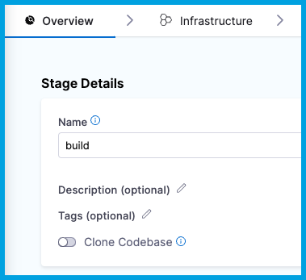

import configure_codebase from './static/create-and-configure-a-codebase-00.png'

CI pipelines build and test code that is pulled from a Git code repository. In Harness CI, you can configure a 'Codebase' for your pipeline, to define the Git repository your Build stage(s) will automatically clone during runtime (unless you stage is set to not clone the codebase). When you add a Build stage to a CI pipeline, if not already set, you will have to option to configure your codebase. 
This topic explains how to configure codebase settings for pipeline to be used by its Build stages.

This topic assumes you have an understanding of the [CI pipeline creation process](../prep-ci-pipeline-components.md).


## Configure the default codebase

When you add a **Build** stage to a CI pipeline, you specify where your build code is stored. This becomes the pipeline's *default codebase*.

1. In the Pipeline Studio, select **Add Stage**, and then select **Build**.
2. Enter a **Stage Name**. **Description** and **Tags** are optional.
3. Make sure **Clone Codebase** is enabled. This tells Harness to clone the codebase into the build environment before running the steps in the stage.
4. Configure your codebase connection.
   * To clone a repo from the [Harness Code Repository module](/docs/code-repository), select **Harness Code Repository**, and then select the repo to clone.
   * To clone a repo from a third-party Git provider, select **Third-party Git provider**, select the relevant [code repo connector](/docs/category/code-repositories), and enter the name of the repo to clone, if **Repository Name** is not automatically populated.
5. Select **Set Up Stage**.


If you need to change the connector or other default codebase settings, go to [Edit the default codebase configuration](#edit-the-default-codebase-configuration). If you don't want every stage to clone the default codebase, go to [Disable Clone Codebase for specific stages](#disable-clone-codebase-for-specific-stages). You can also [clone multiple repositories in a stage](./clone-and-process-multiple-codebases-in-the-same-pipeline.md).


<details>
<summary>YAML example: Default codebase configuration</summary>

```yaml
pipeline:
  name: tutorial example
  identifier: tutorial_example
  projectIdentifier: default
  orgIdentifier: default
  tags: {}
  properties:
    ci:
      codebase:
        connectorRef: YOUR_CODEBASE_CONNECTOR_ID
        build: <+input>
```

</details>

<details>
<summary>YAML example: Harness Code Repository codebase configuration</summary>

This configuration is for repositories in the [Harness Code Repository module](/docs/code-repository).

```yaml
pipeline:
  name: tutorial example
  identifier: tutorial_example
  projectIdentifier: default
  orgIdentifier: default
  tags: {}
  properties:
    ci:
      codebase:
        repoName: YOUR_HARNESS_CODE_REPO_NAME
        build: <+input>
```

</details>

## Disable Clone Codebase for specific stages

After defining the default codebase in the first Build stage, when you add subsequent stages to the pipeline, you can disable **Clone Codebase** for individual stages. You can also disable cloning the default codebase, if necessary.

You might disable **Clone Codebase** if the codebase is not needed for the stage's operations, or you need to use specific `git clone` arguments (such as to [clone a subdirectory instead of an entire repo](./clone-subdirectory.md)). You can also [clone multiple code repos in a pipeline](./clone-and-process-multiple-codebases-in-the-same-pipeline.md).

In the Visual editor, you can disable **Clone Codebase** in the stage's **Overview** tab.

<!--  -->

<DocImage path={require('./static/disable-clone-codebase-visual.png')} />

In the YAML editor, set `cloneCodebase` to `false` in the `stage.spec`.

```yaml
    - stage:
        name: build
        identifier: build
        description: ""
        type: CI
        spec:
          cloneCodebase: false
```

For more information about Build stage settings, go to [CI Build stage settings](../set-up-build-infrastructure/ci-stage-settings.md).

## Edit the default codebase configuration

:::note

We've recently enhanced the Git clone operations within Harness, in both the Git Clone step and the native Clone Codebase functionality. Support was added for : 


- Git LFS - Allows users to clone repositories with large file storage (LFS) efficiently.
- Fetch Tags - Enables fetching of tags during the clone operation.
- Sparse Checkout - Enables cloning specific subdirectories.
- Clone Submodules - Adds options for including and recursively cloning Git submodules.
- Clone Path Customization - Exposes the clone path in the codebase section, allowing users to specify a custom clone directory.
- Additional Pre-Fetch Command - Ability to specify any additional Git commands to run before fetching the code.


These capabilites are behind feature flag `CI_GIT_CLONE_ENHANCED`. If it is not available in your account, contact [Harness Support](mailto:support@harness.io) to enable the feature.

:::

import Tabs from '@theme/Tabs';
import TabItem from '@theme/TabItem';

<Tabs>
  <TabItem value="Visual" label="Visual">

To edit a pipeline's default codebase configuration, select **Codebase** on the right side panel of the Pipeline Studio's Visual editor.

<!--  -->

<DocImage path={require('./static/create-and-configure-a-codebase-03.png')} />

</TabItem>
  <TabItem value="YAML" label="YAML" default>

To edit a pipeline's default codebase configuration in the YAML editor, edit the `codebase` section. For example:

```yaml
pipeline:
  name: tutorial example
  identifier: tutorial_example
  projectIdentifier: tutorial_test
  orgIdentifier: default
  tags: {}
  properties:
    ci:
      codebase:
        connectorRef: YOUR_CODEBASE_CONNECTOR_ID
        build: <+input>
        depth: 0
        sslVerify: true
        prCloneStrategy: MergeCommit

```

</TabItem>
</Tabs>

In addition to changing the **Connector** (`connectorRef`) or **Repository Name** (`repoName`), you can edit the following **Advanced** settings.

### Depth

The number of commits to fetch when the pipeline clones the codebase repo.

The default depth varies by build and trigger type:

* For manually-triggered branch and tag builds, the default depth is `50`. This means each `git clone` operation fetches the 50 most recent commits.
* For manually-triggered PR builds and all auto-triggered builds (such as webhook triggers), the default depth is `0`. This means each `git clone` operation fetches all commits from the relevant branch.

For more information, go to the [git clone documentation](https://git-scm.com/docs/git-clone).

### Pull Request Clone Strategy

When a build is triggered by a pull request, this setting determines the branch to use for the artifact after the repo is cloned.

If this is set to **Merge Commit** (which is the default setting), the pipeline tries to merge the pull request branch with the target branch before building the artifact. This guarantees that the artifact includes all commits in both the pull request and the target branch. The disadvantage is that this can take more time and result in build failures: If the merge fails, then the build fails.


If this is set to **Source Branch**, the pipeline builds the artifact from the latest commit in the pull request branch. This can be faster and less likely to result in build failures; however, it might not include some commits in the target branch.


### Clone Directory

An optional target path in the pipeline workspace where you want to clone the repo.

You can't specify `/harness/` as a target directory for a **Git Clone** step because this folder is reserved for the **Build** stage's codebase. You can specify **Shared Paths** in your [CI Build stage settings](../set-up-build-infrastructure/ci-stage-settings.md) to share data across steps in your **Build** stage.

### Fetch Tags

Determines whether to fetch all tags when performing a shallow clone (depth > 0). Setting this to `true` is equivalent to adding the `--tags` flag.

### Download LFS Files

The [Git Large File Storage (LFS)](https://git-lfs.com/) client is an extension for versioning large files, such as audio, video, datasets, and graphics.

Set **Download LFS Files** to `true` to download Git-LFS files. Default is `false`.

### Sparse Checkout

Do a sparse checkout on given patterns. The subset of files is chosen by providing a list of directories in cone mode. Refer to [git documentation](https://git-scm.com/docs/git-sparse-checkout#_internalscone_pattern_set) for more details.

### Include Submodules

Determines whether to include submodules in the clone. Default is `false`. Set to `true` to include submodules or recursive to clone submodules recursively. 

### Pre Fetch Command

Specify any additional Git commands to run before fetching the code. This field is for Git commands only; separate each command with a new line.

This could be used, for example, to set additional LFS configurations or clone specific submodules. For example,

```bash
git config lfs.fetchexclude ".jpg"
```

### SSL Verify

If **True**, which is the default value, the pipeline verifies your Git SSL certificates. The build fails if the certificate check fails. Set this to **False** only if you have a known issue with the certificate and you are willing to run your builds anyway.

If you want to use self-signed certificates in a Kubernetes Cluster build infrastructure, go to [Configure a Kubernetes Build Farm to use Self-Signed Certificates](../set-up-build-infrastructure/k8s-build-infrastructure/configure-a-kubernetes-build-farm-to-use-self-signed-certificates.md)

### Set Container Resources

Set maximum resource limits for the containers that clone the codebase at runtime:

* **Limit Memory:** The maximum memory that the container can use. You can express memory as a plain integer or as a fixed-point number using the suffixes `G` or `M`. You can also use the power-of-two equivalents `Gi` and `Mi`. The default is `500Mi`.
* **Limit CPU:** The maximum number of cores that the container can use. CPU limits are measured in CPU units. Fractional requests are allowed; for example, you can specify one hundred millicpu as `0.1` or `100m`. The default is `400m`. For more information, go to [Resource units in Kubernetes](https://kubernetes.io/docs/concepts/configuration/manage-resources-containers/#resource-units-in-kubernetes).


## Troubleshoot codebases

Go to the [Harness CI Knowledge Base](/kb/continuous-integration/continuous-integration-faqs) for common questions and issues related to codebases, such as:

* [How do I improve codebase clone time?](/kb/continuous-integration/continuous-integration-faqs/#how-can-i-reduce-clone-codebase-time)
* [The same Git commit is not used in all stages.](/kb/continuous-integration/continuous-integration-faqs/#the-same-git-commit-is-not-used-in-all-stages)
* [Git fetch fails with invalid index-pack output when cloning large repos.](/kb/continuous-integration/continuous-integration-faqs/#git-fetch-fails-with-invalid-index-pack-output-when-cloning-large-repos)
* [Clone codebase fails due to missing plugin.](/kb/continuous-integration/continuous-integration-faqs/#clone-codebase-fails-due-to-missing-plugin)

For information about branch protection and status checks for codebases associated with Harness CI pipelines, go to [SCM status checks](./scm-status-checks.md).

For troubleshooting information for Git event (webhook) triggers, go to [Troubleshoot Git event triggers](/docs/platform/triggers/triggering-pipelines/#troubleshoot-git-event-triggers).
