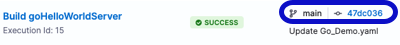
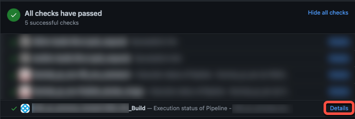

import Tabs from '@theme/Tabs';
import TabItem from '@theme/TabItem';

If your pipelines use [webhook triggers](/docs/platform/triggers/triggering-pipelines), you can get [Harness build statuses in your PRs](#pipeline-links-in-prs). However, you must configure your protection rules *in your SCM provider* if you want failed/running builds to block PR merges.

:::warning

Failed pipelines don't inherently block PR merges. Harness can send pipeline statuses to your PRs, but you must configure branch protections and checks (such as protection rules, CODEOWNERS, linting, and other checks or restrictions) in your source control provider.

:::

If you want to pull PR status check information into a Harness pipeline, such as to determine whether to run a specific step based on the outcome of a check, you can [add custom SCM status checks to your CI pipelines](#custom-scm-status-checks).

## SCM links in build details

When [viewing builds](../viewing-builds.md) in Harness, builds triggered by webhooks can include a link to the PR or commit that started the build.



## Pipeline links in PRs

When viewing a PR in your SCM provider, if a manual or webhook build ran from that PR, then you can follow the **Details** link from the PR's Git status to the build details page in Harness. This is supported for both manual and webhook PR builds, but it is not supported for all SCM providers.



To get status updates in your PRs, you must:

1. [Configure a default codebase for your pipeline.](/docs/continuous-integration/use-ci/codebase-configuration/create-and-configure-a-codebase#configure-the-default-codebase) Your pipeline must have a Build stage. Build updates are only exported for Build stages.
2. Make sure you enable API access in your [code repo connector](/docs/continuous-integration/use-ci/codebase-configuration/create-and-configure-a-codebase#code-repo-connectors) settings.
3. Run PR builds. Branch and tag builds don't send PR status updates. You can use [webhook triggers](/docs/platform/triggers/triggering-pipelines) to automatically run builds when PRs are created or updated.

## Custom SCM status checks

If you want to pull PR status check information into a Harness pipeline, you can use [Run steps](../run-step-settings.md) to query your SCM provider's API and include custom SCM status checks in your CI pipelines.

### Add a custom status check

These steps explain how to add a status check that uses the GitHub API. For information about leveraging another SCM provider's API, refer to that provider's API documentation.

1. You need a [CI pipeline](../prep-ci-pipeline-components.md) with a [Build stage](../set-up-build-infrastructure/ci-stage-settings.md) where you'll add the **Run** step.
2. Create [GitHub Personal Access Token](https://docs.github.com/en/authentication/keeping-your-account-and-data-secure/managing-your-personal-access-tokens) to use for authentication, and save the token as a [Harness text secret](/docs/platform/secrets/add-use-text-secrets).
3. Add a [Run step](../run-step-settings.md) to your **Build** (`CI`) stage.
4. Enter a **Name** for the step.
5. If required by your build infrastructure, provide the **Container Registry** and **Image**.
   * **Container Registry** is a container registry connector, such as a Docker connector.
   * **Image** is the FQN or artifact name and tag of a Docker image that has cURL installed, such as `curlimages/curl:latest` for the [official cURL Docker Hub image](https://hub.docker.com/r/curlimages/curl).
   * To learn more about this setting and when it is required, go to [Use Run steps - Container Registry and Image](../run-step-settings.md#container-registry-and-image).
6. For **Shell**, select **Sh**.
7. In **Command**, enter a script that calls the GitHub API, for example:

   ```shell
   curl -i -X POST \
     -H "Authorization: Bearer <+secrets.getValue('account.YOUR_GITHUB_TOKEN_SECRET_ID')>" \
     -H "Accept: application/vnd.github.v3+json" \
     https://api.github.com/repos/YOUR_GITHUB_ORGANIZATION/<+pipeline.properties.ci.codebase.repoName>/statuses/<+codebase.commitSha> \
     -d '{"state":"pending","target_url":"<+pipeline.execution.url>","description":"Test is running","context":"harness-ci/tests"}'
   ```

   The above example calls the GitHub API and uses the GitHub token secret for authentication. It uses [expressions](/docs/platform/variables-and-expressions/harness-variables.md) to pull information from the pipeline, such as the target repository name (`<+pipeline.properties.ci.codebase.repoName`>) and the pipeline build link (`<+pipeline.execution.url>`).

   If you use the above script, replace `YOUR_GITHUB_ORGANIZATION` with your GitHub organization name, and replace `YOUR_GITHUB_TOKEN_SECRET_ID` with the ID of the Harness text secret that contains your GitHub personal access token.

8. Configure additional settings as necessary for your script and build infrastructure. For example, you might want to set container resource limits, export output variables, or inject environment variables. For more information about **Run** step settings, go to [Use Run steps](../run-step-settings.md).

The above script is a basic GitHub status check. You can modify the script to include more commands, get other information from the payload, or call a different SCM provider's API. For example, the following script takes different actions depending on the resulting status, and it includes environment variables and [conditional execution settings](/docs/platform/pipelines/step-skip-condition-settings.md):

```shell
# status="<+execution.steps.STEP_ID.status>"
# name="harness-ci/tests"

echo "Send Commit Status"

if [[ "$status" == "SUCCEEDED" ]]; then
  state="success"
  description="$name scan passed for <+pipeline.properties.ci.codebase.repoName>"
elif [[ "$status" == "PENDING" ]]; then
  state="pending"
  description="$name scan pending for <+pipeline.properties.ci.codebase.repoName>"
else
  state="failure"
  description="$name scan failed for <+pipeline.properties.ci.codebase.repoName>"
fi

curl -i -u YOUR_GITHUB_ORGANIZATION:<+secrets.getValue("account.YOUR_GITHUB_TOKEN_SECRET_ID")> \
  -X POST \
  -H "Accept: application/vnd.github.v3+json" \
  https://api.github.com/repos/YOUR_GITHUB_ORGANIZATION/<+pipeline.properties.ci.codebase.repoName>/statuses/<+codebase.commitSha> \
  -d "{\"state\":\"$state\",\"target_url\":\"<+pipeline.execution.url>\",\"description\":\"$description\",\"context\":\"$name\"}"
```

### Create reusable status check steps

If you want to include status checks in multiple pipelines, you might want to create reusable templates or plugins.


<Tabs>
  <TabItem value="template" label="Create a step template" default>


[Step templates](/docs/platform/templates/run-step-template-quickstart) help you quickly reuse customized or complex steps in multiple pipelines. For example, here is a YAML example of a step template for a GitHub status check step:

```yaml
template:
  name: Send GitHub Status
  type: Step
  projectIdentifier: YOUR_HARNESS_PROJECT_ID
  orgIdentifier: YOUR_HARNESS_ORGANIZATION_ID
  spec:
    type: Run
    spec:
      connectorRef: account.harnessImage
      image: curlimages/curl:7.82.0
      shell: Sh
      command: |+
        # status="<+execution.steps.STEP_ID.status>"
        # name="harness-ci/tests"

        echo "Send Commit Status"

        if [[ "$status" == "SUCCEEDED" ]]; then
          state="success"
          description="$name scan passed for <+pipeline.properties.ci.codebase.repoName>"
        elif [[ "$status" == "PENDING" ]]; then
          state="pending"
          description="$name scan pending for <+pipeline.properties.ci.codebase.repoName>"
        else
          state="failure"
          description="$name scan failed for <+pipeline.properties.ci.codebase.repoName>"
        fi

        curl -i -u YOUR_GITHUB_ORGANIZATION:<+secrets.getValue("account.YOUR_GITHUB_TOKEN_SECRET_ID")> \
          -X POST \
          -H "Accept: application/vnd.github.v3+json" \
          https://api.github.com/repos/YOUR_GITHUB_ORGANIZATION/<+pipeline.properties.ci.codebase.repoName>/statuses/<+codebase.commitSha> \
          -d "{\"state\":\"$state\",\"target_url\":\"<+pipeline.execution.url>\",\"description\":\"$description\",\"context\":\"$name\"}"

      envVariables:
        status: <+input>
        name: <+input>
      imagePullPolicy: IfNotPresent
    when:
      stageStatus: Success
      condition: <+codebase.build.type>=="PR"
  identifier: Send_Git_Status
  versionLabel: 1.0.0
```


</TabItem>
  <TabItem value="plugin" label="Write a custom plugin">


You can package your status check script in a [custom plugin](../use-drone-plugins/custom_plugins.md) and then add it to your pipelines in a [Plugin step](../use-drone-plugins/custom_plugins.md#add-the-plugin-step).


</TabItem>
</Tabs>

## Troubleshoot status checks

Go to the [Harness CI Knowledge Base](/kb/continuous-integration/continuous-integration-faqs) for common questions and issues related to codebases and SCM status checks, such as:

* [Failed pipelines don't block PR merges.](/kb/continuous-integration/continuous-integration-faqs/#failed-pipelines-dont-block-pr-merges)
* [Pipeline status updates aren't sent to PRs.](/kb/continuous-integration/continuous-integration-faqs/#pipeline-status-updates-arent-sent-to-prs)
* [Build statuses don't show on my PRs, even though the code base connector's token has all repo permissions.](/kb/continuous-integration/continuous-integration-faqs/#build-statuses-dont-show-on-my-prs-even-though-the-code-base-connectors-token-has-all-repo-permissions)

For troubleshooting information for Git event (webhook) triggers, go to [Troubleshoot Git event triggers](/docs/platform/triggers/triggering-pipelines/#troubleshoot-git-event-triggers).
