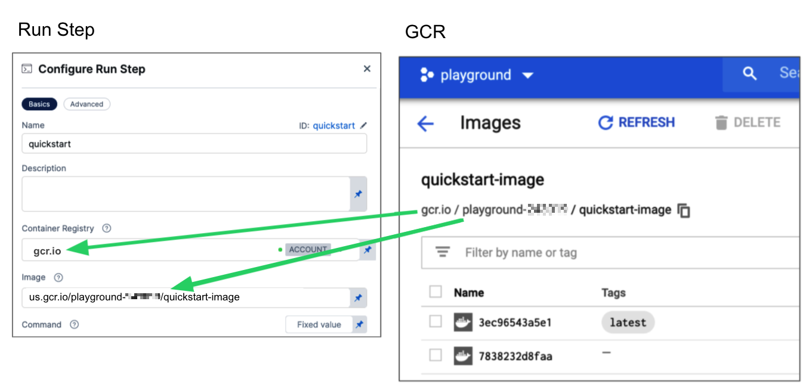

Use Background steps to [manage dependent services](./dependency-mgmt-strategies.md) that need to run for the entire lifetime of a Build stage. For example, you can set up your pipeline to run multiple background services that implement a local, multi-service app.

<figure>


<figcaption>A Build stage with multiple services running in Background steps.</figcaption>
</figure>

A Background step starts a service and then proceeds. For any later step that relies on the service, it is good practice to verify that the service is running before sending requests.

:::info

* Background steps do not support failure strategies or output variables.
* If the pipeline runs on a VM build infrastructure, you can run the background service directly on the VM rather than in a container. To do this, leave the **Container Registry** and **Image** fields blank.
* Depending on the stage's build infrastructure, some settings may be unavailable, optional, or located under **Additional Configuration**.

:::

## Name and Id

Enter a name summarizing the step's purpose. Harness automatically assigns an **Id** ([Entity Identifier Reference](../../../platform/20_References/entity-identifier-reference.md)) based on the **Name**. You can change the **Id** until the step is saved; once saved, the **Id** is locked.

:::tip

You can use the Background step **Id** to call services started by Background steps in later steps, such as commands in Run steps. For example, a cURL command could call `[backgroundStepId]:5000` where it might otherwise call `localhost:5000`.

<figure>


<figcaption>The Background step ID, <code>pythonscript</code>, is used in a cURL command in a Run step.</figcaption>
</figure>

If the Background step is inside a step group, you must include step group ID, such as `curl [stepGroupId]_[backgroundStepId]:5000`, even if both steps are in the same step group.

:::

## Container Registry and Image

**Container Registry** is a Harness container registry connector that connects to the container registry, such as Docker Hub, from which you want Harness to pull an image.

**Image** is the container image to use for the background service. The image name should include the tag, or it defaults to the `latest` tag if unspecified. You can use any Docker image from any Docker registry, including Docker images from private registries. Different container registries require different name formats:

* **Docker Registry:** Input the name of the artifact you want to deploy, such as `library/tomcat`. Wildcards aren't supported. FQN is required for images in private container registries.
* **ECR:** Input the FQN (fully-qualified name) of the artifact you want to deploy. Images in repos must reference a path, for example: `40000005317.dkr.ecr.us-east-1.amazonaws.com/todolist:0.2`.
* **GCR:** Input the FQN (fully-qualified name) of the artifact you want to deploy. Images in repos must reference a path starting with the project ID that the artifact is in, for example: `us.gcr.io/playground-243019/quickstart-image:latest`.

<figure>



<figcaption>An example configuration for the <b>Container Registry</b> and <b>Image</b> fields. Note that this figure shows a <b>Run</b> step, but the fields are populated the same for <b>Background</b> steps.</figcaption>
</figure>

:::info

The stage's build infrastructure determines whether these fields are required or optional:

* [Kubernetes cluster build infrastructure](../set-up-build-infrastructure/k8s-build-infrastructure/set-up-a-kubernetes-cluster-build-infrastructure.md): **Container Registry** and **Image** are always required.
* [Local runner build infrastructure](../set-up-build-infrastructure/define-a-docker-build-infrastructure.md): **Container Registry** and **Image** are always required.
* [Self-hosted cloud provider VM build infrastructure](/docs/category/set-up-vm-build-infrastructures): **Background** steps can use binaries that you've made available on your build VMs. The **Container Registry** and **Image** are required if the VM doesn't have the necessary binaries. These fields are located under **Optional Configuration** for stages that use self-hosted VM build infrastructure.
* [Harness Cloud build infrastructure](../set-up-build-infrastructure/use-harness-cloud-build-infrastructure.md): **Background** steps can use binaries available on Harness Cloud machines, as described in the [image specifications](/docs/continuous-integration/use-ci/set-up-build-infrastructure/use-harness-cloud-build-infrastructure#platforms-and-image-specifications). The **Container Registry** and **Image** are required if the machine doesn't have the binary you need. These fields are located under **Optional Configuration** for stages that use Harness Cloud build infrastructure.

:::

## Shell, Entry Point, and Command

Use these fields to define the commands that you need to run in the Background step.

For **Shell**, select the shell script type for the arguments and commands defined in **Entry Point** and **Command**. Options include: **Bash**, **PowerShell**, **Pwsh**, **Sh**, and **Python**. If the step includes commands that aren't supported for the selected shell type, the build fails. Required binaries must be available on the build infrastructure or the specified image, as described in [Container Registry and Image](#container-registry-and-image).

For **Entry Point** supply a list of arguments in `exec` format. **Entry Point** arguments override the image `ENTRYPOINT` and any commands in the **Command** field. Enter each argument separately.

```mdx-code-block
import Tabs2 from '@theme/Tabs';
import TabItem2 from '@theme/TabItem';
```
```mdx-code-block
<Tabs2>
  <TabItem2 value="Visual" label="Visual">
```
<figure>


<figcaption><b>Entry Point</b> arguments in the Pipeline Studio Visual editor.</figcaption>
</figure>

```mdx-code-block
  </TabItem2>
  <TabItem2 value="YAML" label="YAML" default>
```

```yaml
                    entrypoint:
                      - dockerd-entrypoint.sh
                      - "--mtu=1450"
```

```mdx-code-block
  </TabItem2>
</Tabs2>
```

In the **Command** field, enter [POSIX](https://en.wikipedia.org/wiki/POSIX) shell script commands (beyond the image's entry point) for this step. If the step runs in a container, the commands are executed inside the container.

Select each tab below to view examples for each `shell` type.

```mdx-code-block
import Tabs from '@theme/Tabs';
import TabItem from '@theme/TabItem';
```
```mdx-code-block
<Tabs>
  <TabItem value="bash" label="Bash" default>
```

This Bash script example checks the Java version.

```yaml
              - step:
                  ...
                  spec:
                    shell: Bash
                    command: |-
                      JAVA_VER=$(java -version 2>&1 | head -1 | cut -d'"' -f2 | sed '/^1\./s///' | cut -d'.' -f1)
                      if [[ $JAVA_VER == 17 ]]; then
                        echo successfully installed $JAVA_VER
                      else
                        exit 1
                      fi
```

```mdx-code-block
  </TabItem>
  <TabItem value="powershell" label="PowerShell">
```
This is a simple PowerShell `Wait-Event` example.

```yaml
              - step:
                  ...
                  spec:
                    shell: Powershell
                    command: Wait-Event -SourceIdentifier "ProcessStarted"
```

:::tip

You can run PowerShell commands on Windows VMs running in AWS build farms.

:::


```mdx-code-block
  </TabItem>
  <TabItem value="pwsh" label="Pwsh">
```

This PowerShell Core example runs `ForEach-Object` over a list of events.

```yaml
              - step:
                  ...
                  spec:
                    shell: Pwsh
                    command: |-
                      $Events = Get-EventLog -LogName System -Newest 1000
                      $events | ForEach-Object -Begin {Get-Date} -Process {Out-File -FilePath Events.txt -Append -InputObject $_.Message} -End {Get-Date}
```

:::tip

You can run PowerShell Core commands in pods or containers that have `pwsh` installed.

:::

```mdx-code-block
  </TabItem>
  <TabItem value="sh" label="Sh">
```

In this example, the pulls a `python` image and executes a shell script (`Sh`) that runs `pytest` with code coverage.

```yaml
              - step:
                  ...
                  spec:
                    connectorRef: account.harnessImage
                    image: python:latest
                    shell: Sh
                    command: |-
                      echo "Welcome to Harness CI"
                      uname -a
                      pip install pytest
                      pip install pytest-cov
                      pip install -r requirements.txt

                      pytest -v --cov --junitxml="result.xml" test_api.py test_api_2.py test_api_3.py
```

```mdx-code-block
  </TabItem>
  <TabItem value="python" label="Python">
```

If the `shell` is `Python`, supply Python commands directly in `command`.

This example uses a basic `print` command.

```
            steps:
              - step:
                  ...
                  spec:
                    shell: Python
                    command: print('Hello, world!')
```

```mdx-code-block
  </TabItem>
</Tabs>
```


:::tip

You can use `docker-compose up` to start multiple services in one Background step.

:::

## Privileged

Select this option to run the container with escalated privileges. This is the equivalent of running a container with the Docker `--privileged` flag.

## Report Paths

The path to the file(s) that store [results in JUnit XML format](../set-up-test-intelligence/test-report-ref.md). You can add multiple paths. If you specify multiple paths, make sure the files contain unique tests to avoid duplicates. [Glob](https://en.wikipedia.org/wiki/Glob_(programming)) is supported.

This setting is required for commands run in the Background step to be able to [publish test results](../set-up-test-intelligence/viewing-tests.md).

## Environment Variables

You can inject environment variables into a container and use them in the **Command** script. You must input a **Name** and **Value** for each variable.

You can reference environment variables in the **Command** script by their name. For example, a Bash script would use `$var_name` or `${var_name}`, and a Windows PowerShell script would use `$Env:varName`.

Variable values can be [Fixed Values, Runtime Inputs, and Expressions](/docs/platform/20_References/runtime-inputs.md). For example, if the value type is expression, you can input a value that references the value of some other setting in the stage or pipeline. Select the **Thumbtack**  to change the value type.

<figure>


<figcaption>Using an expression for an environment variable's value.</figcaption>
</figure>

## Image Pull Policy

If the service is running in a container, you can select an option to set the pull policy for the image.

* **Always**: The kubelet queries the container image registry to resolve the name to an image digest every time the kubelet launches a container. If the kubelet encounters an exact digest cached locally, it uses its cached image; otherwise, the kubelet downloads (pulls) the image with the resolved digest, and uses that image to launch the container.
* **If Not Present**: The image is pulled only if it is not already present locally.
* **Never**: The image is assumed to exist locally. No attempt is made to pull the image.

## Port Bindings

Depending on the Build stage's **Infrastructure**, some steps might run directly on VMs while other steps run in containers. The port used to communicate with a service started by a Background step depends on where the step is running: VMs use the **Host Port** and containerized steps use the **Container Port**.

<details>
<summary>Port Bindings example</summary>

Assume you create a Background step with the **Name** and **Id** `myloginservice`.

- A containerized step talks to this service using `myloginservice:container_port`.
- A step, such as a Run or Run Test step, that runs directly on the VM or in a Kubernetes cluster talks to the service using `localhost:host_port`.

</details>

The host port and container port binding are similar to [port mapping in Docker](https://docs.docker.com/config/containers/container-networking/). Usually the ports are the same unless the default host port for the Background step is already in use by another local service.

:::note

If your build stage uses Harness Cloud build infrastructure and you are running a Docker image in a Background step, you must specify **Port Bindings** if you want to reference that Background step in a later step in the pipeline (such as in a cURL command in a Run step).

:::

## Run as User

If the service is running in a container, you can specify the user ID to use for all processes in the pod. For more information about how to set the value, go to [Set the security context for a pod](https://kubernetes.io/docs/tasks/configure-pod-container/security-context/#set-the-security-context-for-a-pod).

## Set Container Resources

The maximum memory and cores that the container can use.

* **Limit Memory:** The maximum memory that the container can use. You can express memory as a plain integer or as a fixed-point number using the suffixes `G` or `M`. You can also use the power-of-two equivalents `Gi` and `Mi`. Do not include spaces when entering a fixed value. The default value is `500Mi`.
* **Limit CPU:** The maximum number of cores that the container can use. CPU limits are measured in CPU units. Fractional requests are allowed; for example, you can specify one hundred millicpu as `0.1` or `100m`. The default is `400m`. For more information, go to [Resource units in Kubernetes](https://kubernetes.io/docs/concepts/configuration/manage-resources-containers/#resource-units-in-kubernetes).
