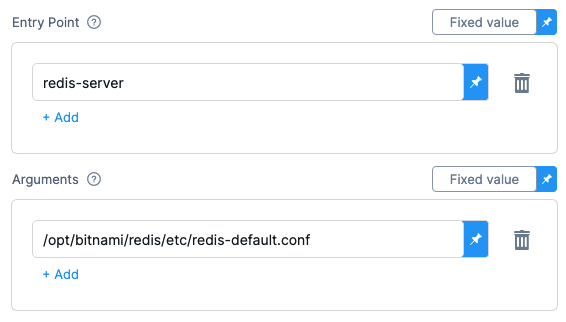
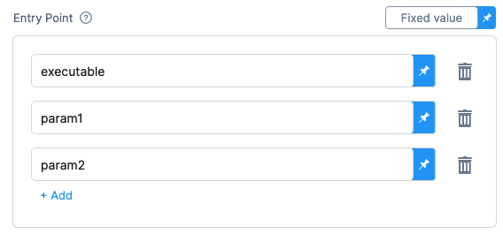

:::caution

The Configure Service Dependency step is deprecated. Instead, use the [Background step](./background-step-settings.md).

For a short time, this step will be backwards compatible. Any pipelines that include Configure Service Dependency steps will remain valid until the step is removed from Harness CI. You are encouraged to replace Configure Service Dependency steps with Background steps as soon as possible.

:::

A *service dependency* is a detached service that's accessible to all steps in a stage. Service dependencies support workflows such as:

* Integration testing: You can set up a service and then run tests against this service.
* Running Docker-in-Docker: You can [set up a DinD service](../run-ci-scripts/run-docker-in-docker-in-a-ci-stage.md) to process Docker commands in Run Steps.

This topic provides settings and permissions for the Configure Service Dependency step.

### Before You Begin

Review this important information about Configure Service Dependency steps.

<details>
<summary>Add a Health Check to Verify that the Service is Up</summary>
After a container starts, the software running inside the container takes time to initialize and begin accepting requests. Before you send the first request, add a health check to verify that the service is running. You can add a `sleep` command to a Run Step, or implement a simple `while` loop to make the Step wait until the service is up. For example, if your Stage uses a dind step, you can run the following:

```
while ! docker ps ;do
     echo "Docker not available yet"
done
```
</details>

<details>
<summary>Service and Step Networking</summary>

Service and Step containers within the same Stage all share the same network. To communicate with a Service, use the local-host address and the port number defined in the Docker image. For example, you can use `127.0.0.1:6379` to communicate with a Redis server or `localhost:27017` to communicate with a Mongo database (assuming the default ports aren't overridden).

In a Kubernetes build infrastructure, all steps run in containers. In an AWS build infrastructure, some steps might run directly on the VM. For more information, go to [Port Bindings](#port-bindings) below.
</details>

### Name

Enter a name summarizing the step's purpose.

### Id

For information about this setting, go to [Entity Identifier Reference](../../../platform/20_References/entity-identifier-reference.md).

### Description

Text string.

### Container Registry

Harness Connector for the container registry containing the Service Dependency image, such as Docker Hub.

### Image

The name of the Docker image.

The image name should include the tag and will default to the `latest` tag if unspecified.

You can use any Docker image from any Docker registry, including Docker images from private registries.

Example: `mysql:5`

### Optional Configurations

#### Privileged

Enable this option to run the container with escalated privileges. This is the equivalent of running a container with the Docker `--privileged` flag.

#### Environment Variables

Add any environment variables you want to inject into the container.

#### Entry Point

ENTRYPOINT instructions allow you to configure a container that will run as an executable.

You can add commands in Entry Point to override the image [ENTRYPOINT](https://docs.docker.com/engine/reference/builder/#entrypoint). See ENTRYPOINT best practices from Docker.



Commands should be in exec form.

Each command and parameter should be added separately. For example:



For a useful summary of ENTRYPOINT and CMD see [Demystifying ENTRYPOINT and CMD in Docker](https://aws.amazon.com/blogs/opensource/demystifying-entrypoint-cmd-docker/) from AWS.

#### Arguments

Overrides the image [CMD](https://docs.docker.com/engine/reference/builder/#cmd). Each argument should be in exec format. For example:


For a useful summary of ENTRYPOINT and CMD, see [Demystifying ENTRYPOINT and CMD in Docker](https://aws.amazon.com/blogs/opensource/demystifying-entrypoint-cmd-docker/) in the AWS docs.

#### Port Bindings

Depending on a pipeline's build infrastructure, some steps might run on a VM and others run in a container. The port used to communicate with the Service Dependency depends on where the step is running: VM steps use the Host Port and containerized steps use the Container Port.

Suppose you create a Service Dependency with the Name and Id `myloginservice`.

- A containerized Step talks to the service using `myloginservice:container_port`.

- A Run or Run Test Step that runs directly on the VM or in a Kubernetes cluster talks to the service using `localhost:host_port`.

The binding of Host and Container Ports is similar to [port mapping in Docker](https://docs.docker.com/config/containers/container-networking/). Usually the ports are the same unless the default Host Port for the service dependency is already in use by another local service.

#### Image Pull Policy

Select an option to set the pull policy for the image.

* **Always**: The kubelet queries the container image registry to resolve the name to an image digest every time the kubelet launches a container. If the kubelet encounters an exact digest cached locally, it uses its cached image; otherwise, the kubelet downloads (pulls) the image with the resolved digest, and uses that image to launch the container.
* **If Not Present**: The image is pulled only if it isn't already present locally.
* **Never**: The image is assumed to exist locally. The kubelet doesn't try to pull the image.

#### Run as User

Set the value to specify the user id for all processes in the pod, running in containers. See [Set the security context for a pod](https://kubernetes.io/docs/tasks/configure-pod-container/security-context/#set-the-security-context-for-a-pod).

#### Set container resources

These settings specify the maximum resources used by the container at runtime.

##### Limit Memory

Maximum memory that the container can use. You can express memory as a plain integer or as a fixed-point number using the suffixes `G` or `M`. You can also use the power-of-two equivalents `Gi` and `Mi`.

##### Limit CPU

The maximum number of cores that the container can use. CPU limits are measured in cpu units. Fractional requests are allowed: you can specify one hundred millicpu as `0.1` or `100m`. See [Resource units in Kubernetes](https://kubernetes.io/docs/concepts/configuration/manage-resources-containers/#resource-units-in-kubernetes).

##### Timeout

Timeout for the step. Once the timeout is reached, the Step fails and the Pipeline execution continues.

### See Also

* [Share CI Data across Steps and Stages](../caching-ci-data/share-ci-data-across-steps-and-stages.md)
* [Run Docker-in-Docker in a Build stage](../run-ci-scripts/run-docker-in-docker-in-a-ci-stage.md)

