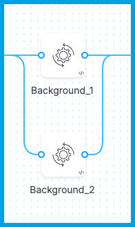

```mdx-code-block
import Tabs from '@theme/Tabs';
import TabItem from '@theme/TabItem';
```

This topic explains how to use **Background** steps to run multiple PostgreSQL instances in a Harness CI pipeline.

## Requirements

* You need a [CI pipeline](../prep-ci-pipeline-components.md) with a [Build stage](../set-up-build-infrastructure/ci-stage-settings.md).
* You need an understanding of PostgreSQL and the [psql command](https://www.postgresql.org/docs/current/app-psql.html).

## Add Background steps

Add one **Background** step for each PostgreSQL service you need to run.

For the **Background** steps to run the PostgreSQL services, the build environment must have the necessary binaries. Depending on the stage's build infrastructure, **Background** steps can use binaries that exist in the build environment or pull an image, such as a public or private Docker image, that contains the required binaries. For more information about when and how to specify images, go to the [Background step Container Registry and Image settings](./background-step-settings.md#container-registry-and-image).

```mdx-code-block
<Tabs>
  <TabItem value="Visual" label="Visual">
```

1. Go to the **Build** stage in the pipeline where you want to add the **Background** steps.
2. On the **Execution** tab, select **Add Step**, and select the **Background** step from the Step Library.
3. Configure the [Background step settings](./background-step-settings.md). Required settings depend on your build infrastructure.

```mdx-code-block
<Tabs>
  <TabItem value="hosted" label="Harness Cloud" default>
```

* Enter a **Name** and note the **Id**. You need the **Id** to call the service later in your pipeline.
* Add the following **Environment Variables**:
   * `POSTGRES_USER`: Postgres database user name.
   * `POSTGRES_DB`: Name for the database.
   * `POSTGRES_PASSWORD`: Password for the specified user/database. You can use an expression to [reference a Harness text secret](/docs/platform/secrets/add-use-text-secrets/).
* Add a **Port Binding**, and then set the **Host Post** to `5432` and the **Container Port** to the desired port for this database instance, such as `5433`.
* Configure [other settings](./background-step-settings.md), such as **Command**, **Entry Point**, **Container Registry**, and **Image**, if needed.

```mdx-code-block
  </TabItem>
  <TabItem value="k8s" label="Self-hosted Kubernetes cluster">
```

* Enter a **Name** and note the **Id**. You need the **Id** to call the service in later steps in this stage.
* For **Container Registry** and **Image**, select a Docker connector and specify a [PostgreSQL Docker image](https://hub.docker.com/_/postgres).
* Add the following **Entry Point** arguments, and replace `PORT_NUMBER` with the desired port binding for this database instance, such as `5433`.
   * `docker-entrypoint.sh`
   * `-p PORT_NUMBER`
* Add the following **Environment Variables**:
   * `POSTGRES_USER`: Postgres database user name.
   * `POSTGRES_DB`: Name for the database.
   * `POSTGRES_PASSWORD`: Password for the specified user/database. You can use an expression to [reference a Harness text secret](/docs/platform/secrets/add-use-text-secrets).
* Configure [other settings](./background-step-settings.md), if needed.

```mdx-code-block
  </TabItem>
</Tabs>
```

4. Select **Apply Changes** to save the step.
5. Add additional **Background** steps for each PostgreSQL instance you want to run. Make sure each instance has a different port binding. For example, if the first **Background** step was `5433`, the second one could be `5434`.
6. Arrange the **Background** steps to run in parallel.

<!--  -->

<docimage path={require('./static/background_in_parallel.png')} />

```mdx-code-block
  </TabItem>
  <TabItem value="YAML" label="YAML" default>
```

In Harness, go to the pipeline where you want to run the PostgreSQL services. In the `CI` stage, add one `Background` step for each PostgreSQL database, and group the steps to run in parallel. Required [Background step settings](./background-step-settings.md) depend on your build infrastructure.

```mdx-code-block
<Tabs>
  <TabItem value="hosted" label="Harness Cloud" default>
```

```yaml
            steps:
              - parallel: ## Group the Background steps to run in parallel so all PostgreSQL services run simultaneously.
                  - step:
                      identifier: Background_1 ## You use the identifier to call background services in later steps in this stage.
                      type: Background
                      name: Background_1
                      spec:
                        shell: Sh
                        envVariables: ## Add environment variables for the PostgreSQL user name, database name, and password.
                          POSTGRES_USER: postgres
                          POSTGRES_DB: test
                          POSTGRES_PASSWORD: password ## For security, use an expression to reference a Harness text secret.
                        portBindings:
                          "5432": "5433" ## Specify the host port (5432) and the desired container port (such as 5433). Each Background step must have a different container port.
                  - step:
                      identifier: Background_2
                      type: Background
                      name: Background_2
                      spec:
                        shell: Sh
                        envVariables:
                          POSTGRES_USER: postgres
                          POSTGRES_DB: test1
                          POSTGRES_PASSWORD: password
                        portBindings: ## Each Background step must have a different container port.
                          "5432": "5434"
```

```mdx-code-block
  </TabItem>
  <TabItem value="k8s" label="Self-hosted Kubernetes cluster">
```

```yaml
            steps:
              - parallel: ## Group the Background steps to run in parallel so all PostgreSQL services run simultaneously.
                  - step:
                      identifier: Background_1
                      type: Background
                      name: Background_1
                      spec:
                        connectorRef: account.harnessImage ## Use the built-in Docker connector or your own Docker connector.
                        image: postgres ## Specify a PostgreSQL Docker image.
                        shell: Sh
                        entrypoint: ## Include both the image ENTRYPOINT and the additional port binding argument.
                          - docker-entrypoint.sh
                          - "-p 5433" ## Specify the desired container port. Each Background step must have a different container port.
                        envVariables: ## Add environment variables for the PostgreSQL user name, database name, and password.
                          POSTGRES_USER: postgres
                          POSTGRES_DB: test
                          POSTGRES_PASSWORD: password ## For security, use an expression to reference a Harness text secret.
                  - step:
                      identifier: Background_2
                      type: Background
                      name: Background_2
                      spec:
                        connectorRef: account.harnessImage
                        image: postgres
                        shell: Sh
                        entrypoint:
                          - docker-entrypoint.sh
                          - "-p 5434" ## Each Background step must have a different container port.
                        envVariables:
                          POSTGRES_USER: postgres
                          POSTGRES_DB: test1
                          POSTGRES_PASSWORD: password
```

```mdx-code-block
  </TabItem>
</Tabs>
```

:::tip

For the `POSTGRES_PASSWORD`, you can use an expression to [reference a Harness text secret](/docs/platform/secrets/add-use-text-secrets).

:::

```mdx-code-block
  </TabItem>
</Tabs>
```

## Test the services

You can add a [Run step](../run-ci-scripts/run-step-settings.md) to confirm your PostgreSQL services are running before running other steps that need to interact with those services.

For the **Run** step to run `psql` commands, the build environment must have the necessary binaries. Depending on the stage's build infrastructure, **Run** steps can use binaries that exist in the build environment or pull an image, such as a public or private Docker image, that contains the required binaries. For more information about when and how to specify images, go to the [Run step Container Registry and Image settings](../run-ci-scripts/run-step-settings.md#container-registry-and-image).

```mdx-code-block
<Tabs>
  <TabItem value="Visual" label="Visual">
```

1. In the same **Build** stage as your **Background** steps, add a **Run** step after (*not* in parallel with) your **Background** steps.
2. Configure the [Run step settings](../run-ci-scripts/run-step-settings.md#settings). Required settings depend on your build infrastructure.

```mdx-code-block
<Tabs>
  <TabItem value="hosted" label="Harness Cloud" default>
```

* Enter a **Name**.
* For **Shell**, select **Sh**.
* Enter the following **Commands** and replace the placeholders with corresponding values from your **Background** steps.

   ```
   sleep 15
   psql -U POSTGRES_USER -d FIRST_DATABASE_NAME -h FIRST_BACKGROUND_STEP_ID -p FIRST_BACKGROUND_STEP_CONTAINER_PORT
   psql -U POSTGRES_USER -d SECOND_DATABASE_NAME -h SECOND_BACKGROUND_STEP_ID -p SECOND_BACKGROUND_STEP_CONTAINER_PORT
   ```

   For example:

   ```
   sleep 15
   psql -U postgres -d test -h Background_1 -p 5433
   psql -U postgres -d test1 -h Background_2 -p 5434
   ```

* Configure [other settings](../run-ci-scripts/run-step-settings.md#settings), if needed.

```mdx-code-block
  </TabItem>
  <TabItem value="k8s" label="Self-hosted Kubernetes cluster">
```

* Enter a **Name**.
* For **Container Registry** and **Image**, select a Docker connector and specify a [PostgreSQL Docker image](https://hub.docker.com/_/postgres).
* For **Shell**, select **Sh**.
* Enter the following **Commands** and replace the placeholders with corresponding values from your **Background** steps.

   ```
   sleep 15
   psql -U POSTGRES_USER -d FIRST_DATABASE_NAME -h localhost -p FIRST_BACKGROUND_STEP_CONTAINER_PORT
   psql -U POSTGRES_USER -d SECOND_DATABASE_NAME -h localhost -p SECOND_BACKGROUND_STEP_CONTAINER_PORT
   ```

   For example:

   ```
   sleep 15
   psql -U postgres -d test -h localhost -p 5433
   psql -U postgres -d test1 -h localhost -p 5434
   ```

* Configure [other settings](../run-ci-scripts/run-step-settings.md#settings), if needed.

```mdx-code-block
  </TabItem>
</Tabs>
```

3. Select **Apply Changes** to save the step.
4. Run your pipeline to test your PostgreSQL services. You can monitor and review build logs on the [Build details page](../viewing-builds.md). Once you've confirmed that the services run as expected, you can configure the rest of your pipeline. Note that **Background** steps don't persist across stages.

```mdx-code-block
  </TabItem>
  <TabItem value="YAML" label="YAML" default>
```

In the same `CI` stage where you added the `Background` steps, add a `Run` step after the `Background` steps. Make sure the `Run` step *isn't* in the `-parallel` group. Required [Run step settings](../run-ci-scripts/run-step-settings.md) depend on your build infrastructure.

```mdx-code-block
<Tabs>
  <TabItem value="hosted" label="Harness Cloud" default>
```

```yaml
              - step:
                  identifier: Run_1
                  type: Run
                  name: Run_1
                  spec:
                    shell: Sh
                    command: |- ## Provide the user name, database name, Background step identifier, and container port from each of your Background steps.
                      sleep 15
                      psql -U postgres -d test -h Background_1 -p 5433
                      psql -U postgres -d test1 -h Background_2 -p 5434
```

In `command`, you must provide values from your `Background` steps:

```
sleep 15
psql -U POSTGRES_USER -d FIRST_DATABASE_NAME -h FIRST_BACKGROUND_STEP_ID -p FIRST_BACKGROUND_STEP_CONTAINER_PORT
psql -U POSTGRES_USER -d SECOND_DATABASE_NAME -h SECOND_BACKGROUND_STEP_ID -p SECOND_BACKGROUND_STEP_CONTAINER_PORT
```

```mdx-code-block
  </TabItem>
  <TabItem value="k8s" label="Self-hosted Kubernetes cluster">
```

```yaml
              - step:
                  identifier: Run_1
                  type: Run
                  name: Run_1
                  spec:
                    connectorRef: account.harnessImage ## Use the built-in Docker connector or your own Docker connector.
                    image: postgres:9-alpine ## Specify a PostgreSQL Docker image.
                    shell: Sh
                    command: |- ## Provide the user name, database name, and container port from each of your Background steps.
                      sleep 15
                      psql -U postgres -d test -h localhost -p 5433
                      psql -U postgres -d test1 -h localhost -p 5434
```

In `command`, you must provide values from your `Background` steps:

```
sleep 15
psql -U POSTGRES_USER -d FIRST_DATABASE_NAME -h localhost -p FIRST_BACKGROUND_STEP_CONTAINER_PORT
psql -U POSTGRES_USER -d SECOND_DATABASE_NAME -h localhost -p SECOND_BACKGROUND_STEP_CONTAINER_PORT
```

```mdx-code-block
  </TabItem>
</Tabs>
```

:::tip

For the `POSTGRES_PASSWORD`, you can use an expression to [reference a Harness text secret](/docs/platform/secrets/add-use-text-secrets).

:::

After adding the `Run`step, run your pipeline to test your PostgreSQL services. You can monitor and review build logs on the [Build details page](../viewing-builds.md). Once you've confirmed that the services run as expected, you can configure the rest of your pipeline. Note that `Background` steps don't persist across stages.

```mdx-code-block
  </TabItem>
</Tabs>
```

## Pipeline YAML examples

```mdx-code-block
<Tabs>
  <TabItem value="hosted" label="Harness Cloud" default>
```

```yaml
pipeline:
  name: default
  identifier: default
  projectIdentifier: default
  orgIdentifier: default
  tags: {}
  stages:
    - stage:
        identifier: stage
        type: CI
        name: stage
        description: ""
        spec:
          cloneCodebase: false
          execution:
            steps:
              - parallel: ## Group the Background steps to run in parallel so all PostgreSQL services run simultaneously.
                  - step:
                      identifier: Background_1 ## You use the identifier to call background services in later steps in this stage.
                      type: Background
                      name: Background_1
                      spec:
                        shell: Sh
                        envVariables: ## Add environment variables for the PostgreSQL user name, database name, and password.
                          POSTGRES_USER: postgres
                          POSTGRES_DB: test
                          POSTGRES_PASSWORD: password ## For security, use an expression to reference a Harness text secret.
                        portBindings:
                          "5432": "5433" ## Specify the host port (5432) and the desired container port (such as 5433). Each Background step must have a different container port.
                  - step:
                      identifier: Background_2
                      type: Background
                      name: Background_2
                      spec:
                        shell: Sh
                        envVariables:
                          POSTGRES_USER: postgres
                          POSTGRES_DB: test1
                          POSTGRES_PASSWORD: password
                        portBindings: ## Each Background step must have a different container port.
                          "5432": "5434"
              - step:
                  identifier: Run_1
                  type: Run
                  name: Run_1
                  spec:
                    shell: Sh
                    command: |- ## Provide the user name, database name, Background step identifier, and container port from each of your Background steps.
                      sleep 15
                      psql -U postgres -d test -h Background_1 -p 5433
                      psql -U postgres -d test1 -h Background_2 -p 5434
          platform:
            os: Linux
            arch: Amd64
          runtime:
            type: Cloud
            spec: {}
```

```mdx-code-block
  </TabItem>
  <TabItem value="k8s" label="self-hosted Kubernetes cluster">
```

```yaml
pipeline:
  name: default
  identifier: default
  projectIdentifier: default
  orgIdentifier: default
  tags: {}
  stages:
    - stage:
        identifier: run_postgres
        type: CI
        name: run postgres
        description: ""
        spec:
          cloneCodebase: false
          infrastructure:
            type: KubernetesDirect
            spec:
              connectorRef: YOUR_KUBERNETES_CLUSTER_CONNECTOR_ID
              namespace: YOUR_KUBERNETES_NAMESPACE
              automountServiceAccountToken: true
              nodeSelector: {}
              os: Linux
          execution:
            steps:
              - parallel: ## Group the Background steps to run in parallel so all PostgreSQL services run simultaneously.
                  - step:
                      identifier: Background_1
                      type: Background
                      name: Background_1
                      spec:
                        connectorRef: account.harnessImage ## Use the built-in Docker connector or your own Docker connector.
                        image: postgres ## Specify a PostgreSQL Docker image.
                        shell: Sh
                        entrypoint: ## Include both the image ENTRYPOINT and the additional port binding argument.
                          - docker-entrypoint.sh
                          - "-p 5433" ## Specify the desired container port. Each Background step must have a different container port.
                        envVariables: ## Add environment variables for the PostgreSQL user name, database name, and password.
                          POSTGRES_USER: postgres
                          POSTGRES_DB: test
                          POSTGRES_PASSWORD: password ## For security, use an expression to reference a Harness text secret.
                  - step:
                      identifier: Background_2
                      type: Background
                      name: Background_2
                      spec:
                        connectorRef: account.harnessImage
                        image: postgres
                        shell: Sh
                        entrypoint:
                          - docker-entrypoint.sh
                          - "-p 5434" ## Each Background step must have a different container port.
                        envVariables:
                          POSTGRES_USER: postgres
                          POSTGRES_DB: test1
                          POSTGRES_PASSWORD: password
              - step:
                  identifier: Run_1
                  type: Run
                  name: Run_1
                  spec:
                    connectorRef: account.harnessImage ## Use the built-in Docker connector or your own Docker connector.
                    image: postgres:9-alpine ## Specify a PostgreSQL Docker image.
                    shell: Sh
                    command: |- ## Provide the user name, database name, and container port from each of your Background steps.
                      sleep 15
                      psql -U postgres -d test -h localhost -p 5433
                      psql -U postgres -d test1 -h localhost -p 5434
```

```mdx-code-block
  </TabItem>
</Tabs>
```
