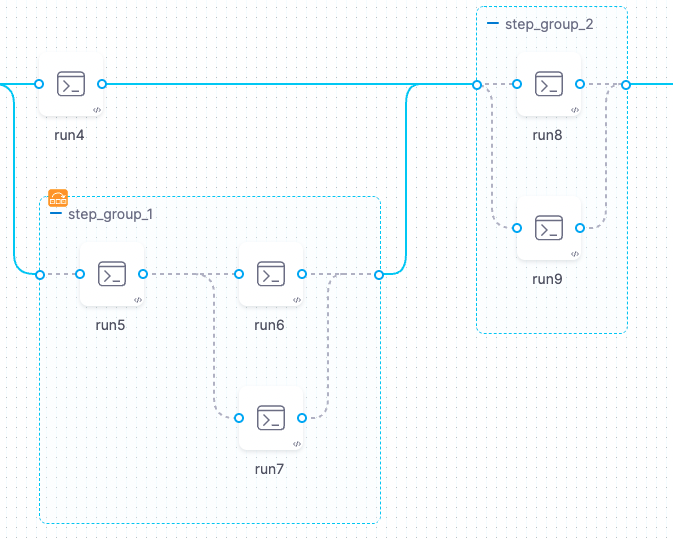
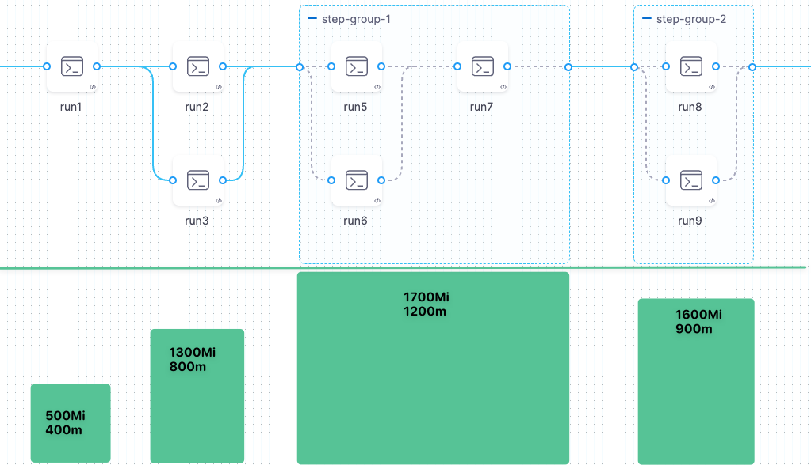
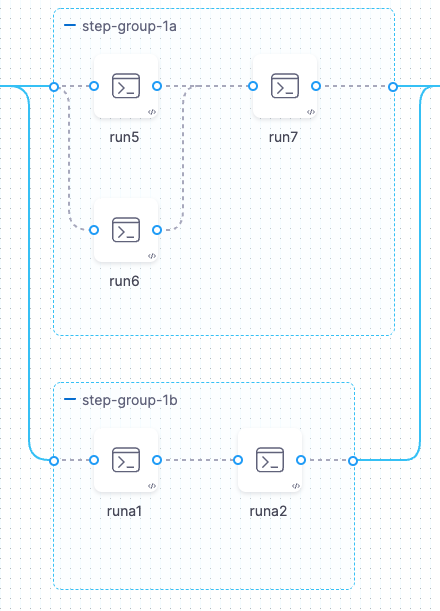
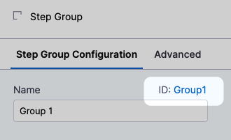
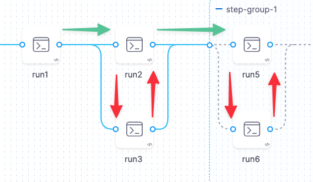

You can add steps to CI pipelines individually or in step groups. Steps in step groups can run serially or in parallel. Step groups can have [Conditional Execution, Failure Strategy, and Looping Strategy settings](#advanced-settings) that apply to all steps in the group.

Step groups are one of the [optimization methods](./optimizing-ci-build-times.md) you can use to speed up your CI pipelines. You might use step groups to:

* Improve test times in pipelines that include a lot of tests.
* [Run health checks on background services](../manage-dependencies/health-check-services.md).

## Add a step group

1. Go to the pipeline where you want to add a step group.
2. In the stage's **Execution** tab, select **Add Step**, and then select **Step Group**.

   

3. Enter a name for the step group, and then select **Apply Changes**.
4. Add or drag steps into the step group and configure the steps as usual.

   

### Step group YAML example

The following YAML example includes one stage with three steps. Two steps are in a step group, and one step isn't in the step group.

```yaml
    - stage:
        type: CI
        name: build
        identifier: build
        spec:
          cloneCodebase: false
          infrastructure:
            ...
          execution:
            steps: ## Step container for the entire stage.
              - stepGroup: ## Step group flag.
                  name: sg1 ## Step group name.
                  identifier: sg1 ## Step group ID.
                  steps: ## Step container for the step group. The following two steps are in the step group.
                    - step:
                        type: Run
                        name: Run_1
                        identifier: Run_1
                        spec:
                          ...
                    - step:
                        type: Run
                        name: Run_2
                        identifier: Run_2
                        spec:
                         ...
              - step: ## This step is outdented so that it is not in the step group.
                  type: Run
                  name: Run_3
                  identifier: Run_3
                  spec:
                    ...
```

## Organizing steps and step groups

You can have multiple step groups in the same stage. Step groups can run in parallel, but they can't be nested.

Within each step group, you can arrange the steps to run sequentially, in parallel, or a combination.

Running groups or steps in parallel can have significant impacts on resource allocation.

### Parallelism impacts resource consumption

Consider [resource consumption](../set-up-build-infrastructure/resource-limits.md) when running steps in parallel. Pipelines reserve memory and CPU resources in advance for each stage, and the amount of reserved memory and CPU is determined by the highest utilization at any point in the stage.

For example, the stage depicted in the following screenshot reaches peak resource consumption when Step Group 1 is running. The pipeline reserves 1700Mi of memory and 1200m of CPU in anticipation of this workload. If the pipeline's build infrastructure can't reserve enough resources, the pipeline fails.



### Step groups can't be nested

You can't create a step group inside another step group, but you can configure the steps within a group to run in parallel. You can also run multiple step groups in parallel.



## Referencing data in step groups

To reference a step, step setting, variable, output, or other data from a step in a step group, you must include the step group ID, such as:

```
<+execution.steps.[step-group-id].steps.[step-id].[field-name]>
```




For example, the following reference calls an output variable named `outVar1` that comes from a step with the ID `run_script` that is inside a step group with the ID `group1`:

```
<+execution.steps.group1.steps.run_script.output.outputVariables.outVar1>
```

### Parallel steps can't reference output data from concurrent parallel steps

Steps running in parallel can't reference output data from each other, since the data might not be available if a step in the group is still running. A step can reference outputs only from other steps that have already finished running.



## Conditional executions, failure strategies, and looping strategies for step groups

Step groups can have [Conditional Execution](/docs/platform/pipelines/w_pipeline-steps-reference/step-skip-condition-settings), [Failure Strategy](/docs/platform/pipelines/define-a-failure-strategy-on-stages-and-steps), and [Looping Strategy](/docs/platform/pipelines/looping-strategies/looping-strategies-matrix-repeat-and-parallelism) settings that apply to all steps in the group. However, if a step within the group has its own step-level **Conditional Execution** or **Failure Strategy**, then the individual step's settings override the step group's settings for that single step.

If you configure stage-level **Conditional Execution** and **Failure Strategy** settings, then those settings apply to any step groups or steps that don't have their own **Conditional Execution** and **Failure Strategy** settings.

To configure a step group's advanced settings:

1. Select the step group name in the Pipeline Studio.
2. Select **Advanced** on the **Step Group** settings pane.

