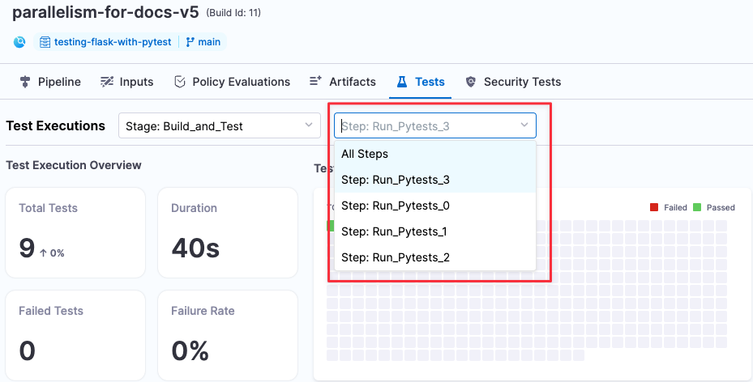

To decrease test cycle time, utilize parallelism by dividing tests into multiple sets and running them in parallel. *Parallelism* is one of the [looping strategies](/docs/platform/pipelines/looping-strategies/looping-strategies-matrix-repeat-and-parallelism) available in Harness pipelines. Whenever it's possible to divide the tasks of a particular step or stage into multiple sets and execute them concurrently, parallelism can be used to [speed things up](./optimizing-ci-build-times.md).

Most CI pipelines are set up to run tests with every new commit. When you [set up parallelism in a pipeline](#set-up-parallelism-in-a-pipeline), you must specify the following:

* The [parallelism strategy](#define-the-parallelism-strategy), which determines the number of instances of a stage or step to execute
* The strategy for splitting tests. How you do this depends on which step you're using to run tests:
   * If you're using the **Run Tests** step, you specify the `testSplitStrategy` to [enable test splitting for Test Intelligence](/docs/continuous-integration/use-ci/set-up-test-intelligence/#enable-parallelism-test-splitting-for-test-intelligence).
   * If you're using a **Run** step, you use the `split_tests` command along with test split strategies, such as `--split-by file_size` to [define test splitting](#define-test-splitting).

:::info

This page describes how to set up parallelism and test splitting in a **Run** step. For information about test splitting with Test Intelligence or in a **Run Tests** step, go to [Enable Test Intelligence](/docs/continuous-integration/use-ci/set-up-test-intelligence/).

:::

The diagram below demonstrates how parallelism can accelerate your CI pipelines. The first time you run a build with parallelism and test splitting, the pipeline partitions tests based on file size and gathers timing statistics for all tests. In subsequent builds, tests can be partitioned by timing to further speed up the pipeline's execution. With every run, test partitioning is refined based on the most up-to-date timing data.


## Important notes

* When using parallelism, it's important to take into account any resource limitations that exist in your build infrastructure. For more information, go to [Best Practices for Looping Strategies](/docs/platform/pipelines/looping-strategies/best-practices-for-looping-strategies.md).
* You can apply a parallelism strategy to an entire stage or to individual steps within a stage.
* When implementing parallelism in a step rather than a stage, you must ensure that each test-group step generates a report with a unique filename to prevent conflicts. You can accomplish this by utilizing the `<+strategy.iteration>` [expression](/docs/platform/variables-and-expressions/harness-variables) in your `reports.paths`. This expression represents the test group's parallel run index, ranging from `0` to `parallelism - 1`.
* To publish your test results, your output files must be in [JUnit](https://junit.org/junit5/) XML format. How you publish your test results depends on the specific language, test runner, and formatter used in your repo. For more information, go to the [Publish test reports section](#define-the-test-reports).
* If your stage utilizes Harness Cloud build infrastructure, you can directly call the `split_tests` binary from the **Run** step's `command`. For example, you would use `split_tests` instead of `/addon/bin/split_tests`.

### Example: YAML stage with parallelism

Parallelism can be set at either the step level or stage level.

The following YAML example shows a **Run** step that uses [pytest](https://docs.pytest.org/) and splits tests into four parallel test groups.

```yaml
# Use "run" step type  
- step:  
      type: Run     
      name: Run Pytests  
      identifier: Run_Pytests  
      # Enable parallelism strategy   
      strategy:             
          parallelism: 4   # Number of parallel runs  
          maxConcurrency: 2 # (optional) Limit the number of parallel runs   
      spec:  
          connectorRef: $dockerhub_connector  
          image: python:latest  
          shell: Sh  
          # Store the current index and total runs in environment variables  
          envVariables:    
              HARNESS_NODE_INDEX: <+strategy.iteration>  # index of current run  
              HARNESS_NODE_TOTAL: <+strategy.iterations> # total runs  
          command: |-  
              pip install -r requirements.txt  
              # Define splitting strategy and generate a list of test groups  
              FILES=`/addon/bin/split_tests --glob "**/test_*.py" \  
                     --split-by file_timing \  
                     --split-index ${HARNESS_NODE_INDEX} \  
                     --split-total ${HARNESS_NODE_TOTAL}`  
              echo $FILES  
              # Run tests with the test-groups string as input  
              pytest -v --junitxml="result_<+strategy.iteration>.xml" $FILES  
         # Publish JUnit test reports to Harness   
         reports:    
              type: JUnit   
              spec:  
                  paths:   # Generate unique report for each iteration  
                      - "**/result_<+strategy.iteration>.xml"   
      failureStrategies: []
```

## Set up parallelism in a pipeline

:::info

The following information applies to test splitting in a **Run** step. For information about test splitting with Test Intelligence (in a **Run Tests** step), go to [Enable Test Intelligence](/docs/continuous-integration/use-ci/set-up-test-intelligence/).

:::

The process to set up parallelism in a pipeline is as follows:

1. Enable parallelism and specify the number of jobs to run in parallel. For more information, go to [Define the parallelism strategy](#define-the-parallelism-strategy).
2. Define the following environment variables within the stage or step where you declared the parallelism strategy:
	* `HARNESS_NODE_TOTAL = <+strategy.iterations>` — This specifies the total number of iterations in the current stage or step.
	* `HARNESS_NODE_INDEX = <+strategy.iteration>` — This specifies the index of the current test run, which ranges from `0` to `parallelism-1`. You can define and use these variables in the YAML editor as shown in the following snippet:

```yaml
- step:    
     ....  
     envVariables:   
          HARNESS_NODE_INDEX: <+strategy.iteration>   
          HARNESS_NODE_TOTAL: <+strategy.iterations>   
     command: |-   
          pip install -r requirements.txt   
          FILES=`/addon/bin/split_tests --glob "**/test_*.py" \  
                --split-by file_size \  
                --split-index ${HARNESS_NODE_INDEX} \  
                --split-total=${HARNESS_NODE_TOTAL}`   
          pytest -v --junitxml="result_${HARNESS_NODE_INDEX}.xml" $FILES   
          echo "$HARNESS_NODE_TOTAL runs using file list $FILES" 
```

To define these attributes in the Pipeline Studio, go to the step that implements the parallelism strategy. Then go to **Optional Configuration** > **Environment Variables**.

3. Set up the `split_tests` command with the splitting criteria based on file size (`--split-by file_size`). For more information, go to [Define test splitting](#define-test-splitting).
4. Define your test reports. Your reports must be in JUnit XML format. For more information, go to [Publish test reports](#publish-test-reports).
5. Run your pipeline to make sure all your steps complete successfully. You can see the parallel copies of your step running on the [Build details page](../viewing-builds).

   

6. When the build finishes, go to the **Tests** tab and [view your results](/docs/continuous-integration/use-ci/set-up-test-intelligence/viewing-tests). You can view results for each parallel run using the pull-down.

   

7. Now that Harness has collected timing data, you can use [test splitting options based on timing](#test-splitting-strategies) to further reduce your build times.

### Define the parallelism strategy

The `parallelism` value defines how many steps you want to run in parallel. In general, a higher value means a faster completion time for all tests. The primary restraint is the resource availability in your build infrastructure.

```mdx-code-block
import Tabs from '@theme/Tabs';
import TabItem from '@theme/TabItem';
```

```mdx-code-block
<Tabs>
  <TabItem value="Visual" label="Visual">
```

1. In the Pipeline Studio, open the step or stage where you run your tests, and select the **Advanced** tab.
2. Under **Looping Strategies**, select **Parallelism** and define your strategy.


```mdx-code-block
  </TabItem>
  <TabItem value="YAML" label="YAML" default>
```

```yaml
- step:  
      ...  
      strategy:  
        parallelism: 4
```

```mdx-code-block
  </TabItem>
</Tabs>
```

### Define test splitting

:::info

The following information applies to test splitting in a **Run** step. For information about test splitting with Test Intelligence (in a **Run Tests** step), go to [Enable Test Intelligence](/docs/continuous-integration/use-ci/set-up-test-intelligence/).

:::

You use the `split_tests` CLI command to define the set of tests you want to run. In the **Command** field of the **Run** step where you run your tests, you need to do the following:

1. Configure the `split_tests` command to define how you want to split your tests. This command outputs a string of your test groups.
2. Run the test command with your test-groups string as input.

For example:

```
# Generate a new set of grouped test files and output the file list to a string...  
FILES=`/addon/bin/split_tests --glob "**/test_*.py" \  
          --split-by file_time \  
          --split-index ${HARNESS_NODE_INDEX} \  
          --split-total=${HARNESS_NODE_TOTAL}` 
echo $FILES  
# example output: test_api_2.py test_api_4.py test_api_6.py  
  
# Then use the $FILES list as input to the test command--in this case, pytest:  
pytest -v --junitxml="result_${HARNESS_NODE_INDEX}.xml" $FILES 
```

:::tip

If your stage uses Harness Cloud build infrastructure, your Run step's `command` can call the `split_tests` binary directly. For example, you would use `./split_tests` instead of `/addon/bin/split_tests`.

:::

The `split_tests` command creates a new set of test files that is ordered based on your splitting criteria. This command takes the following as inputs:

* The set of all the tests you want to run (`--glob` argument).
* The algorithm used to split the tests into groups (`--split-by` argument).
* The run index and total number of runs. You should set these to the environment attributes you defined previously (`--split-index ${HARNESS_NODE_INDEX}` and `--split-total ${HARNESS_NODE_TOTAL}`).

#### Test splitting strategies

The `split_tests` command allows you to define the criteria for splitting tests.

Harness supports the following strategies:

* `--split-by file_size` - Split files into groups based on the size of individual files.
* `--split-by file_timing` (Default) — Split files into groups based on the test times of individual files. `split_tests` uses the most recent timing data to ensure that all parallel test runs finish at approximately the same time. The pipeline needs timing data from the previous run to split tests by time. If timing data isn't available, `split_tests` falls back to `--split-by file_size`.
* `--split-by test_count` — Split tests into groups based on the overall number of tests.
* `--split-by class_timing` — Split tests into groups based on the timing data for individual classes. The pipeline needs timing data from the previous run to split tests by time. If timing data isn't available, `split_tests` falls back to `--split-by file_size`.
* `--split-by testcase_timing` — Split tests into groups based on the timing data for individual test cases. The pipeline needs timing data from the previous run to split tests by time. If timing data isn't available, `split_tests` falls back to `--split-by file_size`.
* `--split-by testsuite_timing` — Split tests into groups based on the timing data for individual test suites. The pipeline needs timing data from the previous run to split tests by time. If timing data isn't available, `split_tests` falls back to `--split-by file_size`.

#### Specifying the tests to split

To split tests based on their run time, you must provide a list of file paths, classes, test cases, or test suites to include. For example, the following code snippet splits tests by time in a **Run** step. The `split_tests` command used in the code parses all matching test files based on the `--glob` option and splits them into separate lists based on `--split-by file_timing`. The number of lists created is determined by the `parallelism` setting. For example, if `parallelism` is set to 2, the command creates two separate lists of files that are evenly divided based on their testing time. The pipeline then creates two parallel steps that run tests for the files in each list.

```
pip install -r requirements.txt  
  
# Split by timing data  
FILES=`/addon/bin/split_tests --glob "**/test_*.py" --split-by file_timing`  
echo $FILES  
pytest -v --junitxml="result_${HARNESS_NODE_INDEX}.xml" $FILES
```

When the pipeline finishes a build, the `echo $FILES` output shows the files that got tested in each step. For example, one log contains the following:

```
+ FILES=test_file_1.py test_file_2.py test_file_6.py test_file_9.py test_file_10.py test_file_12.py test_file_13.py
```

Whereas another log contains:

```
+ FILES=test_file_3.py test_file_4.py test_file_5.py test_file_8.py test_file_11.py test_file_14.py
```

Note that this example applies to the `--split-by file_timing`option. In this case, you can use a glob expression to specify the set of elements that need to be split and tested. For class, test-case, or test-suite timing, you must provide a text file of the elements to split. If you want to split by Java-class timing, for example, you could specify the set of classes to split and test in a new-line-delineated string like this:

```
echo 'io.harness.jhttp.server.PathResolverTest\nio.harness.jhttp.processor.DirectoryIndexTest\nio.harness.jhttp.functional.HttpClientTest\nio.harness.jhttp.processor.ResourceNotFoundTest'> classnames.txt  
CLASSES=`/addon/bin/split_tests --split-by class_timing --file-path classnames.txt`
```

### Publish test reports

The `report` section in the pipeline YAML defines how to publish your test reports. Here's an example:

```yaml
reports:   
   type: JUnit   
      spec:   
         paths: - "**/result_${HARNESS_NODE_INDEX}.xml"
```

To ensure that your test reports are correctly published and time-based test splitting works, you must do the following:

* Configure your test runner and formatter to publish your test reports in the [JUnit](https://junit.org/junit5/) XML format and include file names in the XML output.
   * For example, if you use `pytest`, you can set `junit_family=xunit1` in your code repo's `pytest.ini` file, or you can include `-o junit_family="xunit1"` in the step's `command`.
   * The exact setup and configuration requirements depend on the test runner that you use. Refer to your test runner's documentation to learn how to publish in the correct format.
   * For more information, go to [Format test reports](/docs/continuous-integration/use-ci/set-up-test-intelligence/test-report-ref).
* If you're implementing `parallelism` in a step, rather than a stage, ensure that each `test-group` step generates a report with a unique filename. You can achieve this using the `<+strategy.iteration>` variable, which represents the index of the current test run, in the range of `0` to `parallelism-1`.

You can configure test reporting options in the Pipeline Studio's YAML or Visual editors. In your pipeline, locate the **Run** or **Run Tests** step and specify the **Report Paths** field. In the Visual editor this field is located under **Optional Configuration**.


## YAML pipeline example with parallelism

The following YAML example shows a full end-to-end pipeline with parallelism enabled.

:::tip

If your stage uses Harness Cloud build infrastructure, your Run step's `command` can use the `split_tests` binary directly. For example, you would use `split_tests` instead of `/addon/bin/split_tests`.

:::

<details>
<summary>Parallelism pipeline YAML example</summary>

```yaml
pipeline:  
    name: parallelism-for-docs-v6  
    identifier: parallelismfordocsv6  
    projectIdentifier: myproject  
    orgIdentifier: myorg  
    tags: {}  
    properties:  
        ci:  
            codebase:  
                connectorRef: $GITHUB_CONNECTOR  
                repoName: testing-flask-with-pytest  
                build: <+input>  
    stages:  
        - stage:  
              name: Build and Test  
              identifier: Build_and_Test  
              type: CI  
              spec:  
                  cloneCodebase: true  
                  infrastructure:  
                      type: KubernetesDirect  
                      spec:  
                          connectorRef: $HARNESS_K8S_DELEGATE_CONNECTOR  
                          namespace: harness-delegate-ng  
                          automountServiceAccountToken: true  
                          nodeSelector: {}  
                          os: Linux  
                  execution:  
                      steps:  
                          - step:  
                                type: Run  
                                name: Run Pytests  
                                identifier: Run_Pytests  
                                strategy:  
                                    parallelism: 4  
                                spec:  
                                    connectorRef: $DOCKERHUB_CONNECTOR  
                                    image: python:latest  
                                    shell: Sh  
                                    envVariables:  
                                        HARNESS_NODE_INDEX: <+strategy.iteration>  
                                        HARNESS_NODE_TOTAL: <+strategy.iterations>  
                                    command: |-  
                                        pip install -r requirements.txt  
                                        FILES=`/addon/bin/split_tests --glob "**/test_*.py" \  
                                               --split-by file_timing \  
                                               --split-index ${HARNESS_NODE_INDEX} \  
                                               --split-total=${HARNESS_NODE_TOTAL}`  
                                        echo $FILES  
                                        pytest -v --junitxml="result_${HARNESS_NODE_INDEX}.xml" $FILES  
                                    reports:  
                                        type: JUnit  
                                        spec:  
                                            paths:  
                                                - "**/result_${HARNESS_NODE_INDEX}.xml"  
                                failureStrategies: []
```

</details>

## See also

* [Optimize and enhance CI pipelines](./optimizing-ci-build-times.md)
* [Looping strategies overview](/docs/platform/pipelines/looping-strategies/looping-strategies-matrix-repeat-and-parallelism)
* [Best Practices for Looping Strategies](/docs/platform/pipelines/looping-strategies/best-practices-for-looping-strategies)
