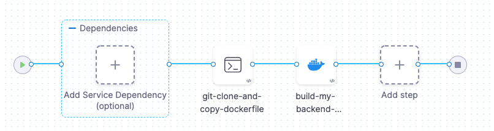

You can clone multiple codebases in the same Pipeline and then build artifacts from multiple repositories. This enables use cases such as:

* You use Packer and Ansible to build artifacts automatically. Your organization maintains separate repos for Packer, Ansible, and code. You set up a Run Step that clones all three repos and then builds artifacts from a common workspace.
* Your code files are in one repo managed by the Engineering team. Your Docker files are in a separate repo managed by the Security team. Your Pipeline clones both repos and then builds a Docker image from a common workspace.

This topic uses the second use case to illustrate how to clone and combine multiple repos into one workspace. The example Pipeline works as follows:

* The Build Stage specifies the code repo as the default Codebase. The Build setup process clones this repo into the build workspace automatically.
* A Run Step clones the Docker repo into the workspace.
* A Build Step builds and pushes an image using files from both repos in the build workspace.

### Before You Begin

To go through this workflow, you need the following:

* A familiarity with basic Harness CI concepts:
	+ [CI Pipeline Tutorial](../../ci-quickstarts/ci-pipeline-quickstart.md)
	+ [Learn Harness' Key Concepts](../../../getting-started/learn-harness-key-concepts.md)
* A familiarity with Build Stage settings:
	+ [CI Build Stage Settings](../../ci-technical-reference/ci-stage-settings.md)
* A familiarity with how Pipelines use Codebases:
	+ [Create and Configure a Codebase](../codebase-configuration/create-and-configure-a-codebase.md)

### Step 1: Set Up the Build Stage

In the first Build Stage of your Pipeline, do the following:

1. Configure the default Codebase.  
You set up the Codebase when you create the first Build Stage in your Pipeline. To edit a Codebase after you create it, click **Codebase** on the right side of the Pipeline Studio. See [Create and Configure a Codebase](../codebase-configuration/create-and-configure-a-codebase.md).
2. In the Overview tab, verify that **Clone Codebase** is selected.  
With this option selected (the default), a Build clones the default codebase into its workspace as part of the setup process. You can clone additional codebases into the workspace, as described below.

### Step 2: Define the Build Farm Infrastructure

In the CI stage Infrastructure, define the build farm for the codebase. See [Set Up Build Infrastructure](https://docs.harness.io/category/set-up-build-infrastructure).

### Step 4: Add Run Steps to Clone Additional Repos

You can create one or more Run Steps to clone additional repos into the build workspace. Note the following:

* Depending on the image you use for the Run Step, you might need to install Git before you clone any repos.
* You might want to define Stage Variables for the names and URLs of the codebases that you clone into the workspace. These variables are accessible across all Steps in the Stage.

Here's some example code that installs git, verifies that it's working, and clones the repo with the Dockerfile needed to build an image:


```
apk add git  
git --version  
git clone https://github.com/$GITHUB_USERNAME/$DOCKER_REPO
```
### Step 5: Move Files and Folders as Needed

You now have your default Codebase and additional codebases cloned into the same workspace. Note that the default Codebase files are in the root folder, while other codebase files are in subfolders. If you run a `find` or a recursive `ls` in the Run step after you clone your codebases, you see something like this:


```
# Files from default codebase:  
87 info 4/26/2022 10:43:31 AM ./setup-be-service.sh  
88 info 4/26/2022 10:43:31 AM ./default-be-template.json  
89 info 4/26/2022 10:43:31 AM ./core/  
90 info 4/26/2022 10:43:31 AM ./core/src/  
...  
# Files from $DOCKER_REPO codebase:  
146 info 4/26/2022 10:43:31 AM ./myDockerRepo/myBackendService  
147 info 4/26/2022 10:43:31 AM ./myDockerRepo/myBackendService/Dockerfile
```
In this example workflow, you need to copy the Dockerfile for the back-end service into the root workspace folder:


```
# This assumes that Dockerfiles are arranged by app-repo name in the Docker repo:  
cp $DOCKER_REPO/$APP_REPO/Dockerfile .
```
Now the Dockerfile is in the correct location to build the image:


```
./setup-backend-service.sh  
./default-be-template.json  
./Dockerfile  
./core/  
...
```
### Step 5: Add a Build and Push Step

Now that the files from your repos are in one common workspace, you can add a Build Step (in this case, Build and Push an Image to Docker Registry) to your Stage.



### Step 5: Run the Pipeline

Now you can run your Pipeline.

1. Click **Save**.
2. Click **Run**.
3. If prompted, specify a Git branch, tag, or PR number.
4. Click **Run Pipeline** and check the console output to verify that the Pipeline runs as intended.

### Configure As Code: YAML

To configure your pipeline as YAML in CI, go to Harness **Pipeline Studio**, click **YAML**. Here’s a working example of the use case described in this topic. Modify the YAML attributes such as name, identifiers, codebase, connector refs, and variables as needed.


```
pipeline:  
    name: build-from-multiple-repos-example  
    identifier: buildfrommultiplereposexample  
    allowStageExecutions: false  
    projectIdentifier: docexampleproject  
    orgIdentifier: wtd  
    description: Git clone, copy Dockerfile from myDockerRepo to workspace root, build image  
    tags: {}  
    properties:  
        ci:  
            codebase:  
                connectorRef: mygithubconnector  
                repoName: myBackendService  
                build: <+input>  
    stages:  
        - stage:  
              name: Build myBackendService  
              identifier: Build_Test_and_Push  
              type: CI  
              spec:  
                  cloneCodebase: true  
                  infrastructure:  
                      type: KubernetesDirect  
                      spec:  
                          connectorRef: mydelegateconnector  
                          namespace: harness-delegate-ng  
                          automountServiceAccountToken: true  
                  execution:  
                      steps:  
                          - step:  
                                type: Run  
                                name: git-clone-and-copy-dockerfile  
                                identifier: echotriggervarscustom  
                                spec:  
                                    connectorRef: mydockerhubconnector  
                                    image: alpine:latest  
                                    shell: Sh  
                                    command: |+  
                                        # Clone Codebase is enabled, which copies all  
                                        # files and folders to the current folder.  
                                        # Before we can build an image, we need to clone the   
                                        # Docker repo and copy the corresponding Dockerfile  
                                        # to the current folder   
  
                                        apk add git  
                                        git --version  
                                        git clone https://github.com/$GITHUB_USERNAME/$DOCKER_REPO  
  
                                        # We now have Docker repo at the current folder:  
                                        find .  
  
                                        # Copy Dockerfile to current folder, where the Docker Build  
                                        # step can find it:  
                                        cp $DOCKER_REPO/$APP_REPO/Dockerfile .  
  
                                    privileged: true  
                          - step:  
                                type: BuildAndPushDockerRegistry  
                                name: build-my-backend-service  
                                identifier: buildmybackendservice  
                                spec:  
                                    connectorRef: mydockerhubconnector  
                                    repo: <+input>  
                                    tags:  
                                        - <+pipeline.sequenceId>  
                                        - latest  
                                    optimize: true  
              variables:  
                  - name: GITHUB_USERNAME  
                    type: Secret  
                    value: msharmadgithubuname  
                  - name: APP_REPO  
                    type: String  
                    value: myBackendService  
                  - name: DOCKER_REPO  
                    type: String  
                    value: myDockerRepo  
              failureStrategies: []
```
### See Also

* [Create and Configure a Codebase](../codebase-configuration/create-and-configure-a-codebase.md)
* [CI Run Step Settings](../../ci-technical-reference/run-step-settings.md)
* [CI Build Stage Settings](../../ci-technical-reference/ci-stage-settings.md)
* [Build and Upload Artifacts](https://docs.harness.io/category/build-and-upload-artifacts)

