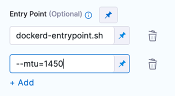

:::tip

Docker-in-Docker (DinD) with privileged mode is necessary only when using a Kubernetes build infrastructure. For other infrastructure types, you can run Docker commands directly on the host.

:::

CI pipelines that use a Kubernetes build infrastructure need Docker-in-Docker (**DinD**) if you need to run Docker commands as part of the build process. For example, you can build images from two separate codebases in the same pipeline: One with a [Build and Push an Image to Docker Registry step](../build-and-upload-artifacts/build-and-push-to-docker-hub-step-settings.md) and another with Docker commands in a [Run step](./run-step-settings.md).

This topic illustrates a simple build-and-push workflow using Docker-in-Docker for a pipeline that uses a Kubernetes build infrastructure.

## Before You Begin

Docker-in-Docker must run in privileged mode to work properly. Use caution because this provides full access to the host environment. For more information, go to the Docker documentation for [Runtime Privilege and Linux Capabilities](https://docs.docker.com/engine/reference/run/#runtime-privilege-and-linux-capabilities). You can't use Docker-in-Docker on platforms that don't support privileged mode, such as those that run containers on Windows.

These steps assume you are familiar with the following concepts:

* Pipeline configuration, such as in the [build and test on a Kubernetes cluster build infrastructure tutorial](/tutorials/ci-pipelines/kubernetes-build-farm)
* [Harness key concepts](../../../getting-started/learn-harness-key-concepts.md)
* [CI Build stage settings](../set-up-build-infrastructure/ci-stage-settings.md)

## Step 1: Set Up the CI Stage

In your Harness Pipeline, click **Add Stage**. Then click **Build**.

In the Overview tab for the new Build Stage, configure the Stage as follows:

* For this example, disable **Clone Codebase**. You will be cloning a different codebase from the one referenced in the Codebase Object.
* Under Shared Paths, add the following:
	+ `/var/run`
	+ `/var/lib/docker`
* Under **Advanced**, add [stage variables](/docs/platform/pipelines/add-a-stage/#stage-variables) for your Docker Hub Personal Access Token and any other fields you want to parameterize. For passwords and Personal Access Tokens, select **Secret** as the variable type.

## Step 2: Define the Build Farm Infrastructure

In the CI Build stage > **Infrastructure** tab, define the build infrastructure for the codebase. See [Set Up Build Infrastructure](/docs/category/set-up-build-infrastructure).

## Step 3: Add a DinD Background step

In the Execution tab, add a [Background step](../manage-dependencies/background-step-settings.md) and configure it as follows:

* **Name:** `dind_Service`
* **Container Registry:** A Docker Hub container registry connector.
* **Image:** The image you want to use, such as [docker:dind](https://hub.docker.com/_/docker).
* **Optional Configuration:** Select **Privileged**. This is required for Docker-in-Docker.

<details>
<summary>Providing arguments</summary>

Provide arguments as a list in **Entry Point**.

For example, the entry point for the `docker:dind` image is `docker-entrypoint.sh`. If you want to add an `--mtu` argument, you would include both the image entry point and the argument in your step's **Entry Point** specification.

```mdx-code-block
import Tabs from '@theme/Tabs';
import TabItem from '@theme/TabItem';
```
```mdx-code-block
<Tabs>
  <TabItem value="Visual" label="Visual" default>
```

<!--  -->

<docimage path={require('./static/dind-background-step-entry-point.png')} />

```mdx-code-block
  </TabItem>
  <TabItem value="YAML" label="YAML">
```

```yaml
entrypoint:
  - docker-entrypoint.sh
  - "--mtu=1450"
```

```mdx-code-block
  </TabItem>
</Tabs>
```

</details>

## Step 4: Configure the Run Step

In the Execution tab, add a [Run Step](./run-step-settings.md) and configure it as follows:

* **Container Registry:** A Connector to your Docker registry.
* **Image:** The Docker image, with the Docker binary, that you want to run the **Run** step in.
* **Command:** Enter the shell commands you want to run in the dind container.

Once the container is started, the software inside the container takes time to initialize and start accepting connections. Give the service adequate time to initialize before trying to connect. You can use a `while` loop, as shown here:


```
  
while ! docker ps ;do   
      echo "Docker not available yet"  
done  
echo "Docker Service Ready"  
docker ps  

```
The following example code clones a Git repo, builds an image, and pushes the image to a Docker registry:


```
apk add git  
git --version  
git clone https://github.com/$GITHUB_USERNAME/$GITHUB_REPO  
cd $GITHUB_REPO  
  
echo $DOCKERHUB_PAT > my_password.txt  
cat my_password.txt | docker login --username $DOCKERHUB_USERNAME --password-stdin  
  
docker build -t $DOCKER_IMAGE_LABEL .  
docker tag $DOCKER_IMAGE_LABEL $DOCKERHUB_USERNAME/$DOCKER_IMAGE_LABEL:<+pipeline.sequenceId>  
docker push $DOCKERHUB_USERNAME/$DOCKER_IMAGE_LABEL:<+pipeline.sequenceId>
```
## Step 5: Run the Pipeline

Now you can run your Pipeline. You simply need to select the codebase.

1. Click **Save**.
2. Click **Run**.
3. If prompted, specify a Git branch, tag, or PR number.
4. Click **Run Pipeline** and check the console output to verify that the Pipeline runs as intended.

## Configure As Code: YAML

To configure your pipeline as YAML in CI, go to Harness **Pipeline Studio** and select **YAML**. Here is an example of a pipeline that uses the workflow described in this topic. Modify the YAML attributes, such as `name`, `identifiers`, `codebase`, connector refs, and variables, as needed.

```
pipeline:
  name: dind-w-background-step
  identifier: dindwbackgroundstep
  projectIdentifier: myproject
  orgIdentifier: myorg
  tags: {}
  stages:
    - stage:
        name: build-bg
        identifier: buildbg
        type: CI
        spec:
          cloneCodebase: false
          execution:
            steps:
              - step:
                  type: Background
                  name: Background
                  identifier: Background
                  spec:
                    connectorRef: mydockerhubconnector
                    image: docker:dind
                    shell: Sh
                    privileged: true
              - step:
                  type: Run
                  name: Run
                  identifier: Run
                  spec:
                    connectorRef: mydockerhubconnector
                    image: docker:run_step_image
                    shell: Sh
                    command: |-
                      while ! docker ps ;do   
                            echo "Docker not available yet"  
                      done  
                      echo "Docker Service Ready"  
                      docker ps 

                      apk add git  
                      git --version  
                      git clone https://github.com/john-doe/$GITHUB_REPO  
                      cd $GITHUB_REPO  
                        
                      echo $DOCKERHUB_PAT > my_password.txt  
                      cat my_password.txt | docker login --username $DOCKERHUB_USERNAME --password-stdin  
                        
                      docker build -t $DOCKER_IMAGE_LABEL .  
                      docker tag $DOCKER_IMAGE_LABEL $DOCKERHUB_USERNAME/$DOCKER_IMAGE_LABEL:<+pipeline.sequenceId>  
                      docker push $DOCKERHUB_USERNAME/$DOCKER_IMAGE_LABEL:<+pipeline.sequenceId>
                    privileged: false
          infrastructure:
            type: KubernetesDirect
            spec:
              connectorRef: docsexampledelegate
              namespace: harness-delegate-ng
              nodeSelector: {}
              os: Linux
          sharedPaths:
            - /var/run
            - /var/lib/docker
        variables:
          - name: DOCKERHUB_USERNAME
            type: String
            description: ""
            value: jdoe
          - name: DOCKERHUB_PAT
            type: Secret
            description: ""
            value: jdoedockerhubpat
          - name: GITHUB_USERNAME
            type: String
            description: ""
            value: john-doe
          - name: GITHUB_REPO
            type: String
            description: ""
            value: codebaseAlpha
          - name: GITHUB_PAT
            type: Secret
            description: ""
            value: johndoegithubpat
          - name: DOCKER_IMAGE_LABEL
            type: String
            description: ""
            value: dind-w-bg-step

```

## See also

* [Run a Drone Plugin in CI](../use-drone-plugins/run-a-drone-plugin-in-ci.md)
