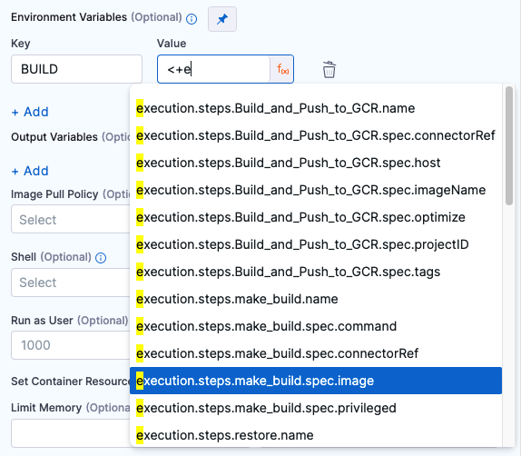

```mdx-code-block
import Tabs from '@theme/Tabs';
import TabItem from '@theme/TabItem';
import OutVar from '/docs/continuous-integration/shared/output-var.md';
```

You can use a **Run** step to run commands or scripts in a CI pipeline. Here are some examples of different ways you can use **Run** steps.

```mdx-code-block
<Tabs>
  <TabItem value="test" label="Run tests" default>
```

This example runs `pytest`, includes [code coverage](../set-up-test-intelligence/code-coverage.md) and produces a report in JUnit XML format.

```yaml
              - step:
                  type: Run
                  name: Run pytest
                  identifier: Run_pytest
                  spec:
                    connectorRef: account.harnessImage
                    image: python:latest
                    shell: Sh
                    command: |-
                      echo "Welcome to Harness CI"
                      uname -a
                      pip install pytest
                      pip install pytest-cov
                      pip install -r requirements.txt

                      pytest -v --cov --junitxml="result.xml" test_api.py test_api_2.py test_api_3.py

                      echo "Done"
                    reports:
                      type: JUnit
                      spec:
                        paths:
                          - "**/*.xml"
```

:::tip

You can use `parallelism` and `split_tests` to [define test splitting in a Run step](/docs/platform/pipelines/speed-up-ci-test-pipelines-using-parallelism/#define-test-splitting) and improve test times.

:::

```mdx-code-block
  </TabItem>
  <TabItem value="dependencies" label="Install dependencies">
```

This example installs Go dependencies.

```yaml
              - step:
                  type: Run
                  identifier: dependencies
                  name: Dependencies
                  spec:
                    shell: Sh
                    command: |-
                      go get example.com/my-go-module
```

```mdx-code-block
  </TabItem>
  <TabItem value="version" label="Specify versions">
```

This example uses a **Run** step to select a version of Xcode.

```yaml
              - step:
                  type: Run
                  name: set_xcode_version
                  identifier: set_xcode_version
                  spec:
                    shell: Sh
                    command: |-
                      sudo xcode-select -switch /Applications/Xcode_13.4.1.app
                      xcodebuild -version
```

```mdx-code-block
  </TabItem>
  <TabItem value="repo" label="Clone a repo">
```

This example clones a GitHub repository.

```yaml
              - step:
                  type: Run
                  identifier: clone
                  name: clone
                  spec:
                    shell: Sh
                    command: |-
                      git clone https://GH_PERSONAL_ACCESS_TOKEN@github.com/ACCOUNT_NAME/REPO_NAME.git
```

To use this command, you would replace:

* `ACCOUNT_NAME` with your GitHub account name.
* `REPO_NAME` with the name of the GitHub repo to clone.
* `PERSONAL_ACCESS_TOKEN` with a [GitHub personal access token](https://docs.github.com/en/authentication/keeping-your-account-and-data-secure/creating-a-personal-access-token) that has pull permissions to the target repository. Additional permissions may be necessary depending on the Action's purpose. Store the token as a [Harness secret](/docs/category/secrets) and use a variable expression, such as `<+secrets.getValue("YOUR_TOKEN_SECRET")>`, to call it.

```mdx-code-block
  </TabItem>
  <TabItem value="scripts" label="Run scripts">
```

**Run** steps are highly versatile, and you can use them to run all manner of individual commands or multi-line scripts.

For example, this step is from the [Terraform notifications tutorial](/tutorials/ci-pipelines/tfc-notification), and it produces [output variables](#output-variables) from Terraform values. These output variables are used by another step later in the same pipeline.

```yaml
              - step:
                  type: Run
                  name: Terraform Outputs
                  identifier: tf_outputs
                  spec:
                    connectorRef: account.harnessImage
                    image: kameshsampath/kube-dev-tools
                    shell: Sh
                    command: |-
                      cd /harness/vanilla-gke/infra
                      terraform init
                      GCP_PROJECT=$(terraform output -raw project-name)
                      GCP_ZONE=$(terraform output -raw zone)
                      GKE_CLUSTER_NAME=$(terraform output -raw kubernetes-cluster-name)
                    envVariables:
                      TF_TOKEN_app_terraform_io: <+secrets.getValue("terraform_cloud_api_token")>
                      TF_WORKSPACE: <+trigger.payload.workspace_name>
                      TF_CLOUD_ORGANIZATION: <+trigger.payload.organization_name>
                    outputVariables:
                      - name: GCP_PROJECT
                      - name: GCP_ZONE
                      - name: GKE_CLUSTER_NAME
                    imagePullPolicy: Always
                  description: Get the outputs of terraform provision
```

:::tip

Consider [creating plugins](../use-drone-plugins/custom_plugins.md) for scripts that you reuse often.

:::

```mdx-code-block
  </TabItem>
</Tabs>
```

## Add the Run step

You need a [CI pipeline](../prep-ci-pipeline-components.md) with a [Build stage](../set-up-build-infrastructure/ci-stage-settings.md) where you'll add the **Run** step. If you haven't created a pipeline before, try one of the [CI pipeline tutorials](../../ci-quickstarts/ci-pipeline-quickstart.md).

In order for the **Run** step to execute your commands, the build environment must have the necessary binaries for those commands. Depending on the stage's build infrastructure, **Run** steps can use binaries that exist in the build environment or pull an image, such as a public or private Docker image, that contains the required binaries. For more information about when and how to specify images, go to the [Container registry and image settings](#container-registry-and-image).

```mdx-code-block
<Tabs>
  <TabItem value="Visual" label="Visual">
```

1. Go to the **Build** stage in the pipeline where you want to add the **Run** step.
2. On the **Execution** tab, select **Add Step**, and select the **Run** step from the Step Library.
3. Configure the [Run step settings](#settings) and then select **Apply Changes** to save the step.

```mdx-code-block
  </TabItem>
  <TabItem value="YAML" label="YAML" default>
```

In Harness, go to the pipeline where you want to add the `Run` step. In the `CI` stage, add a `Run` step and configure the [Run step settings](#settings).

```yaml
              - step:
                  type: Run
                  name: Run pytest # Specify a name for the step.
                  identifier: Run_pytest # Define a step ID, usually based on the name.
                  spec:
                    connectorRef: account.harnessImage # Specify a container registry, if required.
                    image: python:latest # Specify an image, if required.
                    shell: Sh
                    command: |-
                      # Provide your commands.
```

```mdx-code-block
  </TabItem>
</Tabs>
```

## Settings

The **Run** step has the following settings.

:::info

Depending on the stage's build infrastructure, some settings may be unavailable or optional. Settings specific to containers, such as **Set Container Resources**, are not applicable when using the step in a stage with VM or Harness Cloud build infrastructure.

:::

### Name

Enter a name summarizing the step's purpose. Harness automatically assigns an **Id** ([Entity Identifier Reference](../../../platform/20_References/entity-identifier-reference.md)) based on the **Name**. You can change the **Id**.

### Description

Optional text string describing the step's purpose.

### Container Registry and Image

**Container Registry** and **Image** ensure that the build environment has the binaries necessary to execute the commands that you want to run in this step. For example, a cURL script may require a cURL image, such as `curlimages/curl:7.73.0`.

The **Container Registry** is a container registry connector, such as a [Docker connector](/docs/platform/connectors/cloud-providers/ref-cloud-providers/docker-registry-connector-settings-reference/), that connects to a container registry, such as Docker Hub.

The **Image** is the fully-qualified name (FQN) or artifact name of the Docker image to use when this step runs commands, for example `us.gcr.io/playground-123/quickstart-image`.

The image name should include the tag. If you don't include a tag, Harness uses the `latest` tag.

You can use any Docker image from any Docker registry, including Docker images from private registries. Different container registries require different name formats:

* **Docker Registry:** Input the name of the artifact you want to deploy, such as `library/tomcat`. Wildcards aren't supported. FQN is required for images in private container registries.
* **ECR:** Input the FQN of the artifact you want to deploy. Images in repos must reference a path, for example: `40000005317.dkr.ecr.us-east-1.amazonaws.com/todolist:0.2`.
* **GCR:** Input the FQN of the artifact you want to deploy. Images in repos must reference a path starting with the project ID that the artifact is in, for example: `us.gcr.io/playground-243019/quickstart-image:latest`.

<figure>


<figcaption>Configuring GCR Container Registry and Image settings.</figcaption>
</figure>

:::info

The stage's build infrastructure determines whether these fields are required or optional:

* [Kubernetes cluster build infrastructure](../set-up-build-infrastructure/k8s-build-infrastructure/set-up-a-kubernetes-cluster-build-infrastructure.md): **Container Registry** and **Image** are always required.
* [Local runner build infrastructure](../set-up-build-infrastructure/define-a-docker-build-infrastructure.md): **Container Registry** and **Image** are always required.
* [Self-hosted cloud provider VM build infrastructure](/docs/category/set-up-vm-build-infrastructures): **Run** steps can use binaries that you've made available on your build VMs. The **Container Registry** and **Image** are required if the VM doesn't have the necessary binaries. These fields are located under **Optional Configuration** for stages that use self-hosted VM build infrastructure.
* [Harness Cloud build infrastructure](../set-up-build-infrastructure/use-harness-cloud-build-infrastructure.md): **Run** steps can use binaries available on Harness Cloud machines, as described in the [image specifications](/docs/continuous-integration/use-ci/set-up-build-infrastructure/use-harness-cloud-build-infrastructure#platforms-and-image-specifications). The **Container Registry** and **Image** are required if the machine doesn't have the binary you need. These fields are located under **Optional Configuration** for stages that use Harness Cloud build infrastructure.

:::

### Shell and Command

Use these fields to define the commands that you need to run in this step.

For **Shell**, select the shell script type. Options include: **Bash**, **PowerShell**, **Pwsh**, **Sh**, and **Python**. If the step includes commands that aren't supported for the selected shell type, the build fails. Required binaries must be available on the build infrastructure or the specified image, as described in [Container Registry and Image](#container-registry-and-image).

In the **Command** field, enter [POSIX](https://en.wikipedia.org/wiki/POSIX) shell script commands for this step. The script is invoked as if it were the entry point. If the step runs in a container, the commands are executed inside the container.

:::tip

You can reference services started in [Background steps](../manage-dependencies/background-step-settings.md) by using the Background step's **Id** in your Run step's **Command**. For example, a cURL command could call `[backgroundStepId]:5000` where it might otherwise call `localhost:5000`.

<figure>


<figcaption>The Background step ID, <code>pythonscript</code>, is used in a cURL command in a Run step.</figcaption>
</figure>

If the Background step is inside a step group, you must include step group ID, such as `[stepGroupId]_[backgroundStepId]:5000`, even if both steps are in the same step group.

:::

Select each tab below to view examples for each `shell` type.

```mdx-code-block
<Tabs>
  <TabItem value="bash" label="Bash" default>
```

This Bash script example checks the Java version.

```yaml
              - step:
                  ...
                  spec:
                    shell: Bash
                    command: |-
                      JAVA_VER=$(java -version 2>&1 | head -1 | cut -d'"' -f2 | sed '/^1\./s///' | cut -d'.' -f1)
                      if [[ $JAVA_VER == 17 ]]; then
                        echo successfully installed $JAVA_VER
                      else
                        exit 1
                      fi
```

```mdx-code-block
  </TabItem>
  <TabItem value="powershell" label="PowerShell">
```
This is a simple PowerShell `Wait-Event` example.

```yaml
              - step:
                  ...
                  spec:
                    shell: Powershell
                    command: Wait-Event -SourceIdentifier "ProcessStarted"
```

:::tip

You can run PowerShell commands on Windows VMs running in AWS build farms.

:::


```mdx-code-block
  </TabItem>
  <TabItem value="pwsh" label="Pwsh">
```

This PowerShell Core example runs `ForEach-Object` over a list of events.

```yaml
              - step:
                  ...
                  spec:
                    shell: Pwsh
                    command: |-
                      $Events = Get-EventLog -LogName System -Newest 1000
                      $events | ForEach-Object -Begin {Get-Date} -Process {Out-File -FilePath Events.txt -Append -InputObject $_.Message} -End {Get-Date}
```

:::tip

You can run PowerShell Core commands in pods or containers that have `pwsh` installed.

:::

```mdx-code-block
  </TabItem>
  <TabItem value="sh" label="Sh">
```

In this example, the pulls a `python` image and executes a shell script (`Sh`) that runs `pytest` with code coverage.

```yaml
              - step:
                  ...
                  spec:
                    connectorRef: account.harnessImage
                    image: python:latest
                    shell: Sh
                    command: |-
                      echo "Welcome to Harness CI"
                      uname -a
                      pip install pytest
                      pip install pytest-cov
                      pip install -r requirements.txt

                      pytest -v --cov --junitxml="result.xml" test_api.py test_api_2.py test_api_3.py
```

```mdx-code-block
  </TabItem>
  <TabItem value="python" label="Python">
```

If the `shell` is `Python`, supply Python commands directly in `command`.

This example uses a basic `print` command.

```
            steps:
              - step:
                  ...
                  spec:
                    shell: Python
                    command: print('Hello, world!')
```

```mdx-code-block
  </TabItem>
</Tabs>
```

:::info

If your script produces an output variable, you must declare the output variable in the Run step's [Output Variables](#output-variables). For example, the following step runs a `python` script that defines an output variable called `OS_VAR`, and `OS_VAR` is also declared in the `outputVariables`.

```yaml
              - step:
                  type: Run
                  name: Run_2
                  identifier: Run_2
                  spec:
                    shell: Python
                    command: |-
                      import os
                      os.environ["OS_VAR"] = value
                    outputVariables:
                      - name: OS_VAR
```

:::

### Privileged

Enable this option to run the container with escalated privileges. This is equivalent to running a container with the Docker `--privileged` flag.

### Report Paths

Specify one or more paths to files that store [test results in JUnit XML format](../set-up-test-intelligence/test-report-ref.md). You can add multiple paths. If you specify multiple paths, make sure the files contain unique tests to avoid duplicates. [Glob](https://en.wikipedia.org/wiki/Glob_(programming)) is supported.

This setting is required for the Run step to be able to [publish test results](../set-up-test-intelligence/viewing-tests.md).

For example, this step runs `pytest` and produces a test report in JUnit XML format.

```yaml
              - step:
                  type: Run
                  name: Pytest
                  identifier: Pytest
                  spec:
                    shell: Sh
                    command: |-
                      pytest test_main.py --junit-xml=output-test.xml
                    reports:
                      type: JUnit
                      spec:
                        paths:
                          - output-test.xml
```

### Environment Variables

You can inject environment variables into a container and use them in the **Command** script. You must input a **Name** and **Value** for each variable.

You can reference environment variables in the **Command** script by their name. For example, a Bash script would use `$var_name` or `${var_name}`, and a Windows PowerShell script would use `$Env:varName`.

Variable values can be [Fixed Values, Runtime Inputs, and Expressions](/docs/platform/20_References/runtime-inputs.md). For example, if the value type is expression, you can input a value that references the value of some other setting in the stage or pipeline. Select the **Thumbtack**  to change the value type.

<figure>



<figcaption>Using a Harness expression for an environment variable value.</figcaption>
</figure>

For more information, go to the [Built-in Harness Variables Reference](../../../platform/12_Variables-and-Expressions/harness-variables.md).

### Output Variables

<OutVar />

<!--<details>
<summary>Export output variables to stage or pipeline variables</summary>

You can also export step output variables to stage/pipeline environment variables, because they are available through the pipeline.

For example, if a step exported an output variable called `BUILD_NUM`, you could use the following syntax to reference this variable later in the pipeline:

```
<+pipeline.stages.[stageID].variables.BUILD_NUM>
```

</details>-->

### Image Pull Policy

If you specified a [Container Registry and Image](#container-registry-and-image), you can specify an image pull policy:

* **Always**: The kubelet queries the container image registry to resolve the name to an image digest every time the kubelet launches a container. If the kubelet encounters an exact digest cached locally, it uses its cached image; otherwise, the kubelet downloads (pulls) the image with the resolved digest, and uses that image to launch the container.
* **If Not Present**: The image is pulled only if it is not already present locally.
* **Never**: The image is assumed to exist locally. No attempt is made to pull the image.

### Run as User

If you specified a [Container Registry and Image](#container-registry-and-image), you can specify the user ID to use for running processes in containerized steps.

For a Kubernetes cluster build infrastructure, the step uses this user ID to run all processes in the pod. For more information, go to [Set the security context for a pod](https://kubernetes.io/docs/tasks/configure-pod-container/security-context/#set-the-security-context-for-a-pod).

### Set Container Resources

Maximum resources limits for the resources used by the container at runtime:

* **Limit Memory:** Maximum memory that the container can use. You can express memory as a plain integer or as a fixed-point number with the suffixes `G` or `M`. You can also use the power-of-two equivalents, `Gi` or `Mi`. Do not include spaces when entering a fixed value. The default is `500Mi`.
* **Limit CPU:** The maximum number of cores that the container can use. CPU limits are measured in CPU units. Fractional requests are allowed. For example, you can specify one hundred millicpu as `0.1` or `100m`. The default is `400m`. For more information, go to [Resource units in Kubernetes](https://kubernetes.io/docs/concepts/configuration/manage-resources-containers/#resource-units-in-kubernetes).

### Timeout

Set the timeout limit for the step. Once the timeout limit is reached, the step fails and pipeline execution continues. To set skip conditions or failure handling for steps, go to:

* [Step Skip Condition settings](/docs/platform/8_Pipelines/w_pipeline-steps-reference/step-skip-condition-settings.md)
* [Step Failure Strategy settings](../../../platform/8_Pipelines/w_pipeline-steps-reference/step-failure-strategy-settings.md)

## Logs and test results

During and after pipeline runs, you can find step logs on the [Build details page](../viewing-builds.md).

If your pipeline runs tests, you can [view test reports](../set-up-test-intelligence/viewing-tests.md) on the Build details page.
