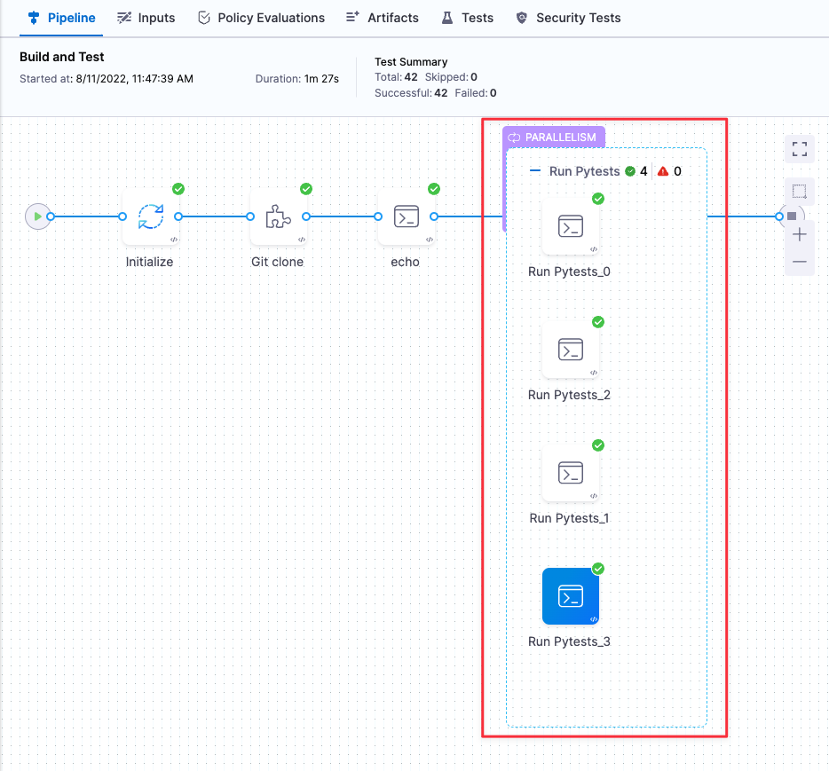
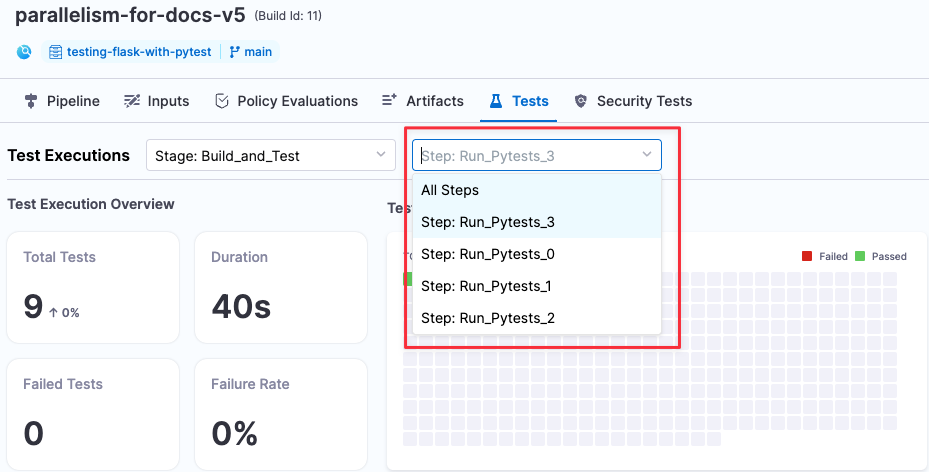

```mdx-code-block
import Tabs from '@theme/Tabs';
import TabItem from '@theme/TabItem';
```

With Harness CI, you can split tests for any language or test tool. This uses test splitting and the parallelism [looping strategy](/docs/platform/pipelines/looping-strategies/looping-strategies-matrix-repeat-and-parallelism) to improve test times.

When you [run tests in Harness CI](./run-tests-in-ci.md), you use **Run** and **Run Tests** steps. You can enable test splitting on either of these steps. To do this, you need to:

<!-- no toc -->
1. [Define a parallelism strategy.](#define-the-parallelism-strategy)
2. [Define a test splitting strategy.](#define-a-test-splitting-strategy)
3. Make sure your steps [produce test reports in JUnit XML format](#produce-test-reports).
4. [Run the pipeline and inspect the test results.](#run-the-pipeline-and-inspect-results)

<details>
<summary>Learn more about test splitting and parallelism</summary>

Most CI pipelines are set up to run tests for every new commit. By default, tests run sequentially. If there are a lot of tests to run, developers might have to wait longer than necessary for test results. Similarly, if there are frequent commits, your builds might start to queue due to [concurrency limits](/docs/continuous-integration/use-ci/optimize-and-more/queue-intelligence).

Test splitting and parallelism can decrease test cycle time by dividing tests into multiple groups and running the groups in parallel. You can configure test splitting by number of tests, test timing, file size, and so on.

For example, suppose you have a pipeline that runs 100 tests, and each test takes about one second to run. By default, all 100 tests run in sequence, taking 100 seconds. If you use test splitting to create four workloads with 25 tests each, the four groups run at the same time, and then it takes only 25 seconds to run all 100 tests. While a savings of 75 seconds doesn't seem like much for a single run, assuming a rate of 50 commits per week, this amounts to a savings of just over one hour per week.

```
( 75 seconds x 50 commits ) / 60 seconds = 62.5 minutes saved
```

Note that this example only calculates the runtime for the tests. Additional time can be required for other commands in your **Run** or **Run Tests** step, such as initializing the step, installing dependencies, and so on.

Time saved can improve over subsequent runs. If you use a test timing strategy to split tests, Harness must collect timing data during the first parallel run. Therefore, on the first parallel run, Harness needs to divide tests by file size or number of tests. Then, on the second run, Harness can use the timing data from the first run to split tests by test time. With each subsequent run, Harness further refines test splitting based on newer timing data.

<figure>


<figcaption>This diagram demonstrates how parallelism can accelerate your CI pipelines. Without parallelism, the tests run one after the other. With parallelism enabled, Harness first splits tests into four groups based on file size, already significantly reducing the overall run time. Using timing data collected in the first parallel run, subsequent runs split tests by test time, further optimizing run time. With each subsequent run, test partitioning is refined based on the newest timing data.</figcaption>
</figure>

Parallelism is one of the [looping strategies](/docs/platform/pipelines/looping-strategies/looping-strategies-matrix-repeat-and-parallelism) available in Harness pipelines, and parallelism isn't limited to splitting tests. You can use parallelism to [speed things up](../optimize-and-more/optimizing-ci-build-times.md) whenever it's possible to divide pipeline, step, or stage tasks into multiple sets and run them concurrently.

When using parallelism, it's important to take into account resource limitations that exist in your build infrastructure. For more information, go to [Best Practices for Looping Strategies](/docs/platform/pipelines/looping-strategies/best-practices-for-looping-strategies.md).

</details>

<details>
<summary>YAML example: Test splitting and parallelism on a Run step</summary>

This example shows test splitting and parallelism applied to a Run step in a stage that uses [Harness Cloud build infrastructure](../set-up-build-infrastructure/use-harness-cloud-build-infrastructure.md). For more YAML examples of test splitting, go to [YAML examples: Test splitting](#yaml-examples-test-splitting).

```yaml
              - step:
                  type: Run ## Test splitting can be applied to any Run or Run Tests steps where you run tests.
                  name: run pytest
                  identifier: run_pytest
                  strategy: ## This is the parallelism strategy for the step.
                    parallelism: 8 ## Tests are split into a maximum of 12 workloads.
                    maxConcurrency: 2 ## Optional. This setting limits the number of workloads that can run at once. In this case, no more than four workloads can run at once. The remaining 8 workloads are queued.
                  spec:
                    envVariables: ## These environment variables are used in the 'command' to differentiate the index values for parallel runs and individual Run steps within each parallel group.
                      HARNESS_NODE_INDEX: <+strategy.iteration>
                      HARNESS_NODE_TOTAL: <+strategy.iterations>
                    shell: Sh
                    command: |- ## Split tests commands are included alongside the regular test commands.
                      # Install dependencies.
                      pip install -r requirements.txt

                      # Call split_tests, define splitting strategy, and generate the list of test files.
                      FILES=`./split_tests --glob "**/test_*.py" --split-by file_timing --split-index ${HARNESS_NODE_INDEX} --split-total ${HARNESS_NODE_TOTAL}`
                      echo $FILES

                      # Use the test files list as input for pytest and produce results in JUnit XML format.
                      pytest -v --junitxml="result_<+strategy.iteration>.xml" $FILES

                    reports:
                      type: JUnit
                      spec:
                        paths:
                          - "**/result_<+strategy.iteration>.xml" ## Using the expression '<+strategy.iteration>' in the file name ensures that the results of parallel runs don't overwrite each other.
```

</details>

This topic focuses on parallelism and test splitting in **Run** steps. For information about test splitting with Test Intelligence (in **Run Tests** steps), go to [Enable Test Intelligence](./set-up-test-intelligence).

## Define a parallelism strategy

In the context of test splitting, the `parallelism` strategy defines the number of workloads into which tests can be divided. Each parallel instance (or workload) is a duplicate of the step or stage where you've defined a parallelism strategy, but each instance runs different tests according to the [test splitting strategy](#define-a-test-splitting-strategy).

<details>
<summary>Learn more about parallel workloads</summary>

To demonstrate how tests are split into concurrent (parallel) workloads, assume that you use the `test_count` splitting strategy to divide 20 tests into four workloads. To tell Harness to create four workloads, you would set your parallelism strategy to `parallelism: 4`. Then use the `test_count` splitting strategy in your **Run** step's commands. When the pipeline runs, `test_count` uses simple division to split the 20 tests into four workloads; therefore, each parallel instance runs five different tests.

```
20 tests / 4 workloads = 5 tests per workload
```

Parallel instances are zero-indexed, resulting in the following breakdown:

* Instance 0 runs tests 1-5.
* Instance 1 runs tests 6-10.
* Instance 2 runs tests 11-15.
* Instance 3 runs tests 16-20.

The four instances run concurrently, but they might finish at different times depending on individual test times. This example used `test_count`, which simply divides the tests based on the total number of tests; therefore, the instances might not finish at the same time if some tests run longer than others. To achieve more equal run times, you can use more nuanced splitting strategies, such as file size or timing.

</details>

```mdx-code-block
<Tabs>
  <TabItem value="Visual" label="Visual editor">
```

Define the parallelism strategy on either the step or stage where your tests run.

1. Edit the step or stage where your tests run, and then select the **Advanced** tab.
2. Under **Looping Strategies**, select **Parallelism**.
3. Set the `parallelism` value to the number of workloads that you want to divide your tests into. For example, if you want to create four workloads, set `parallelism: 4`.

   

4. Optional: Define `maxConcurrency`. This is a strategy to [optimize parallelism](#optimize-parallelism).

   ```yaml
   parallelism: 8
   maxConcurrency: 2
   ```

5. Add the following environment variables to the same step or stage where you defined the parallelism strategy:

   * `HARNESS_NODE_TOTAL: <+strategy.iterations>` - This variable specifies the total number of parallel instances.
   * `HARNESS_NODE_INDEX: <+strategy.iteration>` - This variable specifies the index value of the currently-running parallel instance. Parallel instances are zero-indexed, so this value ranges from `0` to `parallelism-1`.

   Stage variables are declared on the **Overview** tab under **Advanced**. Step environment variables are declared in the step settings under **Optional Configuration**.

   You'll use these variables when you [define a test splitting strategy](#define-a-test-splitting-strategy) to create commands that can be used for all parallel instances.

   ```yaml
   FILES=`/addon/bin/split_tests --glob "**/test_*.py" --split-by file_timing \
      --split-index ${HARNESS_NODE_INDEX} \
      --split-total ${HARNESS_NODE_TOTAL}`
   echo $FILES
   ```

   You can also use them to create helpful step logs to help you differentiate parallel instances, such as `echo "${HARNESS_NODE_INDEX} of ${HARNESS_NODE_TOTAL}"`.

```mdx-code-block
  </TabItem>
  <TabItem value="YAML" label="YAML editor" default>
```

1. Use `strategy.parallelism` to define a parallelism strategy on either the step or stage where your tests run.

   * `strategy`: Declares a looping strategy
   * `parallelism`: Specify the number of workloads that you want to divide your tests into. For example, if you want to create four workloads, set `parallelism: 4`.
   * `maxConcurrency`: Optional strategy to [optimize parallelism](#optimize-parallelism).

   This example shows parallelism applied to a Run step. For more YAML examples, go to [YAML examples: Test splitting](#yaml-examples-test-splitting).

   ```yaml
                 - step:
                     type: Run
                     name: tests
                     identifier: tests
                     strategy: ## Declares a looping strategy.
                       parallelism: 8 ## Specify the number of workloads. This example creates 12 workloads.
                       maxConcurrency: 2 ## Optional. Limit the number of workloads that can run at once.
                     spec:
                       ...
   ```

2. Add the following environment variables to the same step or stage where you defined the parallelism strategy:

   * `HARNESS_NODE_TOTAL: <+strategy.iterations>` - This variable specifies the total number of parallel instances.
   * `HARNESS_NODE_INDEX: <+strategy.iteration>` - This variable specifies the index value of the currently-running parallel instance. Parallel instances are zero-indexed, so this value ranges from `0` to `parallelism-1`.

   This example shows these environment variables declared on a step. To declare them on a stage, add them to the [stage variables](/docs/platform/pipelines/add-a-stage/#stage-variables).

   ```yaml
                 - step:
                     type: Run
                     name: tests
                     identifier: tests
                     ...
                     spec:
                       envVariables:
                         HARNESS_NODE_INDEX: <+strategy.iteration>
                         HARNESS_NODE_TOTAL: <+strategy.iterations>
                       ...
   ```

   You'll use these variables when you [define a test splitting strategy](#define-a-test-splitting-strategy) to create commands that can be used for all parallel instances.

   ```yaml
   FILES=`/addon/bin/split_tests --glob "**/test_*.py" --split-by file_timing \
      --split-index ${HARNESS_NODE_INDEX} \
      --split-total ${HARNESS_NODE_TOTAL}`
   echo $FILES
   ```

   You can also use them to create helpful step logs to help you differentiate parallel instances, such as `echo "${HARNESS_NODE_INDEX} of ${HARNESS_NODE_TOTAL}"`.

```mdx-code-block
  </TabItem>
</Tabs>
```

### Optimize parallelism

In general, a higher `parallelism` value means a faster pipeline run time, because the tests can be divided into more parallel instances. However, this depends on your test suite and resource limitations in your build infrastructure. For example, if you try to run 10 groups of tests, but your build infrastructure can't handle 10 parallel instances, the pipeline can fail or take longer than expected.

To optimize your parallelism strategy:

* Try different parallelism values to determine your infrastructure's limits.
   * It's important to understand that parallelism impacts [resource allocation](/docs/continuous-integration/use-ci/set-up-build-infrastructure/resource-limits) for each stage in the pipeline. A stage with five sequential steps can require fewer resources than a stage with running five parallel instances of one step, because the second stage has to run all five instances at once.
* Use `maxConcurrency` to control the flow of parallel instances and avoid overtaxing infrastructure resources. Concurrency limits the number of parallel instances that can run at once and queues additional instances.
   * For example, if you set `parallelism: 12`, Harness attempts to run 12 instances of the step at once. If you set `parallelism: 12` and `maxConcurrency: 3`, Harness generates 12 instances of the step, but only runs three instances at a time. The remaining nine instances are queued, and the queued instances start running as space clears in the concurrency limit (when prior instances finish).
   * Concurrency allows you to divide tests into more workloads without overloading your system resources.
   * Keep in mind that there are resource requirements for generating parallel instances (even if they are not all running at the same time) and handling queues. Try different combinations of `parallelism` and `maxConcurrency` values to determine your ideal configuration.
* Review the [Best practices for looping strategies](/docs/platform/pipelines/looping-strategies/best-practices-for-looping-strategies.md), including [how to calculate ideal concurrency](/docs/platform/pipelines/looping-strategies/best-practices-for-looping-strategies#how-to-calculate-ideal-concurrency).

## Define a test splitting strategy

The test splitting strategy determines how you want to divide the tests, such as by number of tests or test timing.

To define and apply a test splitting strategy, use the `split_tests` binary on the **Run** step where your tests run, for example:

```
FILES=`[binary path] [--glob or --file-path] [--split-by] [--split-index] [--split-total]`
```

The `split_tests` tool outputs a list of test files based on your chosen splitting strategy. You then use this list as input for your test tool's commands so that each parallel instance only runs an assigned subset of tests. For example, these commands use `split_tests` with `pytest`:

```shell
# Install dependencies.
pip install -r requirements.txt

# Call split_tests, define splitting strategy, and generate the list of test files.
FILES=`/addon/bin/split_tests --glob "**/test_*.py" --split-by file_timing \
   --split-index ${HARNESS_NODE_INDEX} \
   --split-total ${HARNESS_NODE_TOTAL}`
echo $FILES

# Use the test files list as input for pytest and produce results in JUnit XML format.
pytest -v --junitxml="result_<+strategy.iteration>.xml" $FILES
```

### Binary path

Call the `split_tests` binary. The path depends on your build infrastructure.

* For Harness Cloud, use `./split_tests`.
* For other build infrastructures, use `/addon/bin/split_tests`.
* For steps running in containers rather that on the host, use `usr/bin/split_tests`. You must also declare this path in [shared paths](/docs/continuous-integration/use-ci/set-up-build-infrastructure/ci-stage-settings/#shared-paths).

### Glob or file-path

Specify the set of all tests that you want to run across all parallel instances. Whether to use `--glob` or `--file-path` is determined by [`--split-by`](#split-by).

* For `--split-by file_timing`, `--split-by file_size`, or `--split-by test_count`, you can use a glob expression to specify the set of files to split, such as `--glob "**/test_*.py"`.
* For `--split-by class_timing`, `--split-by testcase_timing`, and `--split-by testsuite_timing`, you must provide a text file of the elements to split. For example, if you want to split by Java class timing, you could specify the set of classes to split and test in a new-line-delineated string and then reference the text file in with `--file-path FILE_NAME.txt`:

   ```shell
   # Generate a list of classes and store in classname.txt
   echo 'io.harness.jhttp.server.PathResolverTest\nio.harness.jhttp.processor.DirectoryIndexTest\nio.harness.jhttp.functional.HttpClientTest\nio.harness.jhttp.processor.ResourceNotFoundTest'> classnames.txt

   # Run split_tests on elements in classname.txt
   CLASSES=`/addon/bin/split_tests --split-by class_timing --file-path classnames.txt`
   ```

### Split-by

Specify a test splitting strategy, such as test timing or file size. If unspecified, the default is `--split-by file_timing`.

The `split_tests` binary supports these test splitting strategies:

* `--split-by class_timing`: Split tests into groups based on the timing data for individual classes. This strategy requires timing data from the previous run. If timing data isn't available, `split_tests` falls back to `--split-by file_size`.
* `--split-by file_size`: Split tests into groups based on the size of individual files.
* `--split-by file_timing`: (Default) Split tests into groups based on the test times of individual files. `split_tests` uses the most recent timing data to ensure that all parallel test runs finish at approximately the same time. This strategy requires timing data from the previous run. If timing data isn't available, `split_tests` falls back to `--split-by file_size`.
* `--split-by test_count`: Split tests into groups based on the total number of tests.
* `--split-by testcase_timing`: Split tests into groups based on the timing data for individual test cases. This strategy requires timing data from the previous run. If timing data isn't available, `split_tests` falls back to `--split-by file_size`.
* `--split-by testsuite_timing`: Split tests into groups based on the timing data for individual test suites. This strategy requires timing data from the previous run. If timing data isn't available, `split_tests` falls back to `--split-by file_size`.

### Split-index and split-total

Include `--split-index ${HARNESS_NODE_INDEX}` and `--split-total ${HARNESS_NODE_TOTAL}`. These commands create groups of tests files based on the total number of parallel instances (`--split-total`) and assign specific test files for each individual instance (`--split-index`). These commands use the environment variables you declared when you [defined a parallelism strategy](#define-a-parallelism-strategy).

### Split tests output

`split_tests` stores list of test files assigned to the current instance in a variable. For example, the following command stores the list of tests in `$FILES`:

```shell
# Call split_tests, define splitting strategy, and generate the list of test files.
FILES=`/addon/bin/split_tests --glob "**/test_*.py" --split-by file_timing \
   --split-index ${HARNESS_NODE_INDEX} \
   --split-total ${HARNESS_NODE_TOTAL}`
echo $FILES
```

You then call the variable (such as `$FILES`) in your test tool's commands, for example:

```shell
pytest -v --junitxml="result_<+strategy.iteration>.xml" $FILES
```

You can include `echo $FILES` to print the list of assigned tests in each step's logs, for example:

```shell
+ FILES=test_file_1.py test_file_2.py test_file_6.py test_file_9.py test_file_10.py test_file_12.py test_file_13.py
```

### Test splitting for Test Intelligence

If you [define a parallelism strategy](#define-a-parallelism-strategy) on a **Run Tests** step, Harness automatically splits tests by class timing. For information about test splitting with Test Intelligence (in a **Run Tests** step), go to [Enable test splitting for Test Intelligence](./set-up-test-intelligence#enable-parallelism-test-splitting-for-test-intelligence).

## Produce test reports


```mdx-code-block
<Tabs>
  <TabItem value="Visual" label="Visual editor">
```

1. Edit the step where your tests run.
2. Make sure your test tool's commands produce test results. The specific commands required to produce test results files depends on the specific language, test runner, and formatter you use.
3. Use an [expression](/docs/platform/Variables-and-Expressions/harness-variables) or variable in the results file name, such as `result_<+strategy.iteration>.xml` or `result_${HARNESS_NODE_INDEX}.xml`, to ensure each parallel instance produces a uniquely-named results file.

   :::caution

   If you [defined the parallelism strategy](#define-a-parallelism-strategy) on a step (instead of a stage), you *must* use an [expression](/docs/platform/Variables-and-Expressions/harness-variables) or variable in the results file name, such as `result_<+strategy.iteration>.xml` or `result_${HARNESS_NODE_INDEX}.xml`, to ensure each parallel instance produces a uniquely-named results file. If you don't use an expression or variable in the results file name, the files overwrite each other or fail due to same-name conflicts.

   :::

4. To publish your test results in the Harness UI, your test results must be in [JUnit XML format](./test-report-ref.md).

   * Configure your test runner and formatter to publish your test reports in the [JUnit](https://junit.org/junit5/) XML format and include file names in the XML output.
   * For example, if you use `pytest`, you can set `junit_family=xunit1` in your code repo's `pytest.ini` file, or you can include `-o junit_family="xunit1"` in the step's **Command**.

5. Under **Optional Configuration**, add a **Report Path**, such as `**/result_<+strategy.iteration>.xml`.


```mdx-code-block
  </TabItem>
  <TabItem value="YAML" label="YAML editor" default>
```

1. Edit the step where your tests run.
2. Make sure your test tool's commands produce test results. The specific commands required to produce test results files depends on the specific language, test runner, and formatter you use.
3. Use an [expression](/docs/platform/Variables-and-Expressions/harness-variables) or variable in the results file name, such as `result_<+strategy.iteration>.xml` or `result_${HARNESS_NODE_INDEX}.xml`, to ensure each parallel instance produces a uniquely-named results file.

   :::caution

   If you [defined the parallelism strategy](#define-a-parallelism-strategy) on a step (instead of a stage), you *must* use an [expression](/docs/platform/Variables-and-Expressions/harness-variables) or variable in the results file name, such as `result_<+strategy.iteration>.xml` or `result_${HARNESS_NODE_INDEX}.xml`, to ensure each parallel instance produces a uniquely-named results file. If you don't use an expression or variable in the results file name, the files overwrite each other or fail due to same-name conflicts.

   :::

4. To publish your test results in the Harness UI, your test results must be in [JUnit XML format](./test-report-ref.md).

   * Configure your test runner and formatter to publish your test reports in the [JUnit](https://junit.org/junit5/) XML format and include file names in the XML output.
   * For example, if you use `pytest`, you can set `junit_family=xunit1` in your code repo's `pytest.ini` file, or you can include `-o junit_family="xunit1"` in the step's `command`.

5. Add the `reports` section to the `step.spec` and include the `paths` for your test results files. For example:

   ```yaml
                     type: Run
                     name: tests
                     identifier: tests
                     spec:
                       ...
                       reports: ## Start of reports section.
                          type: JUnit ## Specify format as JUnit.
                             spec:
                                paths: - "**/result_${HARNESS_NODE_INDEX}.xml" ## Specify the results file path. Use a variable or expression to generate uniquely-named results files for each parallel instance. Without a differentiating identifier, the results files can overwrite each other.
   ```

```mdx-code-block
  </TabItem>
</Tabs>
```

## YAML examples: Test splitting

The following YAML example shows a full end-to-end pipeline with parallelism enabled.

:::tip

If your stage uses Harness Cloud build infrastructure, your Run step's `command` can use the `split_tests` binary directly. For example, you would use `split_tests` instead of `/addon/bin/split_tests`.

:::

<details>
<summary>Parallelism pipeline YAML example</summary>

<!-- cloud version, not calling env vars in junit paths-->

```yaml
pipeline:
  name: pytest_split_test
  identifier: pytest_split_test
  projectIdentifier: default
  orgIdentifier: default
  tags: {}
  properties:
    ci:
      codebase:
        connectorRef: YOUR_CODEBASE_CONNECTOR_ID
        repoName: YOUR_CODE_REPO_NAME
        build: <+input>
  stages:
    - stage:
        name: pytest
        identifier: pytest
        description: ""
        type: CI
        spec:
          cloneCodebase: true
          platform:
            os: Linux
            arch: Amd64
          runtime:
            type: Cloud
            spec: {}
          execution:
            steps:
              - step:
                  type: Run
                  name: run pytest
                  identifier: run_pytest
                  spec:
                    shell: Sh
                    command: |-
                      pip install -r requirements.txt  
                      # Define splitting strategy and generate a list of test groups  
                      FILES=`./split_tests --glob "**/test_*.py" --split-by file_timing --split-index ${HARNESS_NODE_INDEX} --split-total ${HARNESS_NODE_TOTAL}`  
                      echo $FILES  
                      # Run tests with the test-groups string as input  
                      pytest -v --junitxml="result_<+strategy.iteration>.xml" $FILES  
                    reports:
                      type: JUnit
                      spec:
                        paths:
                          - "**/result_<+strategy.iteration>.xml"
                    envVariables:
                      HARNESS_NODE_INDEX: <+strategy.iteration>
                      HARNESS_NODE_TOTAL: <+strategy.iterations>
                  strategy:
                    parallelism: 4
                    maxConcurrency: 2
```

<!-- refreshed, k8s -->

```yaml
pipeline:
  name: pytest_split_test
  identifier: pytest_split_test
  projectIdentifier: default
  orgIdentifier: default
  tags: {}
  properties:
    ci:
      codebase:
        connectorRef: YOUR_CODEBASE_CONNECTOR_ID
        repoName: YOUR_CODE_REPO_NAME
        build: <+input>
  stages:
    - stage:
        name: pytest
        identifier: pytest
        description: ""
        type: CI
        spec:
          cloneCodebase: true
          execution:
            steps:
              - step:
                  type: Run
                  name: run pytest
                  identifier: run_pytest
                  spec:
                    connectorRef: YOUR_DOCKER_CONNECTOR_ID
                    image: python:latest
                    shell: Sh
                    command: |-
                      pip install -r requirements.txt  
                      # Define splitting strategy and generate a list of test groups  
                      FILES=`/addon/bin/split_tests --glob "**/test_*.py" --split-by file_timing --split-index ${HARNESS_NODE_INDEX} --split-total ${HARNESS_NODE_TOTAL}`  
                      echo $FILES  
                      # Run tests with the test-groups string as input  
                      pytest -v --junitxml="result_${HARNESS_NODE_INDEX}.xml" $FILES  
                    reports:
                      type: JUnit
                      spec:
                        paths:
                          - "**/result_${HARNESS_NODE_INDEX}.xml"
                    envVariables:
                      HARNESS_NODE_INDEX: <+strategy.iteration>
                      HARNESS_NODE_TOTAL: <+strategy.iterations>
                  strategy:
                    parallelism: 4
                    maxConcurrency: 2
          infrastructure:
            type: KubernetesDirect
            spec:
              connectorRef: YOUR_K8S_CLUSTER_CONNECTOR_ID
              namespace: YOUR_K8S_NAMESPACE
              automountServiceAccountToken: true
              nodeSelector: {}
              os: Linux
```

</details>


### Example: Parallelism strategy on Run step

Parallelism can be set at either the step level or stage level.

The following YAML example shows a **Run** step that uses [pytest](https://docs.pytest.org/) and splits tests into four parallel test groups.

```yaml
# Use "run" step type  
- step:  
      type: Run     
      name: Run Pytests  
      identifier: Run_Pytests  
      # Enable parallelism strategy   
      strategy:             
          parallelism: 4   # Number of parallel runs
          maxConcurrency: 2 # (optional) Limit the number of parallel runs
      spec:  
          connectorRef: $dockerhub_connector  ## Not required for all build infra.
          image: python:latest  ## Not required for all build infra.
          shell: Sh  
          # Store the current index and total runs in environment variables  
          envVariables:    
              HARNESS_NODE_INDEX: <+strategy.iteration>  # index of current run  
              HARNESS_NODE_TOTAL: <+strategy.iterations> # total runs  
          command: |-  
              pip install -r requirements.txt  
              # Define splitting strategy and generate a list of test groups  
              FILES=`/addon/bin/split_tests --glob "**/test_*.py" \  
                     --split-by file_timing \  
                     --split-index ${HARNESS_NODE_INDEX} \  
                     --split-total ${HARNESS_NODE_TOTAL}`  
              echo $FILES  
              # Run tests with the test-groups string as input  
              pytest -v --junitxml="result_<+strategy.iteration>.xml" $FILES  
         # Publish JUnit test reports to Harness   
         reports:    
              type: JUnit   
              spec:  
                  paths:   # Generate unique report for each iteration  
                      - "**/result_<+strategy.iteration>.xml"   
      failureStrategies: []
```

<!-- Updated, Cloud version -->
```yaml
              - step:
                  type: Run
                  name: run pytest
                  identifier: run_pytest
                  spec:
                    shell: Sh
                    command: |-
                      pip install -r requirements.txt  
                      # Define splitting strategy and generate a list of test groups  
                      FILES=`./split_tests --glob "**/test_*.py" --split-by file_timing --split-index ${HARNESS_NODE_INDEX} --split-total ${HARNESS_NODE_TOTAL}`  
                      echo $FILES  
                      # Run tests with the test-groups string as input  
                      pytest -v --junitxml="result_<+strategy.iteration>.xml" $FILES  
                    reports:
                      type: JUnit
                      spec:
                        paths:
                          - "**/result_<+strategy.iteration>.xml"
                    envVariables:
                      HARNESS_NODE_INDEX: <+strategy.iteration>
                      HARNESS_NODE_TOTAL: <+strategy.iterations>
                  strategy:
                    parallelism: 4
                    maxConcurrency: 2
```

### Language/tool examples

<!-- Run steps on Format Test Reports, language guides, and Code Coverage pages. Add looping strategy & split commands -->

* Go - Use [`go list ./...`](https://pkg.go.dev/cmd/go#hdr-List_packages_or_modules) to glob Golang packages and split tests.
* Java - Maven, Gradle
* JavaScript - ESLint, Jest, Karma, Mocha
* PHP - [phpunit-finder](https://github.com/previousnext/phpunit-finder) can help split tests by getting a list of test filenames.
* Python - pytest
* Ruby - Cucumber, Minitest, RSpec
* C/C++ - CTest
* C# - .NET Core, NUnit
* Clojure - Kaocha, Clojure.test


[Playwright:](https://github.com/microsoft/playwright)

[docs](https://playwright.dev/docs/ci#ci-configurations)

* Specify a playwright image.
* Use sharding to split tests.

```shell
SHARD="$((${HARNESS_NODE_INDEX}+1))"; npx playwright test -- --shard=${SHARD}/${HARNESS_NODE_TOTAL}
```

## Run the pipeline and inspect results

When you run the pipeline, you can observe the parallel instances running on the [Build details page](../viewing-builds).



When the build finishes, go to the **Tests** tab to [view the results](./viewing-tests). Use the **Test Executions** stage and step dropdown menu to view results for each parallel instance.



If you used a timing strategy, Harness collects timing data during the first run with parallelism enabled. On subsequent runs, Harness uses the timing data from the previous run to optimize test splitting.
