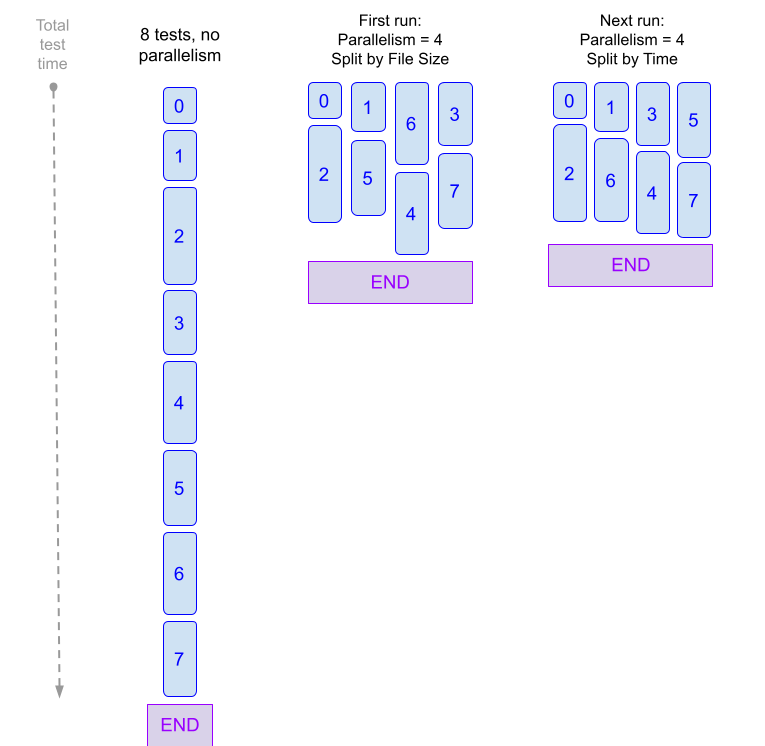
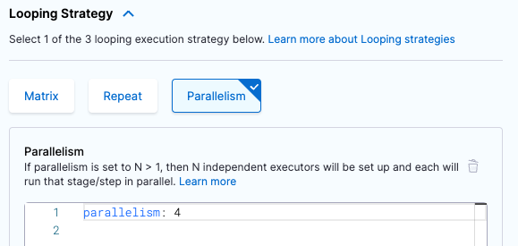
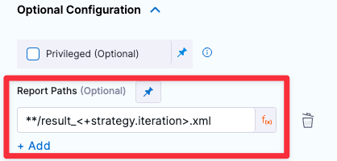

import Tabs from '@theme/Tabs';
import TabItem from '@theme/TabItem';

When you [run tests in Harness CI](./run-tests-in-ci.md), you use **Run** or **Test** steps.

In a **Run** step, you can split tests for any language or test tool by using test splitting and the parallelism [looping strategy](/docs/platform/pipelines/looping-strategies/looping-strategies-matrix-repeat-and-parallelism) to improve test times.

:::warning Does this topic apply to you?

This topic explains test splitting/parallelism in **Run** steps *only*.

For test splitting/parallelism in **Test** steps, go to the [Tests step documentation](./tests-v2.md).

:::

To split tests in a **Run** step, you need to:

<!-- no toc -->
1. [Define a parallelism strategy.](#define-a-parallelism-strategy)
2. [Define a test splitting strategy.](#define-a-test-splitting-strategy)
3. [Produce test reports in JUnit XML format](#produce-test-reports).
4. [Run the pipeline and inspect the test results.](#logs-and-results)

<details>
<summary>Learn more about test splitting and parallelism</summary>

Most CI pipelines are set up to run tests for every new commit. By default, tests run sequentially. If there are a lot of tests to run, developers might have to wait longer than necessary for test results. Similarly, if there are frequent commits, your builds might start to queue due to concurrency limits.

Test splitting and parallelism can decrease test cycle time by dividing tests into multiple groups and running the groups in parallel. You can configure test splitting by number of tests, test timing, file size, and so on.

For example, suppose you have a pipeline that runs 100 tests, and each test takes about one second to run. By default, all 100 tests run in sequence, taking 100 seconds. If you use test splitting to create four workloads with 25 tests each, the four groups run at the same time, and then it takes only 25 seconds to run all 100 tests. While a savings of 75 seconds doesn't seem like much for a single run, assuming a rate of 50 commits per week, this amounts to a savings of just over one hour per week.

```
( 75 seconds x 50 commits ) / 60 seconds = 62.5 minutes saved
```

Note that this example only calculates the runtime for the tests. Additional time can be required for other commands in your **Run** step, such as initializing the step, installing dependencies, and so on.

Time saved can improve over subsequent runs. If you use a timing strategy to split tests, Harness must collect timing data during the first parallel run. Therefore, on the first parallel run, Harness divides tests by file size. Then, on subsequent runs, Harness uses the timing data from earlier runs to split tests by time. With each subsequent run, Harness further refines test splitting based on newer timing data.

<figure>



<figcaption>This diagram demonstrates how parallelism can accelerate your CI pipelines. Without parallelism, the tests run one after the other. With parallelism enabled, Harness first splits tests into four groups based on file size, already significantly reducing the overall run time. Using timing data collected in the first parallel run, subsequent runs split tests by test time, further optimizing run time. With each subsequent run, test partitioning is refined based on the newest timing data.</figcaption>
</figure>

Parallelism is one of the [looping strategies](/docs/platform/pipelines/looping-strategies/looping-strategies-matrix-repeat-and-parallelism) available in Harness pipelines, and parallelism isn't limited to splitting tests. You can use parallelism to speed things up whenever it isn't possible to divide pipeline, step, or stage tasks into multiple sets and run them concurrently.

When using parallelism, it's important to take into account resource limitations that exist in your build infrastructure. For more information, go to [Best Practices for Looping Strategies](/docs/platform/pipelines/looping-strategies/best-practices-for-looping-strategies.md).

</details>

Here are examples of test splitting and parallelism applied to Run steps. For more YAML examples of test splitting, go to [YAML Examples: Test splitting](#yaml-examples-test-splitting).

<Tabs>
  <TabItem value="hc" label="Harness Cloud build infrastructure" default>

This example uses [Harness Cloud build infrastructure](../set-up-build-infrastructure/use-harness-cloud-build-infrastructure.md).

```yaml
    - stage:
        name: tests
        identifier: tests
        description: ""
        type: CI
        strategy: ## This is the parallelism strategy for the stage. Stage-level parallelism is recommended.
          parallelism: 4 ## Tests are split into a maximum of four workloads. Stage-level parallelism generates a stage for each workload.
          maxConcurrency: 2 ## Optional. This setting limits the number of workloads that can run at once.
        spec:
          cloneCodebase: true
          platform:
            os: Linux
            arch: Amd64
          runtime:
            type: Cloud
            spec: {}
          execution:
            steps:
              - step:
                  type: Run ## Test splitting can be applied to any Run steps where you run tests.
                  name: tests
                  identifier: tests
                  spec:
                    envVariables: ## These environment variables are used in the 'command' to get the index value for each parallel instance and the total number of parallel instances.
                      HARNESS_NODE_INDEX: <+strategy.iteration>
                      HARNESS_NODE_TOTAL: <+strategy.iterations>
                    shell: Sh
                    command: |- ## Split tests commands are included alongside the regular test commands.
                      # Install dependencies.
                      pip install -r requirements.txt

                      # Call split_tests, define splitting strategy, and generate the list of test files.
                      FILES=`./split_tests --glob "**/test_*.py" --split-by file_timing \
                         --split-index ${HARNESS_NODE_INDEX} \
                         --split-total ${HARNESS_NODE_TOTAL}`
                      echo $FILES

                      # Use the test files list as input for pytest and produce results in JUnit XML format.
                      pytest -v --junitxml="result_<+strategy.iteration>.xml" $FILES

                    reports:
                      type: JUnit
                      spec:
                        paths:
                          - "**/result_<+strategy.iteration>.xml" ## Using the expression '<+strategy.iteration>' in the file name ensures that the results of parallel runs don't overwrite each other.
```

</TabItem>
  <TabItem value="oth" label="Other build infrastructures">

This example uses a [Kubernetes cluster build infrastructure](/docs/category/set-up-kubernetes-cluster-build-infrastructures).

```yaml
    - stage:
        name: tests
        identifier: tests
        description: ""
        type: CI
        strategy: ## This is the parallelism strategy for the stage. Stage-level parallelism is recommended.
          parallelism: 4 ## Tests are split into a maximum of four workloads. Stage-level parallelism generates a stage for each workload.
          maxConcurrency: 2 ## Optional. This setting limits the number of workloads that can run at once.
        spec:
          cloneCodebase: true
          execution:
            steps:
              - step:
                  type: Run ## Test splitting can be applied to any Run steps where you run tests.
                  name: tests
                  identifier: tests
                  spec:
                    envVariables: ## These environment variables are used in the 'command' to get the index value for each parallel instance and the total number of parallel instances.
                      HARNESS_NODE_INDEX: <+strategy.iteration>
                      HARNESS_NODE_TOTAL: <+strategy.iterations>
                    connectorRef: YOUR_DOCKER_CONNECTOR_ID ## Specify your Harness Docker connector ID.
                    image: python:latest ## Specify an image with your test runner's binary.
                    shell: Sh
                    command: |- ## Split tests commands are included alongside the regular test commands.
                      # Install dependencies.
                      pip install -r requirements.txt

                      # Call split_tests, define splitting strategy, and generate the list of test files.
                      FILES=`/addon/bin/split_tests --glob "**/test_*.py" --split-by file_timing \
                         --split-index ${HARNESS_NODE_INDEX} \
                         --split-total ${HARNESS_NODE_TOTAL}`
                      echo $FILES

                      # Use the test files list as input for pytest and produce results in JUnit XML format.
                      pytest -v --junitxml="result_<+strategy.iteration>.xml" $FILES

                    reports:
                      type: JUnit
                      spec:
                        paths:
                          - "**/result_<+strategy.iteration>.xml" ## Using the expression '<+strategy.iteration>' in the file name ensures that the results of parallel runs don't overwrite each other.
          infrastructure:
            type: KubernetesDirect
            spec:
              connectorRef: YOUR_K8S_CLUSTER_CONNECTOR_ID
              namespace: YOUR_K8S_NAMESPACE
              automountServiceAccountToken: true
              nodeSelector: {}
              os: Linux
```

</TabItem>
</Tabs>

## Define a parallelism strategy

In the context of test splitting, the `parallelism` strategy defines the number of workloads into which tests can be divided. Each parallel instance (or workload) is a duplicate of the stage where you've defined a parallelism strategy, but each instance runs different tests according to the [test splitting strategy](#define-a-test-splitting-strategy).

<details>
<summary>Learn more about parallel workloads</summary>

To demonstrate how tests are split into concurrent (parallel) workloads, assume that you use the `file_size` splitting strategy to divide 20 tests into four workloads. To tell Harness to create four workloads, you would set your parallelism strategy to `parallelism: 4`. Then use the `file_size` splitting strategy in your **Run** step's commands. When the pipeline runs, `file_size` splits the 20 tests into four workloads based on the file size. For the purpose of this example, assume all files are roughly the same size, and, therefore, each parallel instance runs five different tests:

```
20 tests / 4 workloads = 5 tests per workload
```

Parallel instances are zero-indexed, resulting in the following breakdown:

* Instance 0 runs tests 1-5.
* Instance 1 runs tests 6-10.
* Instance 2 runs tests 11-15.
* Instance 3 runs tests 16-20.

The four instances run concurrently, but they might finish at different times depending on individual test times (if some tests run longer than others). To achieve more equal run times, you can use more nuanced splitting strategies, such as `testcase_timing`.

</details>

<Tabs>
  <TabItem value="Visual" label="Visual editor">

Define the parallelism strategy on the stage where your tests run.

:::warning

You can configure parallelism strategies on stages or steps. **Harness recommends using stage-level parallelism for test splitting.**

:::

1. In your pipeline, select the stage where your tests run, and then select the **Advanced** tab.
2. Under **Looping Strategies**, select **Parallelism**.
3. Set the `parallelism` value to the number of workloads that you want to divide your tests into. For example, if you want to create four workloads, set `parallelism: 4`.

   

4. Optional: Define `maxConcurrency`. This is a strategy to [optimize parallelism](#optimize-parallelism).

   ```yaml
   parallelism: 8
   maxConcurrency: 2
   ```

5. Add the following [stage variables](/docs/platform/pipelines/add-a-stage.md#stage-variables) to the stage where you defined the parallelism strategy:

   * `HARNESS_NODE_TOTAL: <+strategy.iterations>` - This variable specifies the total number of parallel instances.
   * `HARNESS_NODE_INDEX: <+strategy.iteration>` - This variable specifies the index value of the currently-running parallel instance. Parallel instances are zero-indexed, so this value ranges from `0` to `parallelism-1`.

   You can use these variables when you [define a test splitting strategy](#define-a-test-splitting-strategy) to create commands that can be used for all parallel instances. You can also use them to create helpful step logs to help you differentiate parallel instances, such as `echo "${HARNESS_NODE_INDEX} of ${HARNESS_NODE_TOTAL}"`.

</TabItem>
  <TabItem value="YAML" label="YAML editor" default>

1. Use `strategy.parallelism` to define a parallelism strategy on the stage where your tests run.

   ```yaml
           strategy: ## Declares a looping strategy.
            parallelism: 8 ## Specify the number of workloads. This example creates 8 workloads.
            maxConcurrency: 2 ## Optional setting to optimize parallelism. Limits the number of workloads that can run at once.
   ```

   :::warning

   You can configure parallelism strategies on stages or steps. **Harness recommends using stage-level parallelism for test splitting on Run steps.**

   :::

2. Add the following [stage variables](/docs/platform/pipelines/add-a-stage.md#stage-variables) to the stage where you defined the parallelism strategy:

   * `HARNESS_NODE_TOTAL: <+strategy.iterations>` - This variable specifies the total number of parallel instances.
   * `HARNESS_NODE_INDEX: <+strategy.iteration>` - This variable specifies the index value of the currently-running parallel instance. Parallel instances are zero-indexed, so this value ranges from `0` to `parallelism-1`.

   You can use these variables when you [define a test splitting strategy](#define-a-test-splitting-strategy) to create commands that can be used for all parallel instances. You can also use them to create helpful step logs to help you differentiate parallel instances, such as `echo "${HARNESS_NODE_INDEX} of ${HARNESS_NODE_TOTAL}"`.

</TabItem>
</Tabs>

### Optimize parallelism

In general, a higher `parallelism` value means a faster pipeline run time, because the tests can be divided into more parallel instances. However, this depends on your test suite and resource limitations in your build infrastructure. For example, if you try to run 10 groups of tests, but your build infrastructure can't handle 10 parallel instances, the pipeline can fail or take longer than expected.

To optimize your parallelism strategy:

* Try different parallelism values to determine your infrastructure's limits. Parallelism impacts [resource allocation](/docs/continuous-integration/use-ci/set-up-build-infrastructure/resource-limits) for the pipeline. A pipeline with five sequential stages can require fewer resources than a pipeline running five parallel instances of a stage, because the second pipeline has to run all five instances at once.
* Use `maxConcurrency` to control the flow of parallel instances and avoid overtaxing infrastructure resources. Concurrency limits the number of parallel instances that can run at once and queues additional instances.
   * For example, if you set `parallelism: 12`, Harness attempts to run 12 instances of the stage at once. If you set `parallelism: 12` and `maxConcurrency: 3`, Harness generates 12 instances of the stage, but only runs three instances at a time. The remaining nine instances are queued, and the queued instances start running as space clears in the concurrency limit (when prior instances finish).
   * Concurrency allows you to divide tests into more workloads without overloading your system resources.
   * There are resource requirements to *generate* parallel instances (even if they are not all running at the same time) and handle queues. Try different combinations of `parallelism` and `maxConcurrency` values to determine your ideal configuration.
* Review the [Best practices for looping strategies](/docs/platform/pipelines/looping-strategies/best-practices-for-looping-strategies.md), including [how to calculate ideal concurrency](/docs/platform/pipelines/looping-strategies/best-practices-for-looping-strategies#how-to-calculate-ideal-concurrency).

## Define a test splitting strategy

The test splitting strategy determines how you want to divide the tests, such as by number of tests or test timing.

To do this, use the `split_tests` binary in the **Run** step that runs your tests, for example:

```shell
FILES='[binary path] [--glob or --file-path] [--split-by] [--split-index] [--split-total]'
```

The `split_tests` tool outputs a list of test files based on your chosen splitting strategy. You then use this list as input for your test tool's commands so that each parallel instance only runs an assigned subset of tests.

For example, these commands use `split_tests` with `pytest`:

```shell
# Install dependencies.
pip install -r requirements.txt

# Call split_tests, define splitting strategy, and generate the list of test files.
FILES=`/addon/bin/split_tests --glob "**/test_*.py" --split-by file_timing \
   --split-index ${HARNESS_NODE_INDEX} \
   --split-total ${HARNESS_NODE_TOTAL}`
echo $FILES

# Use the test files list as input for pytest and produce results in JUnit XML format.
pytest -v --junitxml="result_<+strategy.iteration>.xml" $FILES
```

### Binary path

Call the `split_tests` binary. The path depends on your build infrastructure.

* For Harness Cloud, use `./split_tests`.
* For other build infrastructures, use `/addon/bin/split_tests`.
* For steps running in containers, rather that on the host, use `usr/bin/split_tests`. You must also declare this path in [shared paths](/docs/continuous-integration/use-ci/set-up-build-infrastructure/ci-stage-settings.md#shared-paths).

### Glob or file-path

Specify the set of all tests that you want to run across all parallel instances.

Whether you use `--glob` or `--file-path` is determined by [`--split-by`](#split-by).

* For `--split-by file_timing` or `--split-by file_size`, you can use a glob expression to specify the set of files to split, such as `--glob "**/test_*.py"`.
* For `--split-by class_timing`, `--split-by testcase_timing`, and `--split-by testsuite_timing`, you must provide a text file of the elements to split. For example, if you want to split by Java class timing, you could specify the set of classes to split and test in a new-line-delineated string and then reference the text file in with `--file-path FILE_NAME.txt`:

   ```shell
   # Generate a list of classes and store in classname.txt
   echo 'io.harness.jhttp.server.PathResolverTest\nio.harness.jhttp.processor.DirectoryIndexTest\nio.harness.jhttp.functional.HttpClientTest\nio.harness.jhttp.processor.ResourceNotFoundTest'> classnames.txt

   # Run split_tests on elements in classname.txt
   CLASSES=`/addon/bin/split_tests --split-by class_timing --file-path classnames.txt`
   ```

### Split-by

Specify a test splitting strategy, such as test timing or file size. If unspecified, the default is `--split-by file_timing`.

The `split_tests` binary supports these test splitting strategies:

* `--split-by class_timing`: Split tests into groups based on the timing data for individual classes. This strategy requires timing data from the previous run. If timing data isn't available, `split_tests` falls back to `--split-by file_size`.
* `--split-by file_size`: Split tests into groups based on the size of individual files.
* `--split-by file_timing`: (Default) Split tests into groups based on the test times of individual files. `split_tests` uses the most recent timing data to ensure that all parallel test runs finish at approximately the same time. This strategy requires timing data from the previous run. If timing data isn't available, `split_tests` falls back to `--split-by file_size`.
* `--split-by testcase_timing`: Split tests into groups based on the timing data for individual test cases. This strategy requires timing data from the previous run. If timing data isn't available, `split_tests` falls back to `--split-by file_size`.
* `--split-by testsuite_timing`: Split tests into groups based on the timing data for individual test suites. This strategy requires timing data from the previous run. If timing data isn't available, `split_tests` falls back to `--split-by file_size`.

### Split-index and split-total

Harness automatically runs the `--split-index` and `--split-total` commands to create groups of tests files based on the total number of parallel instances (`--split-total`) and assign specific test files for each individual instance (`--split-index`).

Harness automatically populates the `HARNESS_NODE_INDEX` and `HARNESS_NODE_TOTAL` environment variables supplied to these commands from the environment variables you declared when you [defined a parallelism strategy](#define-a-parallelism-strategy).

If you need these commands to use different values, you can include them with your split tests commands:

```
--split-index ${HARNESS_NODE_INDEX}
--split-total ${HARNESS_NODE_TOTAL}
```

### Split tests output

`split_tests` stores list of test files assigned to the current instance in a variable. For example, the following command stores the list of tests in `$FILES`:

```shell
# Call split_tests, define splitting strategy, and generate the list of test files.
FILES=`/addon/bin/split_tests --glob "**/test_*.py" --split-by file_timing \
   --split-index ${HARNESS_NODE_INDEX} \
   --split-total ${HARNESS_NODE_TOTAL}`
echo $FILES
```

You then call the variable (such as `$FILES`) in your test tool's commands, for example:

```shell
pytest -v --junitxml="result_<+strategy.iteration>.xml" $FILES
```

You can include `echo $FILES` to print the list of assigned tests in each step's logs, for example:

```shell
+ FILES=test_file_1.py test_file_2.py test_file_6.py test_file_9.py test_file_10.py test_file_12.py test_file_13.py
```

## Produce test reports

<Tabs>
  <TabItem value="Visual" label="Visual editor">

1. Edit your **Run** step where your tests run.
2. Make sure your test tool's commands produce test results. The specific commands required to produce test results files depends on the specific language, test runner, and formatter you use.
3. To publish your test results in the Harness UI, your test results must be in [JUnit](https://junit.org/junit5/) XML format.

   * Configure your test runner and formatter to publish your test reports in JUnit XML format and include file names in the XML output.
   * Some tools have built-in converters and some tools require an additional formatter for JUnit conversion. For more information, go to [Format test reports](./test-report-ref.md).
   * For example, if you use `pytest`, you can set `junit_family=xunit1` in your code repo's `pytest.ini` file, or you can include `-o junit_family="xunit1"` in the step's **Command**.

4. With stage-level parallelism, results files are automatically output as separate stage artifacts.

   If you want the individual results files to have unique names, you can use an [expression](/docs/platform/variables-and-expressions/harness-variables) or variable in the results file name, such as `result_<+strategy.iteration>.xml` or `result_${HARNESS_NODE_INDEX}.xml`. You might need to modify your test tool configurations to support this report naming convention.

   :::warning

   **Harness recommends stage-level parallelism for test splitting.** However, if you [defined the parallelism strategy](#define-a-parallelism-strategy) on a step (instead of a stage), you *must* use an [expression](/docs/platform/variables-and-expressions/harness-variables) or variable in the results file name, such as `result_<+strategy.iteration>.xml` or `result_${HARNESS_NODE_INDEX}.xml`, to ensure each parallel instance produces a uniquely-named results file. If you don't use an expression or variable in the results file name, the files overwrite each other or fail due to same-name conflicts. How you enable this varies by language and test tool. For this reason, among others, **Harness recommends using stage-level parallelism for test splitting on Run steps**.

   :::

5. Add the **Report Path** under **Optional Configuration**, such as `**/result.xml` or `**/result_<+strategy.iteration>.xml`.

   

</TabItem>
  <TabItem value="YAML" label="YAML editor" default>

1. Edit the step where your tests run.
2. Make sure your test tool's commands produce test results. The specific commands required to produce test results files depends on the specific language, test runner, and formatter you use.
3. To publish your test results in the Harness UI, your test results must be in [JUnit](https://junit.org/junit5/) XML format.

   * Configure your test runner and formatter to publish your test reports in JUnit XML format and include file names in the XML output.
   * Some tools have built-in converters and some tools require an additional formatter for JUnit conversion. For more information, go to [Format test reports](./test-report-ref.md).
   * For example, if you use `pytest`, you can set `junit_family=xunit1` in your code repo's `pytest.ini` file, or you can include `-o junit_family="xunit1"` in the step's **Command**.

4. With stage-level parallelism, results files are automatically output as separate stage artifacts.

   If you want the individual results files to have unique names, you can use an [expression](/docs/platform/variables-and-expressions/harness-variables) or variable in the results file name, such as `result_<+strategy.iteration>.xml` or `result_${HARNESS_NODE_INDEX}.xml`. You might need to modify your test tool configurations to support this report naming convention.

   :::warning

   **Harness recommends stage-level parallelism for test splitting.** However, if you [defined the parallelism strategy](#define-a-parallelism-strategy) on a step (instead of a stage), you *must* use an [expression](/docs/platform/variables-and-expressions/harness-variables) or variable in the results file name, such as `result_<+strategy.iteration>.xml` or `result_${HARNESS_NODE_INDEX}.xml`, to ensure each parallel instance produces a uniquely-named results file. If you don't use an expression or variable in the results file name, the files overwrite each other or fail due to same-name conflicts. How you enable this varies by language and test tool. For this reason, among others, **Harness recommends using stage-level parallelism for test splitting on Run steps**.

   :::

5. Add the **Report Path** under **Optional Configuration**, such as `**/result.xml` or `**/result_<+strategy.iteration>.xml`.

   ```yaml
                     type: Run
                     name: tests
                     identifier: tests
                     spec:
                       ...
                       reports: ## Start of reports section.
                          type: JUnit ## Specify format as JUnit.
                             spec:
                                paths: - "**/result_*.xml" ## Specify the results file path.
   ```

</TabItem>
</Tabs>

## Logs and results

When you run the pipeline, you can observe the parallel instances running on the [Build details page](../viewing-builds).

When the build finishes, go to the **Tests** tab to [view the results](./viewing-tests). Use the **Test Executions** stage dropdown menu to view results for each parallel instance.

:::info

If you use a timing [split strategy](#split-by), Harness must collect timing data during the first parallel run. Therefore, on the first parallel run, Harness divides tests by file size. Then, on subsequent runs, Harness can use the timing data from earlier runs to split tests by time.

Time saved can improve over subsequent runs.  With each subsequent run, Harness further refines test splitting based on newer timing data.

:::

## YAML examples: Test splitting

With Harness CI, you can split tests for any language or tool. Here are some examples of test splitting for different languages and tools.

<Tabs>
<TabItem value="go" label="Go" default>

```yaml
          strategy:
            parallelism: 4 ## Specify the number of workloads to split tests into.
            maxConcurrency: 2 ## Optional. This setting limits the number of workloads that can run at once.
          ...
            steps:
              - step:
                  type: Run ## Test splitting can be applied to any Run steps where you run tests.
                  name: tests
                  identifier: tests
                  spec:
                    envVariables: ## These environment variables are used in 'command'.
                      HARNESS_NODE_INDEX: <+strategy.iteration>
                      HARNESS_NODE_TOTAL: <+strategy.iterations>
                    shell: Sh
                    command: |- ## Split tests commands are included alongside the regular test commands.
                      # Install dependencies.
                      go install github.com/jstemmer/go-junit-report/v2@latest

                      # Call split_tests, define splitting strategy, and generate the list of test files.

                      go list ./... > test_suites.txt

                      SUITES=`split_tests --verbose --split-by testsuite_timing --file-path test_suites.txt`

                      echo $SUITES

                      # Use the test suites list as input and produce results in JUnit XML format.
                      go test -v $SUITES | tee report_<+strategy.iteration>.out
                      cat report_<+strategy.iteration>.out | $HOME/go/bin/go-junit-report -set-exit-code > report_<+strategy.iteration>.xml
                    reports:
                      type: JUnit
                      spec:
                        paths:
                          - "report_<+strategy.iteration>.xml"
```

</TabItem>
<TabItem value="java" label="Java">

This example use Maven.

```yaml
          strategy:
            parallelism: 4 ## Specify the number of workloads to split tests into.
            maxConcurrency: 2 ## Optional. This setting limits the number of workloads that can run at once.
          ...
            steps:
              - step:
                  type: Run ## Test splitting can be applied to any Run steps where you run tests.
                  name: tests
                  identifier: tests
                  spec:
                    envVariables: ## These environment variables are used in 'command'.
                      HARNESS_NODE_INDEX: <+strategy.iteration>
                      HARNESS_NODE_TOTAL: <+strategy.iterations>
                    shell: Sh
                    command: |- ## Split tests commands are included alongside the regular test commands.
                      # Install dependencies.
                      mvn clean package dependency:copy-dependencies

                      # Call split_tests, define splitting strategy, and generate the list of test files.
                      FILES=`/addon/bin/split_tests --glob "PATH_TO_TEST_FILES" --split-by file_timing \
                         --split-index ${HARNESS_NODE_INDEX} \
                         --split-total ${HARNESS_NODE_TOTAL}`
                      echo $FILES

                      # Use the test files list as input. Make sure results are in JUnit XML format.
                      mvn -Dtest=$FILES test
                    reports:
                      type: JUnit
                      spec:
                        paths:
                          - target/surefire-reports/*.xml"
```

</TabItem>
<TabItem value="javas" label="JavaScript">

This example uses Mocha.

```yaml
          strategy:
            parallelism: 4 ## Specify the number of workloads to split tests into.
            maxConcurrency: 2 ## Optional. This setting limits the number of workloads that can run at once.
          ...
            steps:
              - step:
                  type: Run ## Test splitting can be applied to any Run steps where you run tests.
                  name: tests
                  identifier: tests
                  spec:
                    envVariables: ## These environment variables are used in 'command'.
                      HARNESS_NODE_INDEX: <+strategy.iteration>
                      HARNESS_NODE_TOTAL: <+strategy.iterations>
                    shell: Sh
                    command: |- ## Split tests commands are included alongside the regular test commands.
                      # Install dependencies.
                      npm install
                      mkdir /harness/junit
                      npm run build --if-present

                      # Call split_tests, define splitting strategy, and generate the list of test files.
                      FILES=`/addon/bin/split_tests --glob "PATH_TO_TEST_FILES" --split-by file_timing \
                         --split-index ${HARNESS_NODE_INDEX} \
                         --split-total ${HARNESS_NODE_TOTAL}`
                      echo $FILES

                      # Use the test files list as input and produce results in JUnit XML format.
                      mocha test $FILES --reporter mocha-junit-reporter --reporter-options mochaFile=/harness/junit/test-results.xml

                    reports:
                      type: JUnit
                      spec:
                        paths:
                          - "/harness/junit/test-results.xml"
```

</TabItem>
<TabItem value="php" label="PHP">

```yaml
          strategy:
            parallelism: 4 ## Specify the number of workloads to split tests into.
            maxConcurrency: 2 ## Optional. This setting limits the number of workloads that can run at once.
          ...
            steps:
              - step:
                  type: Run ## Test splitting can be applied to any Run steps where you run tests.
                  name: tests
                  identifier: tests
                  spec:
                    envVariables: ## These environment variables are used in 'command'.
                      HARNESS_NODE_INDEX: <+strategy.iteration>
                      HARNESS_NODE_TOTAL: <+strategy.iterations>
                    shell: Sh
                    command: |- ## Split tests commands are included alongside the regular test commands.
                      # Install dependencies.
                      mkdir -p /harness/phpunit

                      # Call split_tests, define splitting strategy, and generate the list of test files.
                      FILES=`/addon/bin/split_tests --glob "**/test_*.php" --split-by file_timing \
                         --split-index ${HARNESS_NODE_INDEX} \
                         --split-total ${HARNESS_NODE_TOTAL}`
                      echo $FILES

                      # Use the test files list as input and produce results in JUnit XML format.
                      phpunit --filter $FILES --log-junit /harness/phpunit/junit.xml

                    reports:
                      type: JUnit
                      spec:
                        paths:
                          - "/harness/phpunit/junit.xml"
```

</TabItem>
<TabItem value="python" label="Python">

This example uses pytest.

```yaml
          strategy:
            parallelism: 4 ## Specify the number of workloads to split tests into.
            maxConcurrency: 2 ## Optional. This setting limits the number of workloads that can run at once.
          ...
            steps:
              - step:
                  type: Run ## Test splitting can be applied to any Run steps where you run tests.
                  name: tests
                  identifier: tests
                  spec:
                    envVariables: ## These environment variables are used in 'command'.
                      HARNESS_NODE_INDEX: <+strategy.iteration>
                      HARNESS_NODE_TOTAL: <+strategy.iterations>
                    shell: Sh
                    command: |- ## Split tests commands are included alongside the regular test commands.
                      # Install dependencies.
                      pip install -r requirements.txt

                      # Call split_tests, define splitting strategy, and generate the list of test files.
                      FILES=`/addon/bin/split_tests --glob "**/test_*.py" --split-by file_timing \
                         --split-index ${HARNESS_NODE_INDEX} \
                         --split-total ${HARNESS_NODE_TOTAL}`
                      echo $FILES

                      # Use the test files list as input for pytest and produce results in JUnit XML format.
                      pytest -v --junitxml="result.xml" $FILES

                    reports:
                      type: JUnit
                      spec:
                        paths:
                          - "**/result.xml"
```

</TabItem>
<TabItem value="ruby" label="Ruby">

This example uses Minitest.

```yaml
          strategy:
            parallelism: 4 ## Specify the number of workloads to split tests into.
            maxConcurrency: 2 ## Optional. This setting limits the number of workloads that can run at once.
          ...
            steps:
              - step:
                  type: Run ## Test splitting can be applied to any Run steps where you run tests.
                  name: tests
                  identifier: tests
                  spec:
                    envVariables: ## These environment variables are used in 'command'.
                      HARNESS_NODE_INDEX: <+strategy.iteration>
                      HARNESS_NODE_TOTAL: <+strategy.iterations>
                    shell: Sh
                    command: |- ## Split tests commands are included alongside the regular test commands.
                      # Install dependencies.
                      bundle check || bundle install

                      # Call split_tests, define splitting strategy, and generate the list of test files.
                      FILES=`/addon/bin/split_tests --glob "**/test_*.rb" --split-by file_timing \
                         --split-index ${HARNESS_NODE_INDEX} \
                         --split-total ${HARNESS_NODE_TOTAL}`
                      echo $FILES

                      # Use the test files list as input for rake test and produce results in JUnit XML format.
                      bundle exec rake test -n $FILES --junit --junit-filename="result.xml"

                    reports:
                      type: JUnit
                      spec:
                        paths:
                          - "**/result.xml"
```

</TabItem>
<TabItem value="c" label="C/C++">

This example uses CTest. Note that CTest has parallelize functions built-in as well.

```yaml
          strategy:
            parallelism: 4 ## Specify the number of workloads to split tests into.
            maxConcurrency: 2 ## Optional. This setting limits the number of workloads that can run at once.
          ...
            steps:
              - step:
                  type: Run ## Test splitting can be applied to any Run steps where you run tests.
                  name: tests
                  identifier: tests
                  spec:
                    envVariables: ## These environment variables are used in 'command'.
                      HARNESS_NODE_INDEX: <+strategy.iteration>
                      HARNESS_NODE_TOTAL: <+strategy.iterations>
                    shell: Sh
                    command: |- ## Split tests commands are included alongside the regular test commands.
                      # Install dependencies.
                      mkdir build
                      cmake -S . -B build

                      # Call split_tests, define splitting strategy, and generate the list of test files.
                      FILES=`/addon/bin/split_tests --glob "/build" --split-by file_timing \
                         --split-index ${HARNESS_NODE_INDEX} \
                         --split-total ${HARNESS_NODE_TOTAL}`
                      echo $FILES

                      # Use the test files list as input for ctest and produce results in JUnit XML format.
                      ctest --test-dir $FILES --output-junit out.xml

                    reports:
                      type: JUnit
                      spec:
                        paths:
                          - "/harness/build/out.xml"
```

</TabItem>
<TabItem value="csharp" label="C#">

```yaml
          strategy:
            parallelism: 4 ## Specify the number of workloads to split tests into.
            maxConcurrency: 2 ## Optional. This setting limits the number of workloads that can run at once.
          ...
            steps:
              - step:
                  type: Run ## Test splitting can be applied to any Run steps where you run tests.
                  name: tests
                  identifier: tests
                  spec:
                    envVariables: ## These environment variables are used in 'command'.
                      HARNESS_NODE_INDEX: <+strategy.iteration>
                      HARNESS_NODE_TOTAL: <+strategy.iterations>
                    shell: Sh
                    command: |- ## Split tests commands are included alongside the regular test commands.
                      # Install dependencies
                      dotnet tool install -g trx2junit
                      export PATH="$PATH:/root/.dotnet/tools"

                      dotnet restore
                      dotnet build

                      # Call split_tests, define splitting strategy, and generate the list of test files.
                      FILES=`/addon/bin/split_tests --glob "PATH_TO_TEST_PROJECT" --split-by file_timing \
                         --split-index ${HARNESS_NODE_INDEX} \
                         --split-total ${HARNESS_NODE_TOTAL}`
                      echo $FILES

                      # Use the test files list as input and produce results in JUnit XML format.
                      dotnet test --filter $FILES --no-build --verbosity normal
                      trx2junit results.trx

                    reports:
                      type: JUnit
                      spec:
                        paths:
                          - "./results.trx"
```

</TabItem>
</Tabs>
