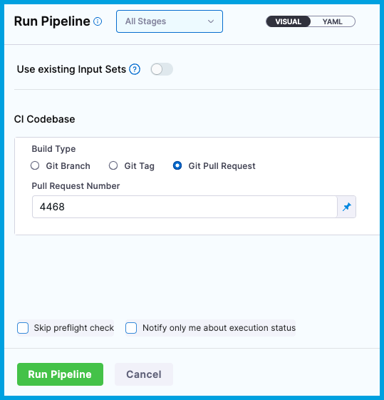

```mdx-code-block
import Tabs from '@theme/Tabs';
import TabItem from '@theme/TabItem';
import OutVar from '/docs/continuous-integration/shared/output-var.md';
```

:::note

Currently, TI for Ruby is behind the feature flag `CI_RUBY_TI`. Contact [Harness Support](mailto:support@harness.io) to enable the feature.

:::

Using [Test Intelligence](./set-up-test-intelligence.md) in your Harness CI pipelines doesn't require you to change your build and test processes, but some initial set up is required.

## Set up Test Intelligence for Ruby

To use TI for Ruby, you must:

1. [Add a Run Tests step.](#add-the-run-tests-step)
2. [Generate the initial call graph.](#generate-the-initial-call-graph)
3. [Trigger test selection.](#trigger-test-selection)
4. [View test reports and test selection.](#view-test-reports-and-test-selection)

After you've successfully enabled TI, you can further optimize test times by [enabling parallelism (test splitting) for TI](./ti-test-splitting.md). You can also configure TI to [ignore tests or files](./set-up-test-intelligence.md#ignore-tests-or-files).

### Add the Run Tests step

You need a [CI pipeline](../../prep-ci-pipeline-components.md) with a [Build stage](../../set-up-build-infrastructure/ci-stage-settings.md) where you'll add the **Run Tests** step. If you haven't created a pipeline before, try one of the [CI pipeline tutorials](/docs/continuous-integration/get-started/tutorials.md) or go to [CI pipeline creation overview](../../prep-ci-pipeline-components.md).

The build environment must have the necessary binaries for the **Run Tests** step to execute your test commands. Depending on the stage's build infrastructure, **Run Tests** steps can use binaries that exist in the build environment or pull an image, such as a public or private Docker image, that contains the required binaries. For more information about when and how to specify images, go to the [Container registry and image settings](#container-registry-and-image).

```mdx-code-block
<Tabs>
  <TabItem value="Visual" label="Visual">
```

1. Go to the **Build** stage in the pipeline where you want to add the **Run** step.
2. On the **Execution** tab, select **Add Step**, and select the **Run Tests** step from the Step Library.
3. Configure the [Run Tests step settings](#run-tests-step-settings). To enable Test Intelligence, you must:

   * Define one or more **Test Report Paths**. JUnit XML format is required. For more information, go to [Format test reports](../test-report-ref.md).
   * Select **Run Only Selected Tests**.
   * Specify the **Language**, **Build Tool**, **Build Arguments**, and other settings specific to your selected language or tool.
   * Specify a **Container Registry** and **Image**, if required by the build infrastructure.

4. Select **Apply Changes** to save the step.
5. After adding the **Run Tests** step, make sure you [generate the initial call graph](#generate-the-initial-call-graph).

```mdx-code-block
  </TabItem>
  <TabItem value="YAML" label="YAML" default>
```

1. In Harness, go to the pipeline where you want to add the `RunTests` step. In the `CI` stage, add a `RunTests` step and configure the [Run Tests step settings](#run-tests-step-settings). To enable Test Intelligence, you must:

   * Specify one or more report paths in `reports`. JUnit XML format is required. For more information, go to [Format test reports](../test-report-ref.md).
   * Include `runOnlySelectedTests: true`
   * Specify `language`, `buildTool`, `args`, and other settings specific to your selected language or tool.
   * Include `connectorRef` and `image` if required by the build infrastructure.

2. After adding the `RunTests` step, make sure you [generate the initial call graph](#generate-the-initial-call-graph).

Here is a YAML example of a Run Tests step configured for Ruby.

```yaml
              - step:
                  type: RunTests
                  name: Run Ruby Tests
                  identifier: Run_Ruby_Tests
                  spec:
                    language: Ruby
                    buildTool: Rspec
                    runOnlySelectedTests: true
                    preCommand: bundle install
```

```mdx-code-block
  </TabItem>
</Tabs>
```

### Generate the initial call graph

The first time you enable Test Intelligence on a repository, you must run all tests and generate an initial call graph. This sets the baseline for test selection in future builds. You can use a webhook trigger or manual build to generate the initial call graph.

:::info

The initial call graph sets the baseline for test selection in future builds. Test selection *isn't* applied to this run because Harness has no baseline against which to compare changes and select tests.

You only need to generate an initial call graph the first time you enable Test Intelligence on a repository.

:::

```mdx-code-block
<Tabs>
  <TabItem value="webhook" label="Webhook trigger (Recommended)" default>
```

1. [Add a webhook trigger](/docs/platform/triggers/triggering-pipelines/) to your pipeline that listens for **Pull Request** or **Push** events in the pipeline's [codebase](../../codebase-configuration/create-and-configure-a-codebase.md).
2. Open a PR or push changes to your codebase.
3. Wait while the build runs. You can monitor the build's progress on the [Build details page](../../viewing-builds.md). If the build succeeds, you can [review the test results](#view-test-reports-and-test-selections).

   The first run with TI *doesn't* apply test selection, because Harness must establish a baseline for comparison in future runs.

4. If you created a PR, merge the PR after the tests pass and the build succeeds. This is required to ensure that the baseline established by the call graph persists on the target branch. This step is not required for push triggers.

Now that you've established a testing baseline, each time this pipeline runs, Harness can select relevant tests to run based on the content of the code changes.

```mdx-code-block
  </TabItem>
  <TabItem value="manual" label="Manual build">
```

1. Open a PR or push changes to your pipeline's [codebase](../../codebase-configuration/create-and-configure-a-codebase.md).
2. In Harness, run your pipeline.

   * If you opened a PR, select **Git Pull Request** for **Build Type**, and enter the PR number.
   * If you pushed changes, select **Git Branch** for **Build Type**, and then enter the branch name.

   <!--  -->

   <docimage path={require('../static/set-up-test-intelligence-04.png')} />

3. Wait while the build runs. You can monitor the build's progress on the [Build details page](../../viewing-builds.md). If the build succeeds, you can [review the test results](#view-test-reports-and-test-selection).

   The first TI run *doesn't* apply test selection, because Harness must establish a baseline for comparison in future runs.

4. If you created a PR, merge the PR after the tests pass and the build succeeds. This is required to ensure that the baseline established by the call graph persists on the target branch. This step is not required if you pushed changes without a PR.

Now that you've established a testing baseline, each time this pipeline runs, Harness can select relevant tests to run based on the content of the code changes.

```mdx-code-block
  </TabItem>
</Tabs>
```

### Trigger test selection

After you [generate the initial call graph](#generate-the-initial-call-graph), Harness can apply test selection to subsequent pipeline runs.

To trigger test selection, create another PR (or push changes to your codebase) and run the pipeline again.

```mdx-code-block
<Tabs>
  <TabItem value="webhook" label="Webhook trigger" default>
```

1. Open a PR or push changes to your codebase.
2. Wait while the trigger starts and runs your pipeline. You can monitor the build's progress on the [Build details page](../../viewing-builds.md).
3. If the build succeeds, you can [review the test results and test selection](#view-test-reports-and-test-selections).
4. If the tests pass and the build succeeds, you can merge your PR, if applicable.

Each time the pipeline runs, Harness selects the relevant tests to run based on the content of the code changes.

```mdx-code-block
  </TabItem>
  <TabItem value="manual" label="Manual build">
```

1. Open a PR or push changes to your codebase.
2. In Harness, run your pipeline.

   * If you opened a PR, select **Git Pull Request** for **Build Type**, and enter the PR number.
   * If you pushed changes, select **Git Branch** for **Build Type**, and then enter the branch name.

   <!--  -->

   <docimage path={require('../static/set-up-test-intelligence-04.png')} />

3. Wait while the build runs. You can monitor the build's progress on the [Build details page](../../viewing-builds.md).
4. If the build succeeds, you can [review the test results and test selection](#view-test-reports-and-test-selection).
5. If the tests pass and the build succeeds, merge your PR, if applicable.

Each time the pipeline runs, Harness selects the relevant tests to run based on the content of the code changes.

```mdx-code-block
  </TabItem>
</Tabs>
```

### View test reports and test selection

For information about test reports for Test Intelligence, go to [View tests](../viewing-tests.md).

## Pipeline YAML examples

```mdx-code-block
<Tabs>
  <TabItem value="cloud" label="Harness Cloud" default>
```

This example shows a pipeline that uses Harness Cloud build infrastructure and runs tests on Ruby with RSpec and Test Intelligence.

```yaml
pipeline:
  projectIdentifier: default
  orgIdentifier: default
  identifier: testintelligencedemo
  name: Test Intelligence Demo
  properties:
    ci:
      codebase:
        connectorRef: YOUR_CODEBASE_CONNECTOR_ID
        repoName: YOUR_CODE_REPO_NAME
        build: <+input>
  tags: {}
  stages:
    - stage:
        name: Ruby Tests
        identifier: rubytests
        type: CI
        spec:
          cloneCodebase: true
          execution:
            steps:
              - step:
                  type: Run Ruby Tests
                  name: Run_Ruby_Tests
                  identifier: Run_Ruby_Tests
                  spec:
                    language: Ruby
                    buildTool: Rspec
                    runOnlySelectedTests: true ## Set to false if you don't want to use TI.
                    preCommand: bundle install
          platform:
            arch: Amd64
            os: Linux
          runtime:
            spec: {}
            type: Cloud
```

```mdx-code-block
  </TabItem>
  <TabItem value="sh" label="Self-hosted">
```

This example shows a pipeline that uses a Kubernetes cluster build infrastructure and runs tests on Ruby with RSpec and Test Intelligence.

```yaml
pipeline:
  projectIdentifier: default
  orgIdentifier: default
  identifier: testintelligencedemo
  name: Test Intelligence Demo
  properties:
    ci:
      codebase:
        connectorRef: YOUR_CODEBASE_CONNECTOR_ID
        repoName: YOUR_CODE_REPO_NAME
        build: <+input>
  tags: {}
  stages:
    - stage:
        name: Ruby tests
        identifier: rubytests
        type: CI
        spec:
          cloneCodebase: true
          execution:
            steps:
              - step:
                  type: Run Ruby Tests
                  name: Run_Ruby_Tests
                  identifier: Run_Ruby_Tests
                  spec:
                    connectorRef: account.harnessImage ## Specify if required by your build infrastructure.
                    image: ruby:latest ## Specify if required by your build infrastructure.
                    language: Ruby
                    buildTool: Rspec
                    runOnlySelectedTests: true ## Set to false if you don't want to use TI.
                    preCommand: bundle install
          infrastructure:
            type: KubernetesDirect
            spec:
              connectorRef: YOUR_KUBERNETES_CLUSTER_CONNECTOR_ID
              namespace: YOUR_KUBERNETES_NAMESPACE
              automountServiceAccountToken: true
              nodeSelector: {}
              os: Linux
```

```mdx-code-block
  </TabItem>
</Tabs>
```

## Run Tests step settings

The **Run Tests** step has the following settings. Some settings are optional, and some settings are only available for specific languages or build tools. Settings specific to containers, such as **Set Container Resources**, are not applicable when using the step in a stage with VM or Harness Cloud build infrastructure.

### Name

Enter a name summarizing the step's purpose. Harness automatically assigns an **Id** ([Entity Identifier Reference](/docs/platform/references/entity-identifier-reference.md)) based on the **Name**. You can edit the **Id**.

**Name** and **Id** are required. **Description** is optional.

### Container Registry and Image

The build environment must have the necessary binaries for the **Run Tests** step to execute your test commands. Depending on the stage's build infrastructure, **Run Tests** steps can use binaries that exist in the build environment or pull an image, such as a public or private Docker image, that contains the required binaries. You can also install tools at runtime in [Pre-Command](#pre-command), provided the build machine or image can execute the necessary commands, such as `curl` commands to download files.

:::info

The stage's build infrastructure determines whether these fields are required or optional:

* [Kubernetes cluster build infrastructure](../../set-up-build-infrastructure/k8s-build-infrastructure/set-up-a-kubernetes-cluster-build-infrastructure.md): **Container Registry** and **Image** are always required.
* [Local runner build infrastructure](../../set-up-build-infrastructure/define-a-docker-build-infrastructure.md): **Container Registry** and **Image** are always required.
* [Self-hosted cloud provider VM build infrastructure](/docs/category/set-up-vm-build-infrastructures): **Run Tests** steps can use binaries that you've made available on your build VMs. The **Container Registry** and **Image** are required if the VM doesn't have the necessary binaries. These fields are located under **Additional Configuration** for stages that use self-hosted VM build infrastructure.
* [Harness Cloud build infrastructure](../../set-up-build-infrastructure/use-harness-cloud-build-infrastructure.md): **Run Tests** steps can use binaries available on Harness Cloud machines, as described in the [image specifications](/docs/continuous-integration/use-ci/set-up-build-infrastructure/use-harness-cloud-build-infrastructure#platforms-and-image-specifications). The **Container Registry** and **Image** are required if the machine doesn't have the binaries you need. These fields are located under **Additional Configuration** for stages that use Harness Cloud build infrastructure.

:::

For **Container Registry**, provide a Harness container registry connector, such as a Docker connector, that connects to the container registry where the **Image** is located.

For **Image**, provide the FQN (fully-qualified name) or artifact name and tag of a Docker image that has the binaries necessary to run the commands in this step, such as `ruby:latest`. If you don't include a tag, Harness uses the `latest` tag.

You can use any Docker image from any Docker registry, including Docker images from private registries. Different container registries require different name formats:

* **Docker Registry:** Enter the name of the artifact you want to deploy, such as `library/tomcat`. Wildcards aren't supported. FQN is required for images in private container registries.
* **ECR:** Enter the FQN of the artifact you want to deploy. Images in repos must reference a path, for example: `40000005317.dkr.ecr.us-east-1.amazonaws.com/todolist:0.2`.
* **GCR:** Enter the FQN of the artifact you want to deploy. Images in repos must reference a path starting with the project ID that the artifact is in, for example: `us.gcr.io/playground-243019/quickstart-image:latest`.

### Language

Select **Ruby**.

### Build Tool

Select [RSpec](https://rspec.info/).

### Build Arguments

This setting is optional for Ruby. You can provide additional runtime arguments for tests, such as `--format RspecJunitFormatter --out tmp/junit.xml`. You don't need to repeat the build tool; this is declared in **Build Tool**.

### Test Report Paths

This setting is optional for Ruby.

You can use this setting if you want your test reports to be stored somewhere other than the default location or have a different name than the default report name.

You can specify one or more paths to files that store [test results in JUnit XML format](../../run-tests/test-report-ref.md). [Glob](https://en.wikipedia.org/wiki/Glob_(programming)) is supported.

```yaml
                    reports:
                      type: JUnit
                      spec:
                        paths:
                          - tmp/junit.xml
```

You can add multiple paths. If you specify multiple paths, make sure the files contain unique tests to avoid duplicates.

### Enable Test Splitting and Test Split Strategy

Used to [enable test splitting for TI](./ti-test-splitting.md).

### Pre-Command

You can enter commands for setting up the environment before running the tests, such as `bundle install`.

If a script is supplied here, select the corresponding **Shell** option.

:::info

If you need to run `bundle install` before running tests, you must include `bundle install` in the `preCommand`.

:::

### Post-Command

You can enter commands used for cleaning up the environment after running the tests. For example, `sleep 600` suspends the process for 600 seconds.

If a script is supplied here, select the corresponding **Shell** option.

### Run Only Selected Tests

This option must be selected (`true`) to enable Test Intelligence.

If this option is not selected (`false`), TI is disabled and all tests run on every build.

### Test Globs

You can override the default test globs pattern. For example, the default for RSpec is `spec/**/*_spec.rb`, and you could override it with any other pattern, such as `spec/features/**/*_spec.rb`.

<!-- ### Output Variables

<OutVar /> -->

### Environment Variables

You can inject environment variables into the step container and use them in the step's commands. You must input a **Name** and **Value** for each variable.

You can reference environment variables in the **Build Arguments**, **Pre-Command**, or **Post-Command** scripts by name, such as `$var_name`.

Variable values can be [fixed values, runtime inputs, or expressions](/docs/platform/variables-and-expressions/runtime-inputs/). For example, if the value type is expression, you can input a value that references the value of some other setting in the stage or pipeline.

<figure>


<figcaption>Using an expression for an environment variable's value.</figcaption>
</figure>

:::tip Stage variables

[Stage variables](/docs/platform/pipelines/add-a-stage/#stage-variables) are inherently available to steps as environment variables.

:::

### Image Pull Policy

If you specified a [Container Registry and Image](#container-registry-and-image), you can specify an image pull policy:

* **Always:** The kubelet queries the container image registry to resolve the name to an image digest every time the kubelet launches a container. If the kubelet encounters an exact digest cached locally, it uses its cached image; otherwise, the kubelet downloads (pulls) the image with the resolved digest, and uses that image to launch the container.
* **If Not Present:** The image is pulled only if it isn't already present locally.
* **Never:** The image is not pulled.

### Run as User

If you specified a [Container Registry and Image](#container-registry-and-image), you can specify the user ID to use for running processes in containerized steps.

For a Kubernetes cluster build infrastructure, the step uses this user ID to run all processes in the pod. For more information, go to [Set the security context for a pod](https://kubernetes.io/docs/tasks/configure-pod-container/security-context/#set-the-security-context-for-a-pod).

### Privileged

For container-based build infrastructures, you can enable this option to run the container with escalated privileges. This is equivalent to running a container with the Docker `--privileged` flag.

### Shell

Select the shell script type, if you provided [Pre-command](#pre-command) or [Post-command](#post-command).

### Set Container Resources

These settings specify the maximum resources used by the container at runtime. These setting are only available for container-based build infrastructures, such as a Kubernetes cluster build infrastructure.

* **Limit Memory:** The maximum memory that the container can use. You can express memory as a plain integer or as a fixed-point number using the suffixes `G` or `M`. You can also use the power-of-two equivalents `Gi` and `Mi`. The default is `500Mi`.
* **Limit CPU:** The maximum number of cores that the container can use. CPU limits are measured in CPU units. Fractional requests are allowed. For example, you can specify one hundred millicpu as `0.1` or `100m`. The default is `400m`. For more information go to [Resource units in Kubernetes](https://kubernetes.io/docs/concepts/configuration/manage-resources-containers/#resource-units-in-kubernetes).

### Timeout

The timeout limit for the step. Once the timeout is reached, the step fails and pipeline execution proceeds according to any [Step Failure Strategy settings](/docs/platform/pipelines/w_pipeline-steps-reference/step-failure-strategy-settings.md) or [Step Skip Condition settings](/docs/platform/pipelines/w_pipeline-steps-reference/step-skip-condition-settings.md).

## Troubleshooting TI for Ruby

### Cannot find rspec helper file

The following log line indicates that Test Intelligence can't locate an rspec helper file in your code repo:

```
Unable to write rspec helper file automatically cannot find rspec helper file. Please make change manually to enable TI.
```

This usually occurs if the helper file has a name other than `spec_helper.rb`.

To resolve this, add the following line to your rspec helper file:

```
set -e; echo "require_relative '/tmp/engine/ruby/harness/ruby-agent/test_intelligence.rb'" >> lib/vagrant/shared_helpers.rb
```

### Dynamically generated code

Test Intelligence results can be inaccurate for Ruby repos using dynamically generated code.

### Rails apps using Spring

Test Intelligence results can be inaccurate for Rails apps using [Spring](https://github.com/rails/spring).