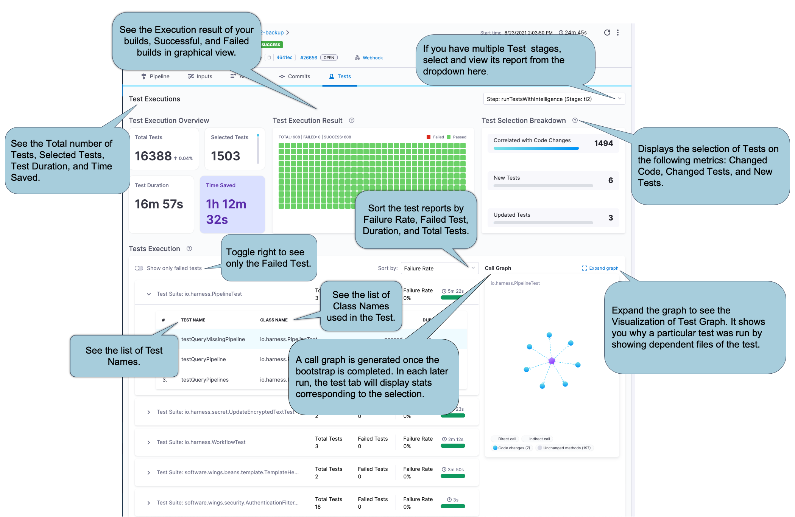
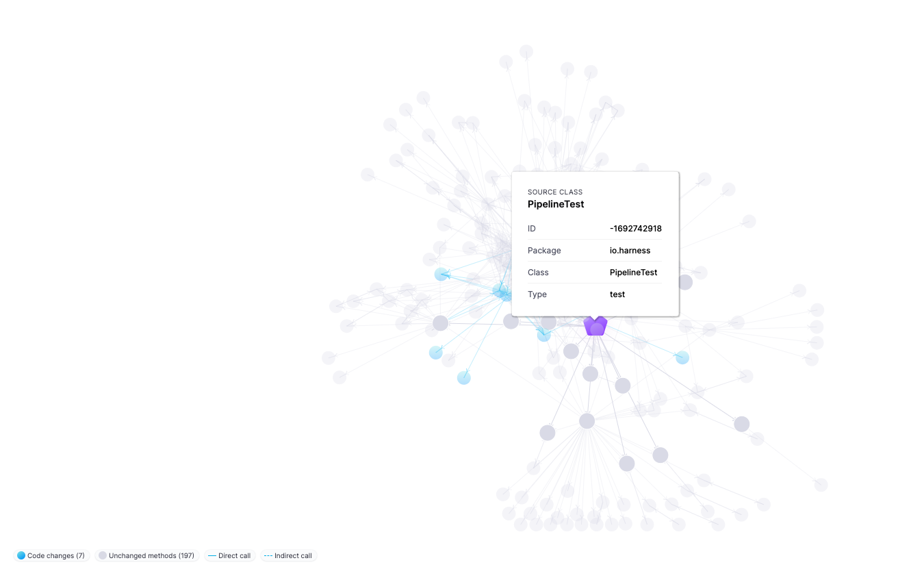

import Tabs from '@theme/Tabs';
import TabItem from '@theme/TabItem';


Your CI pipelines can run tests in [Run steps](../run-step-settings.md) and [Test steps](./tests-v2.md). In Harness, test results can be published to the [Build details page](../viewing-builds.md) on either the **Tests** tab or the **Artifacts** tab.

## Publish reports to the Tests tab

To publish test results and view them in Harness, you must produce [test reports in JUnit XML format](./test-report-ref.md) and add the **Report Paths** specification to the step, for example:

```yaml
              - step:
                  type: Run
                  name: Tests
                  identifier: tests
                  ...
                  reports:
                    type: JUnit
                    spec:
                      paths:
                        - /path/to/test/report.xml
```

The **Tests** tab can show tests only if your test reports are in JUnit XML format, because Harness parses test reports that are in JUnit XML format only. For information about formatting unit test reports, go to [Format test reports](./test-report-ref.md).

After a build runs, you can review test reports on the **Tests** tab on the [Build details page](../viewing-builds.md). The content differs for **Run** and **Test** steps.

### Results from Run steps

If you used a **Run** step, the **Tests** tab contains information about the total number of tests, the failure rate, and a list of failed tests. You can hover over individual failed test to view additional details about the failure.

If you ran tests in multiple steps/stages, or parallel steps/stages, use the **Step/Stage** dropdown menu to switch between reports from different steps or stages.


### Results from Test steps with Test Intelligence

If you are using [Test Intelligence for your unit tests](./ti-overview.md), the **Tests** tab contains information unique to Test Intelligence. In addition to the test results, you can also get information about which tests were selected by Test Intelligence and why Test Intelligence selected those tests.

:::info

The first run with TI *doesn't* include test selection, because Harness must establish a baseline for comparison in future runs. On subsequent runs, Harness can use the baseline to select relevant tests based on the content of the code changes.

Your first TI run won't report selected tests. Subsequent runs can report selected tests, if any are selected. For more information, go to [Enable Test Intelligence](./ti-overview.md#enable-test-intelligence).

:::

<!--  -->

<DocImage path={require('./static/set-up-test-intelligence-03.png')} />

Expand the sections below to learn more about the information available on the **Tests** tab for Test Intelligence.

<details>
<summary>Test Execution Overview</summary>

This section provides an overview of **Total Tests**, number of **Selected Tests**, total **Duration** of all tests, and **Time Saved**.

**Duration** reflects the sum of CPU time taken for all tests to complete. The values are collected as-is from the JUnit report, and they don't correspond with wall-clock time. In contrast, the pipeline execution time is a measure of wall-clock time. Therefore, it is possible that the **Duration** may exceed the total pipeline execution time.

</details>

<details>
<summary>Test Execution Result</summary>

This section provides a graphical representation of successful and failed tests.

</details>

<details>
<summary>Test Selection Breakdown</summary>

Test Intelligence analyzes changes to source files and test files in the codebase and then runs only the tests that are relevant to the detected changes. This section reports how many tests ran based on the different the types of code changes included in this build:

* **Correlated with Code Changes**: The number of tests that ran due to changes in the codebase.
* **New Tests**: The number of tests that ran because they are new.
* **Updated Tests**: The number of tests that ran because there was a change to the actual test code or content.

</details>

<details>
<summary>Test Execution</summary>

This section provides a detailed list of all tests, including class methods and test methods.

Initially, the list shows only failed tests. To see all tests, toggle **Show all Tests**.

You can sort the list by failure rate, duration, and total tests. You can also expand test suites to see details about individual tests in that suite.

</details>

<details>
<summary>Call Graph</summary>

Select **Expand graph** to view the TI Visualization, which shows why a specific test was selected and the reason behind every test selection. Purple nodes represent tests. Select any test (purple node) to see all the classes and methods covered by that test. Blue nodes represent changes to classes and methods that caused TI to select that test.



The call graph can be empty if:

* You just enabled Test Intelligence. Your first TI run won't report selected tests. Subsequent runs can report selected tests, if any are selected. The first run with TI *doesn't* include test selection, because Harness must establish a baseline for comparison in future runs. On subsequent runs, Harness can use the baseline to select relevant tests based on the content of the code changes.
* TI selected all tests. Lots of code changes and changes to certain files cause TI to select all tests. In this case, no call graph is generated because it would be too large and not useful.

For more information about how and when TI selects tests, go to [Enable Test Intelligence](./ti-overview.md#enable-test-intelligence).

</details>

## View reports on the Artifacts tab

For reports that can't be published to the **Tests** tab, you can use the [Artifact Metadata Publisher plugin](https://github.com/drone-plugins/artifact-metadata-publisher) to publish reports to the **Artifacts** tab on the [Build details page](../viewing-builds.md). You can [publish any URL to the Artifacts tab](/docs/continuous-integration/use-ci/build-and-upload-artifacts/artifacts-tab).

<Tabs>
  <TabItem value="Visual" label="Visual">

To publish a test report to the **Artifacts** tab, you must:

1. Include steps in your pipeline that run tests and produce test reports.
2. Add a step to upload the report artifact to cloud storage, such as:
   * [Upload Artifacts to GCS](../build-and-upload-artifacts/upload-artifacts/upload-artifacts-to-gcs-step-settings.md)
   * [Upload Artifacts to S3](../build-and-upload-artifacts/upload-artifacts/upload-artifacts-to-s3.md)
   * [Upload Artifacts to Sonatype Nexus](../build-and-upload-artifacts/upload-artifacts/upload-artifacts-to-sonatype-nexus.md)
   * [Upload Artifacts to JFrog Artifactory](../build-and-upload-artifacts/upload-artifacts/upload-artifacts-to-jfrog.md)
3. Add a [Plugin step](../use-drone-plugins/plugin-step-settings-reference.md) that uses the `artifact-metadata-publisher` plugin, configured as follows:
   * **Name:** Enter a name.
   * **Container Registry:** Select a Docker connector.
   * **Image:** Enter `plugins/artifact-metadata-publisher`.
   * **Settings:** Add the following two settings as key-value pairs:
      * `file_urls`: Provide the URL to the artifact that was uploaded in the **Upload Artifacts** step. If you uploaded multiple artifacts, you can provide a list of URLs.
      * `artifact_file`: Provide any `.txt` file name, such as `artifact.txt` or `url.txt`. This is a required setting that Harness uses to store the artifact URL and display it on the **Artifacts** tab. This value is not the name of your uploaded artifact, and it has no relationship to the artifact object itself.

</TabItem>
  <TabItem value="YAML" label="YAML" default>

1. Include steps in your pipeline that run tests and produce test reports.
2. Add a step to upload the report artifact to cloud storage, such as:
   * [Upload Artifacts to GCS](../build-and-upload-artifacts/upload-artifacts/upload-artifacts-to-gcs-step-settings.md)
   * [Upload Artifacts to S3](../build-and-upload-artifacts/upload-artifacts/upload-artifacts-to-s3.md)
   * [Upload Artifacts to Sonatype Nexus](../build-and-upload-artifacts/upload-artifacts/upload-artifacts-to-sonatype-nexus.md)
   * [Upload Artifacts to JFrog Artifactory](../build-and-upload-artifacts/upload-artifacts/upload-artifacts-to-jfrog.md)
3. Add a [Plugin step](../use-drone-plugins/plugin-step-settings-reference.md) that uses the `artifact-metadata-publisher` plugin, for example:

   ```yaml
                  - step:
                     type: Plugin
                     name: publish artifact metadata
                     identifier: publish_artifact_metadata
                     spec:
                       connectorRef: account.harnessImage ## Use the built-in Docker connector or specify your own Docker connector.
                       image: plugins/artifact-metadata-publisher ## Required.
                       settings:
                         file_urls: ## Provide the URL to the artifact that was uploaded in the Upload Artifacts step. If you uploaded multiple artifacts, you can provide a list of URLs.
                         artifact_file: artifact.txt ## Provide any '.txt' file name. Harness uses this to store the artifact URL and display it on the Artifacts tab. This value is not the name of your uploaded artifact, and it has no relationship to the artifact object itself.
   ```

</TabItem>
</Tabs>

## Parse JUnit tests results

The `parse-test-reports` plugin is a Harness plugin designed to parse JUnit XML test reports and fail the pipeline if any test failures are detected. 
This plugin ensures that the entire test suite runs, even if failures occur, by deferring the detection of failures to a later step in the pipeline. The plugin scans directories specified by input globs for JUnit XML test reports, and will exit with status 1 if it finds any test failures.


**How it works**

1. Set the failure strategy of the step that runs the tests to ignore failures. 
2. Use the parse-test-reports plugin in a subsequent Plugin step to scan the test report directories set in the plugin, and fail the build if any failures are found.

**Usage Example**

```yaml

- step:
    type: Plugin
    name: Parse Test Reports Plugin
    identifier: Parse_Test_Reports_Plugin
    spec:
      connectorRef: dockerConnector
      image: harnesscommunity/parse-test-reports:latest
      settings:
        test_globs: folder1/*.xml, folder2/*.xml  # paths to junit results

```

In the above example, Harness will scan for JUnit XML test reports in folder1 and folder2, and will fail (exit status 1) in case failures are detected in the JUnit XML test reports found in the folders scanned. 


## Test report dashboard

:::note

Currently, the Unit Test Metrics dashboard is behind the feature flag `CI_TI_DASHBOARDS_ENABLED`. Contact [Harness Support](mailto:support@harness.io) to enable the feature.

:::

The **Unit Test Metrics** dashboard aggregates data from test reports in JUnit XML format. The dashboard reports the overall failure rate and the overall success rate. The dashboard breaks down failure data by pipeline, Git repo, and test. You can filter by project, pipeline, and date range.

You can find this and other [dashboards](/docs/platform/dashboards/dashboards-overview/) under the **Dashboards** section of your Harness account.

## Troubleshoot test reports

Go to the [CI Knowledge Base](/kb/continuous-integration/continuous-integration-faqs) for questions and issues related to test reports in Harness CI, including:

* [Test suites incorrectly parsed](/kb/continuous-integration/continuous-integration-faqs/#test-reports-missing-or-test-suites-incorrectly-parsed)
* [Test reports missing](/kb/continuous-integration/continuous-integration-faqs/#test-reports-missing-or-test-suites-incorrectly-parsed)
* [Test report truncated](/kb/continuous-integration/continuous-integration-faqs/#why-is-the-test-report-truncated-in-tests-tab)
* [Multiple test report paths](/kb/continuous-integration/continuous-integration-faqs/#can-i-specify-multiple-paths-for-test-reports-in-a-run-step)
* [Test Intelligence call graph is empty](/kb/continuous-integration/continuous-integration-faqs/#on-the-tests-tab-the-test-intelligence-call-graph-is-empty-and-says-no-call-graph-is-created-when-all-tests-are-run)
