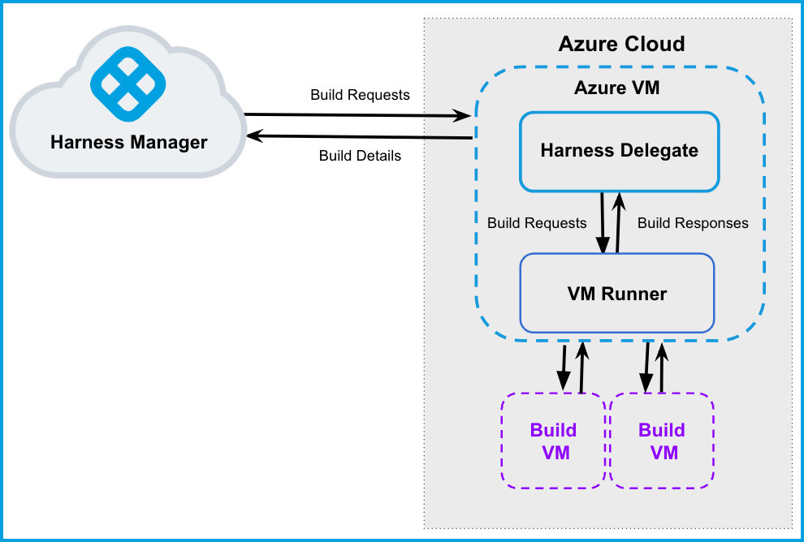
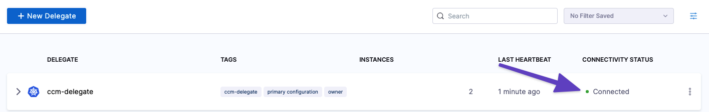

> **NOTE**: Currently, this feature is behind the Feature Flag `CI_VM_INFRASTRUCTURE`. Contact [Harness Support](mailto:support@harness.io) to enable the feature.

This topic describes how to set up a CI build infrastructure in Microsoft Azure. You will create a VM and install a CI Delegate and Drone Runner on it. The Delegate creates VMs dynamically in response to CI build requests.

Running builds in your infrastructure, rather than in a vendor's cloud, has significant benefits. Vendor clouds often experience outages that can result in backlogs and delayed builds. You can build software and run tests, repeatedly and automatically, on a scalable platform with no outages or backlogs.

For information on using Kubernetes as a build farm, see [Define Kubernetes Cluster Build Infrastructure](set-up-a-kubernetes-cluster-build-infrastructure.md).

The following diagram illustrates a build farm. The [​Harness Docker Delegate](https://docs.harness.io/article/cya29w2b99-install-a-docker-delegate) communicates directly with your Harness instance. The [VM Runner](https://docs.drone.io/runner/vm/overview/) maintains a pool of VMs for running builds. When the Delegate receives a build request, it forwards the request to the Runner, which runs the build on an available VM.



### Important Notes

* VM requirements:
	+ For the Delegate VM, use a machine type with 4 vCPU and 16 GB memory or more.
	+ Harness recommends the [Ubuntu Server 18.04 LTS](https://azuremarketplace.microsoft.com/en-us/marketplace/apps/canonical.0001-com-ubuntu-server-bionic?tab=overview) image and a [Microsoft Windows Server 2019 with Containers](https://az-vm-image.info/?cmd=--all+--publisher+microsoftwindowsserver+--sku+containers+--query+%22%5B%3Fcontains%28version%2C+%272019%27%29%5D%22) image. For additional details, go to [Azure](https://docs.drone.io/runner/vm/drivers/azure/) in the Drone docs.
	+ The VM must allow ingress access on ports 22 and 9079. Open port 3389 as well if you want to run Windows builds and be able to RDP into your build VMs.
* Azure requirements:
	+ You need permissions to create Azure Applications and VMs.
	+ An Azure Application that has the Owner role assigned to your VM. To assign a role to your VM, go to [Virtual Machines](https://portal.azure.com/#view/HubsExtension/BrowseResource/resourceType/Microsoft.Compute%2FVirtualMachines). Then select your VM and go to **Access Control (IAM)**.
* To enable the runner to create new VMs, you'll need to specify the Application (client) ID, client\_secret, subscription\_id and Directory (tenant) ID.
	+ `client_id` — To find the client ID, go to [App Registrations](https://portal.azure.com/#view/Microsoft_AAD_RegisteredApps/ApplicationsListBlade) and then select your app.
	+ `tenant_id` — to find the tenant ID, go to [App Registrations](https://portal.azure.com/#view/Microsoft_AAD_RegisteredApps/ApplicationsListBlade) and then select your app.
	+ `client_secret` — To create a client secret, go to your app and click **Certificates and Secrets**.
	+ `subscription_id` — To find the subscription ID, go to the [Virtual Machines page](https://portal.azure.com/#view/HubsExtension/BrowseResource/resourceType/Microsoft.Compute%2FVirtualMachines) and select your delegate VM.

### Step 1: Set Up the Delegate VM

1. Go to [Virtual Machines](https://portal.azure.com/#view/HubsExtension/BrowseResource/resourceType/Microsoft.Compute%2FVirtualMachines) and then launch the VM instance where the Harness Delegate will be installed.
2. [Install Docker](https://docs.aws.amazon.com/AmazonECS/latest/developerguide/docker-basics.html#install_docker) on the VM.
3. [Install Docker Compose](https://docs.docker.com/compose/install/) on the VM. You must have [Docker Compose version 3.7](https://docs.docker.com/compose/compose-file/compose-versioning/#version-37) or higher installed.
4. Create a `/runner` folder on your VM and `cd` into it:
```
mkdir /runner  
cd /runner
```

### Step 2: Configure the Drone Pool

The **drone\_pool.yml** file defines the VM spec and pool size for the VM instances used to run the Pipeline. A pool is a group of instantiated VM that are immediately available to build CI Pipelines.

1. In the `/runner` folder, create a new **drone\_pool.yml** file.
2. Set up the file as described in the following example. Note the following:  
See the Pool Settings Reference below for details on specific settings. See also [Drone Pool](https://docs.drone.io/runner/vm/configuration/pool/) and [Azure](https://docs.drone.io/runner/vm/drivers/azure/) in the Drone docs.

Example pool.yaml for Ubuntu 18.04
```
version: "1"  
instances:  
  - name: ubuntu-azure-pool  
    default: true  
    type: azure  
    pool: 1      
    limit: 4     
    platform:  
      os: linux  
      arch: amd64  
    spec:  
      account:  
        client_id: XXXXXXXXXXXXXXXXXXXX  
        client_secret: XXXXXXXXXXXXXXXXXXXX  
        subscription_id: XXXXXXXXXXXXXXXXXXXX  
        tenant_id: XXXXXXXXXXXXXXXXXXXX  
      location: eastus2  
      size : Standard_F2s  
      tags:  
        tagName: tag  
      image:  
        username: azureuser  
        password: XXXXXXXXXXXXXXXXXXXX  
        publisher: Canonical  
        offer: UbuntuServer  
        sku: 18.04-LTS  
        version: latest
```
Example pool.yaml for Windows Server 2019
```
version: "1"  
instances:  
- name: ubuntu-azure  
  default: true  
  type: azure  
  platform:  
    os: windows  
  spec:  
    account:  
      client_id: XXXXXXX  
      client_secret: XXXXXXX  
      subscription_id: XXXXXXX  
      tenant_id: XXXXXXX  
    location: eastus2  
    size: Standard_F2s  
    tags:  
      tagName: tag  
    image:  
      username: XXXXXXX  
      password: XXXXXXX  
      publisher: MicrosoftWindowsServer  
      offer: WindowsServer  
      sku: 2019-Datacenter-with-Containers  
      version: latest
```
Later in this workflow, you'll reference the pool identifier in the Harness Manager to map the pool with a Stage Infrastructure in a CI Pipeline. This is described later in this topic.

### Step 3: Create the Docker-Compose YAML

1. Navigate to the Delegates page for your Harness account, organization, or project.
2. Click **New Delegate** and select **Docker**.
3. Follow the steps in [Install the Docker Delegate](https://docs.harness.io/article/cya29w2b99-install-a-docker-delegate) and download the **docker-compose.yaml** file to your local machine.

### Step 4: Configure the Docker Compose File

The Harness Delegate and Runner run on the same VM. The Runner communicates with the Harness Delegate on localhost and port 3000 of your VM. 

In this step, you will add the Runner spec to the new Delegate definition. 

1. Copy your local **docker-compose.yaml** to the `/runner` folder on the VM. This folder should now have **docker-compose.yaml** and **.drone\_pool.yml**.
2. Append the following to **docker-compose.yaml**.
```
drone-runner-aws:  
    restart: unless-stopped  
    image: drone/drone-runner-aws:latest  
    volumes:  
      - /runner:/runner  
    entrypoint: ["/bin/drone-runner-aws", "delegate", "--pool", "pool.yml"]  
    working_dir: /runner  
    ports:  
      - "3000:3000"
```
3. In the **docker-compose.yaml** file, add the following under `services: harness-ng-delegate: restart: unless-stopped`:
```
network_mode: "host"
```

Your Docker Compose file now looks something like this:

Updated docker-compose.yml
```
version: "3.7"  
services:  
  harness-ng-delegate:  
    restart: unless-stopped  
    network_mode: "host"  
    deploy:  
      resources:  
        limits:  
          cpus: "0.5"  
          memory: 2048M  
    image: harness/delegate:latest  
    environment:  
      - ACCOUNT_ID=XXXXXXXXXXXXXXXX  
      - ACCOUNT_SECRET=XXXXXXXXXXXXXXXX  
      - MANAGER_HOST_AND_PORT=https://qa.harness.io  
      - WATCHER_STORAGE_URL=https://app.harness.io/public/qa/premium/watchers  
      - WATCHER_CHECK_LOCATION=current.version  
      - REMOTE_WATCHER_URL_CDN=https://app.harness.io/public/shared/watchers/builds  
      - DELEGATE_STORAGE_URL=https://app.harness.io  
      - DELEGATE_CHECK_LOCATION=delegateqa.txt  
      - USE_CDN=true  
      - CDN_URL=https://app.harness.io  
      - DEPLOY_MODE=KUBERNETES  
      - DELEGATE_NAME=qwerty  
      - NEXT_GEN=true  
      - DELEGATE_DESCRIPTION=  
      - DELEGATE_TYPE=DOCKER  
      - DELEGATE_TAGS=  
      - DELEGATE_TASK_LIMIT=50  
      - DELEGATE_ORG_IDENTIFIER=  
      - DELEGATE_PROJECT_IDENTIFIER=  
      - PROXY_MANAGER=true  
      - VERSION_CHECK_DISABLED=false  
      - INIT_SCRIPT=echo "Docker delegate init script executed."  
  drone-runner-aws:  
    restart: unless-stopped  
    image: drone/drone-runner-aws:latest  
    volumes:  
      - /runner:/runner  
    entrypoint: ["/bin/drone-runner-aws", "delegate", "--pool", "pool.yml"]  
    working_dir: /runner  
    ports:  
      - "3000:3000"
```
### Step 5: Install the Delegate and Runner

1. [SSH](https://docs.aws.amazon.com/AWSEC2/latest/UserGuide/AccessingInstancesLinux.html) into the Delegate VM and **`cd`** to `/runner`.
2. Confirm that the folder has both setup files:
```
$ ls -a  
.  ..  docker-compose.yml  .drone_pool.yml 
```
3. Install the Delegate and Runner:
```
$ docker-compose -f docker-compose.yml up -d
```
4. Verify that both containers are running correctly. (you might need to wait a few minutes for both processes to start.)
```
$ docker ps  
$ docker logs <delegate-container-id>  
$ docker logs <runner-container-id>
```
5. In the Harness UI, verify that the Delegate appears in the Delegates list. This might take two or three minutes. You should see Connected next to the Delegate listing.
6. If you see **Not Connected**, make sure the Docker host can connect to **https://app.harness.io**.

The Delegate and Runner have now been successfully installed, registered, and connected.

For details on the environment variables of the Harness Docker Delegate, see [Harness Docker Delegate Environment Variables](https://ngdocs.harness.io/article/cya29w2b99-install-a-docker-delegate#harness_docker_delegate_environment_variables).

### Step 6: Run a CI Build

1. In the Harness CI Stage, in **Infrastructure**, select **VMs**.
2. In the **Pool ID**, enter the pool name `<pool_id>` that you added in Step 2.


You can now run Build Stages in your GCP build infrastructure.

### Pool Settings Reference

See also [Drone Pool](https://docs.drone.io/runner/vm/configuration/pool/) and [Azure](https://docs.drone.io/runner/vm/drivers/azure/) in the Drone docs.


|  |  |
| --- | --- |
| **Subfields** | **Description** |
| `name` (String) | Unique identifier of the pool. You will be referencing this pool name in the Harness Manager in later steps while setting up the CI Stage Infrastructure. |
| `pool` (Integer) | Minimum pool size number. Denotes the minimum number of cached VMs in ready state to be used by the Runner. |
| `limit` (Integer) | Maximum pool size number. Denotes the maximum number of cached VMs in ready state to be used by the Runner. |
| `platform` | Configure the details of your VM platform. |
| `spec` | Configure the settings of your build VMs:`account`  — The azure account settings that the runner needs to create new VMs.* `client_id` — To find the client ID, go to [App Registrations](Directory (tenant) ID) and then select your app.
* `tenant_id` — to find the tenant ID, go to [App Registrations](Directory (tenant) ID) and then select your app.
* `client_secret` — To create a client secret, go to your app and click **Certificates and Secrets**.
* `subscription_id` — To find the subscription ID, go to the [Virtual Machines page](https://portal.azure.com/#view/HubsExtension/BrowseResource/resourceType/Microsoft.Compute%2FVirtualMachines) and select your delegate VM.

`image`  — The Azure region for the build VMs.`location`  — The Azure region for the build VMs. To reduce latency, Harness recommends you use the same region as the Delegate.`size`  — The Azure VM size.`tag` — An optional tag to identify build VMs. |

### Troubleshooting (Advanced)

If you have problems running the delegate, runner, or VMs, you can collect debug and trace information in your container logs.

1. Create a `.env` file with the following options in your `/runner` folder:
```
DRONE_DEBUG=true  
DRONE_TRACE=true
```
2. Shut down the delegate and runner: `docker-compose down`
3. In your `docker-compose.yml` file, update the `drone-runner-aws: entrypoint` to include the `.env` file:
```
    drone-runner-aws:  
    restart: unless-stopped  
    image: drone/drone-runner-aws:1.0.0-rc.9  
    volumes:  
      - /runner:/runner  
      - /home/jsmith/.config/gcloud/:/key  
    entrypoint: ["/bin/drone-runner-aws", "delegate", "--envfile", ".env", "--pool", "pool.yml"]  
    working_dir: /runner  
    ports:  
      - "3000:3000"  
    
```
4. Restart the delegate and runner: `docker-compose up`

### See Also

* [Set Up a Kubernetes Cluster Build Infrastructure](set-up-a-kubernetes-cluster-build-infrastructure.md)
* For more details on VM Runner, visit this [GitHub](https://github.com/drone-runners/drone-runner-aws) page.

