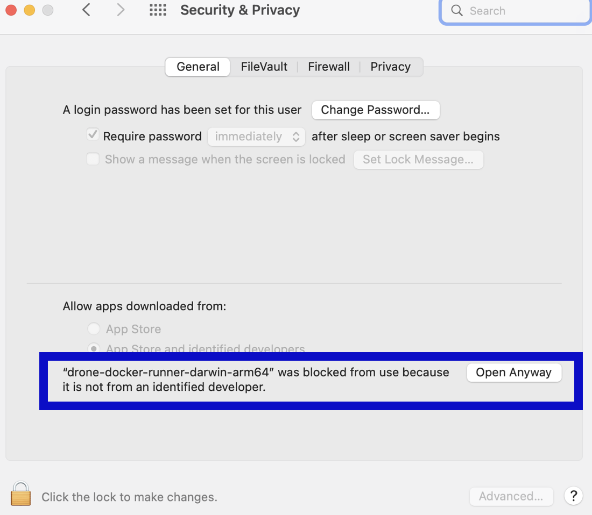

import Tabs from '@theme/Tabs';
import TabItem from '@theme/TabItem';


<DocsTag  text="Free plan" link="/docs/continuous-integration/ci-quickstarts/ci-subscription-mgmt" /> <DocsTag  text="Team plan" link="/docs/continuous-integration/ci-quickstarts/ci-subscription-mgmt" /> <DocsTag  text="Enterprise plan" link="/docs/continuous-integration/ci-quickstarts/ci-subscription-mgmt" />

You can define a CI build infrastructure on a Linux, macOS, or Windows host by installing a Harness Docker Delegate and local Harness Docker Runner. When the pipeline runs, the Harness Docker Runner runs the build actions in the environment where it is installed. The delegate handles communication between the Harness Platform and the Harness Docker Runner.

* [Set up a Linux local runner build infrastructure](#set-up-a-linux-local-runner)
* [Set up a macOS local runner build infrastructure](#set-up-a-macos-local-runner)
* [Set up a Windows local runner build infrastructure](#set-up-a-windows-local-runner)

Local runner build infrastructure is recommended for small, limited builds, such as a one-off build on your local machine. Consider [other build infrastructure options](/docs/category/set-up-build-infrastructure) for builds-at-scale.

## Set up a Linux local runner

### Prepare machines

Review the following requirements for local runner build infrastructures:

* There is a one-to-one relationship between Harness Docker Runners and Harness Delegates. If you need to run three local hosts, each host needs a runner and a delegate.
* The Harness Docker Delegate is limited by the total amount of memory and CPU on the local host. Builds can fail if the host runs out of CPU or memory when running multiple builds. The Harness Docker Delegate has the following system requirements:
   * Default 0.5 CPU.
   * Default 1.5GB. Ensure that you provide the minimum memory for the delegate and enough memory for the host/node system.
* The machine where the delegate runs must have Docker installed.

### Install the delegate

1. In Harness, go to **Account Settings**, select **Account Resources**, and then select **Delegates**.

   You can also create delegates at the project scope. To do this, go to your Harness CI project, select **Project Setup**, and then select **Delegates**.

2. Select **New Delegate** or **Install Delegate**.
3. Select **Docker**.
4. Enter a **Delegate Name**.
5. Copy the delegate install command and modify it as follows:

   * Add `--net=host` to the first line.
   * Add `-e DELEGATE_TAGS="DELEGATE_OS_ARCH"`, and replace `DELEGATE_OS_ARCH` with the tag corresponding to your Docker environment's architecture: `linux-amd64` or `linux-arm64`.

   Here's an example of an install script for Linux arm64:

   ```
   docker run --cpus=1 --memory=2g --net=host \
     -e DELEGATE_NAME=docker-delegate \
     -e NEXT_GEN="true" \
     -e DELEGATE_TYPE="DOCKER" \
     -e ACCOUNT_ID=H5W8iol5TNWc4G9h5A2MXg \
     -e DELEGATE_TOKEN=YOUR_API_TOKEN \
     -e LOG_STREAMING_SERVICE_URL=https://app.harness.io/log-service/ \
     -e DELEGATE_TAGS="linux-arm64" \
     -e MANAGER_HOST_AND_PORT=https://app.harness.io/ harness/delegate:23.02.78306
   ```

6. Run the modified install command on your build host machine.

:::tip

The delegate install command uses the default authentication token for your Harness account. If you want to use a different token, you can create a token and then specify it in the delegate install command:

1. In Harness, go to **Account Settings**, then **Account Resources**, and then select **Delegates**.
2. Select **Tokens** in the header, and then select **New Token**.
3. Enter a token name and select **Apply** to generate a token.
4. Copy the token and paste it in the value for `DELEGATE_TOKEN`.

:::

For more information about delegates and delegate installation, go to [Delegate installation overview](/docs/platform/delegates/install-delegates/overview).

### Install the Harness Docker Runner

The Harness Docker Runner service performs the build work. The delegate needs the runner to run CI builds.

1. Download a [Harness Docker Runner executable](https://github.com/harness/harness-docker-runner/releases) corresponding to your build farm's OS and architecture.
2. (Optional) To use self-signed certificates, export `CI_MOUNT_VOLUMES` along with a comma-separated list of source paths and destination paths formatted as `path/to/source:path/to/destination`, for example:

   ```
   export CI_MOUNT_VOLUMES="[path/to/local/cert];/etc/ssl/certs/ca-certificates.crt,[path/to/local/cert2];/etc/ssl/certs/cacerts.pem"
   ```

   :::info

   If your pipelines have STO scan steps, review the additional requirements for [adding custom artifacts to STO pipelines](/docs/security-testing-orchestration/use-sto/set-up-sto-pipelines/add-custom-certs/add-certs-to-delegate).

   :::

3. Enable execution permissions for the Runner. For example:

   ```
   sudo chmod +x harness-docker-runner-linux-arm64
   ```

4. Start the runner binary. For example:

   ```
   sudo ./harness-docker-runner-linux-arm64 server
   ```

Here is an example of the three commands to install the Linux arm64 Harness Docker Runner with self-signed certificates:

```
export CI_MOUNT_VOLUMES="[path/to/local/cert];/etc/ssl/certs/cacerts.pem"
sudo chmod +x harness-docker-runner-linux-arm64
./harness-docker-runner-linux-arm64 server
```

### Define build infrastructure

After configuring the host machine, you need to [set the pipeline's build infrastructure](#set-the-pipelines-build-infrastructure).

## Set up a macOS local runner

### Prepare machines

Review the following requirements for local runner build infrastructures:

* There is a one-to-one relationship between Harness Docker Runners and Harness Delegates. If you need to run three local hosts, each host needs a runner and a delegate.
* The Harness Docker Delegate is limited by the total amount of memory and CPU on the local host. Builds can fail if the host runs out of CPU or memory when running multiple builds. The Harness Docker Delegate has the following system requirements:
   * Default 0.5 CPU.
   * Default 1.5GB. Ensure that you provide the minimum memory for the delegate and enough memory for the host/node system.
* The machine where the delegate runs must have Docker installed.

### Install the delegate

1. In Harness, go to **Account Settings**, select **Account Resources**, and then select **Delegates**.

   You can also create delegates at the project scope. To do this, go to your Harness CI project, select **Project Setup**, and then select **Delegates**.

2. Select **New Delegate** or **Install Delegate**.
3. Select **Docker**.
4. Enter a **Delegate Name**.
5. Copy the delegate install command and modify it as follows:

   * Add `-e DELEGATE_TAGS="DELEGATE_OS_ARCH"`, and replace `DELEGATE_OS_ARCH` with the tag corresponding to your Docker environment's architecture: `macos-amd64` or `macos-arm64`.
   * Add `-e RUNNER_URL=http://host.docker.internal:3000`.

   Here's an example of an install script for macOS amd64:

   ```
   docker run --cpus=1 --memory=2g \
     -e DELEGATE_NAME=docker-delegate \
     -e NEXT_GEN="true" \
     -e DELEGATE_TYPE="DOCKER" \
     -e ACCOUNT_ID=H5W8iol5TNWc4G9h5A2MXg \
     -e DELEGATE_TOKEN=YOUR_API_TOKEN \
     -e LOG_STREAMING_SERVICE_URL=https://app.harness.io/gratis/log-service/ \
     -e DELEGATE_TAGS="macos-amd64" \
     -e RUNNER_URL=http://host.docker.internal:3000 \
     -e MANAGER_HOST_AND_PORT=https://app.harness.io/gratis harness/delegate:23.02.78306
   ```

6. Run the modified install command on your build host machine.

:::tip

The delegate install command uses the default authentication token for your Harness account. If you want to use a different token, you can create a token and then specify it in the delegate install command:

1. In Harness, go to **Account Settings**, then **Account Resources**, and then select **Delegates**.
2. Select **Tokens** in the header, and then select **New Token**.
3. Enter a token name and select **Apply** to generate a token.
4. Copy the token and paste it in the value for `DELEGATE_TOKEN`.

:::

For more information about delegates and delegate installation, go to [Delegate installation overview](/docs/platform/delegates/install-delegates/overview).

### Install the Harness Docker Runner

The Harness Docker Runner service performs the build work. The delegate needs the runner to run CI builds.

1. Download a [Harness Docker Runner executable](https://github.com/harness/harness-docker-runner/releases) corresponding to your build farm's OS and architecture.
2. (Optional) To use self-signed certificates, export `CI_MOUNT_VOLUMES` along with a comma-separated list of source paths and destination paths formatted as `path/to/source:path/to/destination`, for example:

   ```
   export CI_MOUNT_VOLUMES="[path/to/local/cert];/etc/ssl/certs/ca-certificates.crt,[path/to/local/cert2];/etc/ssl/certs/cacerts.pem"
   ```

   :::info

   If your pipelines have STO scan steps, review the additional requirements for [adding custom artifacts to STO pipelines](/docs/security-testing-orchestration/use-sto/set-up-sto-pipelines/add-custom-certs/add-certs-to-delegate).

   :::

3. Enable execution permissions for the Runner. For example:

   ```
   sudo chmod +x harness-docker-runner-darwin-amd64
   ```

4. Start the runner binary. For example:

   ```
   ./harness-docker-runner-darwin-amd64 server
   ```

5. If [macOS Gatekeeper](https://support.apple.com/en-us/HT202491) stops the installation because it can't check for malicious software, you need to modify **Security & Privacy** settings to allow this app to run.

   

<details>
<summary>Allow the runner binary app to run</summary>

1. Go to **System Preferences** and select **Security & Privacy**.
2. On the **General** tab, select the lock to make changes.
3. Select **Allow** next to the `an app was blocked from loading` message.
4. Select **OK**.
5. Select **Open Anyway** next to the `not from an identified developer` message.

  

6. Select **Open** to confirm that you want to run the binary. If this window doesn't appear, rerun the binary start command.

</details>

Here is an example of the three commands to install the Darwin amd64 Harness Docker Runner with self-signed certificates:

```
export CI_MOUNT_VOLUMES="[path/to/local/cert];/etc/ssl/certs/cacerts.pem"
sudo chmod +x harness-docker-runner-darwin-arm64
./harness-docker-runner-darwin-arm64 server
```

### Define build infrastructure

After configuring the host machine, you need to [set the pipeline's build infrastructure](#set-the-pipelines-build-infrastructure).

## Set up a Windows local runner

### Prepare machines

Review the following requirements for Windows local runner build infrastructures:

* You need two machines *for each build host*:
   * A Windows machine where the Harness Docker Runner will run. **This machine must have Docker for Windows installed.** The Harness Docker Runner runs as an executable.
   * A Linux or macOS machine where the Harness Delegate will run. **This machine must have Docker installed.** The delegate runs as a container.
* There is a one-to-one relationship between Harness Docker Runners and Harness Delegates. If you need to run three local hosts, each host needs a runner machine and a delegate machine.
* The Harness Docker Delegate is limited by the total amount of memory and CPU on the local host. Builds can fail if the host runs out of CPU or memory when running multiple builds. The Harness Docker Delegate has the following system requirements:
   * Default 0.5 CPU.
   * Default 1.5GB. Ensure that you provide the minimum memory for the delegate and enough memory for the host/node system.

### Install the delegate

1. In Harness, go to **Account Settings**, select **Account Resources**, and then select **Delegates**.

   You can also create delegates at the project scope. To do this, go to your Harness CI project, select **Project Setup**, and then select **Delegates**.

2. Select **New Delegate** or **Install Delegate**.
3. Select **Docker**.
4. Enter a **Delegate Name**.
5. Copy the delegate install command and modify it as follows:

   * Add `-e DELEGATE_TAGS="windows-amd64"`.
   * Add `-e RUNNER_URL=http://WINDOWS_MACHINE_HOSTNAME_OR_IP:3000`.

   :::warning

   The `RUNNER_URL` must point to the Windows machine where the Harness Docker Runner will run.

   :::

   Here's an example of the delegate install script for a local runner Windows build infrastructure:

   ```
   docker run --cpus=1 --memory=2g \
     -e DELEGATE_NAME=docker-delegate \
     -e NEXT_GEN="true" \
     -e DELEGATE_TYPE="DOCKER" \
     -e ACCOUNT_ID=H5W8iol5TNWc4G9h5A2MXg \
     -e DELEGATE_TOKEN=YOUR_API_TOKEN \
     -e LOG_STREAMING_SERVICE_URL=https://app.harness.io/gratis/log-service/ \
     -e DELEGATE_TAGS="windows-amd64" \
     -e RUNNER_URL=http://WINDOWS_MACHINE_HOSTNAME_OR_IP:3000 \
     -e MANAGER_HOST_AND_PORT=https://app.harness.io/gratis harness/delegate:23.02.78306
   ```

6. Run the modified install command on the Linux or macOS machine where you want to run the delegate.

:::tip

The delegate install command uses the default authentication token for your Harness account. If you want to use a different token, you can create a token and then specify it in the delegate install command:

1. In Harness, go to **Account Settings**, then **Account Resources**, and then select **Delegates**.
2. Select **Tokens** in the header, and then select **New Token**.
3. Enter a token name and select **Apply** to generate a token.
4. Copy the token and paste it in the value for `DELEGATE_TOKEN`.

:::

For more information about delegates and delegate installation, go to [Delegate installation overview](/docs/platform/delegates/install-delegates/overview).

### Install the Harness Docker Runner

The Harness Docker Runner service performs the build work. The delegate needs the runner to run CI builds.

:::warning

Run the Harness Docker Runner executable on the Windows machine that you specified in the delegate's `RUNNER_URL`.

Use PowerShell to run these commands.

:::

1. On the target Windows machine where you want to run the Harness Docker Runner, download the Windows [Harness Docker Runner executable](https://github.com/harness/harness-docker-runner/releases).
2. Open a terminal with Administrator privileges.
3. (Optional) To use self-signed certificates, set `CI_MOUNT_VOLUMES` along with a comma-separated list of source paths and destination paths formatted as `path/to/source:path/to/destination`, for example:

   ```
   $env:CI_MOUNT_VOLUMES="C:\Users\installer\Downloads\certs;C:/Users/ContainerAdministrator/.jfrog/security/certs"
   ```

   :::info

   * With Windows, volume mapping must be folder-to-folder.
   * If your pipelines have STO scan steps, review the additional requirements for [adding custom artifacts to STO pipelines](/docs/security-testing-orchestration/use-sto/set-up-sto-pipelines/add-custom-certs/add-certs-to-delegate).

   :::

4. Run the following command to start the runner binary:

   ```
   harness-docker-runner-windows-amd64.exe server
   ```

Here is an example of the two commands to install the Windows amd64 Harness Docker Runner with self-signed certificates:

```
$env:CI_MOUNT_VOLUMES="C:\Users\installer\Downloads\certs;C:/Users/ContainerAdministrator/.jfrog/security/certs"
harness-docker-runner-windows-amd64.exe server
```

### Define build infrastructure

After configuring the host machines, you need to [set the pipeline's build infrastructure](#set-the-pipelines-build-infrastructure).

## Set the pipeline's build infrastructure

Edit the CI pipeline where you want to use the local runner build infrastructure.


<Tabs>
  <TabItem value="Visual" label="Visual" default>


1. In the pipeline's **Build** stage, select the **Infrastructure** tab.
2. Select **Local** for the **Infrastructure**.
3. Select the relevant **Operating System** and **Architecture**.
4. Save your pipeline.


</TabItem>
  <TabItem value="YAML" label="YAML">


In the pipeline's build stage (`type: CI`), insert `platform` and `runtime` specifications, for example:

```yaml
    - stage:
        name: build
        identifier: build
        description: ""
        type: CI
        spec:
          cloneCodebase: true
          platform:
            os: Linux
            arch: Amd64
          runtime:
            type: Docker
            spec: {}
```

* `platform`:
  * `os`: Specify `Linux`, `MacOS`, or `Windows`
  * `arch`: Specify `Amd64` or `Arm64`
* `runtime`:
  * `type`: `Docker`
  * `spec`: `{}`


</TabItem>
</Tabs>


:::tip

Although you must install a delegate to use the local runner build infrastructure, you can choose to use a different delegate for executions and cleanups in individual pipelines or stages. To do this, use [pipeline-level delegate selectors](/docs/platform/Delegates/manage-delegates/select-delegates-with-selectors#pipeline-delegate-selector) or [stage-level delegate selectors](/docs/platform/Delegates/manage-delegates/select-delegates-with-selectors#stage-delegate-selector).

Delegate selections take precedence in the following order:

1. Stage
2. Pipeline
3. Platform (build machine delegate)

This means that if delegate selectors are present at the pipeline and stage levels, then these selections override the platform delegate, which is the delegate that you installed on the build machine. If a stage has a stage-level delegate selector, then it uses that delegate. Stages that don't have stage-level delegate selectors use the pipeline-level selector, if present, or the platform delegate.

For example, assume you have a pipeline with three stages called `alpha`, `beta`, and `gamma`. If you specify a stage-level delegate selector on `alpha` and you don't specify a pipeline-level delegate selector, then `alpha` uses the stage-level delegate, and the other stages (`beta` and `gamma`) use the platform delegate.

<details>
<summary>Early access feature: Use delegate selectors for codebase tasks</summary>

Currently, delegate selectors for CI codebase tasks is behind the feature flag `CI_CODEBASE_SELECTOR`. Contact [Harness Support](mailto:support@harness.io) to enable the feature.

By default, delegate selectors aren't applied to delegate-related CI codebase tasks.

With this feature flag enabled, Harness uses your [delegate selectors](/docs/platform/delegates/manage-delegates/select-delegates-with-selectors) for delegate-related codebase tasks. Delegate selection for these tasks takes precedence in order of [pipeline selectors](/docs/platform/delegates/manage-delegates/select-delegates-with-selectors/#pipeline-delegate-selector) over [connector selectors](/docs/platform/delegates/manage-delegates/select-delegates-with-selectors/#infrastructure-connector).

</details>

:::

## Troubleshooting

### Check runner status

To confirm that the runner is running, send a cURL request like `curl http://localhost:3000/healthz`.

If the running is running, you should get a valid response, such as:

```json
{
 "version": "0.1.2",
 "docker_installed": true,
 "git_installed": true,
 "lite_engine_log": "no log file",
 "ok": true
}
```

### Check the delegate status

The delegate should connect to your instance after you finish the installation workflow above. If the delegate does not connect after a few minutes, run the following commands to check the status:

```
docker ps
docker logs --follow <docker-delegate-container-id>
```

The container ID should be the container with image name `harness/delegate:latest`.

Successful setup is indicated by a message such as `Finished downloading delegate jar version 1.0.77221-000 in 168 seconds`.

### Clone codebase fails due to missing plugin

If [clone codebase](../codebase-configuration/create-and-configure-a-codebase.md) fails during stage setup (the **Initialize** step in build logs) and the runner's logs contain `Error response from daemon: plugin \"<plugin>\" not found`, this means a required plugin is missing from your build infrastructure container's Docker installation. The plugin is required to configure Docker networks.

To resolve this issue:

1. On the machine where the runner is running, stop the runner.
2. Set the `NETWORK_DRIVER` environment variable to your preferred network driver plugin, such as `export NETWORK_DRIVER="nat"` or `export NETWORK_DRIVER="bridge"`.
   For Windows, use [PowerShell variable syntax](https://learn.microsoft.com/en-us/powershell/module/microsoft.powershell.core/about/about_environment_variables?view=powershell-5.1#using-the-variable-syntax), such as `$Env:NETWORK_DRIVER="nat"` or `$Env:NETWORK_DRIVER="bridge"`.
3. Restart the runner.

### Runner can't find an available, non-overlapping IPv4 address pool.

The following runner error can occur during stage setup (the **Initialize** step in build logs):

```
Could not find an available, non-overlapping IPv4 address pool among the defaults to assign to the network.
```

This error means the number of Docker networks has exceeded the limit. To resolve this, you need to clean up unused Docker networks. To get a list of existing networks, run [`docker network ls`](https://docs.docker.com/engine/reference/commandline/network_ls/), and then remove unused networks with [`docker network rm`](https://docs.docker.com/engine/reference/commandline/network_rm/) or [`docker network prune`](https://docs.docker.com/engine/reference/commandline/network_prune/).

### Docker daemon fails with invalid working directory path on Windows

The following error can occur in Windows local runner build infrastructures:

```
Error response from daemon: the working directory 'C:\harness-DIRECTORY_ID' is invalid, it needs to be an absolute path
```

This error indicates there may be a problem with the Docker installation on the host machine.

1. Run the following command (or a similar command) to check if the same error occurs:

   ```
   docker run -w C:\blah -it -d mcr.microsoft.com/windows/servercore:ltsc2022
   ```

2. If you get the `working directory is invalid` error again, uninstall Docker and follow the instructions in the Windows documentation to [Prepare Windows OS containers for Windows Server](https://learn.microsoft.com/en-us/virtualization/windowscontainers/quick-start/set-up-environment?tabs=dockerce#windows-server-1).
3. Restart the host machine.

### Check if the Docker daemon is running

To check if the Docker daemon is running, use the `docker info` command. An error response indicates the daemon is not running. For more information, go to the Docker documentation on [Troubleshooting the Docker daemon](https://docs.docker.com/config/daemon/troubleshoot/)

### Runner process quits after terminating SSH connection

If you launch the Harness Docker Runner binary within an SSH session, the runner process can quit when you terminate the SSH session.

To avoid this with macOS runners, use this command when you [start the runner binary](/docs/continuous-integration/use-ci/set-up-build-infrastructure/define-a-docker-build-infrastructure#install-the-harness-docker-runner-1):

```
./harness-docker-runner-darwin-amd64 server >log.txt 2>&1 &
disown
```

For Linux runners, you can use a tool such as `nohup` when you start the runner, for example:

```
nohup ./harness-docker-runner-darwin-amd64 server >log.txt 2>&1 &
```
