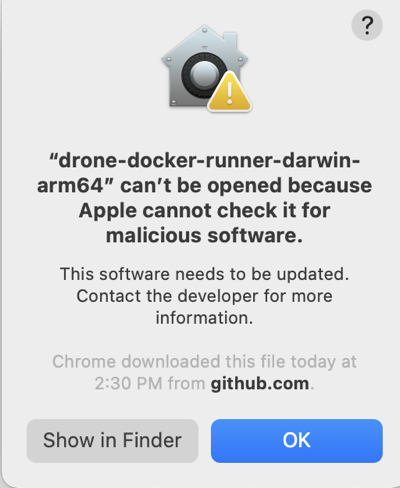

You can define a CI build infrastructure on a Linux, macOS, or Windows host by installing a Harness Docker Delegate and local Drone Runner. When the pipeline runs, the Drone Runner runs the build actions in the environment where it is installed. The delegate handles communication between Harness and the Drone Runner.

Local runner build infrastructure is recommended for small, limited builds, such as a one-off build on your local machine. Consider [other build infrastructure options](/docs/category/set-up-build-infrastructure) for builds-at-scale.

## Docker delegate requirements

The Harness Docker Delegate is limited by the total amount of memory and CPU on the local host. Builds can fail if the host runs out of CPU or memory when running multiple builds. The Harness Docker Delegate has the following system requirements:

* Default 0.5 CPU.
* Default 1.5GB. Ensure that you provide the minimum memory for the delegate and enough memory for the host/node system.
* The machine where the delegate runs must have Docker installed.

```mdx-code-block
import Tabs from '@theme/Tabs';
import TabItem from '@theme/TabItem';
```
```mdx-code-block
<Tabs>
  <TabItem value="Linux" label="Linux" default>
```
## Install the delegate

Use the following modifications along with the **Docker** instructions in [Install the default delegate on Kubernetes or Docker](/docs/platform/delegates/install-delegates/overview/):

* Add `--net=host` to the first line.
* Add `-e DELEGATE_TAGS="<delegate-tag>"`. Use the tag for your Docker environment's architecture: `linux-amd64` or `linux-arm64`.

Here's an example of an install script for Linux arm64:

```
docker run --cpus=1 --memory=2g --net=host \
  -e DELEGATE_NAME=docker-delegate \
  -e NEXT_GEN="true" \
  -e DELEGATE_TYPE="DOCKER" \
  -e ACCOUNT_ID=H5W8iol5TNWc4G9h5A2MXg \
  -e DELEGATE_TOKEN=ZWYzMjFmMzNlN2YxMTExNzNmNjk0NDAxOTBhZTUyYzU= \
  -e LOG_STREAMING_SERVICE_URL=https://app.harness.io/log-service/ \
  -e DELEGATE_TAGS="linux-arm64" \
  -e MANAGER_HOST_AND_PORT=https://app.harness.io/ harness/delegate:23.02.78306
```

Make sure to create the delegate at the appropriate scope, such as the project level or account level.

## Install the Drone Runner

The [Drone Runner](https://docs.drone.io/runner/overview/) service performs the build work. The delegate needs the runner to run CI builds.

1. Download a [Drone Runner executable](https://github.com/harness/drone-docker-runner/releases) corresponding to your build farm's OS and architecture.
2. To use self-signed certificates, export `CI_MOUNT_VOLUMES` along with a comma-separated list of source paths and destination paths formatted as `path/to/source:path/to/destination`, for example:

   ```
   export CI_MOUNT_VOLUMES="[path/to/local/cert];/etc/ssl/certs/ca-certificates.crt,[path/to/local/cert2];/etc/ssl/certs/cacerts.pem"
   ```

3. Enable execution permissions for the Runner. For example:

   ```
   sudo chmod +x drone-docker-runner-linux-arm64
   ```

4. Start the runner binary. For example:

   ```
   sudo ./drone-docker-runner-linux-arm64 server
   ```

Here is an example of the three commands to install the Linux arm64 Drone Runner with self-signed certificates:

```
export CI_MOUNT_VOLUMES="[path/to/local/cert];/etc/ssl/certs/cacerts.pem"
sudo chmod +x drone-docker-runner-linux-arm64
./drone-docker-runner-linux-arm64 server
```

```mdx-code-block
  </TabItem>
  <TabItem value="macOS" label="macOS">
```
## Install the delegate

Use the following modifications along with the **Docker** instructions in [Install the default delegate on Kubernetes or Docker](/docs/platform/delegates/install-delegates/overview/):

* Add `-e DELEGATE_TAGS="<delegate-tag>"`. Use the tag for your Docker environment's architecture: `macos-amd64` or `macos-arm64`.
* Add `-e RUNNER_URL=http://host.docker.internal:3000`.

Here's an example of an install script for macOS amd64:

```
docker run --cpus=1 --memory=2g \
  -e DELEGATE_NAME=docker-delegate \
  -e NEXT_GEN="true" \
  -e DELEGATE_TYPE="DOCKER" \
  -e ACCOUNT_ID=H5W8iol5TNWc4G9h5A2MXg \
  -e DELEGATE_TOKEN=ZWYzMjFmMzNlN2YxMTExNzNmNjk0NDAxOTBhZTUyYzU= \
  -e LOG_STREAMING_SERVICE_URL=https://app.harness.io/gratis/log-service/ \
  -e DELEGATE_TAGS="macos-amd64" \
  -e RUNNER_URL=http://host.docker.internal:3000 \
  -e MANAGER_HOST_AND_PORT=https://app.harness.io/gratis harness/delegate:23.02.78306
```

Make sure to create the delegate at the appropriate scope, such as the project level or account level.

## Install the Drone Runner

The [Drone Runner](https://docs.drone.io/runner/overview/) service performs the build work. The delegate needs the runner to run CI builds.

1. Download a [Drone Runner executable](https://github.com/harness/drone-docker-runner/releases) corresponding to your build farm's OS and architecture.
2. To use self-signed certificates, export `CI_MOUNT_VOLUMES` along with a comma-separated list of source paths and destination paths formatted as `path/to/source:path/to/destination`, for example:

   ```
   export CI_MOUNT_VOLUMES="[path/to/local/cert];/etc/ssl/certs/ca-certificates.crt,[path/to/local/cert2];/etc/ssl/certs/cacerts.pem"
   ```

3. Enable execution permissions for the Runner. For example:

   ```
   sudo chmod +x drone-docker-runner-darwin-amd64
   ```

4. Start the runner binary. For example:

   ```
   ./drone-docker-runner-darwin-amd64 server
   ```

5. If [macOS Gatekeeper](https://support.apple.com/en-us/HT202491) stops the installation because it can't check for malicious software, you need to modify **Security & Privacy** settings to allow this app to run.

   

<details>
<summary>Allow the runner binary app to run</summary>

1. Go to **System Preferences** and select **Security & Privacy**.
2. On the **General** tab, select the lock to make changes.
3. Select **Allow** next to the `an app was blocked from loading` message.
4. Select **OK**.
5. Select **Open Anyway** next to the `not from an identified developer` message.

  

6. Select **Open** to confirm that you want to run the binary. If this window doesn't appear, rerun the binary start command.

</details>

Here is an example of the three commands to install the Darwin amd64 Drone Runner with self-signed certificates:

```
export CI_MOUNT_VOLUMES="[path/to/local/cert];/etc/ssl/certs/cacerts.pem"
sudo chmod +x drone-docker-runner-darwin-arm64
./drone-docker-runner-darwin-arm64 server
```

```mdx-code-block
  </TabItem>
  <TabItem value="windows" label="Windows">
```

## Prepare machines

To configure a local runner build infrastructure for Windows, you need two machines:

* A Windows machine where the Drone Runner will run. This machine must have Docker for Windows. The Drone Runner runs as a container.
* A Linux machine where the Harness Delegate will run. This machine must have Docker. The delegate runs as a container.

There is a one-to-one relationship between Drone Runners and Harness Delegates. If you need to run three local hosts, each must have a runner and a delegate.

## Install the delegate

On the Linux machine where you want to run the delegate, use the following modifications along with the **Docker** instructions in [Install the default delegate on Kubernetes or Docker](/docs/platform/delegates/install-delegates/overview/):

* Add `-e DELEGATE_TAGS="windows-amd64"`.
* Add `-e RUNNER_URL=http://[windows_machine_hostname_or_ip]:3000`.

:::caution

The `RUNNER_URL` must point to the Windows machine where the Drone Runner will run.

:::

Here's an example of the delegate install script for a local runner Windows build infrastructure:

```
docker run --cpus=1 --memory=2g \
  -e DELEGATE_NAME=docker-delegate \
  -e NEXT_GEN="true" \
  -e DELEGATE_TYPE="DOCKER" \
  -e ACCOUNT_ID=H5W8iol5TNWc4G9h5A2MXg \
  -e DELEGATE_TOKEN=ZWYzMjFmMzNlN2YxMTExNzNmNjk0NDAxOTBhZTUyYzU= \
  -e LOG_STREAMING_SERVICE_URL=https://app.harness.io/gratis/log-service/ \
  -e DELEGATE_TAGS="windows-amd64" \
  `-e RUNNER_URL=http://[windows_machine_hostname_or_ip]:3000` \
  -e MANAGER_HOST_AND_PORT=https://app.harness.io/gratis harness/delegate:23.02.78306
```

Make sure to create the delegate at the appropriate scope, such as the project level or account level.

## Install the Drone Runner

The [Drone Runner](https://docs.drone.io/runner/overview/) service performs the build work. The delegate needs the runner to run CI builds.

:::caution

Run the Drone Runner executable on the Windows machine that you specified in the delegate's `RUNNER_URL`.

Use PowerShell to run these commands.

:::

1. On the target Windows machine where you want to run the Drone Runner, download the Windows [Drone Runner executable](https://github.com/harness/drone-docker-runner/releases).
2. Open a terminal with Administrator privileges.
3. To use self-signed certificates, set `CI_MOUNT_VOLUMES` along with a comma-separated list of source paths and destination paths formatted as `path/to/source:path/to/destination`, for example:

   ```
   $env:CI_MOUNT_VOLUMES="C:\Users\installer\Downloads\certs;C:/Users/ContainerAdministrator/.jfrog/security/certs"
   ```

   With Windows, volume mapping must be folder-to-folder.

4. Run the following command to start the runner binary:

   ```
   drone-docker-runner-windows-amd64.exe server
   ```

Here is an example of the two commands to install the Windows amd64 Drone Runner with self-signed certificates:

```
$env:CI_MOUNT_VOLUMES="C:\Users\installer\Downloads\certs;C:/Users/ContainerAdministrator/.jfrog/security/certs"
drone-docker-runner-windows-amd64.exe server
```

```mdx-code-block
  </TabItem>
</Tabs>
```

## Set the pipeline's build infrastructure

Edit the CI pipeline where you want to use the local runner build infrastructure.

```mdx-code-block
import Tabs2 from '@theme/Tabs';
import TabItem2 from '@theme/TabItem';
```
```mdx-code-block
<Tabs2>
  <TabItem2 value="Visual" label="Visual" default>
```

1. In the pipeline's **Build** stage, select the **Infrastructure** tab.
2. Select **Local** for the **Infrastructure**.
3. Select the relevant **Operating System** and **Architecture**.
4. Save your pipeline.

```mdx-code-block
  </TabItem2>
  <TabItem2 value="YAML" label="YAML">
```

In the pipeline's build stage (`type: CI`), insert `platform` and `runtime` specifications, for example:

```yaml
    - stage:
        name: build
        identifier: build
        description: ""
        type: CI
        spec:
          cloneCodebase: true
          platform:
            os: Linux
            arch: Amd64
          runtime:
            type: Docker
            spec: {}
```

* `platform`:
  * `os`: Specify `Linux`, `MacOS`, or `Windows`
  * `arch`: Specify `Amd64` or `Arm64`
* `runtime`:
  * `type`: `Docker`
  * `spec`: `{}`

```mdx-code-block
  </TabItem2>
</Tabs2>
```

:::tip

Although you must install a delegate to use the local runner build infrastructure, you can choose to use a different delegate for executions and cleanups in individual pipelines or stages. To do this, use [pipeline-level delegate selectors](/docs/platform/Delegates/manage-delegates/select-delegates-with-selectors#pipeline-delegate-selector) or [stage-level delegate selectors](/docs/platform/Delegates/manage-delegates/select-delegates-with-selectors#stage-delegate-selector).

Delegate selections take precedence in the following order:

1. Stage
2. Pipeline
3. Platform (build machine delegate)

This means that if delegate selectors are present at the pipeline and stage levels, then these selections override the platform delegate, which is the delegate that you installed on the build machine. If a stage has a stage-level delegate selector, then it uses that delegate. Stages that don't have stage-level delegate selectors use the pipeline-level selector, if present, or the platform delegate.

For example, assume you have a pipeline with three stages called `alpha`, `beta`, and `gamma`. If you specify a stage-level delegate selector on `alpha` and you don't specify a pipeline-level delegate selector, then `alpha` uses the stage-level delegate, and the other stages (`beta` and `gamma`) use the platform delegate.

:::

## Troubleshooting

The delegate should connect to your instance after you finish the installation workflow above. If the delegate does not connect after a few minutes, run the following commands to check the status:

```
docker ps
docker logs --follow <docker-delegate-container-id>
```

The container ID should be the container with image name `harness/delegate:latest`.

Successful setup is indicated by a message such as `Finished downloading delegate jar version 1.0.77221-000 in 168 seconds`.
