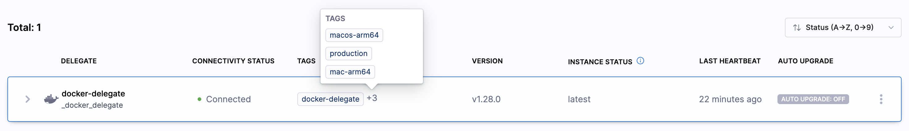

import Tabs from '@theme/Tabs';
import TabItem from '@theme/TabItem';

<style>
{`
  .tabs--full-width {
    width: 100%;
  }
  .tabs--full-width .tabs__item {
    flex: 1;
    text-align: center;
    justify-content: center;
  }
`}
</style>

:::warning Closed Beta

Delegate 2.0 is currently in closed beta, and is available for select customers only. Access is determined by the product team, and is based on current [supported use cases and steps](#whats-supported).

:::

This guide describes how to install the new Harness Delegate to local machines. Skip to the [End to End Demo](#end-to-end-demo) if you want to watch video instructions for the new delegate installation.

:::info Important

Harness Delegate 2.0 is under **Beta** and can only be used for Mac Build, Android Build, and CI Stage Pipelines with limited sets of steps and connector support.

:::

## What's Supported

### Supported Connectors

| Connector          | Caveats                                                                 |
|--------------------|-------------------------------------------------------------------------|
| Docker Registry    | Only the DockerHub provider type                                        |
| Github             | Does not work with Github App OAuth.                                    |
| HashiCorp Vault    | Only AppRole and Token Auth; set Renewal Interval to 0 (zero)           |
| AWS Secrets Manager| Only Access Key and IAM Role Credential Type                            |

### Supported CI Steps

| Step Name  | Caveats              |
|------------|----------------------|
| Git Clone  | Only for Github      |
| Run        |                      |

## Delegate Installation Instructions

## Quick Reference

| Command | Description |
|---------|-------------|
| `./delegate install` | Install and register the service |
| `./delegate start` | Start the delegate service |
| `./delegate stop` | Stop the service gracefully |
| `./delegate status` | Show delegate status and details |
| `./delegate uninstall` | Uninstall service (preserves config/logs) |

**Important file locations:**

| OS | Config File | Logs | Service Definition |
|----|-------------|------|-------------------|
| **MacOS** | `~/.harness-delegate/config.env` | `~/.harness-delegate/logs/` | `~/Library/LaunchAgents/harness-delegate.plist` |
| **Linux** | `./config.env` | `./nohup-delegate.out` | N/A (runs in foreground/background) |
| **Windows** | `C:\HarnessDelegate\config.env` | `C:\HarnessDelegate\logs\` | Windows Service Control Manager |

---

### Get Harness Credentials

Before installation, obtain your Account ID, Delegate Token, and Harness URL:

<Tabs className="tabs--full-width">
<TabItem value="Interactive Guide">

<DocVideo src="https://app.tango.us/app/embed/Get-Delegate-2-0-Credentials-41d069778e3e421d8791dd4dcc8ab793" title="Get Credentials for Delegate 2.0" />

</TabItem>
<TabItem value="Step-by-Step" default>

1. In the left nav, click **Project Settings**.
2. Under **Project-level Resources**, click **Delegates**.
3. Click **+ New Delegate**.
4. Choose **Docker** as your delegate type.
5. Copy the values from the `docker run` command:
   - `ACCOUNT_ID` → Your Account ID
   - `DELEGATE_TOKEN` → Your Delegate Token  
   - `MANAGER_HOST_AND_PORT` → Your Harness URL

   

:::tip
Keep these values ready - you'll use them in the installation command.
:::

</TabItem>
</Tabs>

### Download and Install the Delegate

Download and install the correct binary for your OS.

<Tabs className="tabs--full-width">
<TabItem value="MacOS">

:::info
The delegate runs as a user service (LaunchAgent), not a system service. It only runs when you're logged in. Enable auto-login (see step 5) to ensure it starts after system reboots.
:::

1. **Download the delegate binary**

   Replace `<VERSION>` with the latest version (e.g., `1.28.0`):

   For **arm64** (Apple Silicon):
   ```bash
   curl -L "https://app.harness.io/public/shared/delegates/<VERSION>/delegate-darwin-arm64" -o delegate
   chmod +x delegate
   ```

   For **amd64** (Intel):
   ```bash
   curl -L "https://app.harness.io/public/shared/delegates/<VERSION>/delegate-darwin-amd64" -o delegate
   chmod +x delegate
   ```

   Example using version 1.28.0:
   ```bash
   curl -L "https://app.harness.io/public/shared/delegates/1.28.0/delegate-darwin-arm64" -o delegate
   ```

2. **Install the delegate with your credentials**

   Run the install command with the credentials you obtained from the [previous step](#get-harness-credentials):

   ```bash
   ./delegate install --account=[Your Account ID] \
                      --token=[Your Delegate Token] \
                      --url=[Your Harness URL] \
                      --name=[Your Delegate Name]
   ```

   :::info
   If you don't specify a name, the delegate will default to `harness-delegate`.
   :::

   **Optional: Add tags for delegate selection**
   
   Tags are optional but useful for routing specific pipelines to this delegate:
   
   ```bash
   ./delegate install --account=[Your Account ID] \
                      --token=[Your Delegate Token] \
                      --url=[Your Harness URL] \
                      --name=[Your Delegate Name] \
                      --tags="production,macos"
   ```

   <details>
   <summary>View all available installation options</summary>

   ```bash
   ./delegate install --help
   ```

   Available options:
   - `--account` - Your Harness account ID **(required)**
   - `--token` - Delegate authentication token **(required)**
   - `--url` - Harness server URL **(required)**
   - `--name` - Custom delegate name (default: `harness-delegate`)
   - `--tags` - Comma-separated tags for delegate selection (optional)
   - `--env-file` - Path to config file (default: `~/.harness-delegate/config.env`)
   - `--graceful-exit-timeout` - Shutdown timeout in seconds (default: 300)
   - `--auto-restart-on-failure` - Auto-restart on failure (default: true) 

   </details>

   **What this command creates:**
   - Workspace directory: `~/.harness-delegate`
   - Configuration file: `~/.harness-delegate/config.env`
   - LaunchAgent service: `~/Library/LaunchAgents/harness-delegate.plist`

3. **Start the delegate service**

   ```bash
   ./delegate start
   ```

   You should see a success message with the config location and log file path.

   

4. **Verify the delegate is running**

   Check the status:

   ```bash
   ./delegate status
   ```

   

   View logs in real-time:

   ```bash
   tail -f ~/.harness-delegate/logs/delegate.log
   ```

   Navigate to **Project Settings** > **Delegates** in Harness UI. You should see your delegate with a **Connected** status.

   

5. **Enable auto-login (Recommended)**

   Since the delegate runs as a user service, enable auto-login to ensure it starts after system reboots:

   1. Open **System Settings** (or **System Preferences** on older macOS)
   2. Go to **Users & Groups**
   3. Click the lock icon and authenticate
   4. Select **Login Options**
   5. Set **Automatic login** to your user account

#### Additional Configuration

**Update delegate settings:**

1. Stop the service: `./delegate stop`
2. Edit the config: `nano ~/.harness-delegate/config.env`
3. Start the service: `./delegate start`

**Proxy configuration:**

If you need proxy settings, add them to `~/.harness-delegate/config.env`. See [Configure Delegate Proxy Settings](/docs/platform/delegates/manage-delegates/configure-delegate-proxy-settings).

**Manual plugin installation:**

Some CI steps can run directly on the host. Harness automatically downloads required plugins, but manual installation is needed when your infrastructure lacks internet connectivity (e.g., behind a proxy or firewall).

To manually install a plugin:

1. Download the plugin from its source (e.g., [drone-git v1.7.6](https://github.com/wings-software/drone-git/releases/tag/v1.7.6))
2. Decompress: `zstd -d plugin-darwin-arm64.zst` (or `plugin-darwin-amd64.zst` for Intel)
3. Move to plugins directory:
   ```bash
   mkdir -p ~/.harness-delegate/default/plugin/drone-git/
   mv plugin-darwin-* ~/.harness-delegate/default/plugin/drone-git/
   chmod +x ~/.harness-delegate/default/plugin/drone-git/plugin-darwin-*
   ```

#### Manage the Delegate

**Stop:** `./delegate stop` - Gracefully shuts down (waits up to 5 minutes for tasks to complete)

**Uninstall:** `./delegate uninstall` - Removes service registration (preserves config, logs, and binary)

**Upgrade:**
1. Download new binary (replace existing `delegate` file)
2. `./delegate stop`
3. `./delegate start`

</TabItem>

<TabItem value="Linux">

1. **Download the delegate binary**

   For **arm64**:
   ```bash
   curl -L "https://app.harness.io/public/shared/delegates/1.28.0/delegate-linux-arm64" -o delegate
   chmod +x delegate
   ```

   For **amd64**:
   ```bash
   curl -L "https://app.harness.io/public/shared/delegates/1.28.0/delegate-linux-amd64" -o delegate
   chmod +x delegate
   ```

2. **Create configuration file**

   Create a `config.env` file with the credentials you obtained from the [previous step](#get-harness-credentials):

   ```bash
   cat > config.env <<EOF
   HARNESS_ACCOUNT_ID="[Your Account ID]"
   HARNESS_TOKEN="[Your Delegate Token]"
   HARNESS_URL="[Your Harness URL]"
   HARNESS_NAME="[Your Delegate Name]"
   EOF
   ```

   :::info
   If you don't specify `HARNESS_NAME`, the delegate will default to `harness-delegate`.
   :::

   **Optional: Add tags**
   
   Tags are optional but useful for routing specific pipelines:
   
   ```bash
   cat > config.env <<EOF
   HARNESS_ACCOUNT_ID="[Your Account ID]"
   HARNESS_TOKEN="[Your Delegate Token]"
   HARNESS_URL="[Your Harness URL]"
   HARNESS_NAME="[Your Delegate Name]"
   HARNESS_TAGS="production,linux"
   EOF
   ```

3. **Start the delegate**

   Run in the background:

   ```bash
   nohup ./delegate server --env-file config.env > nohup-delegate.out 2>&1 &
   ```

4. **Verify the delegate is running**

   Check the logs:

   ```bash
   tail -f nohup-delegate.out
   ```

   Navigate to **Project Settings** > **Delegates** in Harness UI. You should see your delegate with a **Connected** status.

#### Additional Configuration

**Proxy configuration:**

If you need proxy settings, add them to `config.env`. See [Configure Delegate Proxy Settings](/docs/platform/delegates/manage-delegates/configure-delegate-proxy-settings).

**Manual plugin installation:**

Some CI steps can run directly on the host. Harness automatically downloads required plugins, but manual installation is needed when your infrastructure lacks internet connectivity (e.g., behind a proxy or firewall).

To manually install a plugin:

1. Download the plugin from its source (e.g., [drone-git v1.7.6](https://github.com/wings-software/drone-git/releases/tag/v1.7.6))
2. Decompress: `zstd -d plugin-linux-arm64.zst` (or `plugin-linux-amd64.zst`)
3. Move to plugins directory:
   ```bash
   mkdir -p ./default/plugin/drone-git/
   mv plugin-linux-* ./default/plugin/drone-git/
   chmod +x ./default/plugin/drone-git/plugin-linux-*
   ```

#### Manage the Delegate

**Stop:** Find and kill the process using `ps` and `kill` commands

**Upgrade:**
1. Download new binary (replace existing `delegate` file)
2. Kill the existing process
3. Start with the command from step 3

</TabItem>
<TabItem value="Windows">

:::info
The delegate runs under the LocalSystem account.
:::

1. **Download the delegate binary**

   Open **PowerShell as Administrator**:
   - Press **Windows Key + X**
   - Select **"Windows PowerShell (Admin)"** or **"Terminal (Admin)"**

   Replace `<VERSION>` with the latest version (e.g., `1.28.0`):

   ```powershell
   Invoke-WebRequest -Uri "https://app.harness.io/public/shared/delegates/<VERSION>/delegate-windows-amd64.exe" -o delegate
   ```

   :::note
   In Command Prompt, use: `curl -L "https://app.harness.io/public/shared/delegates/<VERSION>/delegate-windows-amd64.exe" -o delegate`
   :::

2. **Install the delegate with your credentials**

   Run the install command with the credentials you obtained from the [previous step](#get-harness-credentials):

   ```powershell
   .\delegate install --account=[Your Account ID] `
                          --token=[Your Delegate Token] `
                          --url=[Your Harness URL] `
                          --name=[Your Delegate Name]
   ```

   :::info
   If you don't specify a name, the delegate will default to `harness-delegate`.
   :::

   **Optional: Add tags for delegate selection**
   
   Tags are optional but useful for routing specific pipelines to this delegate:
   
   ```powershell
   .\delegate install --account=[Your Account ID] `
                     --token=[Your Delegate Token] `
                     --url=[Your Harness URL] `
                     --name=[Your Delegate Name] `
                     --tags="production,windows"
   ```

   <details>
   <summary>View all available installation options</summary>

   ```powershell
   .\delegate install --help
   ```

   Available options:
   - `--account` - Your Harness account ID **(required)**
   - `--token` - Delegate authentication token **(required)**
   - `--url` - Harness server URL **(required)**
   - `--name` - Custom delegate name (default: `harness-delegate`)
   - `--tags` - Comma-separated tags for delegate selection (optional)
   - `--env-file` - Path to config file (default: `C:\HarnessDelegate\config.env`)
   - `--auto-restart-on-failure` - Auto-restart on failure (default: true)

   </details>

   **What this command creates:**
   - Workspace directory: `C:\HarnessDelegate`
   - Configuration file: `C:\HarnessDelegate\config.env`
   - Windows service registered in Service Control Manager

3. **Start the delegate service**

   ```powershell
   .\delegate start
   ```

   You should see a success message with the config location and log file path.

4. **Verify the delegate is running**

   Check the status:

   ```powershell
   .\delegate status
   ```

   Or use Windows native commands:

   ```powershell
   Get-Service "harness-delegate"
   ```

   View logs in real-time:

   ```powershell
   Get-Content -Path "C:\HarnessDelegate\logs\delegate.log" -Tail 10 -Wait
   ```

   Navigate to **Project Settings** > **Delegates** in Harness UI. You should see your delegate with a **Connected** status.

#### Additional Configuration

**Update delegate settings:**

1. Stop the service: `.\delegate stop`
2. Edit the config: `notepad C:\HarnessDelegate\config.env`
3. Start the service: `.\delegate start`

**Proxy configuration:**

If you need proxy settings, add them to `C:\HarnessDelegate\config.env`. See [Configure Delegate Proxy Settings](/docs/platform/delegates/manage-delegates/configure-delegate-proxy-settings).

**Manual plugin installation:**

Some CI steps can run directly on the host. Harness automatically downloads required plugins, but manual installation is needed when your infrastructure lacks internet connectivity (e.g., behind a proxy or firewall).

To manually install a plugin:

1. Download the plugin from its source (e.g., [drone-git v1.7.6](https://github.com/wings-software/drone-git/releases/tag/v1.7.6))
2. Decompress: `zstd.exe -d plugin-windows-amd64.zst -o plugin-windows-amd64.exe`
3. Move to plugins directory:
   ```powershell
   New-Item -ItemType Directory -Force -Path "C:\HarnessDelegate\default\plugin\drone-git\"
   Move-Item plugin-windows-amd64.exe "C:\HarnessDelegate\default\plugin\drone-git\"
   ```

#### Manage the Delegate

**Stop:** `.\delegate stop` - The service will auto-start on system reboot

**Uninstall:** `.\delegate uninstall` - Removes service registration (preserves config, logs, and binary)

**Upgrade:**
1. Download new binary (replace existing `delegate` file)
2. `.\delegate stop`
3. `.\delegate start`

</TabItem>

</Tabs>
---

Navigate to **Project Settings** > **Delegates**. You should see your new delegate in the delegates list.

:::info

If you don't set a name for your delegate, it will default to `harness-delegate`

:::

### Configure Pipeline Delegate

For the CI stages that you want to use the new delegate with, [define the stage variable](/docs/platform/variables-and-expressions/add-a-variable/#define-variables) `HARNESS_CI_INTERNAL_ROUTE_TO_RUNNER` and set it to `true`.

Then, in order for the pipeline to select this delegate, [set your pipeline's build infrastructure](/docs/continuous-integration/use-ci/set-up-build-infrastructure/define-a-docker-build-infrastructure#set-the-pipelines-build-infrastructure) as normal.

Most importantly, ensure that you have set `Local` as the **Infrastructure** and that the **Operating System** and **Architecture** match the delegate you installed in the [download and install delegate step](#download-and-install-the-delegate).

## Delegate Configuration

The `config.env` file location for each operating system:
- **MacOS**: `~/.harness-delegate/config.env`
- **Linux**: `./config.env` (in the directory where you created it)
- **Windows**: `C:\HarnessDelegate\config.env`

### Set Max Stage Capacity

With Harness Delegate 2.0, you can configure a limit for the maximum number of stages the delegate will be executing at a given time. When the delegate is handling tasks at full capacity, new tasks will be queued and picked up once the delegate's capacity is freed.

In order to configure a max limit for number of stages executed by a delegate, you should add a `MAX_STAGES` variable in the delegate's `config.env` file. The value of the `MAX_STAGES` should be a positive integer.

#### Example config.env

If you wanted the delegate to only execute up to 5 stages a time, set `MAX_STAGES=5`. For example:

```
ACCOUNT_ID="<ACCOUNT_ID>"
TOKEN="<DELEGATE_TOKEN>"
TAGS="<your delegate tags>"
URL="<MANAGER_HOST_AND_PORT>"
NAME="<your delegate name>"
...
MAX_STAGES=5
```

### Set Graceful Shutdown

With Harness Delegate 2.0, you can configure a grace period to allow for a clean shutdown of running containers and processes when a pipeline execution is aborted. This ensures that any resources started by the pipeline are given time to terminate gracefully before being forcefully removed.

To configure this grace period, add the `CLEANUP_GRACE_PERIOD_SECONDS` variable to the delegate's config.env file. The value should be a non-negative integer representing the number of seconds to wait before forcefully terminating resources.

If the grace period is set to 0 (default), the delegate will immediately send a SIGKILL signal to stop containers and processes. If a positive value is configured, the delegate will first send a SIGTERM signal. After the grace period expires, any resources that are still running will be terminated with a SIGKILL.

#### Example config.env

If you want the delegate to wait up to 30 seconds before forcefully stopping any running containers or processes, set `CLEANUP_GRACE_PERIOD_SECONDS=30`. For example:

```
ACCOUNT_ID="<ACCOUNT_ID>"
TOKEN="<DELEGATE_TOKEN>"
TAGS="<your delegate tags>"
URL="<MANAGER_HOST_AND_PORT>"
NAME="<your delegate name>"
...
CLEANUP_GRACE_PERIOD_SECONDS=30
```

## Debugging

### Logs

You can find the delegate logs in the following locations:
- **MacOS**: `~/.harness-delegate/logs/delegate.log`
- **Linux**: `./nohup-delegate.out` (in the directory where you started the delegate)
- **Windows**: `C:\HarnessDelegate\logs\delegate.log`

#### Log File Configuration

The delegate supports automatic log rotation and sanitization. Configure these using environment variables in your `config.env`:

```bash
# Enable/disable file logging
LOG_ENABLE_FILE_LOGGING=true

# Custom log file path (optional)
LOG_FILE_PATH=/custom/path/to/delegate.log

# Log rotation settings
LOG_MAX_SIZE_MB=100        # Rotate at 100MB
LOG_MAX_BACKUPS=3          # Keep 3 old files
LOG_MAX_AGE_DAYS=28        # Delete after 28 days
LOG_COMPRESS=false         # Compress rotated logs
```

**View logs in real-time:**

MacOS:
```bash
tail -f ~/.harness-delegate/logs/delegate.log
```

Linux:
```bash
tail -f nohup-delegate.out
```

Windows:
```powershell
Get-Content -Path "C:\HarnessDelegate\logs\delegate.log" -Tail 20 -Wait
```

### Metrics

Delegate 2.0 exposes metrics on the `/metrics` endpoint for monitoring and observability. By default, the metrics endpoint is available at `http://localhost:3000/metrics`.

## End to End Demo

This video walks through an end to end demo of the delegate installation, including usage and a pipeline execution.

<DocVideo src="https://www.loom.com/share/1e292d0f51004882bfd5462ef0553222?sid=487e23cb-28fc-4d2e-ac66-07197fa7dafe" />

