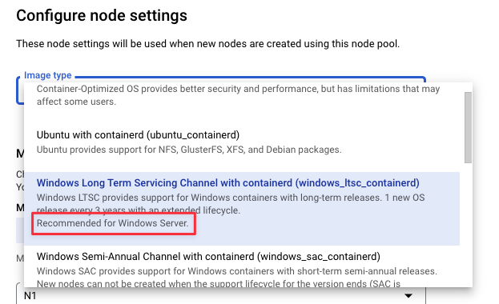
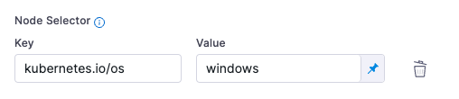

You can run Windows builds in your Kubernetes build infrastructure. Windows Server 2019 images are available for running CI Builds and for out-of-the-box CI steps such as Run, Save, and Restore.

## Important notes

* The following steps aren't supported on Windows platforms on Kubernetes cluster build infrastructures: **Build and Push an image to Docker Registry**, **Build and Push to ECR**, and **Build and Push to GCR**. Try using the [buildah plugin](../../build-and-upload-artifacts/build-and-push-nonroot.md) instead.
* **Docker commands aren't supported.** If your build process needs to run Docker commands, [Docker-in-Docker (DinD) with privileged mode](../../run-ci-scripts/run-docker-in-docker-in-a-ci-stage.md) is necessary when using a Kubernetes cluster build infrastructure; however, Windows doesn't support privileged mode. If you need to run Docker commands, you must use another build infrastructure, such as [Harness Cloud](../use-harness-cloud-build-infrastructure.md) or a [VM build infrastructure](/docs/category/set-up-vm-build-infrastructures), where you can run Docker commands directly on the host.

## Windows Server 2019 is required

Only Windows Server 2019 images are supported.

With Amazon EKS, the [AMI](https://docs.aws.amazon.com/AWSEC2/latest/WindowsGuide/aws-windows-ami.html) type must be [Windows Server Core](https://hub.docker.com/_/microsoft-windows-servercore).

With GKS, use the recommended image type for Windows Server 2019.



## Configure cluster and build infrastructure

1. Set up your cluster with both Linux and Windows node pools. Linux is required for running the Delegate.
2. [Install the Delegate](https://developer.harness.io/docs/platform/delegates/delegate-concepts/delegate-overview) on the Linux node pool by specifying the Linux node pool selector. For example, on GKE the Linux node pool label is `kubernetes.io/os: linux` and the Windows node pool label is `kubernetes.io/os: windows`. The selectors are automatically set up on the nodes.
3. In your pipeline's **Build** stage, go to the **Infrastructure** tab and configure the following settings:
   1. Select **Windows** for the **OS**.
   2. Expand the **Advanced** section, and add a **Node Selector** to use the Windows node pool. Enter `kubernetes.io/os` as the **Key** and `windows` as the **Value**.

  

4. Save and run your pipeline.

:::info

If you use a custom Windows image in a Run step, the container must be based on [Windows Server Core](https://hub.docker.com/_/microsoft-windows-servercore) version 1809 and must include `netapi32.dll`. To include this in your image, add the following command to the Dockerfile:

```
COPY --from=core /windows/system32/netapi32.dll /windows/system32/netapi32.dll
```

:::

### YAML example

This example pipeline runs on a Windows platform on a Kubernetes cluster build infrastructure. Note the presence of `os` and `nodeSelector` in `stage.spec.infrastructure.spec`.

```yaml
pipeline:  
  name: WindowsK8  
  identifier: WindowsK8  
  projectIdentifier: myproject  
  orgIdentifier: default  
  tags: {}  
  properties:  
    ci:  
      codebase:  
        connectorRef: $GITHUB_CONNECTOR  
        repoName: testing-flask-with-pytest  
        build: <+input>  
  stages:  
    - stage:  
        name: Build and Test  
        identifier: Build_and_Test  
        type: CI  
        spec:  
          cloneCodebase: true  
          infrastructure:  
            type: KubernetesDirect  
            spec:  
              connectorRef: $K8S_CONNECTOR  
              namespace: harness-delegate-ng  
              automountServiceAccountToken: true  
              nodeSelector:  
                kubernetes.io/os: windows  
              os: Windows  
          execution:  
            steps:  
              - step:  
                  type: Run  
                  name: helloWorld  
                  identifier: Pre  
                  spec:  
                    connectorRef: $DOCKERHUB_CONNECTOR  
                    image: winamd64/python  
                    shell: Powershell  
                    command: "Write-Host \"hello world\" "
```
