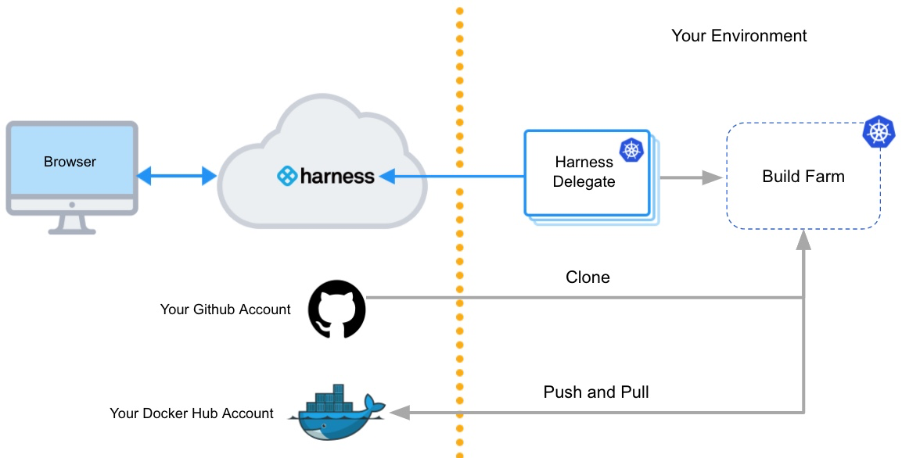

import Tabs from '@theme/Tabs';
import TabItem from '@theme/TabItem';

<DocsTag  text="Team plan" link="/docs/continuous-integration/ci-quickstarts/ci-subscription-mgmt" /> <DocsTag  text="Enterprise plan" link="/docs/continuous-integration/ci-quickstarts/ci-subscription-mgmt" />

You can use a Kubernetes cluster build infrastructure for **Build** stages in Harness CI pipelines. To do this, you need to:

<!-- no toc -->
1. [Set up the Kubernetes cluster to use as your build infrastructure.](#create-a-kubernetes-cluster)
2. [Create a Kubernetes cluster connector and install the Harness Delegate.](#create-a-kubernetes-cluster-connector-and-install-the-delegate)
3. [Configure the build infrastructure in Harness.](#configure-the-build-infrastructure-in-harness)

<details>
<summary>Architecture diagram</summary>

The following diagram shows the architecture of a kubernetes cluster build infrastructure. You interact with the Harness Platform through your browser. The Harness Delegate, which is installed in your Kubernetes cluster, manages communication between the Harness Platform and the Kubernetes pod where the pipeline's build farm is running. While the pipeline runs, the build farm communicates with your codebase, such as GitHub, and container registry, such as Docker Hub.



You must install the Harness Delegate in the same cluster you use for the build farm. The Delegate creates the namespace `harness-delegate`, and you use that namespace for both the Delegate and build farm. You can change the namespace name if you like.

</details>

<details>
<summary>Video summary</summary>

Here's a short video that walks you through adding a Harness Kubernetes Cluster connector and Harness Kubernetes delegate. The delegate is added to the target cluster, then the Kubernetes Cluster connector uses the delegate to connect to the cluster.

<DocVideo src="https://www.youtube.com/embed/wUC23lmqfnY?feature=oembed" />

</details>

For a step-by-step guide, go to [Tutorial - Build and test on a Kubernetes cluster build infrastructure](/docs/continuous-integration/use-ci/set-up-build-infrastructure/k8s-build-infrastructure/tutorial-ci-kubernetes-build-infra).

## Create a Kubernetes cluster

Create a Kubernetes cluster to use for builds. For instructions on creating clusters, go to:

- [Creating a cluster in Kubernetes](https://kubernetes.io/docs/tutorials/kubernetes-basics/create-cluster/)
- [Creating a cluster in GKE (Google Kubernetes Engine)](https://cloud.google.com/kubernetes-engine/docs/how-to/creating-a-zonal-cluster)

Make sure your Kubernetes cluster meets the following requirements:

* The cluster has sufficient memory and CPU to support the resources required by your builds *and* the Harness Delegate. The delegate is an agent between Harness and your cluster that you will install on the cluster as part of the process to configure this build infrastructure.
* The cluster meets the [CI cluster requirements](/docs/platform/connectors/cloud-providers/ref-cloud-providers/kubernetes-cluster-connector-settings-reference.md#harness-ci-cluster-requirements).
* The cluster has the [roles and policies required for builds](/docs/platform/connectors/cloud-providers/ref-cloud-providers/kubernetes-cluster-connector-settings-reference.md#roles-and-policies-for-the-connector).
* If required for your builds, the cluster supports [privileged mode for Docker-in-Docker](#docker-in-docker-requires-privileged-mode) and allows [root access for Build and Push steps](#build-and-push-steps-require-root-access).
* If you use Istio MTLS Strict mode, you [added a headless service](#create-headless-service-for-istio-mtls-strict-mode).
* Port 20001 needs to be open on the Kubernetes infrastructure because the Harness delegate communicates with the Lite Engine using this port.

### Docker-in-Docker requires privileged mode

If your build process needs to run Docker commands, [Docker-in-Docker (DinD) with privileged mode](../../manage-dependencies/run-docker-in-docker-in-a-ci-stage.md) is necessary when using a Kubernetes cluster build infrastructure.

If your Kubernetes cluster doesn't support privileged mode, you'll need to use another build infrastructure, such as [Harness Cloud](../use-harness-cloud-build-infrastructure.md) or a [VM build infrastructure](/docs/category/set-up-vm-build-infrastructures). Other infrastructure types allow you to run Docker commands directly on the host.

### Build and Push steps require root access

With Kubernetes cluster build infrastructures, [Build and Push steps](/docs/continuous-integration/use-ci/build-and-upload-artifacts/build-and-upload-an-artifact) use [kaniko](https://github.com/GoogleContainerTools/kaniko/blob/main/README.md). Kaniko requires root access to build the Docker image. It doesn't support non-root users.

If your build [runs as non-root](#run-as-non-root-or-a-specific-user), you can run individual **Build and Push** steps as root by setting **Run as User** to `0` on a specific **Build and Push** step to use the root user for that individual step only.

If your security policy doesn't allow running as root, you can use the Builah plugin to [build and push with non-root users](/docs/continuous-integration/use-ci/build-and-upload-artifacts/build-and-push-nonroot.md) instead of the built-in **Build and Push** steps.

### Create headless service for Istio MTLS STRICT mode

If you use [Istio MTLS STRICT mode](https://istio.io/latest/docs/tasks/security/authentication/authn-policy/#globally-enabling-istio-mutual-tls-in-strict-mode), you need to add a [headless service](https://kubernetes.io/docs/concepts/services-networking/service/#headless-services) to the Kubernetes namespace where you will install the Harness Delegate. For example:

```yaml
apiVersion: v1
kind: Service
metadata:
  name: headless
spec:
  clusterIP: None
  selector:
    accountID: HARNESS_ACCOUNT_ID
  ports:
    - protocol: TCP
      port: 20001
      targetPort: 20001
```

#### Istio ProxyConfig

If the delegate is unable to connect to the created build farm with Istio MTLS STRICT mode, and you see that the pod is removed after a few seconds, you might need to add [Istio ProxyConfig](https://istio.io/latest/docs/reference/config/istio.mesh.v1alpha1/#ProxyConfig) with `"holdApplicationUntilProxyStarts": true`.

This setting delays application start until the pod is ready to accept traffic so that the delegate doesn't attempt to connect before the pod is ready. to do this, it injects the sidecar at the start of the pod's container list and configures it to block all other containers from starting until the proxy is ready.

You can add the Istio ProxyConfig as a pod annotation, for example:

```
proxy.istio.io/config: '{ "holdApplicationUntilProxyStarts": true }'
```

### GKE Autopilot is not recommended

We don't recommend using Harness CI with GKE Autopilot due to Docker-in-Docker limitations and potential cloud cost increases.

Autopilot clusters do not allow privileged pods, which means you can't use [Docker-in-Docker](../../manage-dependencies/run-docker-in-docker-in-a-ci-stage.md) to run Docker commands, since these require privileged mode.

Additionally, GKE Autopilot sets resource limits equal to resource requests for each container. This can cause your builds to allocate more resources than they need, resulting in higher cloud costs with no added benefit.

<details>
<summary>GKE Autopilot cloud cost demonstration</summary>

Consider the following CI stage:


Assume that you configure your stage resources as follows:

- Redis (service dependency in Background step): 5GB, 2 CPU
- s1 step: 2GB, 2 CPU
- s2 step: 3GB, 1 CPU
- s3 step: 4GB, 1 CPU
- s4 step: 2GB, 1 CPU
- s5 step: 2GB, 1 CPU

Kubernetes would allocate a pod based on the maximum requirements for the overall stage. In this example, the peak requirement is when the s3, s4, and s5 steps run in parallel. The pod also needs to run the Redis service at the same time. The total maximum requirements are the sum of Redis + s3 + s4 + s5:

- 5 + 4 + 2 + 2 = **13GB Memory**
- 2 + 1 + 1 + 1 = **5 CPUs**

GKE Autopilot calculates resource requirements differently. For containers, it sets resource limits equivalent to resource requests. For pods, it sums all step requirements in the stage, whether they're running in parallel or not. In this example, the total maximum requirements are the sum of Redis + s1 + s2 + s3 + s4 + s5:

- 5 + 2 + 2+ 4 + 4 + 4 = **17GB Memory**
- 2 + 1 + 1+ 1 + 1 + 1 = **7 CPUs**

Autopilot might be cheaper than standard Kubernetes if you only run builds occasionally. This can result in cost savings because some worker nodes are always running in a standard Kubernetes cluster. If you're running builds more often, Autopilot can increase costs unnecessarily.

</details>

## Create a Kubernetes cluster connector and install the delegate

A [Kubernetes Cluster connector](/docs/platform/connectors/cloud-providers/add-a-kubernetes-cluster-connector) creates a connection between Harness and your Kubernetes cluster. This connector works through a Harness Delegate that you will install on a pod in your cluster.

1. In a Harness CI project, select **Connectors** under **Project Settings**.
2. Select **New Connector**, and then select **Kubernetes cluster**.
3. Enter a name for the connector and select **Continue**.
4. Select **Use the credentials of a specific Harness Delegate**, and then select **Continue**.
5. Select **Install new Delegate**.
6. Install the delegate on a pod in your Kubernetes cluster.

   You can use a Helm Chart, Terraform, or Kubernetes Manifest to install Kubernetes delegates. For details and instructions for each of these options, go to [Delegate installation overview](/docs/platform/delegates/delegate-concepts/delegate-overview).

   You must install the Harness Delegate in the same cluster you use for the build farm. The Delegate creates the namespace `harness-delegate`, and you use that namespace for both the delegate and build farm. You can change the namespace name if you like.

7. After installing the delegate, return to the Harness UI and select **Verify** to test the connection. It might take a few minutes to verify the Delegate. Once it is verified, exit delegate creation and return to connector setup.
8. In the connector's **Delegates Setup**, select **Only use Delegates with all of the following tags**.
9. Select your new Kubernetes delegate, and then select **Save and Continue**.
10. Wait while Harness tests the connection, and then select **Finish**.

## Configure the build infrastructure in Harness

<Tabs>
  <TabItem value="Visual" label="Visual editor">

1. In Harness, create or edit a pipeline. Select the **Build** stage, and select the **Infrastructure** tab.
2. Select **Kubernetes** for the infrastructure type.
3. Select the **Operating System**, either **Linux** or **Windows**.
   For more information about Windows builds, go to [Run Windows builds in a Kubernetes cluster build infrastructure](./run-windows-builds-in-a-kubernetes-build-infrastructure.md).
4. In **Kubernetes Cluster**, select your Kubernetes cluster connector.
5. In **Namespace**, enter the Kubernetes [namespace](https://kubernetes.io/docs/concepts/overview/working-with-objects/namespaces/) to use when this build runs.
   You can use plain text, [runtime input](/docs/platform/variables-and-expressions/runtime-inputs) (`<+input>`), or an expression for the namespace.
   Your Kubernetes delegate can be in a different namespace than the one defined here.
6. If necessary, configure any advanced settings, as described below. Review the details of each setting to understand whether it is required for your configuration.

</TabItem>
  <TabItem value="YAML" label="YAML editor" default>

In Harness, create or edit a pipeline, and switch to the YAML editor, locate the `CI` stage, and then configure `stage.spec.infrastructure`. At minimum, you must include `type`, `connectorRef`, `namespace`, and `os`, as well as the default value for `automountServiceAccountToken` and `nodeSelector`. For example:

```yaml
stages:
  - stage:
      name: build
      identifier: build
      description: ""
      type: CI
      spec:
        cloneCodebase: true
        infrastructure:
          type: KubernetesDirect ## Specifies the infrastructure type as Kubernetes.
          spec:
            connectorRef: YOUR_K8S_CLUSTER_CONNECTOR_ID
            namespace: YOUR_K8S_NAMESPACE
            automountServiceAccountToken: true ## This is the default value for this setting. Harness automatically includes this setting if you don't include it.
            nodeSelector: {} ## This is empty by default. Harness automatically includes this setting if you don't include it.
            os: Linux ## Set the OS as 'Linux' or 'Windows'.
            ## Include additional advanced settings if required.
```

- `type`: `KubernetesDirect`
- `spec.connectorRef`: Enter your Kubernetes cluster connector ID.
- `spec.namespace`: Enter the Kubernetes [namespace](https://kubernetes.io/docs/concepts/overview/working-with-objects/namespaces/) to use when this build runs. You can also use [runtime input](/docs/platform/variables-and-expressions/runtime-inputs) (`<+input>`) or an expression for the namespace. Your Kubernetes delegate can be in a different namespace than the one defined here.
- `spec.os`: Specify the OS, `Linux` or `Windows`. For more information about Windows builds, go to [Run Windows builds in a Kubernetes cluster build infrastructure](./run-windows-builds-in-a-kubernetes-build-infrastructure.md).
- Advanced settings: If necessary, configure any advanced settings, as described below. Review the details of each setting to understand whether it is required for your configuration.

</TabItem>
</Tabs>

### Volumes

You can add a list of volumes you want to mount onto the pod where the stage runs.

* **Mount Path:** Enter the path to the volume.
* **Type:** Select **Empty Directory**, **Host Path**, or **Persistent Volume Claim**.
* If **Type** is **Empty Directory**, you can specify the storage **Medium** and volume's maximum memory **Size**.
* If **Type** is **Host Path**, you must specify **Path** and you can specify an optional **Path Type**.
* If **Type** is **Persistent Volume Claim**, you must specify a **Claim Name** and whether the volume is **Read Only**.

The following YAML example shows two Empty Directory volumes that would be used for PostgreSQL data.

```yaml
            spec:
              connectorRef: YOUR_K8S_CLUSTER_CONNECTOR_ID
              namespace: YOUR_K8S_CLUSTER_NAMESPACE
              volumes:
                - mountPath: /tmp/pgdata1
                  type: EmptyDir
                  spec:
                    medium: ""
                - mountPath: /tmp/pgdata2
                  type: EmptyDir
                  spec:
                    medium: ""
```

### Service Account Name

Specify a Kubernetes service account that you want step containers to use when communicating with the Kubernetes API server. Leave this field blank if you want to use the namespace's default service account. You must set this field in any of the following cases:

* Your build infrastructure runs on EKS, you have an IAM role associated with the service account, *and* the stage has a step that uses a Harness AWS connector with IRSA. For more information, go to the AWS documentation on [IAM Roles for Service Accounts](https://docs.aws.amazon.com/eks/latest/userguide/iam-roles-for-service-accounts.html).
* Your Build stage has steps that communicate with any external services using a service account other than the default. For more information, go to the Kubernetes documentation on [Configure Service Accounts for Pods](https://kubernetes.io/docs/tasks/configure-pod-container/configure-service-account/).
* Your Kubernetes cluster connector inherits authentication credentials from the Delegate.

### Automount Service Account Token

By default, this option is selected and Kubernetes mounts a token for the Service Account when it creates a pod, which enables the pod to communicate with the Kubernetes API server. When this option is not selected, the service account token is not mounted.

### Labels

You can add Kubernetes labels, as key-value pairs, to the pods in your infrastructure. Labels are useful for searching, organizing, and selecting objects with shared metadata. You can find pods associated with specific stages, organizations, projects, pipelines, builds, or any custom labels you want to query, for example:

```
kubectl get pods -l stageID=mycibuildstage
```

For more information, go to the Kubernetes documentation on [Labels and Selectors](https://kubernetes.io/docs/concepts/overview/working-with-objects/labels/).

Custom label values must use the following regex in order to be generated:

```
^[a-z0-9A-Z][a-z0-9A-Z\\-_.]*[a-z0-9A-Z]$
```

Harness adds the following labels automatically:

* `stageID`: See `pipeline.stages.stage.identifier` in the Pipeline YAML.
* `stageName`: See `pipeline.stages.stage.name` in the Pipeline YAML.
* `orgID`: See `pipeline.orgIdentifier` in the Pipeline YAML.
* `projectID`: See `pipeline.projectIdentifier` in the Pipeline YAML.
* `pipelineID`: See `pipeline.identifier` in the Pipeline YAML.
* `pipelineExecutionId`: To find this, go to a CI Build in the Harness UI. The `pipelineExecutionID` is near the end of the URL path, between `executions` and `/pipeline`, for example:

```
https://app.harness.io/ng/#/account/myaccount/ci/orgs/myusername/projects/myproject/pipelines/mypipeline/executions/__PIPELINE_EXECUTION-ID__/pipeline
```

### Annotations

You can add Kubernetes annotations to the pods in your infrastructure. An annotation can be small or large, structured or unstructured, and can include characters not permitted by labels. For more information, go to the Kubernetes documentation on [Annotations](https://kubernetes.io/docs/concepts/overview/working-with-objects/annotations/).

### Container Security Context

Configure the [Security Context](https://kubernetes.io/docs/tasks/configure-pod-container/security-context/) for the stage (pod) and steps (containers):

* **Privileged:** Run all containers with the [`--privileged`](https://docs.docker.com/engine/reference/run/#runtime-privilege-and-linux-capabilities) flag enabled. This flag is disabled by default. You can override this setting in individual **Run** and **Test** steps.
* **Allow Privilege Escalation:** When enabled, a process can gain more privileges than its parent process. This setting determines whether the [`no_new_privs`](https://www.kernel.org/doc/Documentation/prctl/no_new_privs.txt) flag gets set on the container process.
* **Add Capabilities:** The list of capabilities to add to each step by default, in addition to the runtime defaults. This field corresponds to the [`capabilities: add`](https://kubernetes.io/docs/tasks/configure-pod-container/security-context/#set-capabilities-for-a-container) option in Kubernetes.
* **Drop Capabilities:** The list of capabilities that must be dropped from each step. This field corresponds to the [`capabilities: drop`](https://kubernetes.io/docs/tasks/configure-pod-container/security-context/#set-capabilities-for-a-container) option in Kubernetes.
* **Read-Only Root Filesystem:** Run all steps with a read-only root filesystem that has no writable layer.
* **Run as Non-Root** and **Run as User:** Go to [Run as non-root or a specific user](#run-as-non-root-or-a-specific-user).

#### Run as non-root or a specific user

You can use the **Run as Non-Root** and **Run as User** settings to run builds as a non-root user or a specific user ID. These settings override the default Linux user ID for containers running in the build infrastructure. This is useful if your organization requires containers to run as a specific user with a specific set of permissions.

:::warning

Using a non-root user can require other changes to your pipeline.

With a Kubernetes cluster build infrastructure, all [Build and Push steps](/docs/continuous-integration/use-ci/build-and-upload-artifacts/build-and-upload-an-artifact) use [kaniko](https://github.com/GoogleContainerTools/kaniko/blob/main/README.md). This tool requires root access to build the Docker image. It doesn't support non-root users.

If you enable **Run as Non-Root**, then you must:

* Run the **Build and Push** step as root by setting **Run as User** to `0` on the **Build and Push** step. This will use the root user for that individual step only.
* If your security policy doesn't allow running as root for any step, you must use the Buildah Drone plugin to [build and push with non-root users](/docs/continuous-integration/use-ci/build-and-upload-artifacts/build-and-push-nonroot).

:::

* **Run as Non-Root:** Enable this option to run all steps as a non-root user. If enabled, you must specify a default user ID for all containers in the **Run as User** field.
* **Run as User:** Specify a user ID, such as `1000`, to use for all containers (steps) in the pod (stage). You can also set **Run as User** values for individual steps. If you set **Run as User** on a step, it overrides the build infrastructure **Run as User** setting.

For more information, go to [Configure a security context for a Pod](https://kubernetes.io/docs/tasks/configure-pod-container/security-context/#set-the-security-context-for-a-pod) in the Kubernetes docs.

### Priority Class

Set the Build stage pod's [`PriorityClass`](https://kubernetes.io/docs/concepts/scheduling-eviction/pod-priority-preemption/#priorityclass) in case there are resource shortages the host node. You can specify a `PriorityClass` from your build infrastructure or use the predefined classes `system-cluster-critical` or `system-node-critical`, which ensure that the stage is always scheduled first.

If you leave this field blank, the `PriorityClass` is set to the `globalDefault`, if your infrastructure has one defined, or `0`, which is the lowest priority.

### Node Selector

A list of [`nodeSelectors`](https://kubernetes.io/docs/concepts/scheduling-eviction/assign-pod-node/#nodeselector), which whitelist the set of candidate nodes based on your stage pod's requirements.

### Tolerations

You can provide a list of [`tolerations`](https://kubernetes.io/docs/concepts/scheduling-eviction/taint-and-toleration/) that allow (but do not require) Build stage pods to be scheduled onto nodes with matching taints. For example:

```yaml
              tolerations:
                - effect: NoSchedule
                  key: key1
                  operator: Equal
                  value: value1
                - effect: NoSchedule
                  key: key2
                  operator: Equal
                  value: value2
```

#### Multiple tolerations with the same key

Keys are reserved keywords used to validate unique FQNs. If you have multiple tolerations with the same key, you must include an `identifier` to differentiate them. For example:

```yaml
              tolerations:
                - identifier: identifier1
                  effect: NoSchedule
                  key: key1
                  operator: Equal
                  value: value1
                - identifier: identifier2
                  effect: NoSchedule
                  key: key1
                  operator: Equal
                  value: value2
```

### Host Names

A list of [HostAliases](https://kubernetes.io/docs/tasks/network/customize-hosts-file-for-pods/) to set pod-level override of hostname resolution.

### Init Timeout

You can set the timeout for the initialization phase. During this phase, Harness downloads the build step images and spins up the containers to execute the build steps.

If you use large images in your Build stage's steps, you might find that the initialization step times out and the build fails when the pipeline runs. In this case, you can increase the init timeout window from the default of 8 minutes.

### Override Image Connector

By default, [Harness pulls certain images from public Docker Hub repos](/docs/continuous-integration/use-ci/set-up-build-infrastructure/harness-ci.md) that are needed to run a build. You can override this by using a [Docker connector that downloads the images from the Harness Container Image Registry](/docs/platform/connectors/artifact-repositories/connect-to-harness-container-image-registry-using-docker-connector) instead. This option is useful when your default Delegate cannot access the public registry (for example, due to security policies in your organization or if your infrastructure is running in a private cloud).

## Run Windows builds on a Kubernetes cluster build infrastructure

Go to [Run Windows builds in a Kubernetes cluster build infrastructure](./run-windows-builds-in-a-kubernetes-build-infrastructure.md).

## Use self-signed certificates with a Kubernetes cluster build infrastructure

Go to [Configure a Kubernetes build farm to use self-signed certificates](./configure-a-kubernetes-build-farm-to-use-self-signed-certificates.md).

## Use delegate selectors with Kubernetes cluster build infrastructure

Although you must select a specific delegate when you create the Kubernetes Cluster connector, you can choose to use a different delegate for executions and cleanups in individual pipelines or stages. To do this, use [pipeline-level delegate selectors](/docs/platform/delegates/manage-delegates/select-delegates-with-selectors#pipeline-delegate-selector) or [stage-level delegate selectors](/docs/platform/delegates/manage-delegates/select-delegates-with-selectors#stage-delegate-selector).

Delegate selections take precedence in the following order:

1. Stage
2. Pipeline
3. Connector

This means that if delegate selectors are present at the pipeline and stage levels, then these selections override the delegate selected in the Kubernetes cluster connector's configuration. If a stage has a stage-level delegate selector, then it uses that delegate. Stages that don't have stage-level delegate selectors use the pipeline-level selector, if present, or the connector's delegate.

For example, assume you have a pipeline with three stages called `alpha`, `beta`, and `gamma`. If you specify a stage-level delegate selector on `alpha` and you don't specify a pipeline-level delegate selector, then `alpha` uses the stage-level delegate, and the other stages (`beta` and `gamma`) use the Connector delegate.

:::info

If you use a delegate selector with a Kubernetes cluster build infrastructure, and your delegate selector specifies a Docker delegate, your Kubernetes cluster connector must be set to [Specify Master URL and Credentials](/docs/platform/connectors/cloud-providers/ref-cloud-providers/kubernetes-cluster-connector-settings-reference.md#specify-master-url-and-credentials).

Kubernetes cluster connectors can't inherit delegate credentials (use the credentials of a specific Harness Delegate) from Docker delegates because they are not in the same environment.

:::

<details>
<summary>Early access feature: Use delegate selectors for codebase tasks</summary>

Currently, delegate selectors for CI codebase tasks is behind the feature flag `CI_CODEBASE_SELECTOR`. Contact [Harness Support](mailto:support@harness.io) to enable the feature.

By default, delegate selectors aren't applied to delegate-related CI codebase tasks.

With this feature flag enabled, Harness uses your [delegate selectors](/docs/platform/delegates/manage-delegates/select-delegates-with-selectors) for delegate-related codebase tasks. Delegate selection for these tasks takes precedence in order of [pipeline selectors](/docs/platform/delegates/manage-delegates/select-delegates-with-selectors/#pipeline-delegate-selector) over [connector selectors](/docs/platform/delegates/manage-delegates/select-delegates-with-selectors/#infrastructure-connector).

</details>

## Troubleshoot Kubernetes cluster build infrastructures

Go to the [CI Knowledge Base](/kb/continuous-integration/continuous-integration-faqs) for questions and issues related to Kubernetes cluster build infrastructures, including:

* [How can you execute Docker commands in a CI pipeline that runs on a Kubernetes cluster that lacks a Docker runtime?](/kb/continuous-integration/continuous-integration-faqs/#how-can-you-execute-docker-commands-in-a-ci-pipeline-that-runs-on-a-kubernetes-cluster-that-lacks-a-docker-runtime)
* [How do I configure the build pod to communicate with the Kubernetes API server?](/kb/continuous-integration/continuous-integration-faqs/#how-do-i-configure-the-build-pod-to-communicate-with-the-kubernetes-api-server)
* [Do I have to mount a service account on the build pod?](/kb/continuous-integration/continuous-integration-faqs/#do-i-have-to-mount-a-service-account-on-the-build-pod)
* [What types of volumes can be mounted on a CI build pod?](/kb/continuous-integration/continuous-integration-faqs/#what-types-of-volumes-can-be-mounted-on-a-ci-build-pod)
* [How can I run the build pod on a specific node?](/kb/continuous-integration/continuous-integration-faqs/#how-can-i-run-the-build-pod-on-a-specific-node)
* [I want to use an EKS build infrastructure with an AWS connector that uses IRSA](/kb/continuous-integration/continuous-integration-faqs/#i-want-to-use-an-eks-build-infrastructure-with-an-aws-connector-that-uses-irsa)
* [Why are build pods being evicted?](/kb/continuous-integration/continuous-integration-faqs/#why-are-build-pods-being-evicted)
* [AKS builds timeout](/kb/continuous-integration/continuous-integration-faqs/#aks-builds-timeout)
* [What permissions are required to run CI builds in an OpenShift cluster?](/kb/continuous-integration/continuous-integration-faqs/#what-permissions-are-required-to-run-ci-builds-in-an-openshift-cluster)
* [Delegate is unable to connect to the created build farm](/kb/continuous-integration/continuous-integration-faqs/#delegate-is-unable-to-connect-to-the-created-build-farm)
* [What does the "Failed to get image entrypoint" error indicate in a Kubernetes cluster build?](/kb/continuous-integration/continuous-integration-faqs/#what-does-the-failed-to-get-image-entrypoint-error-indicate-in-a-kubernetes-cluster-build)

For more questions and issues related to Kubernetes delegates, go to [Troubleshooting Harness](/docs/troubleshooting/troubleshooting-nextgen).
