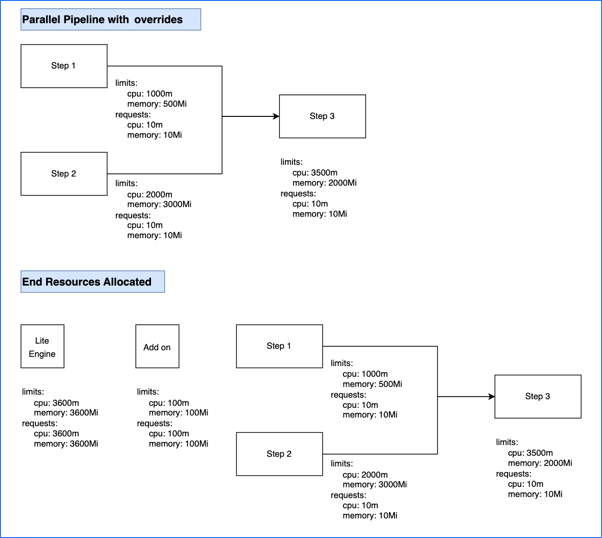

```mdx-code-block
import Kubevict from '/docs/continuous-integration/shared/k8s-pod-eviction-trbs.md';
import Dhrl from '/docs/continuous-integration/shared/docker-hub-rate-limiting-trbs.md';
```

This topic describes container resource allocation logic, how you can configure resource limits, and troubleshooting for issues related to resource allocation.

## Terminology

* **Kubernetes container requests:** Containers are guaranteed to get requests. If a container requests a resource, Kubernetes only schedules it on a node that can give the container the requested resource.
* **Kubernetes container limit:** This defines the upper limit for resource consumption by a Kubernetes container. When the container uses more than the defined limit, Kubernetes evicts the pod.

For more information, go to the Kubernetes documentation on [Kubernetes best practices: Resource requests and limits](https://cloud.google.com/blog/products/containers-kubernetes/kubernetes-best-practices-resource-requests-and-limits).

## Build pod resource allocation

By default, resource requests are always set to the minimum, and additional resources are requested only as needed during build execution, depending on the [resource request logic](#resource-request-logic-and-calculations). Resources are not consumed after a step's execution is done. Default resource minimums (requests) and maximums (limits) are as follows:

| Component | Minimum CPU | Maximum CPU | Minimum memory | Maximum memory |
| --------- | ----------- | ----------- | -------------- | -------------- |
| Steps | 10m | 400m | 10Mi | 500Mi |
| Add on (execution-related steps on containers in Kubernetes pods) | 100m | 100m | 100Mi | 100Mi |

### Override resource limits

For an individual step, you can use the **Set Container Resources** settings to override the maximum resources limits:

* **Limit Memory:** Maximum memory that the container can use. You can express memory as a plain integer or as a fixed-point number with the suffixes `G` or `M`. You can also use the power-of-two equivalents, `Gi` or `Mi`. Do not include spaces when entering a fixed value. The default is `500Mi`.
* **Limit CPU:** The maximum number of cores that the container can use. CPU limits are measured in CPU units. Fractional requests are allowed. For example, you can specify one hundred millicpu as `0.1` or `100m`. The default is `400m`. For more information, go to [Resource units in Kubernetes](https://kubernetes.io/docs/concepts/configuration/manage-resources-containers/#resource-units-in-kubernetes).

**Set Container Resources** settings don't apply to self-hosted VM or Harness Cloud build infrastructures.

To increase default resource limits across the board, you can contact [Harness Support](mailto:support@harness.io) to enable the feature flag `CI_INCREASE_DEFAULT_RESOURCES`. This feature flag increases maximum CPU to 1000m and maximum memory to 3000Mi.

### Resource request logic and calculations

Limit and request values are based on steps being parallel or sequential. Parallel steps sum the resources for each parallel step, and sequential steps take the maximum resources needed amongst the sequential steps.

The total computed resource requirements are set as the limit and request values for the stage container. For example, if total CPU is 600m, then the stage container's memory limit and request values are both set to 600m. This ensures selection of appropriately-sized pods, and it avoids over- or under-utilization of resources. The stage container is also referred to as the Lite Engine.

#### Resource calculation examples

<details>
<summary>Calculation example #1: Sequential steps</summary>

This calculation is for a pipeline with two sequential steps with no [resource limit overrides](#override-resource-limits).

<!--  -->

<docimage path={require('./static/resource-limit-calc1.png')} />

* The two sequential steps have the default resource request and limit values.
* The add on (execution-related steps on containers in Kubernetes pods) has the default resource request and limit values.
* The total stage (Lite Engine) resources for pipelines with sequential steps are calculated as `( maximum resources needed amongst sequential steps ) + ( add on resources )`.
* Because the steps are sequential, the stage only needs resources for one step at a time. This means the stage needs up to 400m CPU and 500Mi memory to run either step.
* Combining the step resources with the add on resources (100m and 100Mi), the total stage resource values are 500m CPU and 600Mi memory.

</details>

<details>
<summary>Calculation example #2: Parallel steps</summary>

This calculation is for a pipeline with two steps that run in parallel and have no [resource limit overrides](#override-resource-limits).

<!--  -->

<docimage path={require('./static/resource-limit-calc2.png')} />

* The two parallel steps have the default resource request and limit values.
* The add on (execution-related steps on containers in Kubernetes pods) has the default resource request and limit values.
* The total stage (Lite Engine) resources for pipelines with parallel steps are calculated as:

   ```
   ( sum of resources needed by concurrent parallel steps ) + ( add on resources )
   ```

* Because the steps are parallel, the stage needs resources to run both steps at once. Adding the resource values for each step together means the stage needs up to 800m CPU and 1000Mi memory to run the two steps.
* Combining the step resources with the add on resources (100m and 100Mi), the total stage resource values are 900m CPU and 1100Mi memory.

</details>

<details>
<summary>Calculation example #3: Sequential and parallel steps</summary>

This calculation is for a pipeline with three steps that have no [resource limit overrides](#override-resource-limits). Two steps run in parallel and one step runs sequentially after the two parallel steps.

<!--  -->

<docimage path={require('./static/resource-limit-calc3.png')} />

* All three steps have the default resource request and limit values.
* The add on (execution-related steps on containers in Kubernetes pods) has the default resource request and limit values.
* The total stage (Lite Engine) resources for pipelines with both parallel and sequential steps is calculated as the total of the add on resources plus the greatest amount of resources needed for steps. The expanded calculation is as follows:

   ```
   Step resources = Greater of ( sum of resources needed by concurrent parallel steps ) or ( maximum resources needed by any one sequential step )

   Stage resources = ( step resources ) + ( add on resources )
   ```

* The parallel steps require the greatest amount of resources.
   * The two parallel steps must run at the same time; therefore, the stage needs up to 800m CPU and 1000Mi memory to run those two steps.
   * To run the sequential step, which runs by itself, the stage needs only 400m CPU and 500Mi memory.
* Combining the step resources with the add on resources (100m and 100Mi), the total stage resource values are 900m CPU and 1100Mi memory.

</details>

<details>
<summary>Calculation example #4: Sequential and parallel steps with overrides</summary>

This calculation is for a pipeline that has three steps with [resource limit overrides](#override-resource-limits). Two steps run in parallel and one step runs sequentially after the two parallel steps.

<!--  -->

<docimage path={require('./static/resource-limit-calc4.png')} />

* Steps one and two run in parallel. Step one's container resources are set to 1000m CPU and 500Mi memory. Step two's container resources are set to 2000m CPU and 3000Mi memory.
* Step three runs sequentially after the two parallel steps. Step three's container resources are set to 3500m CPU and 2000Mi memory.
* The add on (execution-related steps on containers in Kubernetes pods) has the default resource request and limit values.
* The total stage (Lite Engine) resources for pipelines with both parallel and sequential steps is calculated as the total of the add on resources plus the greatest amount of resources needed for steps. The expanded calculation is as follows:

   ```
   Step resources = Greater of ( sum of resources needed by concurrent parallel steps ) or ( maximum resources needed by any one sequential step )

   Stage resources = ( step resources ) + ( add on resources )
   ```

* The parallel steps require the greatest amount of memory and the sequential step requires the greatest amount of CPU.
   * The two parallel steps must run at the same time; therefore, the stage needs up to 3000m CPU and 3500Mi memory to run those two steps.
   * To run the sequential step, which runs by itself, the stage needs 3500m CPU and 2000Mi memory.
   * Therefore, the greatest possible value for CPU is 3500m and the greatest possible value for memory is 3500Mi.
* Combining the total step resources with the add on resources (100m and 100Mi), the total stage resource values are 3600m CPU and 3600Mi memory.

</details>

<details>
<summary>Calculation example #5: Step groups</summary>

Using step groups doesn't inherently change a pipeline's resource needs. The logic is the same for pipelines with step groups as it is without step groups.

For example, assume a pipeline includes two parallel steps followed by a sequential step, and then two sequential steps in a step group. Assume all steps have the default resource limits. The calculation follows the same logic as example #3 (sequential and parallel steps):

* All five steps have the default resource request and limit values.
* The add on (execution-related steps on containers in Kubernetes pods) has the default resource request and limit values.
* The total stage (Lite Engine) resources for pipelines with both parallel and sequential steps is calculated as the total of the add on resources plus the greatest amount of resources needed for steps. The expanded calculation is as follows:

   ```
   Step resources = Greater of ( sum of resources needed by concurrent parallel steps ) or ( maximum resources needed by any one sequential step )

   Stage resources = ( step resources ) + ( add on resources )
   ```

* The parallel steps require the greatest amount of resources.
   * The two parallel steps must run at the same time; therefore, the stage needs up to 800m CPU and 1000Mi memory to run those two steps.
   * To run the sequential steps, which runs by themselves, the stage needs only 400m CPU and 500Mi memory. This includes the steps in the step group. Being in a group doesn't make them parallel.
* Combining the maximum step resources (800m and 1000Mi) with the add on resources (100m and 100Mi), the total stage resource values are 900m CPU and 1100Mi memory.

If the steps in the step group were in parallel (rather than sequential), they would have the same resource needs at the original two parallel steps. There would be no difference in the resource needs.

Likewise, if the step group included two parallel steps and a sequential step, the resource needs would be the same, because the step group would break down as two parallel steps and one sequential step.

</details>

<details>
<summary>Calculation example #6: Background steps</summary>

If your pipeline has [Background steps](../manage-dependencies/background-step-settings.md), the resource requirements for each Background step are added on to the total base stage resources. The expanded calculation is as follows:

```
Step resources = Greater of ( sum of resources needed by concurrent parallel steps ) or ( maximum resources needed by any one sequential step )

Base stage resources = ( step resources ) + ( add on resources )

Stage resources with Background steps = ( stage resources ) + ( resources for Background step 1 ) + ( resources for Background step 2 ) + ... + ( resources for Background step n )
```

The resources for each Background step are added *separately* to the stage resources.

For example, assume you have a pipeline with one Background step, two parallel steps, and one sequential step.

* The parallel steps, sequential step, and add on have the default resource request and limit values.
* The Background step's container resources are set to 3000m CPU and 900Mi memory.
* The calculation for everything except the Background step is the same as calculation example #3 (sequential and parallel steps). Therefore, before adding the Background step, the resource requirements are 900m CPU and 1100Mi memory.
* Adding the Background step resources (3000m CPU and 900Mi memory), the overall total is 3900m CPU and 2000Mi memory.

If the pipeline had more than one Background step, each Background step's resources would be added separately.

</details>

## Troubleshooting

The following troubleshooting guidance addresses some issues you might experience with resource limits or pod evictions. For additional troubleshooting guidance, go to [Troubleshoot CI](../../troubleshoot-ci/troubleshooting-ci.md).

### CI pods appear to be evicted by Kubernetes autoscaling

<Kubevict />

### Use a parallel step to monitor failures

If you need to debug failures that aren't captured in the standard [Build logs](../viewing-builds.md#build-details), you can add two Run steps to your pipeline that run in parallel with the failing step. The Run steps contain commands that monitor the activity of the failing step and generate logs that can help you debug the failing step.

In your pipeline's YAML, add the two debug monitoring steps, as shown in the following example, alongside the failing step, and group the three steps in parallel. Make sure the `timeout` is long enough to cover the time it takes for the failing step to fail; otherwise the debug steps will timeout before capturing the full logs for the failing step.

```yaml
              - parallel:
                  - step:
                      type: Run
                      name: failing step
                      ...
                  - step:
                      type: Run
                      name: Debug monitor 1
                      identifier: debug_monitor_1
                      spec:
                        connectorRef: YOUR_DOCKER_CONNECTOR ## Specify your Docker connector's ID.
                        image: alpine ## Specify an image relevant to your build.
                        shell: Sh
                        command: top -d 10
                      timeout: 10m ## Allow enough time to cover the failing step.
                  - step:
                      type: Run
                      name: Debug monitor 2
                      identifier: debug_monitor_2
                      spec:
                        connectorRef: YOUR_DOCKER_CONNECTOR ## Specify your Docker connector's ID.
                        image: alpine ## Specify an image relevant to your build.
                        shell: Sh
                        command: |-
                          i=0
                          while [ $i -lt 10 ]
                          do
                              df -h
                              du -sh *
                              sleep 10
                              i=`expr $i + 1`
                          done
                      timeout: 10m ## Allow enough time to cover the failing step.
              - step: ## Other steps are outside the parallel group.
                  type: Run
                  name: Run 3
                  ...
```

After adding the debug monitoring steps, run your pipeline, and then check the debug steps' [Build logs](../viewing-builds.md#build-details).

:::tip Parallel steps

Your parallel group (under the `-parallel` flag) should only include the two debug monitoring steps and the failing step.

You can arrange steps in parallel in the Visual editor by dragging and dropping steps to rearrange them.

<!--  -->

<docimage path={require('./static/parallel-debug-steps.png')} />

:::

### Docker Hub rate limiting

<Dhrl />
