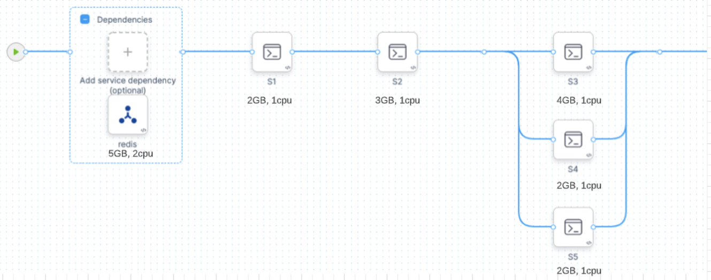
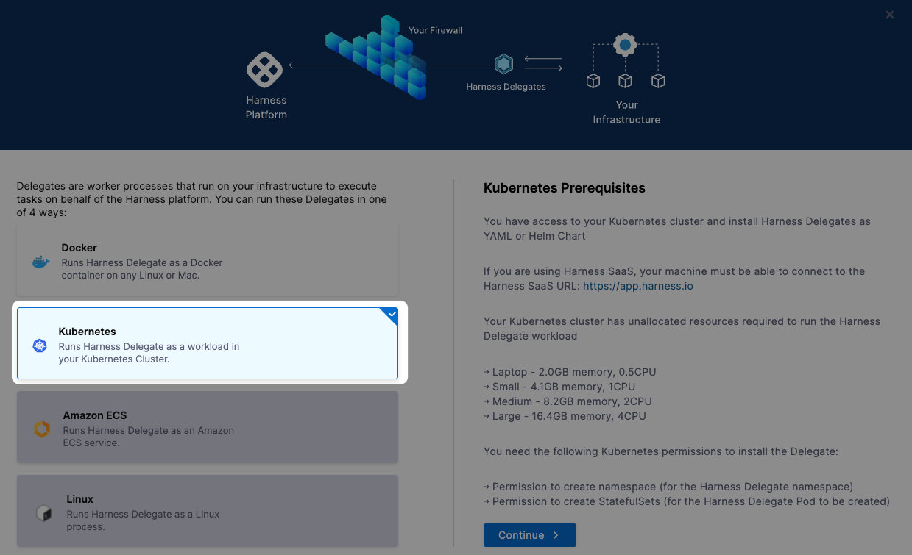

This topic describes how to set up a Kubernetes cluster build infrastructure for a Harness CI stage.

The codebase and tests you add to a Harness CI Stage are built and run using a build infrastructure in your environment.

Some CI providers use in-house orchestration systems for build farms like Docker Machine ([deprecated since 2019](https://docs.docker.com/machine/)). With these systems, outages and backlogs can occur in their infrastructure. Often, the backlogs occur because they do not have enough capacity to cover the backlog that accrued during the outage.

Harness build farms run on your infrastructure using battle-tested platforms for large container workloads (Kubernetes, AWS VMs). This enables you to build software and run tests, repeatedly and automatically, on a scalable platform with no outages.

Once you set up the Kubernetes cluster to use as your build infrastructure, you connect Harness to it using a Harness Kubernetes Cluster Connector and Harness Delegate.

You can also set up build infrastructures using VMs. See [Set Up Build Infrastructure](https://docs.harness.io/category/set-up-build-infrastructure).

### Limitations

#### GKE Autopilot is Not Supported


Harness CI doesn't support GKE Autopilot for the following reasons.

##### Cannot use Docker-in-Docker


Autopilot clusters do not allow Privileged pods. Thus you cannot use [Docker-in-Docker](../run-ci-scripts/run-docker-in-docker-in-a-ci-stage.md) to run Docker commands, since these require Privileged mode.


##### GKE Autopilot Can Result in Higher Cloud Costs


GKE Autopilot sets resource limits = resource requests for each container. This can cause your Builds to allocate more resources than they need. The result is higher cloud costs with no added benefit. 


Consider the following CI Stage:





  Assume that you configure your Stage resources as follows:


* redis (service dependency): 5GB, 2 cpu
* s1 step: 2GB, 2 cpu
* s2 step: 3GB, 1 cpu
* s3 step: 4GB, 1 cpu
* s4 step: 2GB, 1 cpu
* s5 step: 2GB, 1 cpu


Kubernetes will allocate the pod based on the maximum requirements for the overall Stage — in this case, when the s3, s4, and s5 steps run in parallel. The pod also needs to run the Redis service at the same time. The requirements are the sum of Redis + s3 + s4 + s5: 


* 5 + 4 + 2 + 2 = **13GB Memory**
* 2 + 1 + 1 + 1 = **5 CPUs**


GKE Autopilot calculates resource requirements differently. For containers, it sets resource limits to the same as resource requests. For pods, it sums all Step requirements in the Stage, whether they’re running in parallel or not. In this case, the requirements are the sum of Redis + s1 + s2 + s3 + s4 + s5:


* 5 + 2 + 2+ 4 + 4 + 4 = **17GB Memory**
* 2 + 1 + 1+ 1 + 1 + 1 = **7 CPUs**


Autopilot might be cheaper than standard Kubernetes if you only run builds occasionally. This can result in cost savings because some worker nodes are always running in a standard Kubernetes cluster. 


### Before You Begin

* [CI Pipeline Quickstart](../../ci-quickstarts/ci-pipeline-quickstart.md)
* [Delegates Overview](https://docs.harness.io/article/2k7lnc7lvl-delegates-overview)
* [CI Stage Settings](../../ci-technical-reference/ci-stage-settings.md)
* [Learn Harness' Key Concepts](../../../getting-started/learn-harness-key-concepts.md)

### Visual Summary

Here's a short video that walks you through adding a Harness Kubernetes Cluster Connector and Harness Kubernetes Delegate. The Delegate is added to the target cluster, then the Kubernetes Cluster Connector uses the Delegate to connect to the cluster.

<!-- Video:
https://harness-1.wistia.com/medias/rpv5vwzpxz-->
<docvideo src="https://www.youtube.com/embed/wUC23lmqfnY?feature=oembed" />

<!-- div class="hd--embed" data-provider="YouTube" data-thumbnail="https://i.ytimg.com/vi/wUC23lmqfnY/hqdefault.jpg"><iframe width=" 200" height="150" src="https://www.youtube.com/embed/wUC23lmqfnY?feature=oembed" frameborder="0" allowfullscreen="allowfullscreen"></iframe></div -->


### Step 1: Create a Kubernetes Cluster

#### Prerequisites

* Ensure your Kubernetes cluster meets the build infrastructure requirements in [CI Cluster Requirement](https://docs.harness.io/article/sjjik49xww-kubernetes-cluster-connector-settings-reference#harness_ci_cluster_requirements).
* For Harness-specific permission requirements, see [permission required](https://docs.harness.io/article/sjjik49xww-kubernetes-cluster-connector-settings-reference#permissions_required) for CI.
* Install the Harness Kubernetes Delegate on the same cluster you use as your build infrastructure. Make sure that the cluster has enough memory and CPU for the Delegate you are installing.Harness Kubernetes Delegates can be in a different [namespace](https://kubernetes.io/docs/concepts/overview/working-with-objects/namespaces/) than the one you provide while defining the build farm infrastructure for the CI Pipeline.

To create a new Kubernetes cluster, see:

* [Creating a cluster in Kubernetes](https://kubernetes.io/docs/tutorials/kubernetes-basics/create-cluster/)
* [Creating a cluster in GKE (Google Kubernetes Engine](https://cloud.google.com/kubernetes-engine/docs/how-to/creating-a-zonal-cluster))

### Step 2: Add Kubernetes Cluster Connector and Delegate in Harness

* In your **Project**, click **Project Setup**.
* Click **Connectors**.
* Click **New Connector** and then click **Kubernetes Cluster**.

Set up the Connector as follows.

#### Connector Overview

* Enter a unique name for the Connector.

#### Connector Details

You can select Master URL and Credentials or Use the credentials of a specific Harness Delegate. 

In this example, click Use the credentials of a specific Harness Delegate and click **Continue**.

#### Delegate Setup

You should now be in the Delegates Setup screen of the GitHub Connector wizard. Click **Install new Delegate**.


#### Delegate Location

You can install the Delegate in different locations. Usually it makes sense to install and run the Delegate on a pod in your Kubernetes build infrastructure. You'll do this in the next steps.

* Select **Kubernetes**.



#### Delegate Details

Now you specify the Delegate name, size, and permissions.

* Specify the following:
	+ **Delegate name**
	+ **Delegate size**
	+ **Delegate Permissions:** Install Delegate with cluster-wide read/write access  
	This is simply a default. In the future, you can add configurations to run scripts on your Delegates and scope them to different environments.


#### Delegate Install

Harness now generates and displays a workspace-definition YAML file that you can install in your build infrastructure.


* Click **Download Script**. This downloads the YAML file for the Kubernetes Delegate.
* Open a terminal and navigate to where the Delegate file is located. You'll connect to your cluster using the terminal so you can simply run the YAML file on the cluster.
* In the same terminal, log into your Kubernetes cluster. In most platforms, you select the cluster, click **Connect**, and copy the access command.
* Install the Harness Delegate using the **harness-delegate.yaml** file you just downloaded. Click **Next** in the Harness UI, then run the command shown. For example:
```
kubectl apply -f harness-delegate.yaml
```
You should see output similar to this:
```
% kubectl apply -f harness-delegate.yaml  
namespace/harness-delegate-ng created  
clusterrolebinding.rbac.authorization.k8s.io/harness-delegate-ng-cluster-admin created  
secret/ci-quickstart created  
statefulset.apps/ci-quickstart created  
service/delegate-service created
```

#### Connect to the Delegate

* Return to the Harness UI. It might take a few minutes to verify the Delegate. Once it is verified, close the wizard.
* Back in **Delegates Setup**, you can select the new Delegate:
	+ In the list of Delegates, you can see your new Delegate and its tags.
	+ Select the **Connect using Delegates with the following Tags** option.
	+ Enter the tag of the new Delegate and click **Save and Continue**.
	+ Wait for the connection test to complete and then click **Finish**.

### Step 3: Define the Build Farm Infrastructure in Harness

In this step, you set up your build infrastructure using the Connector and Delegate you added previously. 

In the CI stage Infrastructure, select the Kubernetes Cluster Connector you created in the previous step.

In Namespace, enter the Kubernetes namespace to use.

You can use a Runtime Input (`<+input>`) or expression also. See [Runtime Inputs](https://ngdocs.harness.io/article/f6yobn7iq0-runtime-inputs).

### Option: Service Account Name

The Kubernetes service account name. You must set this field in the following cases:

* Your build infrastructure runs on EKS, you have an IAM role associated with the service account, and a CI step uses an AWS Connector with IRSA. See [IAM Roles for Service Accounts](https://docs.aws.amazon.com/eks/latest/userguide/iam-roles-for-service-accounts.html) in the AWS docs.
* You have a CI Build stage with Steps that communicate with any external services using a service account other than default. See [Configure Service Accounts for Pods](https://kubernetes.io/docs/tasks/configure-pod-container/configure-service-account/) in the Kubernetes docs.

### Option: Run as User

You can override the default Linux user ID for containers running in the build infrastructure. This is useful if your organization requires containers to run as a specific user with a specific set of permissions. See [Configure a security context for a Pod](https://kubernetes.io/docs/tasks/configure-pod-container/security-context/#set-the-security-context-for-a-pod) in the Kubernetes docs. 

### Option: Init Timeout

If you use large images in your Build Steps, you might find that the initialization step times out and the build fails when the Pipeline runs. In this case, you can increase the default init time window (10 minutes). 

### Option: Add Annotations

You can add Kubernetes annotations to the pods in your infrastructure. An annotation can be small or large, structured or unstructured, and can include characters not permitted by labels. See [Annotations](https://kubernetes.io/docs/concepts/overview/working-with-objects/annotations/) in the Kubernetes docs. 

### Option: Add Labels

You can add Kubernetes labels (key-value pairs) to the pods in your infrastructure. Labels are useful for searching, organizing, and selecting objects with shared metadata. See [Labels and Selectors](https://kubernetes.io/docs/concepts/overview/working-with-objects/labels/) in the Kubernetes docs. 

If a custom label value does not match the following regex, the label won't get generated:  
`^[a-z0-9A-Z][a-z0-9A-Z\\-_.]*[a-z0-9A-Z]$`Labels make it easy to find pods associated with specific Stages, Organizations, Projects, Pipelines, Builds, and any custom labels you want to add: 


```
kubectl get pods -l stageID=mycibuildstage
```
Harness adds the following labels automatically:

* `stageID`: See `pipeline.stages.stage.identifier` in the Pipeline YAML.
* `stageName`: See `pipeline.stages.stage.name` in the Pipeline YAML.
* `orgID`: See `pipeline.orgIdentifier` in the Pipeline YAML.
* `projectID`: See `pipeline.projectIdentifier` in the Pipeline YAML.
* `pipelineID`: See `pipeline.identifier` in the Pipeline YAML.
* `pipelineExecutionId`: To find this, go to a CI Build in the Harness UI. The `pipelineExecutionID` is near the end of the URL path, between `executions` and `/pipeline`: 

`https://app.harness.io/ng/#/account/myaccount/ci/orgs/myusername/projects/myproject/pipelines/mypipeline/executions/__PIPELINE_EXECUTION-ID__/pipeline`

### Configure As Code

When configuring your Pipeline in YAML, you add the Kubernetes Cluster CI infrastructure using the infrastructure of type KubernetesDirect:


```
pipeline:  
...  
  stages:  
    - stage:  
        ...  
        spec:  
          ...  
          infrastructure:  
            type: KubernetesDirect  
            spec:  
              connectorRef: account.mydelegate  
              namespace: default  
          ...
```
Once the build infrastructure is set up, you can now add CI stages to execute your Run steps to build, deploy your code.

### See Also

* [Add a Kubernetes Cluster Connector](https://docs.harness.io/article/1gaud2efd4-add-a-kubernetes-cluster-connector)
* [Kubernetes Cluster Connector Settings](https://docs.harness.io/article/sjjik49xww-kubernetes-cluster-connector-settings-reference)

