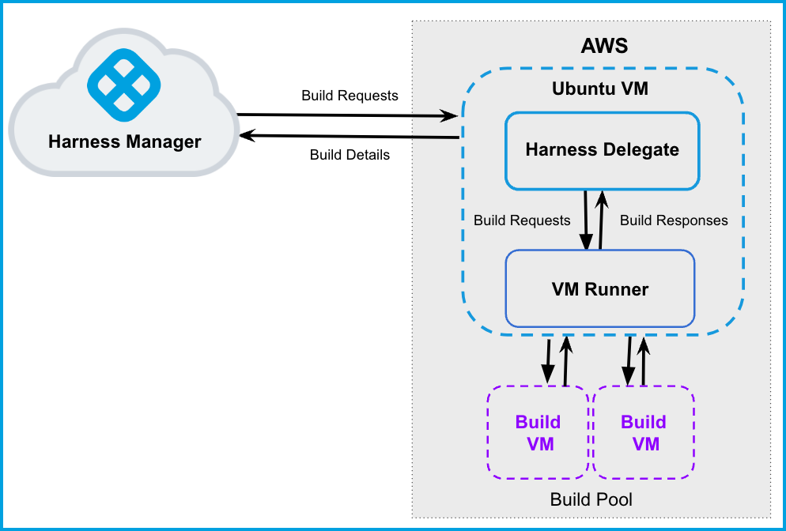

:::note
Currently, this feature is behind the Feature Flag `CI_VM_INFRASTRUCTURE`. Contact [Harness Support](mailto:support@harness.io) to enable the feature.
:::

This topic describes how to set up and use AWS VMs as build infrastructures for running builds and tests in a CI Stage. You will create an Ubuntu VM and install a Delegate on it. This Delegate will create new VMs dynamically in response to CI build requests. You can also configure the Delegate to hibernate AWS Linux and Windows VMs when they aren't needed.

Running builds in your infrastructure, rather than in a vendor's cloud, has significant benefits. Vendor clouds often experience outages that can result in backlogs and delayed builds. AWS has been battle-tested for large container workloads. You can build software and run tests, repeatedly and automatically, on a scalable platform with no outages or backlogs.

For information on using Kubernetes as a build farm, see [Define Kubernetes Cluster Build Infrastructure](set-up-a-kubernetes-cluster-build-infrastructure.md).The following diagram illustrates an AWS build farm. The [​Harness Docker Delegate](https://docs.harness.io/article/cya29w2b99-install-a-docker-delegate) communicates directly with your Harness instance. The [VM Runner](https://docs.drone.io/runner/vm/overview/) maintains a pool of VMs for running builds. When the Delegate receives a build request, it forwards the request to the Runner, which runs the build on an available VM.



### Before You Begin

This topic assumes you're familiar with the following:

* [CI Pipeline Quickstart](../../ci-quickstarts/ci-pipeline-quickstart.md)
* [Delegates Overview](https://ngdocs.harness.io/article/2k7lnc7lvl-delegates-overview)
* [CI Stage Settings](../../ci-technical-reference/ci-stage-settings.md)
* [Learn Harness' Key Concepts](../../../getting-started/learn-harness-key-concepts.md)
* [VM Runner](https://docs.drone.io/runner/vm/overview/)

### Alternate Workflow: Set Up using Terraform

If you have Terraform and Go installed on your EC2, you set up your build infrastructure as described in the Harness GitHub repo [cie-vm-delegate](https://github.com/harness/cie-vm-delegate).

### Prerequisites

* AWS EC2 configuration:
	+ For the Delegate VM, use an Ubuntu t2.large (or higher) AMI.
	+ Build VMs can be Ubuntu, AWS Linux, or Windows Server 2019 (or higher).
	+ Authentication requirements:
		- You can use an access key and access secret ([AWS secret](https://docs.aws.amazon.com/IAM/latest/UserGuide/id_credentials_access-keys.html#Using_CreateAccessKey)) for configuration of the Runner.  
		For Windows instances, you need to add the [AdministratorAccess policy](https://docs.aws.amazon.com/IAM/latest/UserGuide/getting-started_create-admin-group.html) to the IAM role associated with the access key and access secret [IAM](https://console.aws.amazon.com/iamv2/home#/users).
		- You can also use IAM profiles instead of access and secret keys.  
		You need to run the Delegate VM with an IAM role that has CRUD permissions on EC2. This role will provide the Runner with temporary security credentials to create VMs and manage the build pool.
	+ Set up VPC firewall rules for the build instances on EC2.
		- For information on creating a Security Group, see [Authorize inbound traffic for your Linux instances](https://docs.aws.amazon.com/AWSEC2/latest/UserGuide/authorizing-access-to-an-instance.html) in the AWS docs.
		- You also need to allow ingress access to ports 22 and 9079. Open port 3389 as well if you want to run Windows builds and be able to RDP into your build VMs.
		- Once completed, you'll have a Security Group ID, which is needed for the configuration of the Runner.

### Step 1: Set Up the Delegate VM

1. Log into the [EC2 Console](https://console.aws.amazon.com/ec2/) and launch the VM instance where the Harness Delegate will be installed.
2. [Install Docker](https://docs.aws.amazon.com/AmazonECS/latest/developerguide/docker-basics.html#install_docker) on the instance.
3. [Install Docker Compose](https://docs.docker.com/compose/install/) on your instance. You must have [Docker Compose version 3.7](https://docs.docker.com/compose/compose-file/compose-versioning/#version-37) or higher installed.
4. If you are using an IAM role, attach the role to the VM. See [Attach an IAM Role to an Instance](https://docs.aws.amazon.com/AWSEC2/latest/UserGuide/iam-roles-for-amazon-ec2.html#attach-iam-role) in the AWS docs.
5. Create a `/runner` folder on your VM and `cd` into it:

```
mkdir /runner  
cd /runner
```

### Step 2: Configure the Drone Pool on the AWS VM

The **.drone\_pool.yml** file defines the VM spec and pool size for the VM instances used to run the Pipeline. A pool is a group of instantiated VM that are immediately available to build CI Pipelines. To avoid unnecessary costs, you can configure AWS Linux and Windows VMs to hibernate when not in use.

1. In the `/runner` folder, create a new **.drone\_pool.yml** file.
2. Set up the file as described in the following example. Note the following:
	1. To avoid latency issues, set up your build pool in the same Availability Zone as the Delegate VM.
	2. Search for AMIs in your Availability Zone for supported models (Unbuntu, AWS Linux, Windows 2019+). AMI Ids differ depending on the Availability Zone.
	3. See the Pool Settings Reference below for details on specific settings. See also [Drone Pool](https://docs.drone.io/runner/vm/configuration/pool/) and [Amazon Runner](https://docs.drone.io/runner/vm/drivers/amazon/) in the Drone docs.

The following **.drone\_pool.yml** example defines an Ubuntu and a Windows pool.

<details>
   <summary>Example pool.yaml</summary>
   <div>
      <pre class="hljs yaml">

```
version: "1"  
instances:  
  - name: ubuntu-test-pool-july-five  
    default: true  
    type: amazon  
    pool: 1      
    limit: 4     
    platform:  
      os: linux  
      arch: amd64  
    spec:  
      account:  
        region: us-east-2  
        availability_zone: us-east-2c  
        access_key_id: XXXXXXXXXXXXXXXXX  
        access_key_secret: XXXXXXXXXXXXXXXXXXX   
      ami: ami-051197ce9cbb023ea  
      size: t2.nano  
      network:  
        security_groups:  
        - sg-XXXXXXXXXXX  
  - name: windows-test-pool-july-six  
    default: true  
    type: amazon  
    pool: 1  
    limit: 4  
    platform:  
      os: windows  
    spec:  
      account:  
        region: us-east-2  
        availability_zone: us-east-2c  
        access_key_id: XXXXXXXXXXXXXXXXXXXXXX  
        access_key_secret: XXXXXXXXXXXXXXXXXXXXXX  
      ami: ami-088d5094c0da312c0  
      size: t3.large  
      hibernate: true  
      network:  
        security_groups:  
        - sg-XXXXXXXXXXXXXX  
```
</pre>
</div>
</details>

Later in this workflow, you'll reference the pool identifier in the Harness Manager to map the pool with a Stage Infrastructure in a CI Pipeline. This is described later in this topic.

### Step 3: Create the Docker-Compose YAML

1. Navigate to the Delegates page for your Harness account, organization, or project.
2. Click **New Delegate** and select **Docker**.
3. Follow the steps in [Install the Docker Delegate](https://docs.harness.io/article/cya29w2b99-install-a-docker-delegate) and download the **docker-compose.yaml** file to your local machine.

### Step 4: Configure the Docker Compose File

The Harness Delegate and Runner run on the same VM. The Runner communicates with the Harness Delegate on localhost and port 3000 of your VM. 

In this step, you will add the Runner spec to the new Delegate definition. 

1. Copy your local **docker-compose.yaml** to the `/runner` folder on the AWS VM. This folder should now have **docker-compose.yaml** and **.drone\_pool.yml**.
2. Append the following to **docker-compose.yaml**.
```
drone-runner-aws:  
    restart: unless-stopped  
    image: image: drone/drone-runner-aws  
    volumes:  
      - ./runner:/runner  
    entrypoint: ["/bin/drone-runner-aws", "delegate", "--pool", "pool.yml"]  
    working_dir: /runner  
    ports:  
      - "3000:3000"
```
3. In the **docker-compose.yaml** file, add the following under `services: harness-ng-delegate: restart: unless-stopped`:
```
network_mode: "host"
```

Your Docker Compose file now looks something like this:

<details>
   <summary>Updated pool.yaml</summary>
   <div>
      <pre class="hljs yaml">

```
version: "3.7"  
services:  
  harness-ng-delegate:  
    restart: unless-stopped  
    network_mode: "host"  
    deploy:  
      resources:  
        limits:  
          cpus: "0.5"  
          memory: 2048M  
    image: harness/delegate:latest  
    environment:  
      - ACCOUNT_ID=XXXXXXXXXXXXXXXX  
      - DELEGATE_TOKEN=XXXXXXXXXXXXXXXX  
      - MANAGER_HOST_AND_PORT=https://qa.harness.io  
      - WATCHER_STORAGE_URL=https://app.harness.io/public/qa/premium/watchers  
      - WATCHER_CHECK_LOCATION=current.version  
      - REMOTE_WATCHER_URL_CDN=https://app.harness.io/public/shared/watchers/builds  
      - DELEGATE_STORAGE_URL=https://app.harness.io  
      - DELEGATE_CHECK_LOCATION=delegateqa.txt  
      - USE_CDN=true  
      - CDN_URL=https://app.harness.io  
      - DEPLOY_MODE=KUBERNETES  
      - DELEGATE_NAME=qwerty  
      - NEXT_GEN=true  
      - DELEGATE_DESCRIPTION=  
      - DELEGATE_TYPE=DOCKER  
      - DELEGATE_TAGS=  
      - DELEGATE_TASK_LIMIT=50  
      - DELEGATE_ORG_IDENTIFIER=  
      - DELEGATE_PROJECT_IDENTIFIER=  
      - PROXY_MANAGER=true  
      - VERSION_CHECK_DISABLED=false  
      - INIT_SCRIPT=echo "Docker delegate init script executed."  
  drone-runner-aws:  
    restart: unless-stopped  
    image: drone/drone-runner-aws:1.0.0-rc.2  
    volumes:  
      - .:/runner  
    entrypoint: ["/bin/drone-runner-aws", "delegate", "--pool", "pool.yml"]  
    working_dir: /runner  
    ports:  
      - "3000:3000"
```
</pre>
</div>
</details>

### Step 5: Install the Delegate and Runner

1. [SSH](https://docs.aws.amazon.com/AWSEC2/latest/UserGuide/AccessingInstancesLinux.html) into the Delegate VM and **`cd`** to `/runner`.
2. Confirm that the folder has both setup files:
```
$ ls -a  
.  ..  docker-compose.yml  .drone_pool.yml 
```
3. Install the Delegate and Runner:
```
$ docker-compose -f docker-compose.yml up -d
```
4. Verify that both containers are running correctly. (you might need to wait a few minutes for both processes to start.)
```
$ docker ps  
$ docker logs <delegate-container-id>  
$ docker logs <runner-container-id>
```
5. In the Harness UI, verify that the Delegate appears in the Delegates list. This might take two or three minutes. You should see Connected next to the Delegate listing.

   
   
6. If you see **Not Connected**, make sure the Docker host can connect to **https://app.harness.io**.

The Delegate and Runner have now been successfully installed, registered, and connected.

For details on the environment variables of the Harness Docker Delegate, see [Harness Docker Delegate Environment Variables](https://ngdocs.harness.io/article/cya29w2b99-install-a-docker-delegate#harness_docker_delegate_environment_variables).

### Step 6: Run a CI Build

1. In the Harness CI Stage, in **Infrastructure**, select **AWS VMs**.

   

2. In the **Pool ID**, enter the pool name `<pool_id>` that you added in Step 2.

   

3. Your AWS build infrastructure is now set up. You can now run your Build Stages on AWS VMs.

### Pool Settings Reference

You can configure the following settings in your pool.yml file.


|  |  |  |
| --- | --- | --- |
| **Subfields** | **Examples** | **Description** |
| `name` (String) | NA | `name: windows_pool` | Unique identifier of the pool. You will be referencing this pool name in the Harness Manager in later steps while setting up the CI Stage Infrastructure. |
| `min_pool_size` (Integer) | NA | `min_pool_size: 1` | Minimum pool size number. Denotes the minimum number of cached VMs in ready state to be used by the Runner. |
| `max_pool_size` (Integer) | NA | `max_pool_size: 3` | Maximum pool size number. Denotes the maximum number of cached VMs in ready state to be used by the Runner. |
| `hibernate` (boolean) | `hibernate: true` | When set to `true` (the default), VMs are set to hibernate after startup. When `false`, VMs are always in a running state.This option is supported for AWS Linux and Windows VMs. Hibernation for Ubuntu VMs is not currently supported.See [Hibernate your On-Demand Linux instance](https://docs.aws.amazon.com/AWSEC2/latest/UserGuide/Hibernate.html) in the AWS docs. |
| `platform` | See platform example below. | Configure the details of your VM platform. By default, the platform is set to Linux OS and AMD64 architecture. |
| `instance` | See instance example below. | Configure the settings of your AWS instance. Disk contains AWS block information. Network contains AWS network information.For more information on these attributes, refer to the AWS doc [Create a security group](https://docs.aws.amazon.com/AWSEC2/latest/UserGuide/get-set-up-for-amazon-ec2.html#create-a-base-security-group). |

### Platform Example

***os (String)*** 
    `platform: os: windows`
    
***arch (String)***
    `platform: arch:` 
     
***variant (String)***
     `platform: variant:` 
     
***version (String)***
    `platform: version:` 


### Instance Example

***ami (String)***

    instance:
      ami: ami-092f63f22143765a3

***tags (String)***

    instance:
      tags: 285

***type (String)***

    instance:
      type: t2.micro
    
    
***disk***

* size (Integer)

        disk:
          size:

* type (String)

        disk:
          type:

* ops (String)

        disk:
          iops:

***Network***

* vpc (Integer)*

        network:
          vpc:

* vpc_security_groups ([ ] String)

        network:
          vpc_security_groups:
          - sg-0ad8xxxx511b0
  
* security_groups ([ ] String)

          network:
            security_groups:
              - sg-06dcxxxx9811b0

* Subnet_id (String)
  
        network:
          subnet_id:
          subnet-0ab15xxxx07b53

* private_ip (boolean)
  
        network:
          private_ip:


### Runner Settings Reference (Advanced)

You can set the following Runner options your docker-compose.yml file. These can be useful for advanced use cases such as troubleshooting the Runner.

Here's an example:

<details>
   <summary>docker-compose.yml with Drone Environment Settings</summary>
   <div>
      <pre class="hljs yaml">

```
version: "3.7"  
services:  
  harness-ng-delegate:  
    restart: unless-stopped  
    network_mode: "host"  
    deploy:  
      resources:  
        limits:  
          cpus: "0.5"  
          memory: 2048M  
    image: harness/delegate:latest  
    environment:  
      - MANAGER_HOST_AND_PORT=https://qa.harness.io  
      - WATCHER_STORAGE_URL=https://app.harness.io/public/qa/premium/watchers  
      - WATCHER_CHECK_LOCATION=current.version  
      - REMOTE_WATCHER_URL_CDN=https://app.harness.io/public/shared/watchers/builds  
      - DELEGATE_STORAGE_URL=https://app.harness.io  
      - DELEGATE_CHECK_LOCATION=delegateqa.txt  
      - USE_CDN=true  
      - CDN_URL=https://app.harness.io  
      - DEPLOY_MODE=KUBERNETES  
      - DELEGATE_NAME=qwerty  
      - NEXT_GEN=true  
      - DELEGATE_DESCRIPTION=  
      - DELEGATE_TYPE=DOCKER  
      - DELEGATE_TAGS=  
      - DELEGATE_TASK_LIMIT=50  
      - DELEGATE_ORG_IDENTIFIER=  
      - DELEGATE_PROJECT_IDENTIFIER=  
      - PROXY_MANAGER=true  
      - DRONE_SETTINGS_AWS_ACCESS_KEY_ID="<access_key>"  
      - DRONE_SETTINGS_AWS_ACCESS_KEY_SECRET="<secret_key>"  
      - DRONE_SETTINGS_AWS_REGION="us-east-2"  
      - DRONE_SETTINGS_REUSE_POOL=false  
      - DRONE_SETTINGS_LITE_ENGINE_PATH=https://github.com/harness/lite-engine/releases/download/v0.0.1.12  
      - DRONE_DEBUG=true  
      - DRONE_TRACE=true  
      - DRONE_SETTINGS_KEY_PAIR_NAME="<name_of_key_pair>"  
      - VERSION_CHECK_DISABLED=false  
      - INIT_SCRIPT=echo "Docker delegate init script executed."  
  drone-runner-aws:  
    restart: unless-stopped  
    image: drone/drone-runner-aws:1.0.0-rc.2  
    volumes:  
      - .:/runner  
    entrypoint: ["/bin/drone-runner-aws", "delegate", "--pool", "pool.yml"]  
    working_dir: /runner  
    ports:  
      - "3000:3000"
```
</pre>
</div>
</details>

Configure the following fields in the **.env** file to allow Runner to access and launch your AWS VM.


|  |  |  |
| --- | --- | --- | 
| **Fields** | **Description** | **Value** |
| DRONE\_SETTINGS\_AWS\_ACCESS\_KEY\_ID | Enter your AWS Access Key ID. |  |
| DRONE\_SETTINGS\_AWS\_ACCESS\_KEY\_SECRET | Enter your AWS access key secret. |  |
| DRONE\_SETTINGS\_AWS\_REGION | Enter your AWS region. |  |
| DRONE\_SETTINGS\_REUSE\_POOL | Reuse existing EC2 instances on restart of the Runner. | `false` |
| DRONE\_SETTINGS\_LITE\_ENGINE\_PATH | This variable contains the release information for the Lite Engine. The Lite Engine is a binary that is injected into the VMs with which the Runner interacts. It is responsible for coordinating the execution of the steps. | `https://github.com/harness/lite-engine/releases/download/v0.0.1.12` |
| DRONE\_TRACE | Optional boolean value. Enables trace-level logging. | `true` |
| DRONE\_DEBUG | Optional boolean value. Enables debug-level logging. | `true` |
| DRONE\_SETTINGS\_AWS\_KEY\_PAIR\_NAME | Enter the name of the key pair.The Runner allows you to specify a key pair to use in case you want to connect to your Windows VM via RDP.This is highly recommended for troubleshooting.SSH is installed via a cloud-init script, so in case something goes wrong, connecting via RDP will always be possible.For details, see [AWS EC2 Key pairs](https://docs.aws.amazon.com/AWSEC2/latest/UserGuide/ec2-key-pairs.html).  |  |

### See Also

* [Set Up a Kubernetes Cluster Build Infrastructure](set-up-a-kubernetes-cluster-build-infrastructure.md)
* For more details on VM Runner, visit this [GitHub](https://github.com/drone-runners/drone-runner-aws) page.

