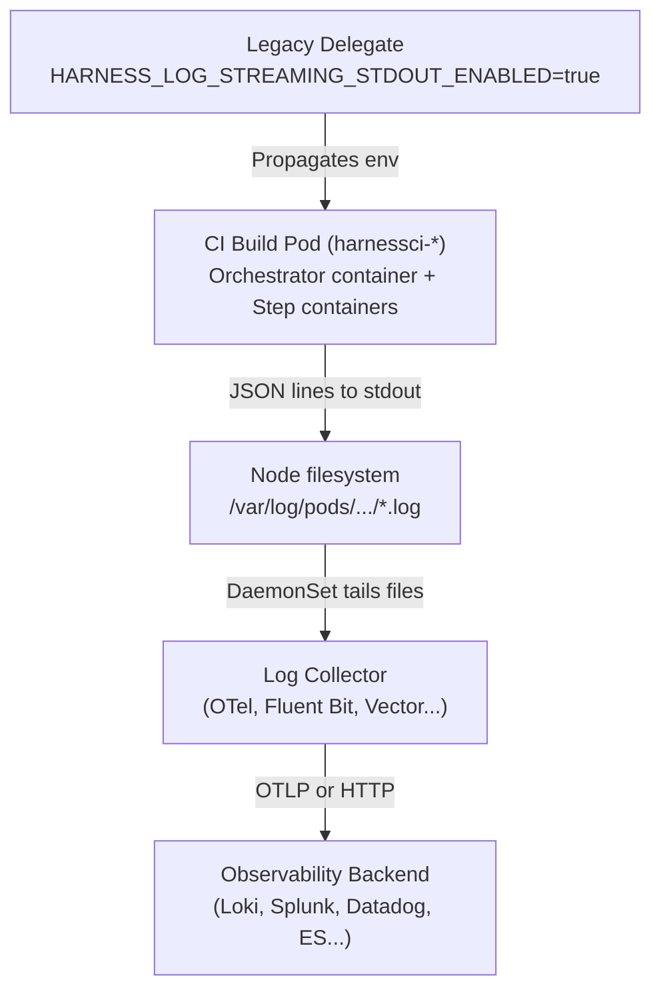

import BrowserOnly from '@docusaurus/BrowserOnly';
import { FAQ } from '@site/src/components/AdaptiveAIContent';

When enabled, Harness CI can emit every build step log line as a structured JSON record to the build container's stdout, alongside the standard Harness Log Service. Once those records are written, you can collect and ship them to your observability backend using any log collector of your choice.

This gives you full ownership of your CI log data. You can search, alert on, correlate, and retain build logs in your own infrastructure without changing pipeline YAML and without coupling Harness to any specific telemetry stack.

---

## What you will learn

- **What dual logging is:** How the `HARNESS_LOG_STREAMING_STDOUT_ENABLED` flag enables a parallel stream that mirrors every build step log line as flat JSON.
- **Supported infrastructure:** Which delegate and build infrastructure combinations are supported today and what is planned.
- **Collector setup:** How to enable log streaming on your delegate and configure log collection for Kubernetes build infrastructure.
- **Log schema and queries:** The exact JSON fields emitted on each line and example queries you can run in Grafana Loki, Splunk, or Elasticsearch.

---

## Supported infrastructure

Support for CI log streaming depends on your delegate type and build infrastructure:

| Delegate | Build infrastructure | Status | How logs are collected |
| :-- | :-- | :-- | :-- |
| Self-managed Legacy Delegate | Kubernetes cluster | Supported | A node-level log collector DaemonSet tails build pod container logs. |
| Self-managed Kubernetes Delegate | Kubernetes cluster | Coming soon | This capability is currently planned for Kubernetes-based builds running on Delegate 3.x. |
| Harness Cloud (hosted build infrastructure) | N/A | Not applicable | Logs are managed by Harness and are not exposed for external collection. |

:::info Kubernetes build support on new delegates is coming soon

For Kubernetes build infrastructures, log streaming currently supports the **self-managed Legacy Delegate**. Equivalent CI Kubernetes build log streaming for Delegate 3.x is coming soon.

:::

---

## How it works

When log streaming is enabled, the delegate propagates the flag to every container in every CI build pod it creates. The orchestrator container writes stage-level lines (such as setup, step dispatch, and teardown) as JSON to its own stdout, while each step container writes its stdout and stderr as JSON to its own stdout. Because every line is written to container stdout, the standard node-level path `/var/log/pods/<namespace>_harnessci-*/**/*.log` captures all records.



:::info Harness emits JSON, not OTLP

The Harness execution engine only writes structured JSON to container stdout. It does not speak OTLP natively. The choice of log collector (such as OpenTelemetry Collector, Fluent Bit, Vector, or Promtail) and downstream protocol is entirely yours.

:::

---

## Before you begin

This guide assumes:

- You have **Continuous Integration** enabled on your Harness account. Go to [Harness CI overview](/docs/continuous-integration/get-started/overview) to review account prerequisites and module setup.
- You are using a self-managed Legacy Delegate with Kubernetes build infrastructure.
- You have permission to update delegate manifests.
- You have an observability backend that can receive logs (such as Grafana Loki, Splunk, Datadog, or Elasticsearch).

---

## Step 1: Enable log streaming

Enable log streaming by setting the appropriate environment variables.

### For Kubernetes build infrastructure (Legacy Delegate)

Edit your delegate Deployment manifest and add the environment variable `HARNESS_LOG_STREAMING_STDOUT_ENABLED=true` to the delegate container:

```yaml
apiVersion: apps/v1
kind: Deployment
metadata:
  name: harness-delegate
  namespace: harness-delegate-ng
spec:
  template:
    spec:
      containers:
        - name: harness-delegate-instance
          env:
            - name: HARNESS_LOG_STREAMING_STDOUT_ENABLED
              value: "true"
```

Apply the manifest and wait for the rollout to complete:

```bash
kubectl apply -f delegate.yaml
kubectl rollout status deploy/harness-delegate -n harness-delegate-ng
```

### For Docker-based delegates

Add the environment variable to your `docker run` command:

```bash
# Replace the placeholders below with your actual delegate environment variables.
docker run -d \
  -e HARNESS_LOG_STREAMING_STDOUT_ENABLED=true \
  -e ACCOUNT_ID=<your-account-id> \
  harness/delegate:<version>
```

---

## Step 2: Configure log collection

Once log streaming is enabled, you can configure your log collector of choice to tail and forward the log records.

Deploy an OpenTelemetry (OTel) Collector DaemonSet in your cluster to tail the node container logs. The `filelog` receiver tails container logs under `/var/log/pods`, and a parser extracts the JSON envelope emitted by Harness CI.

Below is an example snippet for the OTel Collector configuration. Replace `<your-namespace>` and `<your-delegate-name>` with your actual values:

```yaml
receivers:
  filelog:
    # Tail CI build pods (prefixed with harnessci-) and delegate execution logs
    include:
      - /var/log/pods/<your-namespace>_harnessci-*/**/*.log
      - /var/log/pods/<your-namespace>_<your-delegate-name>-*/**/*.log
    start_at: end
    include_file_path: true
    operators:
      # Parse CRI log format: <time> <stream> <flags> <log>
      - type: regex_parser
        regex: '^(?P<time>[^ ]+) (?P<stream>stdout|stderr) (?P<flags>[^ ]+) (?P<log>.*)$'
        on_error: send
        timestamp:
          parse_from: attributes.time
          layout: '%Y-%m-%dT%H:%M:%S.%LZ'
      # Parse the nested JSON envelope written by the containers
      - type: json_parser
        parse_from: attributes.log
        if: 'attributes["log"] matches "^\\{.*"'
        on_error: send

processors:
  batch:
    timeout: 2s
    send_batch_size: 500
  resource:
    attributes:
      - key: service.name
        value: harness-ci
        action: insert

exporters:
  otlphttp:
    endpoint: http://<your-backend-endpoint>:3100/otlp

service:
  pipelines:
    logs:
      receivers: [filelog]
      processors: [batch, resource]
      exporters: [otlphttp]
```

:::tip Other collectors work similarly

You can configure other collectors, such as **Fluent Bit**, **Vector**, or **Promtail**, to tail the same pod directories (`/var/log/pods/`) and parse the container logs as JSON before forwarding them to your backend.

:::

---

## Step 3: Verify log streaming

1. Run a CI pipeline that uses your Kubernetes build infrastructure.
2. Check your collector DaemonSet logs:

```bash
kubectl logs -l app=otel-collector -n <your-namespace> --tail=20
```

3. Query your observability backend for logs with `service.name = "harness-ci"`.

---

## Log format reference

Each CI log line is written as a structured JSON object:

```json
{
  "timestamp": "2026-05-19T10:15:30.123456789Z",
  "level": "INFO",
  "message": "Successfully built image docker.io/myorg/myapp:latest",
  "logType": "EXECUTION_LOGS",
  "logAbstractions": {
    "accountId": "abc123",
    "orgId": "default",
    "projectId": "my_project",
    "pipelineId": "build_and_push",
    "runSequence": "42",
    "planExecutionId": "exec_abc123def456",
    "stageIdentifier": "build_stage",
    "stepIdentifier": "build_and_push_step"
  },
  "logContext": {
    "taskId": "task_xyz789"
  }
}
```

### Field reference

| Field | Description |
| :-- | :-- |
| `timestamp` | UTC timestamp in RFC 3339 nanosecond format. |
| `level` | Log level: `INFO`, `WARN`, `ERROR`. Note that for Kubernetes build pod stdout, this is currently hardcoded to `INFO` on the stdout stream. Severity-based filtering can be done on the message content downstream or by relying on the original Harness Log Service. |
| `message` | The actual log line content. |
| `logType` | Always `EXECUTION_LOGS` for CI step execution output. |
| `logAbstractions.accountId` | Your Harness account identifier. |
| `logAbstractions.orgId` | The organization identifier. |
| `logAbstractions.projectId` | The project identifier. |
| `logAbstractions.pipelineId` | The pipeline identifier. |
| `logAbstractions.runSequence` | The run number (or run sequence). |
| `logAbstractions.planExecutionId` | The unique execution ID for this pipeline run. |
| `logAbstractions.stageIdentifier` | The stage that produced the log. |
| `logAbstractions.stepIdentifier` | The identifier of the step that produced this line, or `engine` for stage-level orchestration lines. |
| `logContext.taskId` | The delegate task ID (present when available). |

:::info Delegate-level execution logs are slightly different

When log streaming is enabled, the delegate process itself also writes a JSON stream of general execution logs (such as CD task execution). Those records carry the same structure, plus two additional fields when available: `logKey` (the Harness internal log key) and `commandUnit` (the command unit name, such as `Execute`). These two fields are not present in standard CI step log records.

:::

---

## Query examples

The following query examples assume the default `service.name` tags configured in the steps above.

### Grafana Loki (LogQL)

```logql
# Query all Kubernetes build logs
{service_name="harness-ci"}

# Filter by a specific pipeline
{service_name="harness-ci"} | json | logAbstractions_pipelineId="build_and_push"

# Filter for errors by inspecting message content
{service_name="harness-ci"} |~ "(?i)(error|failed|exception|panic)"
```

### Splunk (SPL)

```spl
index=harness-ci sourcetype="_json"
| spath "logAbstractions.pipelineId"
| search "logAbstractions.pipelineId"="build_and_push"
```

### Elasticsearch (KQL)

```kql
logAbstractions.pipelineId: "build_and_push" AND level: "ERROR"
```

---

## Resiliency and data safety

Because log streaming writes logs in parallel to the standard flow, **Harness UI logs are completely unaffected** if your log collector or observability backend experiences an outage. The collector handles buffering and retries asynchronously.

| Outage Scenario | Collector Behavior | Data Impact |
| :--- | :--- | :--- |
| Log collector restarts | The collector tracks its read position (offset) in each log file. Upon restart, it resumes reading from that offset. | No data lost (as long as files have not been rotated or pruned on disk). |
| Backend is temporarily down | The collector buffers logs in a sending queue and retries with exponential backoff. | No data lost (within the buffer and retry window). |
| Backend is down for an extended period | The sending queue becomes full. Once the queue is full, the oldest buffered log entries are dropped. | Logs may be lost on the collector side (only the external copy; Harness UI logs remain fully intact). |
| Collector crashes | In-memory buffers and queue states are lost. | Minimal data lost (limited to in-flight batches that were not yet flushed to the backend). |

---

## Frequently asked questions

<BrowserOnly>
{() => (
<>
<FAQ
  question="Do I have to use the OpenTelemetry Collector?"
  mode="docs"
  fallback="No. The Harness execution engine writes logs as structured JSON to container stdout. You can use any container log collector (such as OpenTelemetry Collector, Fluent Bit, Vector, Promtail, or Datadog Agent) that can tail those targets."
/>

<FAQ
  question="Does enabling this feature affect the logs I see in the Harness UI?"
  mode="docs"
  fallback="No. Logs continue to flow to the Harness Log Service unchanged. The external stream is a separate copy emitted for your log collector."
/>

<FAQ
  question="Do I need to change my pipeline YAML to enable log streaming?"
  mode="docs"
  fallback="No. The feature is controlled by the HARNESS_LOG_STREAMING_STDOUT_ENABLED environment variable on the delegate. All pipelines running on that delegate automatically stream logs."
/>

<FAQ
  question="Does this feature work with Harness Cloud build infrastructure?"
  mode="docs"
  fallback="No. The feature requires a self-managed Legacy Delegate. Harness Cloud build infrastructure is fully hosted and managed by Harness."
/>

<FAQ
  question="Will log streaming work with Delegate 3.x on Kubernetes?"
  mode="docs"
  fallback="Not yet. Kubernetes log streaming support for the new delegate is coming soon."
/>

<FAQ
  question="What is the performance impact of enabling log streaming?"
  mode="docs"
  fallback="Minimal on the Harness execution side. The dual write uses a non-blocking JSON marshalling and stdout/file write per log line. The bulk of the overhead is handled asynchronously by your log collector."
/>

<FAQ
  question="How do I disable log streaming?"
  mode="docs"
  fallback="Set HARNESS_LOG_STREAMING_STDOUT_ENABLED=false on the delegate and restart. Existing build containers complete using their current configuration; new builds stop streaming logs immediately."
/>
</>
)}
</BrowserOnly>

---

## Related concepts

Now that you understand CI log streaming, explore related build infrastructure and logging topics:

- [Set up a Kubernetes cluster build infrastructure](/docs/continuous-integration/use-ci/set-up-build-infrastructure/k8s-build-infrastructure/set-up-a-kubernetes-cluster-build-infrastructure): Learn how to configure a self-managed Kubernetes build farm.
- [Customize delegate logging](/docs/platform/delegates/manage-delegates/customize-delegate-logging): Configure log patterns and levels for the delegate process itself.
