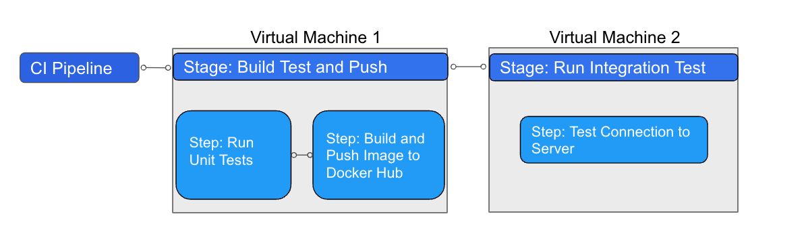

With Harness Cloud, you can run builds in isolation on Harness-hosted VMs that are preconfigured with tools, packages, and settings commonly used in CI pipelines. Harness hosts, maintains, and upgrades these machines so that you can focus on building software instead of maintaining build infrastructure.

Harness Cloud provides the following advantages:

* Free monthly credits for up to 2,000 build minutes.
* Starter pipelines for different programming languages.
* Blazing fast builds on Linux, macOS, and Windows.
* Get the latest features first. Harness may enable features for Harness Cloud before rolling them out to other build infrastructure options.

:::info What happens when pipelines run on Harness Cloud?

During a pipeline build that uses Harness Cloud build infrastructure, Harness runs each CI stage in a new, ephemeral VM.



The steps in each stage execute on the stage's dedicated VM. This allows the stage's steps to share information through the underlying filesystem. You can run CI steps directly on the VM or in a Docker container. When the stage is complete, the VM automatically shuts down.

:::

## Requirements

* You must use Harness Secret Manager to store connector credentials and other secrets.
* All connectors must connect through the Harness Platform, not the delegate.
* AWS connectors can't use IRSA or AssumeRole.
* GCP and Azure connectors can't inherit credentials from the delegate.

For a comparison of build infrastructure options, go to [Which build infrastructure is right for me](./which-build-infrastructure-is-right-for-me.md).

## Platforms and image specifications

Harness Cloud offers the following operating systems and architectures:

* Linux: amd64 and arm64
* macOS: arm64 (M1)
* Windows: amd64

:::tip

To enable Windows and macOS for Harness Cloud, contact [Harness Support](mailto:support@harness.io).

:::

Refer to the following image specification README files for more information about image components and preinstalled software.

* [Linux amd64 image specifications](https://github.com/wings-software/harness-docs/blob/main/harness-cloud/Linux-amd/Ubuntu2204-Readme.md)
* [Linux arm64 image specifications](https://github.com/wings-software/harness-docs/blob/main/harness-cloud/Linux-arm/Ubuntu2204-Readme.md)
* [macOS image specifications](https://github.com/wings-software/harness-docs/blob/main/harness-cloud/macos-13-Readme.md)
* [Windows Server 2019 image specifications](https://github.com/wings-software/harness-docs/blob/main/harness-cloud/Windows2019-Readme.md)

You can include steps in your pipeline to specify a version of a tool installed on an image, lock the stage to a required version, or install additional tools and versions that aren't available on the image. These steps run on the host machine or run as separate Docker images.

:::caution

Harness Cloud machine images can change. If your pipeline relies on a specific version of a software, tool, or environment, use the instructions in [Lock versions or install additional tools](#lock-versions-or-install-additional-tools) to prevent your pipeline from failing when the image changes.

:::

### Specify versions

If there are multiple versions of a tool installed on an image, you can specify the version to use in a step's **Command**. For example, with the Harness Cloud macOS build infrastructure, you could use the following command in a **Run** step to select an Xcode version:

```
sudo xcode-select -switch /Applications/Xcode_14.1.0.app
```

However, Harness Cloud machine images can change. If your pipeline relies on a specific version of a software, tool, or environment, use the instructions in [Lock versions or install additional tools](#lock-versions-or-install-additional-tools) to prevent your pipeline from failing when the image changes.

### Lock versions or install additional tools

If your build requires a specific version of a tool or a tool that isn't already available on the Harness Cloud image, you can use a step to install it directly or run it in a Docker image. There are a variety of steps you can use to do this, such as a [Run step](../run-ci-scripts/run-step-settings.md) or a [Plugin step](../use-drone-plugins/explore-ci-plugins.md).

<details>
<summary>Example: Install Java 17</summary>

In the following YAML example, an [Action step](../use-drone-plugins/ci-github-action-step.md) runs the `actions/setup-java` GitHub Action to install Java 17, and then the **Run** step confirms the Java version.

```yaml
            steps:
              - step:
                  identifier: install_java
                  name: intall java version 17
                  type: Action
                  spec:
                    uses: actions/setup-java@v3
                    with:
                      distribution: 'temurin'
                      java-version: '17'
              - step:
                  identifier: java_ver_check
                  name: java version check
                  type: Run
                  spec:
                    shell: Bash
                    command: |
                      JAVA_VER=$(java -version 2>&1 | head -1 | cut -d'"' -f2 | sed '/^1\./s///' | cut -d'.' -f1)
                      if [[ $JAVA_VER == 17 ]]; then
                        echo successfully installed $JAVA_VER
                      else
                        exit 1
                      fi
```

:::tip

You can also use the [Bitrise plugin step](../use-drone-plugins/ci-bitrise-plugin.md) to run Bitrise Integrations in your CI pipelines.

:::

</details>

<details>
<summary>Example: Pull a Docker image</summary>

The following YAML example demonstrates how a **Run** step can use a Docker image (specified in `conectorRef` and `image`) to leverage tools available on that image that aren't available on the host image:

```yaml
    - stage:
        name: Print welcome message
        identifier: welcome_message
        type: CI
        spec:
          cloneCodebase: true
          platform: // Platform properties describe the target machine required by this stage.
            os: Linux
            arch: Amd64
          runtime:
            type: Cloud // This build runs on Harness-provided infrastructure.
            spec: {}
          execution:
            steps:
              - step:
                  type: Run
                  name: Welcome
                  identifier: Welcome
                  spec:
                    connectorRef: my_docker_hub // Specify a Docker connector to pull an image from Docker.
                    image: alpine // If no image is specified, the step runs on the host machine.
                    shell: Sh
                    command: Echo "Welcome to Harness CI"
```

:::caution

Steps running in containers can't communicate with [Background steps](../manage-dependencies/background-step-settings.md) running on the Harness Cloud build infrastructure, because they do not have a common host.

:::

</details>

## Use Harness Cloud

You can start using Harness Cloud in minutes.

```mdx-code-block
import Tabs from '@theme/Tabs';
import TabItem from '@theme/TabItem';
```

```mdx-code-block
<Tabs>
  <TabItem value="Visual" label="Visual editor" default>
```

1. Go to the pipeline where you want to use Harness Cloud build infrastructure.
2. Select the **Build** stage, and then select the **Infrastructure** tab.
3. Select **Harness Cloud** and the desired **Platform**.
4. Save and run your pipeline.

```mdx-code-block
  </TabItem>
  <TabItem value="YAML" label="YAML editor">
```

To enable Harness Cloud build infrastructure in your pipeline YAML, specify the `platform` and `runtime` in the `stage.spec`. For example:

```yaml
          platform:
            os: Linux
            arch: Amd64
          runtime:
            type: Cloud
            spec: {}
```

* In `runtime`, you must include `type: Cloud`.
* In `platform`, specify the `os` and `arch`. For a list of supported operating systems and architectures, go to [Platforms and image specifications](#platforms-and-image-specifications).

<details>
<summary>Pipeline YAML example</summary>

The following YAML example illustrates a basic CI pipeline that uses Harness Cloud build infrastructure:

```yaml
pipeline:
  name: Build sample-app
  identifier: Build_sample_app_1677210779657
  projectIdentifier: my-app-project
  orgIdentifier: default
  properties:
    ci:
      codebase:
        connectorRef: account.GitHub_example
        repoName: my-gh-account/example-repo
        build: <+input>
  stages:
    - stage:
        name: Build
        identifier: Build
        type: CI
        spec:
          cloneCodebase: true
          execution:
            steps:
              - step:
                  type: Run
                  name: Echo Welcome Message
                  identifier: Echo_Welcome_Message
                  spec:
                    shell: Sh
                    command: echo "Welcome to Harness CI"
          platform:
            os: Linux
            arch: Amd64
          runtime:
            type: Cloud
            spec: {}
```

</details>

```mdx-code-block
  </TabItem>
</Tabs>
```

:::info

Add steps to your pipeline to specify versions of tools, set up environments, or install additional tools. For image specifications and instructions on specifying versions, locking versions, and installing additional tools, go to the [Platforms and image specifications](#platforms-and-image-specifications) section, above.

Harness Cloud machine images can change. If your pipeline relies on a specific version of a software, tool, or environment, use the instructions to **Lock versions or install additional tools** in [Platforms and image specifications](#platforms-and-image-specifications) to prevent your pipeline from failing when the image changes.

:::

<!-- whitelist removed - DOC-2875 -->
