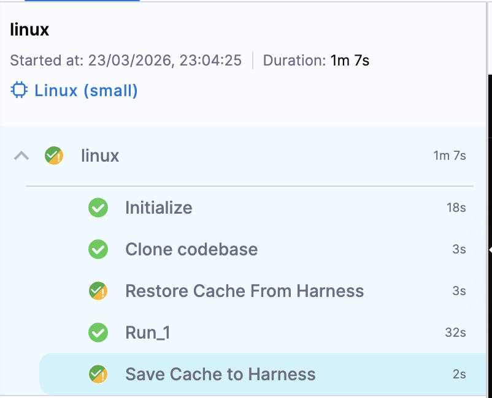
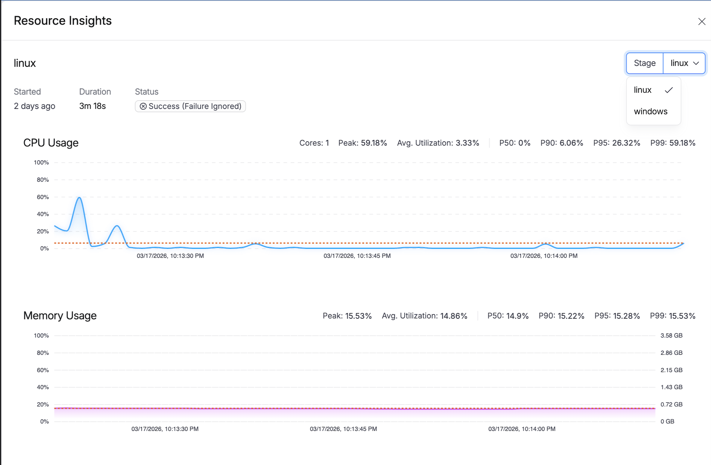
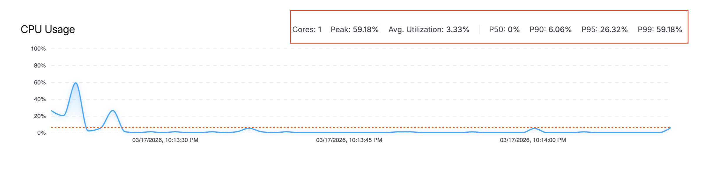

Harness CI provides real-time visibility into resource utilization during CI stage execution. This feature helps you understand how your builds consume CPU and memory resources, enabling you to optimize resource allocation and troubleshoot performance issues.

:::info Cloud-only feature
This feature is **only available for CI stages running on Harness Cloud** build infrastructure across **Linux**, **macOS**, and **Windows** platforms. It is not supported on self-managed build infrastructures.
:::

:::info Feature flag
This feature requires the `CI_CPU_MEMORY_INSIGHTS` feature flag. To enable it, contact [Harness Support](mailto:support@harness.io).
:::

## Access resource metrics

To view resource utilization metrics for a pipeline execution:

1. Go to **Builds** and select a completed or running build.
2. Select the stage that ran on Harness Cloud infrastructure.
3. In the execution view, locate the **resource info button** in the stage header. The button displays the platform and resource class, such as **Linux (Large)** or **Windows (Medium)**.

   

4. Select the button to open the **Resource Insights** drawer.

## Understanding the metrics

The Resource Insights drawer displays real-time and summary metrics for your build execution.

### Real-time metrics

During pipeline execution, metrics are collected periodically and displayed as interactive charts:

| Metric | Description |
|--------|-------------|
| **CPU Usage** | Percentage of CPU utilized over time |
| **Memory Usage** | Memory consumption in GB over time |

### Summary metrics

After the pipeline completes, summary statistics are calculated to help you understand overall resource consumption:

| Metric | Description |
|--------|-------------|
| **Peak Usage** | Maximum resource utilization during execution |
| **Avg. Utilization** | Mean resource utilization across the entire execution |
| **P50** | 50th percentile (median) usage |
| **P90** | 90th percentile usage — 90% of the time, usage was at or below this value |
| **P95** | 95th percentile usage |
| **P99** | 99th percentile usage |

:::tip Understanding percentile metrics
Percentile metrics are useful for capacity planning. For example, P90 tells you that 90% of your build time had resource usage at or below this level, filtering out brief spikes that might skew the average.
:::

## Use cases

### Right-size your resource class

If your P90 CPU or memory usage is consistently low (for example, below 30%), consider using a smaller resource class to reduce costs. Conversely, if you see frequent spikes near 100%, upgrading to a larger resource class may improve build performance.

For available resource classes, go to [Use Harness Cloud build infrastructure](/docs/continuous-integration/use-ci/set-up-build-infrastructure/use-harness-cloud-build-infrastructure#platforms-and-resource-classes).

### Diagnose slow builds

High CPU or memory utilization during specific steps can indicate:

- Resource-intensive operations that might benefit from optimization
- Memory leaks in test suites
- Inefficient parallel execution configurations

### Identify OOM risks

If memory usage approaches the resource class limit, your build may be at risk of Out of Memory (OOM) failures. The metrics help you proactively identify and address these issues before they cause build failures.

## Data retention

Resource utilization metrics are available for up to **30 days** from the pipeline execution date, consistent with the default execution data retention period.

## Metrics data

The following metrics are collected during CI stage execution:

| Field | Unit | Description |
|-------|------|-------------|
| Total Memory | GB | Total available system memory |
| Available Memory | GB | Free memory at each sample |
| Total CPU | Cores | Number of CPU cores |
| Available CPU | % | Unused CPU percentage |

## See also

- [Use Harness Cloud build infrastructure](/docs/continuous-integration/use-ci/set-up-build-infrastructure/use-harness-cloud-build-infrastructure)
- [Harness CI Intelligence](/docs/continuous-integration/use-ci/harness-ci-intelligence)
- [Troubleshoot CI](/docs/continuous-integration/troubleshoot-ci/troubleshooting-ci)
