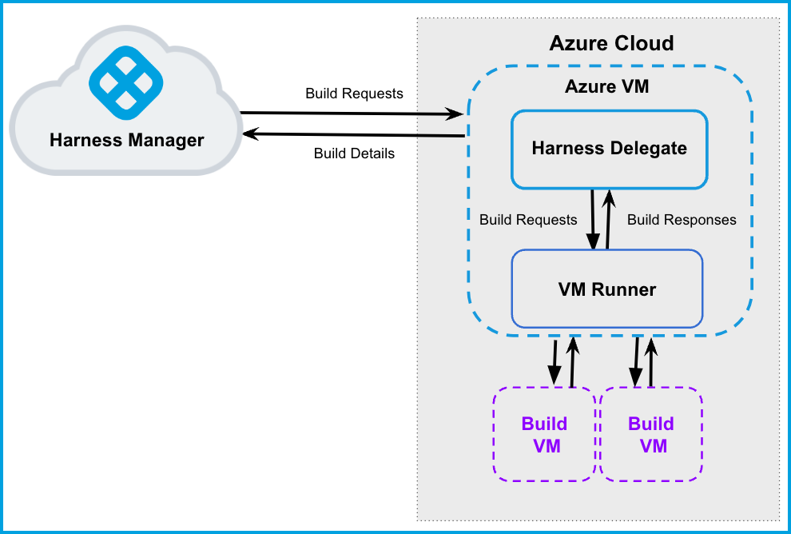

```mdx-code-block
import Tabs from '@theme/Tabs';
import TabItem from '@theme/TabItem';
```

:::note
Currently, this feature is behind the Feature Flag `CI_VM_INFRASTRUCTURE`. Contact [Harness Support](mailto:support@harness.io) to enable the feature.
:::

This topic describes how to set up a CI build infrastructure in Microsoft Azure. To do this, you will create a VM and install a Harness Delegate and Drone VM Runner on it. The runner creates VMs dynamically in response to CI build requests. The delegate and runner VM can be inside or outside Azure; however, the instructions on this page assume you will create the VM in Azure.

This is one of several CI build infrastructure options. For example, you can also [set up a Kubernetes cluster build infrastructure](../k8s-build-infrastructure/set-up-a-kubernetes-cluster-build-infrastructure.md).

The following diagram illustrates a CI build farm. The [Harness Delegate](/docs/platform/delegates/delegate-concepts/delegate-overview) communicates directly with your Harness instance. The [VM Runner](https://docs.drone.io/runner/vm/overview/) maintains a pool of VMs for running builds. When the delegate receives a build request, it forwards the request to the runner, which runs the build on an available VM.



## Prepare Azure

You need to set up an Azure Application and VM. You must have access to Azure and permission to create Azure Applications and VMs.

1. In Azure, use the following requirements to create a VM to run the Harness Delegate:

   * The delegate VM must use a machine type with 4 vCPU and 16 GB memory or more.
   * Harness recommends the following machine images:
      * [Ubuntu 18.04 LTS](https://azuremarketplace.microsoft.com/en-us/marketplace/apps/canonical.0001-com-ubuntu-pro-bionic?tab=overview)
      * [Microsoft Windows Server 2019 with Containers](https://az-vm-image.info/?cmd=--all+--publisher+microsoftwindowsserver+--sku+containers+--query+%22%5B%3Fcontains%28version%2C+%272019%27%29%5D%22)
   * The VM must allow ingress access on ports 22 and 9079.
   * You must also open port 3389 if you want to run Windows builds and be able to RDP into your build VMs.

   For more information about Azure machine images, go to the [Drone documentation on Azure drivers](https://docs.drone.io/runner/vm/drivers/azure/).

2. Create an Azure Application with the Owner role assigned to your delegate VM.

   To assign a role to your VM, log in to Azure, go to [Virtual Machines](https://portal.azure.com/#view/HubsExtension/BrowseResource/resourceType/Microsoft.Compute%2FVirtualMachines), select your VM, and go to **Access Control (IAM)**.

3. Make sure the Azure Application is a Contributor on the subscription.

## Set Up the Delegate VM

1. Log in to Azure, go to [Virtual Machines](https://portal.azure.com/#view/HubsExtension/BrowseResource/resourceType/Microsoft.Compute%2FVirtualMachines), and then launch the delegate VM.
2. [Install Docker](https://docs.docker.com/desktop/vm-vdi/) on the VM.
3. [Install Docker Compose](https://docs.docker.com/compose/install/) on the VM. You must have [Docker Compose version 3.7](https://docs.docker.com/compose/compose-file/compose-versioning/#version-37) or higher installed.

## Configure the Drone pool on the Azure VM

The `pool.yml` file defines the VM spec and pool size for the VM instances used to run the Pipeline. A pool is a group of instantiated VM that are immediately available to run CI pipelines. You can configure multiple pools in `pool.yml`, such as a Windows VM pool and a Linux VM pool.

1. Create a `/runner` folder on your delegate VM and `cd` into it:

   ```
   mkdir /runner
   cd /runner
   ```
2. In the `/runner` folder, create a `pool.yml` file.
3. Modify `pool.yml` as described in the following examples. For information about specific settings, go to [Pool settings reference](#pool-settings-reference).

### pool.yml examples

```mdx-code-block
<Tabs>
  <TabItem value="ubuntu" label="Ubuntu 18.04 pool.yml" default>
```

```yaml
version: "1"
instances:
  - name: ubuntu-azure-pool
    default: true
    type: azure
    pool: 1
    limit: 4
    platform:
      os: linux
      arch: amd64
    spec:
      account:
        client_id: XXXXXX ## Your Azure Application ID. Required for the runner to be able to create new VMs.
        client_secret: XXXXX ## Required for the runner to be able to create new VMs.
        subscription_id: XXXXXX ## Required for the runner to be able to create new VMs.
        tenant_id: XXXXXX ## Your Directory ID. Required for the runner to be able to create new VMs.
      location: eastus2 ## To minimize latency, use the same region as the delegate VM.
      size : Standard_F2s
      tags:
        tagName: tag
      image:
        username: azureuser
        password: XXXXXXX
        publisher: Canonical
        offer: UbuntuServer
        sku: 18.04-LTS
        version: latest
```

```mdx-code-block
  </TabItem>
  <TabItem value="windows" label="Windows Server 2019 pool.yml">
```

```yaml
version: "1"
instances:
- name: ubuntu-azure
  default: true
  type: azure
  platform:
    os: windows
  spec:
    account:
      client_id: XXXXXX ## Your Azure Application ID. Required for the runner to be able to create new VMs.
      client_secret: XXXXX ## Required for the runner to be able to create new VMs.
      subscription_id: XXXXXX ## Required for the runner to be able to create new VMs.
      tenant_id: XXXXXX ## Your Directory ID. Required for the runner to be able to create new VMs.
    location: eastus2 ## To minimize latency, use the same region as the delegate VM.
    size: Standard_F2s
    tags:
      tagName: tag
    image:
      username: XXXXXXX
      password: XXXXXXX
      publisher: MicrosoftWindowsServer
      offer: WindowsServer
      sku: 2019-Datacenter-with-Containers
      version: latest
```

```mdx-code-block
  </TabItem>
</Tabs>
```

### Pool settings reference

You can configure the following settings in your `pool.yml` file. You can also learn more in the Drone documentation for the [Pool File](https://docs.drone.io/runner/vm/configuration/pool/) and [Azure drivers](https://docs.drone.io/runner/vm/drivers/azure/).

:::info

The `account` settings (`client_id`, `client_secret`, `subscription_id`, and `tenant_id`) are required to allow the runner to create new VMs.

:::

| Setting | Type | Example | Description |
| ------- | ---- | ------- | ----------- |
| `name` | String | `name: windows_pool` | Unique identifier of the pool. You will need to specify this pool name in the Harness Manager when you set up the CI stage build infrastructure. |
| `pool` | Integer | `pool: 1` | Warm pool size number. Denotes the number of VMs in ready state to be used by the runner. |
| `limit` | Integer | `limit: 3` | Maximum number of VMs the runner can create at any time. `pool` indicates the number of warm VMs, and the runner can create more VMs on demand up to the `limit`.<br/>For example, assume `pool: 3` and `limit: 10`. If the runner gets a request for 5 VMs, it immediately provisions the 3 warm VMs (from `pool`) and provisions 2 more, which are not warm and take time to initialize. |
| `platform` | Key-value pairs, strings | `platform: os: linux arch: amd64 variant: VERSION` | Specify VM platform operating system (`os`) and architecture (`arch`). `variant` is optional. |
| `spec` | Key-value pairs, various | Go to [pool.yml examples](#poolyml-examples). | Configure settings for the build VMs.<ul><li>`account`: Provide Azure account settings the runner needs to create new VMs:<ul><li>`client_id`: Your Azure application ID. To find the client ID in Azure, go to **App Registrations**, then **Directory (tenant) ID**, and then select your app.</li><li>`client_secret`: To create a client secret, go to your app in Azure, and then select **Certificates and Secrets**.</li><li>`subscription_id`: To find the subscription ID in Azure, go to [Virtual Machines](https://portal.azure.com/#view/HubsExtension/BrowseResource/resourceType/Microsoft.Compute%2FVirtualMachines) and select your delegate VM.</li><li>`tenant_id`: Your Directory ID. To find the tenant ID in Azure, go to **App Registrations**, then **Directory (tenant) ID**, and then select your app.</li></ul></li><li>`image`: The image type to use for the build VM.</li><li>`location`: The Azure region for the build VMs. To minimize latency, use the same region as the delegate VM.</li><li>`size`: The Azure VM size.</li><li>`tag`: You can add an optional tag to identify build VMs.</li><li>`disk`: You can provide the `size` (as an integer representing GB) and `type` (as a string)</li></ul> |

## Start the runner

[SSH into the delegate VM](https://learn.microsoft.com/en-us/azure/virtual-machines/windows/connect-ssh?tabs=azurecli) and run the following command to start the runner:

```
$ docker run -v /runner:/runner -p 3000:3000 drone/drone-runner-aws:latest  delegate --pool /runner/pool.yml
```

This command mounts the volume to the Docker container providing access to `pool.yml` to authenticate with Azure. It also exposes port 3000 and passes arguments to the container.

## Install the delegate

Install a Harness **Docker** Delegate on your delegate VM.

1. Create a delegate token. The delegate uses this token to authenticate with the Harness Platform.

   * In Harness, go to **Account Settings**, then **Account Resources**, and then select **Delegates**.
   * Select **Tokens** in the header, and then select **New Token**.
   * Enter a token name and select **Apply** to generate a token.
   * Copy the token and store is somewhere you can retrieve it when installing the delegate.

2. Again, go to **Account Settings**, then **Account Resources**, and then **Delegates**.
3. Select **New Delegate**.
4. Select **Docker** and enter a name for the delegate.
5. Copy and run the install command generated in Harness. Make sure the `DELEGATE_TOKEN` matches the one you just created.

For more information about delegates and delegate installation, go to [Delegate installation overview](/docs/platform/delegates/install-delegates/overview).

## Verify connectivity

1. Verify that the delegate and runner containers are running correctly. You might need to wait a few minutes for both processes to start. You can run the following commands to check the process status:

	 ```
	 $ docker ps
	 $ docker logs DELEGATE_CONTAINER_ID
	 $ docker logs RUNNER_CONTAINER_ID
	 ```

2. In the Harness UI, verify that the delegate appears in the delegates list. It might take two or three minutes for the Delegates list to update. Make sure the **Connectivity Status** is **Connected**. If the **Connectivity Status** is **Not Connected**, make sure the Docker host can connect to `https://app.harness.io`.

   

The delegate and runner are now installed, registered, and connected.

## Specify build infrastructure

Configure your pipeline's **Build** (`CI`) stage to use your Azure VMs as build infrastructure.

```mdx-code-block
<Tabs>
  <TabItem value="Visual" label="Visual">
```

1. In Harness, go to the CI pipeline that you want to use the Azure VM build infrastructure.
2. Select the **Build** stage, and then select the **Infrastructure** tab.
3. Select **VMs**.
4. Enter the **Pool Name** from your [pool.yml](#configure-the-drone-pool-on-the-azure-vm).
5. Save the pipeline.

<!--  -->

<docimage path={require('../static/ci-stage-settings-vm-infra.png')} />

```mdx-code-block
  </TabItem>
  <TabItem value="YAML" label="YAML" default>
```

```yaml
    - stage:
        name: build
        identifier: build
        description: ""
        type: CI
        spec:
          cloneCodebase: true
          infrastructure:
            type: VM
            spec:
              type: Pool
              spec:
                poolName: POOL_NAME_FROM_POOL_YML
                os: Linux
          execution:
            steps:
            ...
```

```mdx-code-block
  </TabItem>
</Tabs>
```
