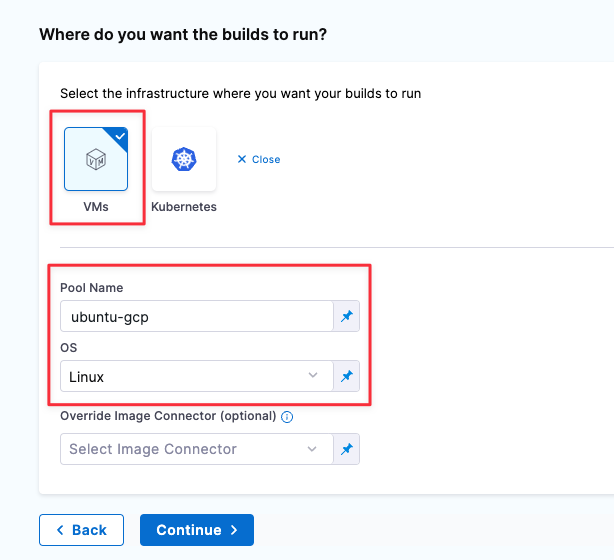

:::note
Currently, this feature is behind the Feature Flag `CI_VM_INFRASTRUCTURE`. Contact [Harness Support](mailto:support@harness.io) to enable the feature.
:::

This topic describes how to set up a CI build infrastructure in Google Cloud Platform. You will create an Ubuntu VM and then install a Harness Delegate and Drone Runner on it. The delegate creates VMs dynamically in response to CI build requests.

This is one of several CI build infrastructure options. For example, you can also [set up a Kubernetes cluster build infrastructure](../k8s-build-infrastructure/set-up-a-kubernetes-cluster-build-infrastructure.md).

The following diagram illustrates a CI build farm. The [Harness Delegate](/docs/platform/delegates/delegate-concepts/delegate-overview) communicates directly with your Harness instance. The [VM Runner](https://docs.drone.io/runner/vm/overview/) maintains a pool of VMs for running builds. When the delegate receives a build request, it forwards the request to the runner, which runs the build on an available VM.


## Prepare Google Cloud VMs

For your Google Cloud VM configuration:

* The delegate VM must use a machine type with 4 vCPU and 16 GB memory or more.
* Harness recommends the [Ubuntu 18.04 LTS (Bionic)](https://console.cloud.google.com/marketplace/product/ubuntu-os-cloud/ubuntu-bionic?project=docs-play) machine image.
* The VM must allow ingress access on ports 22 and 9079.

To find images to use on Google Compute Engine, use `gcloud compute images list`.

Valid image references follow the format of `projects/PROJECT/global/images/IMAGE`. For example: `projects/docs-test/global/images/ubuntu-pro-1804-bionic-v20220131`.

## Step 1: Set up the delegate VM

1. Log into the [Google Cloud Console](https://console.cloud.google.com/) and launch the VM that will host your Harness delegate.
2. [Install Docker](https://docs.aws.amazon.com/AmazonECS/latest/developerguide/docker-basics.html#install_docker) on the VM.
3. [Install Docker Compose](https://docs.docker.com/compose/install/) on the VM. You must have [Docker Compose version 3.7](https://docs.docker.com/compose/compose-file/compose-versioning/#version-37) or higher installed.
4. On the VM, run `gcloud auth application-default login` to create an `application_default_credentials.json` file at `/home/$(whoami)/.config/gcloud`

## Step 2: Configure the Drone pool on the Google VM

The `pool.yml` file defines the VM spec and pool size for the VM instances used to run the pipeline. A pool is a group of instantiated VMs that are immediately available to run CI pipelines.

1. Create a `/runner` folder on your delegate VM and `cd` into it:

   ```
   mkdir /runner
   cd /runner
   ```
2. In the `/runner` folder, create a `pool.yml` file.
3. Modify `pool.yml` as described in the following example. For information about specific settings, go to [Pool settings reference](#pool-settings-reference).

### Example pool.yml

```yaml
version: "1"
instances:
  - name: ubuntu-gcp
    default: true
    type: google
    pool: 1
    limit: 1
    platform:
      os: linux
      arch: amd64
    spec:
      account:
        project_id: ci-play ## Your Google project ID.
        json_path: /path/to/key.json ## Your JSON credentials file.
      image: projects/ubuntu-os-pro-cloud/global/images/ubuntu-pro-1804-bionic-v20220510
      machine_type: e2-small
      zone: ## To minimize latency between delegate and build VMs, specify the same zone where your delegate VM is running.
        - us-centra1-a
        - us-central1-b
        - us-central1-c
      disk:
        size: 100
        type: "pd-balanced"
```

### Pool settings reference

You can configure the following settings in your `pool.yml` file. You can also learn more in the Drone documentation for the [Pool File](https://docs.drone.io/runner/vm/configuration/pool/) and [Google Drivers](https://docs.drone.io/runner/vm/drivers/google/).

| Setting | Type | Example | Description |
| ------- | ---- | ------- | ----------- |
| `name` | String | `name: windows_pool` | Unique identifier of the pool. You will need to specify this pool name in the Harness Manager when you set up the CI Stage Infrastructure. |
| `pool` | Integer | `pool: 1` | Minimum pool size number. Denotes the minimum number of cached VMs in ready state to be used by the Runner. |
| `limit` | Integer | `limit: 3` | Maximum pool size number. Denotes the maximum number of cached VMs in ready state to be used by the Runner. |
| `platform` | Key-value pairs, strings | `platform: os: linux arch: amd64 variant: VERSION` | Specify VM platform operating system (`os`) and architecture (`arch`). `variant` is optional. |
| `spec` | Various | Configure settings for the build VMs.<br/><ul><li>`account`: Specify your GCP project Id and the full path and filename of your local Google credentials file.</li><li>`image`: The image type to use for the build VM.</li><li>`machine_type`: The google machine type. See [About Machine Families](https://cloud.google.com/compute/docs/machine-types) in the Google Cloud docs.</li><li>`zone`: To minimize latency, specify the zone where the delegate is running.</li></ul> |

<!--
## Step 3: Configure the docker-compose.yaml file

1. In your Harness account, organization, or project, select **Delegates** under **Project Setup**.
2. Click **New Delegate** and select **Switch back to old delegate install experience**.
3. Select **Docker** and then select **Continue**.
4. Enter a **Delegate Name**. Optionally, you can add **Tags** or **Delegate Tokens**. Then, select **Continue**.
5. Select **Download YAML file** to download the `docker-compose.yaml` file to your local machine.

Next, you'll add the Runner spec to the new Delegate definition. The Harness Delegate and Runner run on the same VM. The Runner communicates with the Harness Delegate on `localhost` and port `3000` of your VM.

1. Copy your local `docker-compose.yaml` file to the `/runner` folder on the VM. This folder should now have both `docker-compose.yaml` and `pool.yml`.
2. Open `docker-compose.yaml` in a text editor.
3. Append the following to the end of the `docker-compose.yaml` file:

   ```yaml
   drone-runner-aws:  
       restart: unless-stopped  
       image: drone/drone-runner-aws:latest  
       volumes:  
         - /runner:/runner  
         - /path/to/google/credentials/file/:/key  
           # example: /home/jsmith/.config/gcloud/:/key  
       entrypoint: ["/bin/drone-runner-aws", "delegate", "--pool", "pool.yml"]  
       working_dir: /runner  
       ports:  
         - "3000:3000"
   ```

4. Under `services: harness-ng-delegate: restart: unless-stopped`, add the following line:

   ```yaml
   network_mode: "host"
   ```

5. Save `docker-compose.yaml`.

<details>
<summary>Example: docker-compose.yaml with Runner spec</summary>

```yaml
version: "3.7"  
services:  
  harness-ng-delegate:  
    restart: unless-stopped  
    network_mode: "host"  
    deploy:  
      resources:  
        limits:  
          cpus: "0.5"  
          memory: 2048M  
    image: harness/delegate:latest  
    environment:  
      - ACCOUNT_ID=XXXXXXXXXXXXXXXX  
      - ACCOUNT_SECRET=XXXXXXXXXXXXXXXX  
      - MANAGER_HOST_AND_PORT=https://app.harness.io  
      - WATCHER_STORAGE_URL=https://app.harness.io/public/qa/premium/watchers  
      - WATCHER_CHECK_LOCATION=current.version  
      - REMOTE_WATCHER_URL_CDN=https://app.harness.io/public/shared/watchers/builds  
      - DELEGATE_STORAGE_URL=https://app.harness.io  
      - DELEGATE_CHECK_LOCATION=delegateqa.txt  
      - USE_CDN=true  
      - CDN_URL=https://app.harness.io  
      - DEPLOY_MODE=KUBERNETES  
      - DELEGATE_NAME=qwerty  
      - NEXT_GEN=true  
      - DELEGATE_DESCRIPTION=  
      - DELEGATE_TYPE=DOCKER  
      - DELEGATE_TAGS=  
      - DELEGATE_TASK_LIMIT=50  
      - DELEGATE_ORG_IDENTIFIER=  
      - DELEGATE_PROJECT_IDENTIFIER=  
      - PROXY_MANAGER=true  
      - VERSION_CHECK_DISABLED=false  
      - INIT_SCRIPT=echo "Docker delegate init script executed."  
  drone-runner-aws:  
    restart: unless-stopped  
    image: drone/drone-runner-aws:latest  
    volumes:  
      - /runner:/runner  
      - /home/jsmith/.config/gcloud/:/key  
    entrypoint: ["/bin/drone-runner-aws", "delegate", "--pool", "pool.yml"]  
    working_dir: /runner  
    ports:  
      - "3000:3000"
```

</details>

For more information on Harness Docker Delegate environment variables, go to the [Harness Docker Delegate environment variables reference](/docs/platform/2_Delegates/delegate-reference/docker-delegate-environment-variables.md).

## Step 4: Install the Delegate and Runner

1. [SSH](https://docs.aws.amazon.com/AWSEC2/latest/UserGuide/AccessingInstancesLinux.html) into the Delegate VM and `cd` to `/runner`.
2. Confirm that the folder has both setup files, for example:

	 ```
	 $ ls -a
	 . .. docker-compose.yml pool.yml
	 ```

3. Run the following command to install the Delegate and Runner:

	 ```
	 $ docker-compose -f docker-compose.yml up -d
	 ```

4. Verify that both containers are running correctly. You might need to wait a few minutes for both processes to start. You can run the following commands to check the process status:

	 ```
	 $ docker ps  
	 $ docker logs <delegate-container-id>  
	 $ docker logs <runner-container-id>
	 ```

5. In the Harness UI, verify that the Delegate appears in the Delegates list. It might take two or three minutes for the Delegates list to update. Make sure the **Connectivity Status** is **Connected**. If the **Connectivity Status** is **Not Connected**, make sure the Docker host can connect to `https://app.harness.io`.

   

The Delegate and Runner are now installed, registered, and connected.
-->

## Step 3: Start the runner and install the delegate

1. [SSH](https://docs.aws.amazon.com/AWSEC2/latest/UserGuide/AccessingInstancesLinux.html) into the delegate VM and run the following command to start the runner:

	 ```
	 $ docker run -v /home/YOUR_NAME/drone-runner-aws/runner:/runner -p 3000:3000 drone/drone-runner-aws:latest  delegate --pool /runner/pool.yml
	 ```

   This command mounts the volume to the Docker container providing access to `pool.yml` and JSON credentials to authenticate with GCP. It also exposes port 3000 and passes arguments to the container.

2. Install the Harness Delegate on your delegate VM. Follow the **Docker** instructions in [Install the default delegate on Kubernetes or Docker](/docs/platform/delegates/install-delegates/overview/), and then run the delegate installation command provided in the Harness Platform.
3. Verify that the delegate and runner containers are running correctly. You might need to wait a few minutes for both processes to start. You can run the following commands to check the process status:

	 ```
	 $ docker ps
	 $ docker logs DELEGATE_CONTAINER_ID
	 $ docker logs RUNNER_CONTAINER_ID
	 ```

4. In the Harness UI, verify that the delegate appears in the delegates list. It might take two or three minutes for the Delegates list to update. Make sure the **Connectivity Status** is **Connected**. If the **Connectivity Status** is **Not Connected**, make sure the Docker host can connect to `https://app.harness.io`.

   

The delegate and runner are now installed, registered, and connected.

## Step 4: Select pipeline build infrastructure

1. In your CI pipeline's **Build** stage, select the **Infrastructure** tab, and then select **VMs**.
2. In the **Pool ID**, enter the pool `name` from your [pool.yml](#step-2-configure-the-drone-pool-on-the-google-vm).

   

This pipeline's **Build** stage now uses your GCP VMs for its build infrastructure.

<!--
## Troubleshooting (Advanced)

If you have problems running the delegate, runner, or VMs, you can collect debug and trace information in your container logs.

1. Create a `.env` file with the following options in your `/runner` folder:
   ```
   DRONE_DEBUG=true  
   DRONE_TRACE=true
   ```
2. Shut down the delegate and runner: `docker-compose down`
3. In your `docker-compose.yml` file, update the `drone-runner-aws: entrypoint` to include the `.env` file:
   ```
    drone-runner-aws:  
    restart: unless-stopped  
    image: drone/drone-runner-aws:1.0.0-rc.9  
    volumes:  
      - /runner:/runner  
      - /home/jsmith/.config/gcloud/:/key  
    entrypoint: ["/bin/drone-runner-aws", "delegate", "--envfile", ".env", "--pool", "pool.yml"]  
    working_dir: /runner  
    ports:  
      - "3000:3000"      
   ```
4. Restart the delegate and runner: `docker-compose up`
-->
