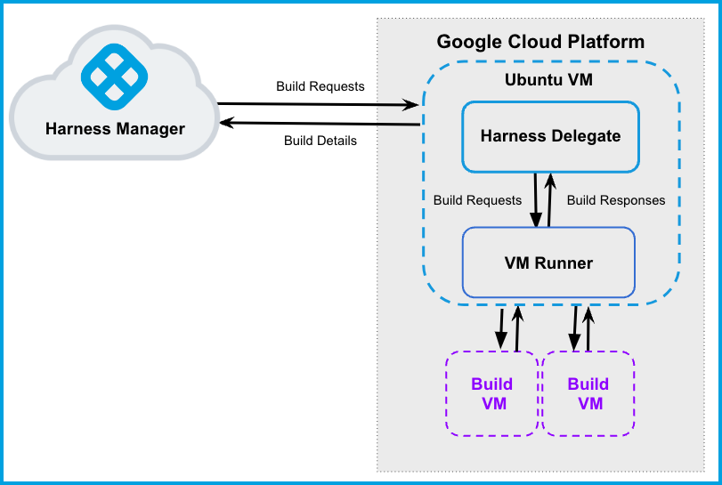

:::note
Currently, this feature is behind the Feature Flag `CI_VM_INFRASTRUCTURE`. Contact [Harness Support](mailto:support@harness.io) to enable the feature.
:::

This topic describes how to set up a CI build infrastructure in Google Cloud Platform (GCP). To do this, you will create an Ubuntu VM and then install a Harness Delegate and Drone VM Runner on it. The runner creates VMs dynamically in response to CI build requests.

This is one of several CI build infrastructure options. For example, you can also [set up a Kubernetes cluster build infrastructure](../k8s-build-infrastructure/set-up-a-kubernetes-cluster-build-infrastructure.md).

The following diagram illustrates a CI build farm. The [Harness Delegate](/docs/platform/delegates/delegate-concepts/delegate-overview) communicates directly with your Harness instance. The [VM Runner](https://docs.drone.io/runner/vm/overview/) maintains a pool of VMs for running builds. When the delegate receives a build request, it forwards the request to the runner, which runs the build on an available VM.



## Prepare the Google Cloud VM

For your Google Cloud VM configuration:

* The delegate VM must use a machine type with 4 vCPU and 16 GB memory or more.
* Harness recommends an Ubuntu 20.04 LTS machine image, such as [Focal](https://console.cloud.google.com/marketplace/product/ubuntu-os-cloud/ubuntu-focal) or [Jammy](https://console.cloud.google.com/marketplace/product/ubuntu-os-cloud/ubuntu-jammy).
* The VM must allow ingress access on ports 22 and 9079.

To find images to use on Google Compute Engine, use `gcloud compute images list`.

Valid image references follow the format of `projects/PROJECT/global/images/IMAGE`. For example: `projects/docs-test/global/images/ubuntu-pro-1804-bionic-v20220131`.

## Set up the delegate VM

1. Log into the [Google Cloud Console](https://console.cloud.google.com/) and launch the VM that will host your Harness delegate.
2. [Install Docker](https://docs.docker.com/engine/install/ubuntu/) on the VM.
3. [Install Docker Compose](https://docs.docker.com/compose/install/) on the VM. You must have [Docker Compose version 3.7](https://docs.docker.com/compose/compose-file/compose-versioning/#version-37) or higher installed.
4. On the VM, run `gcloud auth application-default login` to create an `application_default_credentials.json` file at `/home/$(whoami)/.config/gcloud`

## Configure the Drone pool on the Google VM

The `pool.yml` file defines the VM spec and pool size for the VM instances used to run the pipeline. A pool is a group of instantiated VMs that are immediately available to run CI pipelines. You can configure multiple pools in `pool.yml`, such as a Windows VM pool and a Linux VM pool.

1. Create a `/runner` folder on your delegate VM and `cd` into it:

   ```
   mkdir /runner
   cd /runner
   ```
2. In the `/runner` folder, create a `pool.yml` file.
3. Modify `pool.yml` as described in the following example. For information about specific settings, go to [Pool settings reference](#pool-settings-reference).

### Example pool.yml

```yaml
version: "1"
instances:
  - name: ubuntu-gcp
    default: true
    type: google
    pool: 1
    limit: 1
    platform:
      os: linux
      arch: amd64
    spec:
      account:
        project_id: ci-play ## Your Google project ID.
        json_path: /path/to/key.json ## Your JSON credentials file.
      image: projects/ubuntu-os-pro-cloud/global/images/ubuntu-pro-1804-bionic-v20220510
      machine_type: e2-small
      zone: ## To minimize latency between delegate and build VMs, specify the same zone where your delegate VM is running.
        - us-central1-a
        - us-central1-b
        - us-central1-c
      disk:
        size: 100
        type: "pd-balanced"
```

### Pool settings reference

You can configure the following settings in your `pool.yml` file. You can also learn more in the Drone documentation for the [Pool File](https://docs.drone.io/runner/vm/configuration/pool/) and [Google drivers](https://docs.drone.io/runner/vm/drivers/google/).

| Setting | Type | Example | Description |
| ------- | ---- | ------- | ----------- |
| `name` | String | `name: windows_pool` | Unique identifier of the pool. You will need to specify this pool name in the Harness Manager when you set up the CI stage build infrastructure. |
| `pool` | Integer | `pool: 1` | Warm pool size number. Denotes the number of VMs in ready state to be used by the runner. |
| `limit` | Integer | `limit: 3` | Maximum number of VMs the runner can create at any time. `pool` indicates the number of warm VMs, and the runner can create more VMs on demand up to the `limit`.<br/>For example, assume `pool: 3` and `limit: 10`. If the runner gets a request for 5 VMs, it immediately provisions the 3 warm VMs (from `pool`) and provisions 2 more, which are not warm and take time to initialize. |
| `platform` | Key-value pairs, strings | `platform:`<br/>` os: linux`<br/>` arch: amd64` | Specify VM platform operating system (`os`) and architecture (`arch`). `variant` is optional. |
| `spec` | Key-value pairs, various | Go to [Example pool.yml](#example-poolyml). | Configure settings for the build VMs.<br/><ul><li>`account`: Provide `project_id` and `json_path`. `project_id` is your GCP project ID, and `json_path` is the full path and filename of your local Google credentials file.</li><li>`image`: The image type to use for the build VM.</li><li>`machine_type`: The google machine type. See [About Machine Families](https://cloud.google.com/compute/docs/machine-types) in the Google Cloud docs.</li><li>`zone`: To minimize latency, specify the zone where the delegate is running.</li><li>`disk`: You can provide the `size` (as an integer representing GB) and `type` (as a string, such as `"pd-balanced"`)</li></ul> |

## Start the runner

[SSH into the delegate VM](https://cloud.google.com/compute/docs/connect/standard-ssh) and run the following command to start the runner:

```
$ docker run -v /runner:/runner -p 3000:3000 drone/drone-runner-aws:latest  delegate --pool /runner/pool.yml
```

This command mounts the volume to the Docker container providing access to `pool.yml` and JSON credentials to authenticate with GCP. It also exposes port 3000 and passes arguments to the container.

## Install the delegate

Install a Harness **Docker** Delegate on your delegate VM.

1. Create a delegate token. The delegate uses this token to authenticate with the Harness Platform.

   * In Harness, go to **Account Settings**, then **Account Resources**, and then select **Delegates**.
   * Select **Tokens** in the header, and then select **New Token**.
   * Enter a token name and select **Apply** to generate a token.
   * Copy the token and store is somewhere you can retrieve it when installing the delegate.

2. Again, go to **Account Settings**, then **Account Resources**, and then **Delegates**.
3. Select **New Delegate**.
4. Select **Docker** and enter a name for the delegate.
5. Copy and run the install command generated in Harness. Make sure the `DELEGATE_TOKEN` matches the one you just created.

For more information about delegates and delegate installation, go to [Delegate installation overview](/docs/platform/delegates/install-delegates/overview).

## Verify connectivity

1. Verify that the delegate and runner containers are running correctly. You might need to wait a few minutes for both processes to start. You can run the following commands to check the process status:

	 ```
	 $ docker ps
	 $ docker logs DELEGATE_CONTAINER_ID
	 $ docker logs RUNNER_CONTAINER_ID
	 ```

2. In the Harness UI, verify that the delegate appears in the delegates list. It might take two or three minutes for the Delegates list to update. Make sure the **Connectivity Status** is **Connected**. If the **Connectivity Status** is **Not Connected**, make sure the Docker host can connect to `https://app.harness.io`.

   

The delegate and runner are now installed, registered, and connected.

## Specify build infrastructure

Configure your pipeline's **Build** (`CI`) stage to use your GCP VMs as build infrastructure.

```mdx-code-block
import Tabs from '@theme/Tabs';
import TabItem from '@theme/TabItem';
```

```mdx-code-block
<Tabs>
  <TabItem value="Visual" label="Visual">
```

1. In Harness, go to the CI pipeline that you want to use the GCP VM build infrastructure.
2. Select the **Build** stage, and then select the **Infrastructure** tab.
3. Select **VMs**.
4. Enter the **Pool Name** from your [pool.yml](#configure-the-drone-pool-on-the-google-vm).
5. Save the pipeline.

<!--  -->

<docimage path={require('../static/ci-stage-settings-vm-infra.png')} />

```mdx-code-block
  </TabItem>
  <TabItem value="YAML" label="YAML" default>
```

```yaml
    - stage:
        name: build
        identifier: build
        description: ""
        type: CI
        spec:
          cloneCodebase: true
          infrastructure:
            type: VM
            spec:
              type: Pool
              spec:
                poolName: POOL_NAME_FROM_POOL_YML
                os: Linux
          execution:
            steps:
            ...
```

```mdx-code-block
  </TabItem>
</Tabs>
```
