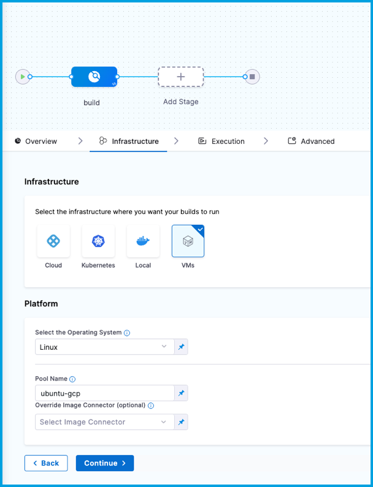

<DocsTag  text="Team plan" link="/docs/continuous-integration/ci-quickstarts/ci-subscription-mgmt" /> <DocsTag  text="Enterprise plan" link="/docs/continuous-integration/ci-quickstarts/ci-subscription-mgmt" />

:::note

Currently, this feature is behind the Feature Flag `CI_VM_INFRASTRUCTURE`. Contact [Harness Support](mailto:support@harness.io) to enable the feature.

:::

This topic describes how to set up a CI build infrastructure in Google Cloud Platform (GCP). To do this, you will create an Ubuntu VM and then install a Harness Delegate and Drone VM Runner on it. The runner creates VMs dynamically in response to CI build requests.

This is one of several CI build infrastructure options. For example, you can also [set up a Kubernetes cluster build infrastructure](../k8s-build-infrastructure/set-up-a-kubernetes-cluster-build-infrastructure.md).

The following diagram illustrates a CI build farm. The [Harness Delegate](/docs/platform/delegates/delegate-concepts/delegate-overview) communicates directly with your Harness instance. The [VM Runner](https://docs.drone.io/runner/vm/overview/) maintains a pool of VMs for running builds. When the delegate receives a build request, it forwards the request to the runner, which runs the build on an available VM.


## Prepare the Google Cloud VM

These are the requirements to configure the Google Cloud VM. This is the primary VM where you will host your Harness Delegate and runner.

1. Log into the [Google Cloud Console](https://console.cloud.google.com/) and launch a VM to host your Harness Delegate and runner.

   * Select a machine type with 4 vCPU and 16 GB memory or more. Harness recommends an Ubuntu 20.04 LTS machine image, such as [Focal](https://console.cloud.google.com/marketplace/product/ubuntu-os-cloud/ubuntu-focal) or [Jammy](https://console.cloud.google.com/marketplace/product/ubuntu-os-cloud/ubuntu-jammy).
   * To find images to use on Google Compute Engine, run `gcloud compute images list`. Valid image references follow the format of `projects/PROJECT/global/images/IMAGE`. For example: `projects/docs-test/global/images/ubuntu-pro-1804-bionic-v20220131`.

2. Configure the VM to allow ingress on ports 22 and 9079.
3. [SSH into the VM](https://cloud.google.com/compute/docs/connect/standard-ssh), if you haven't done so already.
4. [Install Docker](https://docs.docker.com/engine/install/ubuntu/).
5. [Install Docker Compose](https://docs.docker.com/compose/install/).
6. Run `gcloud auth application-default login` to create an `application_default_credentials.json` file at `/home/$(whoami)/.config/gcloud`.

## Configure the Drone pool on the Google Cloud VM

The `pool.yml` file defines the VM spec and pool size for the VM instances used to run the pipeline. A pool is a group of instantiated VMs that are immediately available to run CI pipelines. You can configure multiple pools in `pool.yml`, such as a Windows VM pool and a Linux VM pool.

1. [SSH into your Google Cloud VM](https://cloud.google.com/compute/docs/connect/standard-ssh).
2. Create a `/runner` folder on your Google Cloud VM and `cd` into it:

   ```
   mkdir /runner
   cd /runner
   ```
3. Copy your `application_default_credentials.json` file into the `/runner` folder. You created this file when you [prepared the Google Cloud VM](#prepare-the-google-cloud-vm).
4. In the `/runner` folder, create a `pool.yml` file.
5. Modify `pool.yml` as described in the following example and the [Pool settings reference](#pool-settings-reference).

### Example pool.yml

```yaml
version: "1"
instances:
  - name: ubuntu-gcp
    default: true
    type: google
    pool: 1
    limit: 1
    platform:
      os: linux
      arch: amd64
    spec:
      account:
        project_id: ci-play ## Your Google project ID.
        json_path: /path/to/key.json ## Path to the application_default_credentials.json file.
      image: projects/ubuntu-os-pro-cloud/global/images/ubuntu-pro-1804-bionic-v20220510
      machine_type: e2-small
      zone: ## To minimize latency between delegate and build VMs, specify the same zone where your delegate VM is running.
        - us-central1-a
        - us-central1-b
        - us-central1-c
      disk:
        size: 100
        type: "pd-balanced"
```

### Pool settings reference

You can configure the following settings in your `pool.yml` file. You can also learn more in the Drone documentation for the [Pool File](https://docs.drone.io/runner/vm/configuration/pool/) and [Google drivers](https://docs.drone.io/runner/vm/drivers/google/).

| Setting | Type | Example | Description |
| ------- | ---- | ------- | ----------- |
| `name` | String | `name: windows_pool` | Unique identifier of the pool. You will need to specify this pool name in Harness when you [set up the CI stage build infrastructure](#specify-build-infrastructure). |
| `pool` | Integer | `pool: 1` | Warm pool size number. Denotes the number of VMs in ready state to be used by the runner. |
| `limit` | Integer | `limit: 3` | Maximum number of VMs the runner can create at any time. `pool` indicates the number of warm VMs, and the runner can create more VMs on demand up to the `limit`.<br/>For example, assume `pool: 3` and `limit: 10`. If the runner gets a request for 5 VMs, it immediately provisions the 3 warm VMs (from `pool`) and provisions 2 more, which are not warm and take time to initialize. |
| `platform` | Key-value pairs, strings | `platform:`<br/>` os: linux`<br/>` arch: amd64` | Specify VM platform operating system (`os`) and architecture (`arch`). `variant` is optional. |
| `spec` | Key-value pairs, various | Go to [Example pool.yml](#example-poolyml). | Configure settings for the build VMs.<br/><ul><li>`account`: Provide `project_id` and `json_path`. `project_id` is your GCP project ID, and `json_path` is the full path and filename of your local Google credentials file.</li><li>`image`: The image type to use for the build VM.</li><li>`machine_type`: The google machine type. See [About Machine Families](https://cloud.google.com/compute/docs/machine-types) in the Google Cloud docs.</li><li>`zone`: To minimize latency, specify the zone where the delegate is running.</li><li>`disk`: You can provide the `size` (as an integer representing GB) and `type` (as a string, such as `"pd-balanced"`)</li></ul> |

## Start the runner

[SSH into your Google Cloud VM](https://cloud.google.com/compute/docs/connect/standard-ssh) and run the following command to start the runner:

```
docker run -v /runner:/runner -p 3000:3000 drone/drone-runner-aws:latest  delegate --pool /runner/pool.yml
```

This command mounts the volume to the Docker container providing access to `pool.yml` and JSON credentials to authenticate with GCP. It also exposes port 3000 and passes arguments to the container.

You might need to modify the command to use sudo and specify the runner directory path, for example:

```
sudo docker run -v ./runner:/runner -p 3000:3000 drone/drone-runner-aws:latest  delegate --pool /runner/pool.yml
```

:::info What does the runner do?

When a build starts, the delegate receives a request for VMs on which to run the build. The delegate forwards the request to the runner, which then allocates VMs from the warm pool (specified by `pool` in `pool.yml`) and, if necessary, spins up additional VMs (up to the `limit` specified in `pool.yml`).

The runner includes lite engine, and the lite engine process triggers VM startup through a cloud init script. This script downloads and installs Scoop package manager, Git, the Drone plugin, and lite engine on the build VMs. The plugin and lite engine are downloaded from GitHub releases. Scoop is downloaded from `get.scoop.sh` which redirects to `raw.githubusercontent.com`.

Firewall restrictions can prevent the script from downloading these dependencies. Make sure your images don't have firewall or anti-malware restrictions that are interfering with downloading the dependencies.

:::

## Install the delegate

Install a Harness Docker Delegate on your Google Cloud VM.

1. In Harness, go to **Account Settings**, select **Account Resources**, and then select **Delegates**.

   You can also create delegates at the project scope. In your Harness project, select **Project Settings**, and then select **Delegates**.

2. Select **New Delegate** or **Install Delegate**.
3. Select **Docker**.
4. Enter a **Delegate Name**.
5. Copy the delegate install command and paste it in a text editor.
6. To the first line, add `--network host`, and, if required, `sudo`. For example:

   ```
   sudo docker run --cpus=1 --memory=2g --network host
   ```

7. [SSH into your Google Cloud VM](https://cloud.google.com/compute/docs/connect/standard-ssh) and run the delegate install command.

:::tip

The delegate install command uses the default authentication token for your Harness account. If you want to use a different token, you can create a token and then specify it in the delegate install command:

1. In Harness, go to **Account Settings**, then **Account Resources**, and then select **Delegates**.
2. Select **Tokens** in the header, and then select **New Token**.
3. Enter a token name and select **Apply** to generate a token.
4. Copy the token and paste it in the value for `DELEGATE_TOKEN`.

:::

For more information about delegates and delegate installation, go to [Delegate installation overview](/docs/platform/delegates/install-delegates/overview).

## Verify connectivity

1. Verify that the delegate and runner containers are running correctly. You might need to wait a few minutes for both processes to start. You can run the following commands to check the process status:

	 ```
	 $ docker ps
	 $ docker logs DELEGATE_CONTAINER_ID
	 $ docker logs RUNNER_CONTAINER_ID
	 ```

2. In the Harness UI, verify that the delegate appears in the delegates list. It might take two or three minutes for the Delegates list to update. Make sure the **Connectivity Status** is **Connected**. If the **Connectivity Status** is **Not Connected**, make sure the Docker host can connect to `https://app.harness.io`.

   

The delegate and runner are now installed, registered, and connected.

## Specify build infrastructure

Configure your pipeline's **Build** (`CI`) stage to use your GCP VMs as build infrastructure.

import Tabs from '@theme/Tabs';
import TabItem from '@theme/TabItem';

<Tabs>
  <TabItem value="Visual" label="Visual">


1. In Harness, go to the CI pipeline that you want to use the GCP VM build infrastructure.
2. Select the **Build** stage, and then select the **Infrastructure** tab.
3. Select **VMs**.
4. Enter the **Pool Name** from your [pool.yml](#configure-the-drone-pool-on-the-google-vm).
5. Save the pipeline.

<!--  -->

<DocImage path={require('../static/ci-stage-settings-vm-infra.png')} />

</TabItem>
  <TabItem value="YAML" label="YAML" default>

```yaml
    - stage:
        name: build
        identifier: build
        description: ""
        type: CI
        spec:
          cloneCodebase: true
          infrastructure:
            type: VM
            spec:
              type: Pool
              spec:
                poolName: POOL_NAME_FROM_POOL_YML
                os: Linux
          execution:
            steps:
            ...
```

</TabItem>
</Tabs>

### Delegate selectors with self-managed VM build infrastructures

:::note

Currently, delegate selectors for self-managed VM build infrastructures is behind the feature flag `CI_ENABLE_VM_DELEGATE_SELECTOR`. Contact [Harness Support](mailto:support@harness.io) to enable the feature.

:::

Although you must install a delegate to use a self-managed VM build infrastructure, you can choose to use a different delegate for executions and cleanups in individual pipelines or stages. To do this, use [pipeline-level delegate selectors](/docs/platform/delegates/manage-delegates/select-delegates-with-selectors#pipeline-delegate-selector) or [stage-level delegate selectors](/docs/platform/delegates/manage-delegates/select-delegates-with-selectors#stage-delegate-selector).

Delegate selections take precedence in the following order:

1. Stage
2. Pipeline
3. Platform (build machine delegate)

This means that if delegate selectors are present at the pipeline and stage levels, then these selections override the platform delegate, which is the delegate that you installed on your primary VM with the runner. If a stage has a stage-level delegate selector, then it uses that delegate. Stages that don't have stage-level delegate selectors use the pipeline-level selector, if present, or the platform delegate.

For example, assume you have a pipeline with three stages called `alpha`, `beta`, and `gamma`. If you specify a stage-level delegate selector on `alpha` and you don't specify a pipeline-level delegate selector, then `alpha` uses the stage-level delegate, and the other stages (`beta` and `gamma`) use the platform delegate.

<details>
<summary>Early access feature: Use delegate selectors for codebase tasks</summary>

:::note

Currently, delegate selectors for CI codebase tasks is behind the feature flag `CI_CODEBASE_SELECTOR`. Contact [Harness Support](mailto:support@harness.io) to enable the feature.

:::

By default, delegate selectors aren't applied to delegate-related CI codebase tasks.

With this feature flag enabled, Harness uses your [delegate selectors](/docs/platform/delegates/manage-delegates/select-delegates-with-selectors) for delegate-related codebase tasks. Delegate selection for these tasks takes precedence in order of [pipeline selectors](/docs/platform/delegates/manage-delegates/select-delegates-with-selectors/#pipeline-delegate-selector) over [connector selectors](/docs/platform/delegates/manage-delegates/select-delegates-with-selectors/#infrastructure-connector).

</details>

## Troubleshoot self-managed VM build infrastructure

Go to the [CI Knowledge Base](/kb/continuous-integration/continuous-integration-faqs) for questions and issues related to self-managed VM build infrastructures, including:

* [Can I use the same build VM for multiple CI stages?](/kb/continuous-integration/continuous-integration-faqs/#can-i-use-the-same-build-vm-for-multiple-ci-stages)
* [Why are build VMs running when there are no active builds?](/kb/continuous-integration/continuous-integration-faqs/#why-are-build-vms-running-when-there-are-no-active-builds)
* [How do I specify the disk size for a Windows instance in pool.yml?](/kb/continuous-integration/continuous-integration-faqs/#how-do-i-specify-the-disk-size-for-a-windows-instance-in-poolyml)
* [Clone codebase fails due to missing plugin](/kb/continuous-integration/continuous-integration-faqs/#clone-codebase-fails-due-to-missing-plugin)
* [Can I limit memory and CPU for Run Tests steps running on self-managed VM build infrastructure?](/kb/continuous-integration/continuous-integration-faqs/#can-i-limit-memory-and-cpu-for-run-tests-steps-running-on-harness-cloud)
