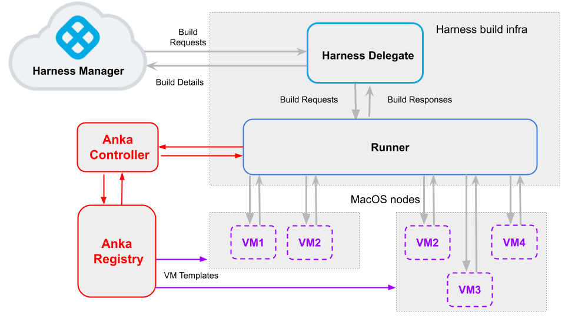

:::note

Currently, this feature is behind the Feature Flag `CI_VM_INFRASTRUCTURE`. Contact [Harness Support](mailto:support@harness.io) to enable the feature.

:::

This topic describes the high-level workflow for setting up a Harness macOS build farm that works with [Anka's virtualization platform for macOS](https://docs.veertu.com/anka/what-is-anka/). Using this workflow, you can set up a highly scalable build farm with multiple VMs and nodes to run your macOS builds with Harness CI. The workflow is comprised of the following steps:

- [Install Anka and create a VM on a Mac node](#install-anka-and-create-a-vm-on-a-mac-node)
- [Set up port forwarding on the VM](#set-up-port-forwarding-on-the-vm)
- [Set up the Anka controller and registry](#set-up-the-anka-controller-and-registry)
- [Install the Harness delegate and runner](#install-the-harness-delegate-and-runner)
- [Set up the Harness runner to communicate with the Anka controller](#set-up-the-harness-runner-to-communicate-with-the-anka-controller)
- [Set up the delegate in the Harness pipeline](#set-up-the-delegate-in-the-harness-pipeline)
- [Add other Mac nodes and VM templates to the Anka registry](#add-other-mac-nodes-and-vm-templates-to-the-anka-registry)

The following diagram shows how Harness CI and Anka work together. Once you set up the Harness and Anka components, you can easily scale up your build farm with additional templates, build nodes, and VMs.



This is one of several build infrastructure options, for example, you can also run on [Azure VMs](define-a-ci-build-infrastructure-in-azure.md) or [GCP VMs](define-a-ci-build-infrastructure-in-google-cloud-platform.md).

## Install Anka and create a VM on a Mac node

The first step is to set up the Anka software on one of your Mac nodes (such as a Mac Mini) and create a VM. For details, go to [Getting Started](https://docs.veertu.com/anka/anka-virtualization-cli/getting-started/) in the Anka documentation.

When you finish this workflow, you will have a macOS node with a working VM. After you set up the Anka registry, you can then push the node and the VM to the registry.

## Set up port forwarding on the VM

This enables connectivity between the Harness runner and the VMs. On the VM host, run the following command for each VM template:

```
anka modify $VM_NAME add port-forwarding service -g 9079
```

For details, go to the Anka documentation about [Modifying your VM](https://docs.veertu.com/anka/anka-virtualization-cli/getting-started/modifying-your-vm/).

##  Set up the Anka controller and registry

Set up the Anka registry and controller. For details, go to the Anka documentation about [Setting up the Controller & Registry](https://docs.veertu.com/anka/anka-build-cloud/getting-started/setup-controller-and-registry/).

When you finish this workflow you will have:

* A running instance of the Anka controller and registry.
* A Mac node (such as a Mac Mini) in the Anka cluster. This node has Anka virtualization software installed.
* A VM template in the registry. You can use this to create VMs on other nodes as you add them to the cluster.

:::note

Optionally, you can enable token authentication for the controller and registry as described in the Anka documentation about [Configuring Token Authentication](https://docs.veertu.com/anka/anka-build-cloud/advanced-security-features/token-authentication).

:::

## Install the Harness delegate and runner

Set up the Harness delegate and runner.

For information about installing delegates, go to [Delegate installation overview](/docs/platform/delegates/install-delegates/overview).

## Set up the Harness runner to communicate with the Anka controller

On the Harness runner host, update up the `pool.env` file as shown in the following Drone Runner config example:

``` yaml
 - name: anka-build
   default: true
   type: ankabuild
   pool: 1
   limit: 100
   platform:
     os: darwin
     arch: amd64
   spec:
     account:
       username: anka-user
       password: admin
     vm_id: xxxxxxxx-xxxx-xxxx-xxxx-xxxxxxxx
#    node_id: // create pool from specific node
     registry_url: https://anka-controller.myorg.com:8089 #make sure to specify the controller URL
     tag: 1.0.6
     auth_token: sometoken
```

## Set up the delegate in the Harness pipeline

In your Harness Project, go to a pipeline that includes a Build stage.

In the Infrastructure tab of the Build Stage, define your infrastructure as follows:

* Type = **VMs**
* Pool Name = The `name` field in your `pool.yml` file.
* OS = **MacOS**

Your macOS build infrastructure is now set up. You can now run your Build stages in your build infrastructure.

##  Add other Mac nodes and VM templates to the Anka registry

Now that you've gone through the entire end-to-end workflow, you can add more nodes and templates as needed. After you join a node to the cluster, it can pull templates from the registry and use them to create nodes.

:::note

Before you push each VM to the registry, make sure that you enable port forwarding as described in [Set up port forwarding on the VM](#set-up-port-forwarding-on-the-vm) above.

:::
