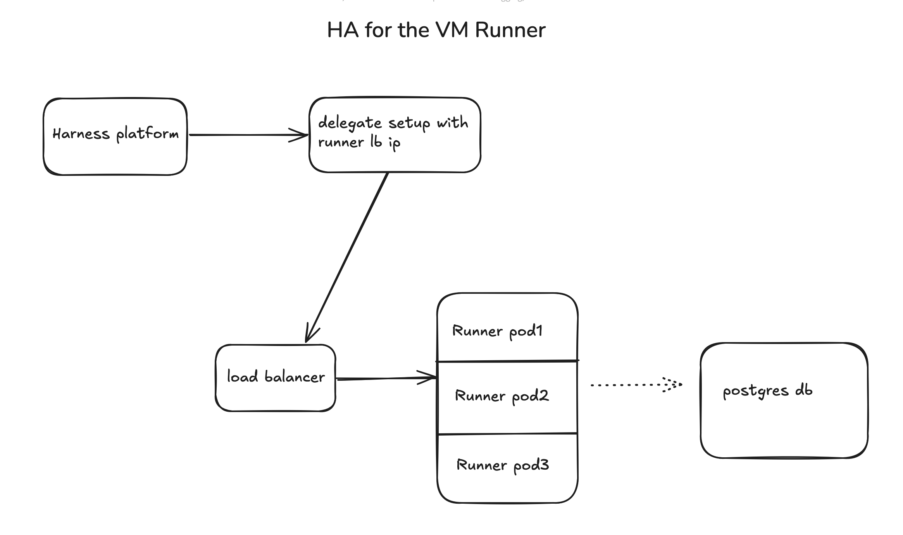

## Minimum Version

In order to use this feature, please ensure that you are using [drone runner](https://github.com/drone-runners/drone-runner-aws/tree/v1.0.0-rc.187?tab=readme-ov-file#high-availablity) version of [`v1.0.0-rc.187`](https://github.com/drone-runners/drone-runner-aws/releases/tag/v1.0.0-rc.187) or greater. 

## Architecture

  

## Setup

When using VM build infrastructure, you can deploy multiple replicas of the runner or infrastructure to ensure high availability. Below is an example of a deployment yaml that deploys 2 replicas of the runner behind a load balancer.

```yaml
---
apiVersion: v1
kind: Namespace
metadata:
  name: harness-delegate-ng
---
apiVersion: apps/v1
kind: Deployment
metadata:
  name: drone-runner
  namespace: harness-delegate-ng
spec:
  replicas: 2
  selector:
    matchLabels:
      app: drone-runner
  template:
    metadata:
      labels:
        app: drone-runner
    spec:
      containers:
        - name: drone-runner
          image: drone/drone-runner-aws:v1.0.0-rc.187
          args: ["delegate", "--pool", "/runner/pool.yml"]
          env:
            - name: DRONE_RUNNER_HA
              value: "true"
            - name: DRONE_DATABASE_DRIVER
              value: postgres
            - name: DRONE_DATABASE_DATASOURCE
              value: host=runnerha-postgres-service.harness-delegate-ng.svc.cluster.local port=5431 user=admin password=password dbname=dlite sslmode=disable
          ports:
            - containerPort: 3000
          volumeMounts:
            - name: config-volume
              mountPath: /runner
              readOnly: true
      volumes:
        - name: config-volume
          projected:
            sources:
              - configMap:
                  name: drone-runner-config
              - secret:
                  name: drone-runner-secret
---
apiVersion: v1
kind: Service
metadata:
  name: drone-runner-lb
  namespace: harness-delegate-ng
spec:
  type: LoadBalancer
  selector:
    app: drone-runner
  ports:
    - port: 3000
      targetPort: 3000
      protocol: TCP
```
Ensure that you've configured the above yaml properly:

- Populate `DRONE_DATABASE_DATASOURCE` according to your database infrastructure.
- The env variable `RUNNER_URL` is used to point to the machine where the Harness Runner will run. In this case, use the load balancer ip obtained for the `RUNNER_URL` in the delegate. For example, when installing the delegate:
  - Add `-e RUNNER_URL=http://<LOAD_BALANCER_IP>:3000`
- Note that above yaml mounts a volume config-volume with path `/runner`. Make sure your `pool.yml` file and secrets required are mapped properly. See the following GCP specific `pool.yaml` file used in the deployment above.

```yaml
version: "1"
instances:
  - name: linux-amd64
    type: google
    pool: 2
    limit: 10
    platform:
      os: linux
      arch: amd64 
    spec:
      hibernate: false
      privateIP: true
      account:
        project_id: projectname
        json_path: runner/gcp-secret.json
      image: projects/projectname/global/images/hosted-vm-64
      machine_type: e2-medium
      zones:
        - us-central1-a
      disk:
        size: 100
```