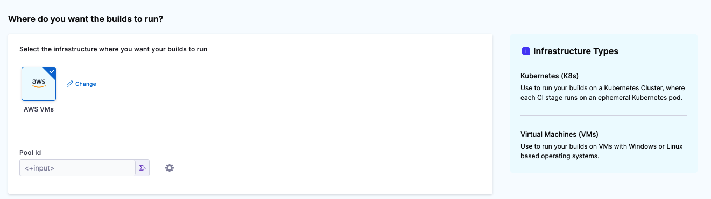
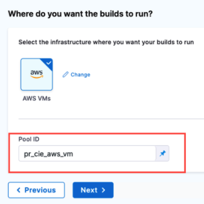

:::note
Currently, this feature is behind the Feature Flag `CI_VM_INFRASTRUCTURE`. Contact [Harness Support](mailto:support@harness.io) to enable the feature.
:::

This topic describes how to set up and use AWS VMs as build infrastructures for running builds and tests in a CI Stage. You will create an Ubuntu VM and install a delegate on it. This delegate will create new VMs dynamically in response to CI build requests. You can also configure the delegate to hibernate AWS Linux and Windows VMs when they aren't needed.

For information on using Kubernetes as a build farm, go to [Set up a Kubernetes cluster build infrastructure](../k8s-build-infrastructure/set-up-a-kubernetes-cluster-build-infrastructure.md).

The following diagram illustrates an AWS build farm. The [Harness Delegate](/docs/platform/Delegates/delegate-concepts/delegate-overview) communicates directly with your Harness instance. The [VM runner](https://docs.drone.io/runner/vm/overview/) maintains a pool of VMs for running builds. When the delegate receives a build request, it forwards the request to the runner, which runs the build on an available VM.


## Before you begin

This topic assumes you're familiar with the following:

* [Building and testing on a Kubernetes cluster build infrastructure](/tutorials/ci-pipelines/kubernetes-build-farm)
* [Delegates overview](/docs/platform/Delegates/delegate-concepts/delegate-overview)
* [CI Build stage settings](../ci-stage-settings.md)
* [Harness key concepts](../../../../getting-started/learn-harness-key-concepts.md)
* Drone VM runner
  * [Drone documentation - VM runner overview](https://docs.drone.io/runner/vm/overview/)
  * [GitHub repository - Drone runner AWS](https://github.com/drone-runners/drone-runner-aws)

## Alternate workflow: Use Terraform

If you have Terraform and Go installed on your EC2, you set up your build infrastructure as described in the Harness GitHub repo [cie-vm-delegate](https://github.com/harness/cie-vm-delegate).

## Prerequisites

The following are required for the AWS EC2 configuration:

* For the delegate VM, use an Ubuntu t2.large (or higher) AMI.
* Build VMs can be Ubuntu, AWS Linux, or Windows Server 2019 (or higher).
* Authentication requirements:
   + You can use an access key and access secret ([AWS secret](https://docs.aws.amazon.com/IAM/latest/UserGuide/id_credentials_access-keys.html#Using_CreateAccessKey)) for configuration of the runner.
     - For Windows instances, you need to add the [AdministratorAccess policy](https://docs.aws.amazon.com/IAM/latest/UserGuide/getting-started_create-admin-group.html) to the IAM role associated with the access key and access secret [IAM](https://console.aws.amazon.com/iamv2/home#/users).
   + You can use IAM profiles instead of access and secret keys. You need to run the delegate VM with an IAM role that has CRUD permissions on EC2. This role provides the runner with temporary security credentials to create VMs and manage the build pool. For details, go to the Amazon documentation on [AmazonEC2FullAccess Managed policy](https://docs.aws.amazon.com/aws-managed-policy/latest/reference/AmazonEC2FullAccess.html).
   + If you want ot use IAM roles with Windows VMs, go to the AWS documentation for [additional configuration for Windows IAM roles for tasks](https://docs.aws.amazon.com/AmazonECS/latest/developerguide/windows_task_IAM_roles.html). This additional configuration is required because containers running on Windows can't directly access the IAM profile on the host.
* Set up VPC firewall rules for the build instances on EC2.
   + Create a Security Group. You need the Security Group ID to configure the runner. For information on creating Security Groups, go to the AWS documentation on [authorizing inbound traffic for your Linux instances](https://docs.aws.amazon.com/AWSEC2/latest/UserGuide/authorizing-access-to-an-instance.html).
   + Allow ingress access to ports 22 and 9079.
   + If you want to run Windows builds and be able to RDP into your build VMs, you must also open port 3389.

## Step 1: Set up the delegate VM

1. Log into the [EC2 Console](https://console.aws.amazon.com/ec2/) and launch the VM instance where the Harness Delegate will be installed.
2. [Install Docker](https://docs.docker.com/engine/install/ubuntu/) on the instance.
3. [Install Docker Compose](https://docs.docker.com/compose/install/) on your instance. You must have [Docker Compose version 3.7](https://docs.docker.com/compose/compose-file/compose-versioning/#version-37) or higher installed.
4. If you are using an IAM role, attach the role to the VM. See [Attach an IAM Role to an Instance](https://docs.aws.amazon.com/AWSEC2/latest/UserGuide/iam-roles-for-amazon-ec2.html#attach-iam-role) in the AWS docs.
5. Create a `/runner` folder on your VM and `cd` into it:

```
mkdir /runner  
cd /runner
```

## Step 2: Configure the Drone pool on the AWS VM

The `pool.yml` file defines the VM spec and pool size for the VM instances used to run the pipeline. A pool is a group of instantiated VM that are immediately available to run CI pipelines. To avoid unnecessary costs, you can configure AWS Linux and Windows VMs to hibernate when not in use.

1. In the `/runner` folder, create a new `pool.yml` file.
2. Set up the file as described in the following example. Note the following:
   * To avoid latency issues, set up your build pool in the same Availability Zone as the delegate VM.
   * Search for AMIs in your Availability Zone for supported models (Ubuntu, AWS Linux, Windows 2019+). AMI Ids differ depending on the Availability Zone.
   * For more information about specific settings, go to the [Pool settings reference](#pool-settings-reference). You can also learn more in the Drone documentation for [Drone Pool](https://docs.drone.io/runner/vm/configuration/pool/) and [Amazon Runner](https://docs.drone.io/runner/vm/drivers/amazon/).

<details>
<summary>Example: pool.yml</summary>

The following `pool.yml` example defines an Ubuntu pool and a Windows pool.

```yaml
version: "1"  
instances:  
  - name: ubuntu-test-pool-july-five  
    default: true  
    type: amazon  
    pool: 1      
    limit: 4     
    platform:  
      os: linux  
      arch: amd64  
    spec:  
      account:  
        region: us-east-2  
        availability_zone: us-east-2c  
        access_key_id: XXXXXXXXXXXXXXXXX  
        access_key_secret: XXXXXXXXXXXXXXXXXXX
        key_pair_name: XXXXX
      ami: ami-051197ce9cbb023ea  
      size: t2.nano
      iam_profile_arn: arn:aws:iam::XXXX:instance-profile/XXXXX
      network:  
        security_groups:  
        - sg-XXXXXXXXXXX  
  - name: windows-test-pool-july-six  
    default: true  
    type: amazon  
    pool: 1  
    limit: 4  
    platform:  
      os: windows  
    spec:  
      account:  
        region: us-east-2  
        availability_zone: us-east-2c  
        access_key_id: XXXXXXXXXXXXXXXXXXXXXX  
        access_key_secret: XXXXXXXXXXXXXXXXXXXXXX
        key_pair_name: XXXXX
      ami: ami-088d5094c0da312c0  
      size: t3.large  
      hibernate: true  
      network:  
        security_groups:  
        - sg-XXXXXXXXXXXXXX  
```

</details>

Later in this workflow, you'll reference the pool identifier in the Harness Manager to map the pool with a Stage Infrastructure in a CI Pipeline. This is described later in this topic.

## Step 3: Configure the docker-compose.yaml file

1. In your Harness account, organization, or project, select **Delegates** under **Project Setup**.
2. Click **New Delegate** and select **Switch back to old delegate install experience**.
3. Select **Docker** and then select **Continue**.
4. Enter a **Delegate Name**. Optionally, you can add **Tags** or **Delegate Tokens**. Then, select **Continue**.
5. Select **Download YAML file** to download the `docker-compose.yaml` file to your local machine.

Next, you'll add the runner spec to the delegate definition. The Harness Delegate and runner run on the same VM. The runner communicates with the Harness Delegate on `localhost` and port `3000` of your VM.

6. Copy your local **docker-compose.yaml** file to the `/runner` folder on the AWS VM. This folder should now have both `docker-compose.yaml` and `pool.yml`.
7. Open `docker-compose.yaml` in a text editor.
8. Append the following to the end of the `docker-compose.yaml` file:

   ```yaml
   drone-runner-aws:  
       restart: unless-stopped  
       image: drone/drone-runner-aws
       network_mode: "host" 
       volumes:  
        - ./runner:/runner  
       entrypoint: ["/bin/drone-runner-aws", "delegate", "--pool", "pool.yml"]  
       working_dir: /runner
   ```

9. Under `services: harness-ng-delegate: restart: unless-stopped`, add the following line:

   ```yaml
   network_mode: "host"
   ```

10. Save `docker-compose.yaml`.

<details>
   <summary>Example: docker-compose.yaml with runner spec</summary>

```yaml
version: "3.7"  
services:  
  harness-ng-delegate:  
    restart: unless-stopped  
    network_mode: "host"  
    deploy:  
      resources:  
        limits:  
          cpus: "0.5"  
          memory: 2048M  
    image: harness/delegate:latest  
    environment:  
      - ACCOUNT_ID=XXXXXXXXXXXXXXXX  
      - DELEGATE_TOKEN=XXXXXXXXXXXXXXXX  
      - MANAGER_HOST_AND_PORT=https://app.harness.io  
      - WATCHER_STORAGE_URL=https://app.harness.io/public/qa/premium/watchers  
      - WATCHER_CHECK_LOCATION=current.version  
      - REMOTE_WATCHER_URL_CDN=https://app.harness.io/public/shared/watchers/builds  
      - DELEGATE_STORAGE_URL=https://app.harness.io  
      - DELEGATE_CHECK_LOCATION=delegateqa.txt  
      - USE_CDN=true  
      - CDN_URL=https://app.harness.io  
      - DEPLOY_MODE=KUBERNETES  
      - DELEGATE_NAME=qwerty  
      - NEXT_GEN=true  
      - DELEGATE_DESCRIPTION=  
      - DELEGATE_TYPE=DOCKER  
      - DELEGATE_TAGS=  
      - DELEGATE_TASK_LIMIT=50  
      - DELEGATE_ORG_IDENTIFIER=  
      - DELEGATE_PROJECT_IDENTIFIER=  
      - PROXY_MANAGER=true  
      - VERSION_CHECK_DISABLED=false  
      - INIT_SCRIPT=echo "Docker delegate init script executed."  
  drone-runner-aws:  
    restart: unless-stopped  
    image: drone/drone-runner-aws:1.0.0-rc.38
    network_mode: "host"
    volumes:  
      - ./runner:/runner  
    entrypoint: ["/bin/drone-runner-aws", "delegate", "--pool", "pool.yml"]  
    working_dir: /runner
```

</details>

For more information on Harness Docker Delegate environment variables, go to the [Harness Docker Delegate environment variables reference](/docs/platform/2_Delegates/delegate-reference/docker-delegate-environment-variables.md).

## Step 4: Install the delegate and runner

1. [SSH](https://docs.aws.amazon.com/AWSEC2/latest/UserGuide/AccessingInstancesLinux.html) into the delegate VM and `cd` to `/runner`.
2. Confirm that the folder has both setup files, for example:

   ```
   $ ls -a
   . .. docker-compose.yaml pool.yml
   ```

3. Run the following command to install the delegate and runner:

   ```
   $ docker-compose -f docker-compose.yaml up -d
   ```

4. Verify that both containers are running correctly. For example, wait a few minutes for both processes to start, and then run the following commands:

   ```
   $ docker ps
   $ docker logs <delegate-container-id>
   $ docker logs <runner-container-id>
   ```

5. In the Harness UI, verify that the delegate appears in the delegates list. It might take two or three minutes for the delegates list to update. Make sure the **Connectivity Status** is **Connected**. If the **Connectivity Status** is **Not Connected**, make sure the Docker host can connect to `https://app.harness.io`.

   

The delegate and runner are now installed, registered, and connected.

## Step 5: Select pipeline build infrastructure

1. In your CI pipeline's **Build** stage, select the **Infrastructure** tab, and then select **AWS VMs**.

   

2. In **Pool ID**, enter the pool `name` from your [pool.yml](#step-2-configure-the-drone-pool-on-the-aws-vm).

   

3. Save your pipeline.

This pipeline's **Build** stage now uses your AWS VMS for its build infrastructure.

## Pool settings reference

You can configure the following settings in your `pool.yml` file.

| **Subfield** | **Type** | **Example** | **Description** |
| - | - | - | - |
| `name` | String | `name: windows_pool` | Unique identifier of the pool. You'll reference this pool name in the Harness Manager later when setting up the CI build infrastructure. |
| `pool` | Integer | `pool: 1` | Pool size number. Denotes the number of cached VMs in ready state to be used by the runner. |
| `limit` | Integer | `limit: 3` | Maximum pool size number. Denotes the maximum number of VMs that can be present at any instance to be used by the runner. |
| `hibernate` | Boolean | `hibernate: true` | When set to `true` (the default), VMs hibernate after startup. When `false`, VMs are always in a running state.This option is supported for AWS Linux and Windows VMs. Hibernation for Ubuntu VMs is not currently supported. For more information go to the AWS documentation: [Hibernate your On-Demand Linux instance](https://docs.aws.amazon.com/AWSEC2/latest/UserGuide/Hibernate.html). |
| `iam_profile_arn` | String | `iam_profile_arn: arn:aws:iam::XXXX:instance-profile/XXX` | Instance profile ARN of the IAM role to apply to the build instances. |
| `platform` | Mapping, string | Go to [Platform example](#platform-example) | Configure the details of your VM platform. By default, the platform is set to Linux OS and AMD64 architecture. |
| `instance` | Mapping, string or integer | Go to [Instance example](#instance-example) | Configure the settings of your AWS instance. `disk` contains AWS block information, and `network` contains AWS network information. For more information on these attributes, go to the AWS documentation: [Create a security group](https://docs.aws.amazon.com/AWSEC2/latest/UserGuide/get-set-up-for-amazon-ec2.html#create-a-base-security-group). |

### Platform example

***os (String)***
    `platform: os: windows`

***arch (String)***
    `platform: arch:`

***variant (String)***
     `platform: variant:`

***version (String)***
    `platform: version:`

***os_name (String)***

```yaml
    instance:
      platform:
        os: linux
        arch: amd64
        os_name: amazon-linux
```

### Instance Example

***ami (String)***

```
    instance:
      ami: ami-092f63f22143765a3
```

***tags (String)***

```
    instance:
      tags: 285
```

***type (String)***

```
    instance:
      type: t2.micro
```

***disk***

* `size` (Integer)

```
        disk:
          size:
```

* `type` (String)

```
        disk:
          type:
```

* `iops` (String)

```
        disk:
          iops:
```

***Network***

* `vpc` (Integer)

```
        network:
          vpc:
```

* `vpc_security_groups` ([ ] String)

```
        network:
          vpc_security_groups:
          - sg-0ad8xxxx511b0
```

* `security_groups` ([ ] String)

```
          network:
            security_groups:
              - sg-06dcxxxx9811b0
```

* `subnet_id` (String)

```
        network:
          subnet_id: subnet-0ab15xxxx07b53
```

* `private_ip` (Boolean)

```
        network:
          private_ip:
```

## Runner settings reference

You can set the following runner options in your `docker-compose.yaml` file. These can be useful for advanced use cases such as troubleshooting the runner.

<details>
<summary>Example: docker-compose.yaml with Drone Environment Settings</summary>

```yaml
version: "3.7"  
services:  
  harness-ng-delegate:  
    restart: unless-stopped  
    network_mode: "host"  
    deploy:  
      resources:  
        limits:  
          cpus: "0.5"  
          memory: 2048M  
    image: harness/delegate:latest  
    environment:  
      - MANAGER_HOST_AND_PORT=https://app.harness.io  
      - WATCHER_STORAGE_URL=https://app.harness.io/public/qa/premium/watchers  
      - WATCHER_CHECK_LOCATION=current.version  
      - REMOTE_WATCHER_URL_CDN=https://app.harness.io/public/shared/watchers/builds  
      - DELEGATE_STORAGE_URL=https://app.harness.io  
      - DELEGATE_CHECK_LOCATION=delegateqa.txt  
      - USE_CDN=true  
      - CDN_URL=https://app.harness.io  
      - DEPLOY_MODE=KUBERNETES  
      - DELEGATE_NAME=qwerty  
      - NEXT_GEN=true  
      - DELEGATE_DESCRIPTION=  
      - DELEGATE_TYPE=DOCKER  
      - DELEGATE_TAGS=  
      - DELEGATE_TASK_LIMIT=50  
      - DELEGATE_ORG_IDENTIFIER=  
      - DELEGATE_PROJECT_IDENTIFIER=  
      - PROXY_MANAGER=true  
      - VERSION_CHECK_DISABLED=false  
      - INIT_SCRIPT=echo "Docker delegate init script executed."  
  drone-runner-aws:  
    restart: unless-stopped  
    image: drone/drone-runner-aws:1.0.0-rc.38
    network_mode: "host" 
    volumes:  
      - .:/runner  
    entrypoint: ["/bin/drone-runner-aws", "delegate", "--pool", "pool.yml"]  
    working_dir: /runner  
    environment:
      - DRONE_REUSE_POOL=false  
      - DRONE_LITE_ENGINE_PATH=https://github.com/harness/lite-engine/releases/download/v0.5.2
      - DRONE_DEBUG=true  
      - DRONE_TRACE=true  
```

</details>

Configure the following fields in the **.env** file to allow runner to access and launch your AWS VM.

| **Field** | **Type** | **Description** | **Example** |
| - | - | - | - |
| `DRONE_REUSE_POOL` | Boolean | Reuse existing EC2 instances on restart of the runner. | `false` |
| `DRONE_LITE_ENGINE_PATH` | String | This variable contains the release information for the Lite Engine. The Lite Engine is a binary that is injected into the VMs with which the runner interacts. It is responsible for coordinating the execution of the steps. | `https://github.com/harness/lite-engine/releases/download/v0.0.1.12` |
| `DRONE_DEBUG` | Boolean | Optional. Enables debug-level logging. | `true` |
| `DRONE_TRACE` | Boolean | Optional. Enables trace-level logging. | `true` |

## Troubleshooting

When you run the pipeline, if VM creation in the runner fails with the error `no default VPC`, then set `subnet_id` in `pool.yml`.
