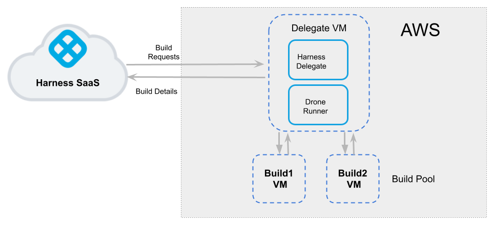

```mdx-code-block
import Tabs from '@theme/Tabs';
import TabItem from '@theme/TabItem';
```

:::note
Currently, this feature is behind the Feature Flag `CI_VM_INFRASTRUCTURE`. Contact [Harness Support](mailto:support@harness.io) to enable the feature.
:::

This topic describes how to use AWS VMs as Harness CI build infrastructure. To do this, you will create an Ubuntu VM and install a Harness Delegate and Drone VM Runner on it. The runner creates VMs dynamically in response to CI build requests. You can also configure the runner to hibernate AWS Linux and Windows VMs when they aren't needed.

This is one of several CI build infrastructure options. For example, you can also [set up a Kubernetes cluster build infrastructure](../k8s-build-infrastructure/set-up-a-kubernetes-cluster-build-infrastructure.md).

The following diagram illustrates a CI build farm using AWS VMs. The [Harness Delegate](/docs/platform/delegates/delegate-concepts/delegate-overview) communicates directly with your Harness instance. The [VM runner](https://docs.drone.io/runner/vm/overview/) maintains a pool of VMs for running builds. When the delegate receives a build request, it forwards the request to the runner, which runs the build on an available VM.



:::info

This is an advanced configuration. Before beginning, you should be familiar with:

* [Harness key concepts](../../../../getting-started/learn-harness-key-concepts.md)
* [CI pipeline creation](../../prep-ci-pipeline-components.md)
* [Delegates](/docs/platform/delegates/delegate-concepts/delegate-overview)
* [CI Build stage settings](../ci-stage-settings.md)
* Running pipelines on other build infrastructures
   * [Building on a Kubernetes cluster build infrastructure](/tutorials/ci-pipelines/kubernetes-build-farm)
   * [Set up a local runner build infrastructure](../define-a-docker-build-infrastructure.md)
* Drone VM Runners and pools
  * [Drone documentation - VM runner overview](https://docs.drone.io/runner/vm/overview/)
  * [Drone documentation - Drone Pool](https://docs.drone.io/runner/vm/configuration/pool/)
  * [Drone documentation - Amazon Runners](https://docs.drone.io/runner/vm/drivers/amazon/)
  * [GitHub repository - Drone runner AWS](https://github.com/drone-runners/drone-runner-aws)

:::

## Prepare AWS

These are the requirements for AWS EC2 configuration.

### Machine specs

* The delegate VM must use an Ubuntu AMI that is `t2.large` or greater.
* Build VMs (in your VM pool) can be Ubuntu, AWS Linux, or Windows Server 2019 (or higher).
* All machine images must have Docker installed.

### Authentication

Decide how you want the runner to authenticate with AWS.

```mdx-code-block
<Tabs>
  <TabItem value="secret" label="Access Key and Secret" default>
```

You can use an access key and access secret ([AWS secret](https://docs.aws.amazon.com/IAM/latest/UserGuide/id_credentials_access-keys.html#Using_CreateAccessKey)) for the runner.

For Windows instances, you must add the [AdministratorAccess policy](https://docs.aws.amazon.com/IAM/latest/UserGuide/getting-started_create-admin-group.html) to the [IAM role](https://console.aws.amazon.com/iamv2/home#/users) associated with the access key and access secret. <!-- if it has IAM then why would you use access key and secret?-->

```mdx-code-block
  </TabItem>
  <TabItem value="iam" label="IAM Roles">
```

You can use IAM profiles instead of access and secret keys.

The delegate VM must use an IAM role that has CRUD permissions on EC2. This role provides the runner with temporary security credentials to create VMs and manage the build pool. For details, go to the Amazon documentation on [AmazonEC2FullAccess Managed policy](https://docs.aws.amazon.com/aws-managed-policy/latest/reference/AmazonEC2FullAccess.html).

To use IAM roles with Windows VMs, go to the AWS documentation for [additional configuration for Windows IAM roles for tasks](https://docs.aws.amazon.com/AmazonECS/latest/developerguide/windows_task_IAM_roles.html). This additional configuration is required because containers running on Windows can't directly access the IAM profile on the host.

```mdx-code-block
  </TabItem>
</Tabs>
```

### VPC, ports, and security groups

* Set up VPC firewall rules for the build instances on EC2.
* Allow ingress access to ports 22 and 9079. Port 9079 is required for security groups within the VPC.
* You must also open port 3389 if you want to run Windows builds and be able to RDP into your build VMs.
* Create a Security Group. You need the Security Group ID to configure the runner. For information on creating Security Groups, go to the AWS documentation on [authorizing inbound traffic for your Linux instances](https://docs.aws.amazon.com/AWSEC2/latest/UserGuide/authorizing-access-to-an-instance.html).

## Set up the delegate VM

1. Log into the [EC2 Console](https://console.aws.amazon.com/ec2/) and launch the VM instance that will host the Harness Delegate.
2. [Install Docker](https://docs.aws.amazon.com/AmazonECS/latest/developerguide/docker-basics.html#install_docker) on the instance.
3. [Install Docker Compose](https://docs.docker.com/compose/install/) on the instance. You must have [Docker Compose version 3.7](https://docs.docker.com/compose/compose-file/compose-versioning/#version-37) or higher installed.
4. If you are using an IAM role, attach the role to the VM. For instructions, go to the AWS documentation on [attaching an IAM role to an instance](https://docs.aws.amazon.com/AWSEC2/latest/UserGuide/iam-roles-for-amazon-ec2.html#attach-iam-role).

## Configure the Drone pool on the AWS VM

<!-- I don't think this is possible anymore because of the new delegate install UI.

:::tip Option: Use Terraform

If you have Terraform and Go installed on your EC2 environment, you can use the [cie-vm-delegate script](https://github.com/harness/cie-vm-delegate). Follow the setup instructions described in the script's README.-->

<!-- Might need these steps - I think the Terraform workflow still uses docker-compose:

When you reach the step to download the delegate YAML, follow these steps to get the docker-compose.yaml file:

1. In your Harness account, organization, or project, select **Delegates** under **Project Setup**.
2. Click **New Delegate** and select **Switch back to old delegate install experience**.
3. Select **Docker** and then select **Continue**.
4. Enter a **Delegate Name**. Optionally, you can add **Tags** or **Delegate Tokens**. Then, select **Continue**.
5. Select **Download YAML file** to download the `docker-compose.yaml` file to your local machine.

You may need to add the runner spec to the delegate definition:

1. Append the following to the end of the `docker-compose.yaml` file:

   ```yaml
   drone-runner-aws:  
       restart: unless-stopped  
       image: drone/drone-runner-aws
       network_mode: "host" 
       volumes:  
        - /runner:/runner  
       entrypoint: ["/bin/drone-runner-aws", "delegate", "--pool", "pool.yml"]  
       working_dir: /runner
   ```

2. Under `services: harness-ng-delegate: restart: unless-stopped`, add the following line:

   ```yaml
   network_mode: "host"
   ```

The Harness Delegate and runner run on the same VM. The runner communicates with the Harness Delegate on `localhost` and port `3000` of your VM.

:::
-->

The `pool.yml` file defines the VM spec and pool size for the VM instances used to run the pipeline. A pool is a group of instantiated VMs that are immediately available to run CI pipelines. You can configure multiple pools in `pool.yml`, such as a Windows VM pool and a Linux VM pool. To avoid unnecessary costs, you can configure `pool.yml` to hibernate VMs when not in use.

1. Create a `/runner` folder on your delegate VM and `cd` into it:

   ```
   mkdir /runner
   cd /runner
   ```
2. In the `/runner` folder, create a `pool.yml` file.
3. Modify `pool.yml` as described in the following example. For information about specific settings, go to [Pool settings reference](#pool-settings-reference).

### Example pool.yml

The following `pool.yml` example defines an Ubuntu pool and a Windows pool.

```yaml
version: "1"
instances:
  - name: ubuntu-ci-pool
    default: true
    type: amazon
    pool: 1
    limit: 4
    platform:
      os: linux
      arch: amd64
    spec:
      account:
        region: us-east-2 ## To minimize latency, use the same region as the delegate VM.
        availability_zone: us-east-2c ## To minimize latency, use the same availability zone as the delegate VM.
        access_key_id: XXXXXXXXXXXXXXXXX
        access_key_secret: XXXXXXXXXXXXXXXXXXX
        key_pair_name: XXXXX
      ami: ami-051197ce9cbb023ea
      size: t2.nano
      iam_profile_arn: arn:aws:iam::XXXX:instance-profile/XXXXX
      network:
        security_groups:
        - sg-XXXXXXXXXXX
  - name: windows-ci-pool
    default: true
    type: amazon
    pool: 1
    limit: 4
    platform:
      os: windows
    spec:
      account:
        region: us-east-2 ## To minimize latency, use the same region as the delegate VM.
        availability_zone: us-east-2c ## To minimize latency, use the same availability zone as the delegate VM.
        access_key_id: XXXXXXXXXXXXXXXXXXXXXX
        access_key_secret: XXXXXXXXXXXXXXXXXXXXXX
        key_pair_name: XXXXX
      ami: ami-088d5094c0da312c0
      size: t3.large
      hibernate: true
      network:
        security_groups:
        - sg-XXXXXXXXXXXXXX
```

### Pool settings reference

You can configure the following settings in your `pool.yml` file. You can also learn more in the Drone documentation for the [Pool File](https://docs.drone.io/runner/vm/configuration/pool/) and [Amazon drivers](https://docs.drone.io/runner/vm/drivers/amazon/).

| Setting | Type | Example | Description |
| ------- | ---- | ------- | ----------- |
| `name` | String | `name: windows_pool` | Unique identifier of the pool. You will need to specify this pool name in the Harness Manager when you set up the CI stage build infrastructure. |
| `pool` | Integer | `pool: 1` | Warm pool size number. Denotes the number of VMs in ready state to be used by the runner. |
| `limit` | Integer | `limit: 3` | Maximum number of VMs the runner can create at any time. `pool` indicates the number of warm VMs, and the runner can create more VMs on demand up to the `limit`.<br/>For example, assume `pool: 3` and `limit: 10`. If the runner gets a request for 5 VMs, it immediately provisions the 3 warm VMs (from `pool`) and provisions 2 more, which are not warm and take time to initialize. |
| `platform` | Key-value pairs, strings | Go to [platform example](#platform-example). | Specify VM platform operating system (`os: linux` or `os: windows`). `arch` and `variant` are optional. `os_name: amazon-linux` is required for AL2 AMIs. The default configuration is `os: linux` and `arch: amd64`. |
| `spec` | Key-value pairs, various | Go to [Example pool.yml](#example-poolyml) and the examples in the following rows. | Configure settings for the build VMs and AWS instance. Contains a series of individual and mapped settings, including `account`, `tags`, `ami`, `size`, `hibernate`, `iam_profile_arn`, `network`, and `disk`. Details about these settings are provided below. |
| `account` | Key-value pairs, strings | Go to [account example](#account-example). | AWS account configuration, including region and access key authentication.<br/><ul><li>`region`: AWS region. To minimize latency, use the same region as the delegate VM.</li><li>`availability_zone`: AWS region availability zone. To minimize latency, use the same availability zone as the delegate VM.</li><li>`access_key_id`: If using access key authentication, this is the AWS access key ID.</li><li>`access_key_secret`: If using access key authentication, this is the AWS secret key.</li><li>`key_pair_name`: Optional.</li></ul> |
| `tags` | Key-vale pairs, strings | Go to [tags example](#tags-example). | Optional tags to apply to the instance. |
| `ami` | String | `ami: ami-092f63f22143765a3` | The AMI ID. [Search for AMIs](https://cloud-images.ubuntu.com/locator/ec2/) in your Availability Zone for supported models (Ubuntu, AWS Linux, Windows 2019+). AMI IDs differ by Availability Zone. |
| `size` | String | `size: t3.large` | The AMI size, such as `t2.nano`, `t2.micro`, `m4.large`, and so on. |
| `hibernate` | Boolean | `hibernate: true` | When set to `true` (which is the default), VMs hibernate after startup. When `false`, VMs are always in a running state. This option is supported for AWS Linux and Windows VMs. Hibernation for Ubuntu VMs is not currently supported. For more information, go to the AWS documentation on [hibernating on-demand Linux instances](https://docs.aws.amazon.com/AWSEC2/latest/UserGuide/Hibernate.html). |
| `iam_profile_arn` | String | `iam_profile_arn: arn:aws:iam::XXXX:instance-profile/XXX` | If using IAM roles, this is the instance profile ARN of the IAM role to apply to the build instances. |
| `network` | Key-value pairs, various | Go to [network example](#network-example). | AWS network information, including security groups and user data. For more information on these attributes, go to the AWS documentation on [creating security groups](https://docs.aws.amazon.com/AWSEC2/latest/UserGuide/get-set-up-for-amazon-ec2.html#create-a-base-security-group).<br/><ul><li>`security_groups`: List of security group IDs as strings.</li><li>`vpc`: If using VPC, this is the VPC ID as an integer.</li><li>`vpc_security_groups`: If using VPC, this is a list of VPC security group IDs as strings.</li><li>`private_ip`: Boolean.</li><li>`subnet_id`: The subnet ID as a string.</li><li>`user_data` and `user_data_path`: You can use these to define user data to apply to the instance and a path to a user data script. For more information, go to the Drone documentation on [cloud-init](https://docs.drone.io/runner/vm/configuration/cloud-init/).</li></ul> |
| `disk` | Key-value pairs, various | `disk:`<br/>`  size: 16`<br/>`  type: io1`<br/>`  iops: iops` | Optional AWS block information.<br/><ul><li>`size`: Integer, size in GB.</li><li>`type`: `gp2`, `io1`, or `standard`.</li><li>`iops`: If `type: io1`, then `iops: iops`.</li></ul> |

#### platform example

```yaml
    instance:
      platform:
        os: linux
        arch: amd64
        version:
        os_name: amazon-linux
```

#### account example

```yaml
      account:
        region: us-east-2
        availability_zone: us-east-2c
        access_key_id: XXXXX
        access_key_secret: XXXXX
        key_pair_name: XXXXX
```

#### tags example

```yaml
      tags:
        owner: USER
        ttl: '-1'
```

#### network example

```yaml
      network:
        private_ip: true
        subnet_id: subnet-XXXXXXXXXX
        security_groups:
          - sg-XXXXXXXXXXXXXX
        user_data: |
          ...
```

 ## Start the runner

[SSH into the delegate VM](https://docs.aws.amazon.com/AWSEC2/latest/UserGuide/AccessingInstancesLinux.html) and run the following command to start the runner:

```
$ docker run -v /runner:/runner -p 3000:3000 drone/drone-runner-aws:latest  delegate --pool /runner/pool.yml
```

This command mounts the volume to the Docker container providing access to `pool.yml` to authenticate with AWS. It also exposes port 3000 and passes arguments to the container.

## Install the delegate

Install a Harness **Docker** Delegate on your delegate VM.

1. Create a delegate token. The delegate uses this token to authenticate with the Harness Platform.

   * In Harness, go to **Account Settings**, then **Account Resources**, and then select **Delegates**.
   * Select **Tokens** in the header, and then select **New Token**.
   * Enter a token name and select **Apply** to generate a token.
   * Copy the token and store is somewhere you can retrieve it when installing the delegate.

2. Again, go to **Account Settings**, then **Account Resources**, and then **Delegates**.
3. Select **New Delegate**.
4. Select **Docker** and enter a name for the delegate.
5. Copy and run the install command generated in Harness. Make sure the `DELEGATE_TOKEN` matches the one you just created.

For more information about delegates and delegate installation, go to [Delegate installation overview](/docs/platform/delegates/install-delegates/overview).

## Verify connectivity

1. Verify that the delegate and runner containers are running correctly. You might need to wait a few minutes for both processes to start. You can run the following commands to check the process status:

	 ```
	 $ docker ps
	 $ docker logs DELEGATE_CONTAINER_ID
	 $ docker logs RUNNER_CONTAINER_ID
	 ```

2. In the Harness UI, verify that the delegate appears in the delegates list. It might take two or three minutes for the Delegates list to update. Make sure the **Connectivity Status** is **Connected**. If the **Connectivity Status** is **Not Connected**, make sure the Docker host can connect to `https://app.harness.io`.

   

The delegate and runner are now installed, registered, and connected.

## Specify build infrastructure

Configure your pipeline's **Build** (`CI`) stage to use your AWS VMs as build infrastructure.

```mdx-code-block
<Tabs>
  <TabItem value="Visual" label="Visual">
```

1. In Harness, go to the CI pipeline that you want to use the AWS VM build infrastructure.
2. Select the **Build** stage, and then select the **Infrastructure** tab.
3. Select **VMs**.
4. Enter the **Pool Name** from your [pool.yml](#configure-the-drone-pool-on-the-aws-vm).
5. Save the pipeline.

<!--  -->

<docimage path={require('../static/ci-stage-settings-vm-infra.png')} />

```mdx-code-block
  </TabItem>
  <TabItem value="YAML" label="YAML" default>
```

```yaml
    - stage:
        name: build
        identifier: build
        description: ""
        type: CI
        spec:
          cloneCodebase: true
          infrastructure:
            type: VM
            spec:
              type: Pool
              spec:
                poolName: POOL_NAME_FROM_POOL_YML
                os: Linux
          execution:
            steps:
            ...
```

```mdx-code-block
  </TabItem>
</Tabs>
```

## Troubleshooting

### Build VM creation fails with no default VPC

When you run the pipeline, if VM creation in the runner fails with the error `no default VPC`, then you need to set `subnet_id` in `pool.yml`.

### CI builds stuck at the initialize step on health check

If your CI build gets stuck at the initialize step on the health check for connectivity with lite-engine, either lite-engine is not running on your build VMs or there is a connectivity issue between the runner and lite-engine.

1. Verify that lite-engine is running on your build VMs.
   1. SSH/RDP into a VM from your VM pool that is in a running state.
   2. Check whether the lite-engine process is running on the VM.
   3. Check the cloud init output [logs](#logs) to debug issues related to startup of the lite-engine process. The lite-engine process starts at VM startup through a cloud init script.
2. If lite-engine is running, verify that the runner can communicate with lite-engine from the delegate VM.
   1. Run `nc -vz <build-vm-ip> 9079` from the runner.
   2. If the status is not successful, make sure the security group settings in `runner/pool.yml` are correct, and make sure your [security group setup](#vpc-ports-and-security-groups) in AWS allows the runner to communicate with the build VMs.

### Delegate connected but builds fail

If the delegate is connected but your builds are failing, check the following:

1. Make sure your the AMIs, specified in `pool.yml`, are still available.
   * Amazon reprovisions their AMIs every two months.
   * For a Windows pool, search for an AMI called `Microsoft Windows Server 2019 Base with Containers` and update `ami` in `pool.yml`.
2. Confirm your [security group setup](#vpc-ports-and-security-groups) and security group settings in `runner/pool.yml`.

### Logs

* Linux
   * lite-engine logs: `/var/log/lite-engine.log`
   * cloud init output logs: `/var/log/cloud-init-output.log`
* Windows
   * lite engine logs: `C:\Program Files\lite-engine\log.out`
   * cloud init output logs: `C:\ProgramData\Amazon\EC2-Windows\Launch\Log\UserdataExecution.log`
