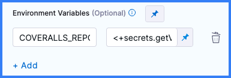

```mdx-code-block
import Tabs from '@theme/Tabs';
import TabItem from '@theme/TabItem';
```

You can add code coverage to a Harness CI pipeline by configuring code coverage tools in your codebase and adding code coverage commands to steps that run tests.

For more information about running tests in Harness CI, go to [Run tests in CI pipelines](./run-tests-in-ci.md).

## Code coverage by language

The following examples show how to include code coverage in a Harness CI pipeline for different languages.

For information about available code coverage tools, configuring specific tools, or code coverage for languages not described here, refer to the documentation for that tool or language.

### Go

Go has built-in code coverage functionality.

1. Add the following commands to the **Run** step where you run your tests:

   ```
   go test -cover -coverprofile=c.out
   go tool cover -html=c.out -o coverage.html
   ```

   For example:

   ```yaml
                 - step:
                     type: Run
                     identifier: test
                     name: Test
                     spec:
                       shell: Sh
                       command: |-
                         go test -cover -coverprofile=c.out
                         go tool cover -html=c.out -o coverage.html
   ```

2. Add a step to upload your code coverage report to cloud storage.

   * [Upload Artifacts to GCS](../build-and-upload-artifacts/upload-artifacts-to-gcs-step-settings.md)
   * [Upload Artifacts to S3](../build-and-upload-artifacts/upload-artifacts-to-s-3-step-settings.md)

3. Add a step to [view your code coverage report on the Artifacts tab](#view-code-coverage-reports-on-the-artifacts-tab).

### Java

1. Set up a Java code coverage tool, such as [JaCoCo](https://github.com/jacoco/jacoco). By including JaCoCo in `pom.xml`, the `mvn test` command automatically writes a code coverage report to an `exec` file.
2. Run your tests in a **Run** or **Run Tests** step, for example:

   ```yaml
                   - step:
                     type: Run
                     name: run test
                     identifier: run_test
                     spec:
                       shell: Sh
                       command: |-
                         mvn test
                       reports:
                         type: JUnit
                         spec:
                           paths:
                             - target/surefire-reports/*.xml
   ```

3. Store and publish your code coverage report:

   * If you're using JaCoCo, use the [JaCoCo Drone plugin](https://github.com/harness-community/drone-jacoco-s3) in a [Plugin step](../use-drone-plugins/plugin-step-settings-reference.md). This plugin uploads your JaCoCo code coverage report to S3 and publishes it to the **Artifacts** tab on the [Build details page](../viewing-builds.md).
   * With other Java code coverage tools:
      * Add an [Upload Artifacts to GCS step](../build-and-upload-artifacts/upload-artifacts-to-gcs-step-settings.md) or [Upload Artifacts to S3 step](../build-and-upload-artifacts/upload-artifacts-to-s-3-step-settings.md).
      * Use the Artifact Metadata Publisher Drone plugin to [view your code coverage report on the Artifacts tab](#view-code-coverage-reports-on-the-artifacts-tab).

### JavaScript

1. If necessary, set up a JavaScript code coverage tool, such as [Istanbul](https://github.com/gotwarlost/istanbul). Your test tool may already include code coverage; for example, [Istanbul is included with Jest](https://jestjs.io/docs/configuration/#collectcoverage-boolean).
2. Add code coverage arguments or commands to the relevant **Run** step. For example, with Jest, add `--collectCoverage=true` to your `jest` command.

   ```yaml
                 - step:
                     type: Run
                     name: Run Jest Tests
                     identifier: run_jest_tests
                     spec:
                       shell: Sh
                       command: |-
                         yarn add --dev jest-junit
                         jest --ci --runInBand --reporters=default --reporters=jest-junit --collectCoverage=true
                       envVariables:
                         JEST_JUNIT_OUTPUT_DIR: "/harness/reports"
                       reports:
                         type: JUnit
                         spec:
                           paths:
                             - "/harness/reports/*.xml"
   ```

3. Add a step to upload your code coverage report to cloud storage.

   * [Upload Artifacts to GCS](../build-and-upload-artifacts/upload-artifacts-to-gcs-step-settings.md)
   * [Upload Artifacts to S3](../build-and-upload-artifacts/upload-artifacts-to-s-3-step-settings.md)

4. Add a step to [view your code coverage report on the Artifacts tab](#view-code-coverage-reports-on-the-artifacts-tab).

### PHP

The built-in [phpdbg](https://www.php.net/manual/en/book.phpdbg.php) tool can generate code coverage reports.

1. Add the following command to the **Run** step where your run your tests:

   ```
   phpdbg -qrr vendor/bin/phpunit --coverage-html build/coverage-report
   ```

   For example:

   ```yaml
                 - step:
                     type: Run
                     identifier: test
                     name: Test
                     spec:
                       shell: Sh
                       command: |-
                         mkdir -p /harness/phpunit
                         phpunit --log-junit /harness/phpunit/junit.xml tests
                         phpdbg -qrr vendor/bin/phpunit --coverage-html build/coverage-report
                       reports:
                         type: JUnit
                         spec:
                           paths:
                             - /harness/phpunit/junit.xml
   ```

2. Add a step to upload your code coverage report to cloud storage.

   * [Upload Artifacts to GCS](../build-and-upload-artifacts/upload-artifacts-to-gcs-step-settings.md)
   * [Upload Artifacts to S3](../build-and-upload-artifacts/upload-artifacts-to-s-3-step-settings.md)

3. Add a step to [view your code coverage report on the Artifacts tab](#view-code-coverage-reports-on-the-artifacts-tab).

### Python

1. Install a Python code coverage tool, such as [Coverage.py](https://coverage.readthedocs.io/en/latest/). Depending on your build infrastructure, you can install this directly on the host machine or use a **Run** step to set up the test environment at runtime.

   ```yaml
                - step:
                 type: Run
                 identifier: installdependencies
                 name: Install dependencies
                 spec:
                   command: |
                     python3 -m pip install --upgrade pip
                     pip install -r requirements.txt
                     pip install pytest
                     python3 -m pip install coverage
   ```

2. Add code coverage commands to the **Run** step where your run your tests.

   ```yaml
             - step:
                 type: Run
                 identifier: runtests
                 name: Run Tests
                 spec:
                   command: |
                     coverage run -m pytest --junit-xml=report.xml
                     coverage report
                     coverage html
   ```

   :::info Coverage.py usage

   With Coverage.py, replace the initial `python` or `pytest` in your usual test commands with `coverage run`.

   For more information, refer to the [Coverage.py quick start guide](https://coverage.readthedocs.io/en/latest/#quick-start).

   :::

3. Add a step to upload your code coverage report to cloud storage.

   * [Upload Artifacts to GCS](../build-and-upload-artifacts/upload-artifacts-to-gcs-step-settings.md)
   * [Upload Artifacts to S3](../build-and-upload-artifacts/upload-artifacts-to-s-3-step-settings.md)

4. Add a step to [view your code coverage report on the Artifacts tab](#view-code-coverage-reports-on-the-artifacts-tab).

### Ruby

1. Set up a Ruby code coverage tool, such as [SimpleCov](https://github.com/simplecov-ruby/simplecov).
2. Run your tests in a **Run** step.

   SimpleCov doesn't require additional commands in the **Run** step since it is loaded in `test/test_helper.rb`.

3. Add a step to upload your code coverage report to cloud storage.

   * [Upload Artifacts to GCS](../build-and-upload-artifacts/upload-artifacts-to-gcs-step-settings.md)
   * [Upload Artifacts to S3](../build-and-upload-artifacts/upload-artifacts-to-s-3-step-settings.md)

4. Add a step to [view your code coverage report on the Artifacts tab](#view-code-coverage-reports-on-the-artifacts-tab).

## Code coverage services

You can use code coverage services with Harness.

### CodeCov

To publish code coverage results to your CodeCov dashboard, use this tutorial: [Code coverage with CodeCov in Harness CI](/tutorials/ci-pipelines/test/codecov).

### Coveralls

To integrate Coveralls in your Harness CI pipelines, follow the Coveralls documentation to [Integrate Coveralls with your codebase](https://docs.coveralls.io/index#integrate-coveralls-with-your-codebase). Note the following:

* For **Step 2: Choose an integration**, use the **Universal Coverage Reporter**.
* For **Step 3: Configure your project to send coverage to Coveralls**:
  * Create a [Harness text secret](/docs/platform/Secrets/add-use-text-secrets) for your `COVERALLS_REPO_TOKEN`.
  * Add the `COVERALLS_REPO_TOKEN` environment variable to steps in your CI pipelines that run tests with code coverage.
  * For the environment variable value, use a Harness expression to [reference the encrypted text secret](/docs/platform/secrets/add-use-text-secrets/#step-3-reference-the-encrypted-text-by-identifier), such as `<+secrets.getValue("YOUR_COVERALLS_SECRET_ID")>`.

<details>
<summary>Add an environment variable to a step</summary>

```mdx-code-block
<Tabs>
  <TabItem value="Visual" label="Visual">
```

1. In Harness, edit the step that runs your tests with code coverage.
2. Under **Environment Variables**, select **Add**.
3. Set the key to `COVERALLS_REPO_TOKEN`.
4. Set the value to `<+secrets.getValue("YOUR_COVERALLS_SECRET_ID")>`



```mdx-code-block
  </TabItem>
  <TabItem value="YAML" label="YAML" default>
```

Add `envVariables` to the `step.spec` for the relevant `Run` or `RunTests` step.

```yaml
              - step:
                  type: Run
                  name: npm test
                  identifier: npm_test
                  spec:
                    shell: Sh
                    command: |-
                      npm install
                      npm run build --if-present
                      npm test
                    reports:
                      type: JUnit
                      spec:
                        paths:
                          - report.xml
                    envVariables:
                      COVERALLS_REPO_TOKEN: <+secrets.getValue("YOUR_COVERALLS_SECRET_ID")>
```

```mdx-code-block
  </TabItem>
</Tabs>
```

</details>

## View code coverage reports on the Artifacts tab

You can use [Drone plugins](../use-drone-plugins/explore-ci-plugins.md) to view code coverage reports on the **Artifacts** tab on the [Build details page](../viewing-builds.md).

```mdx-code-block
<Tabs>
  <TabItem value="artifactmetadata" label="Artifact Metadata Publisher plugin" default>
```

The [Artifact Metadata Publisher Drone plugin](https://github.com/drone-plugins/artifact-metadata-publisher) pulls content from cloud storage and publishes it to the **Artifacts** tab.

```mdx-code-block
<Tabs>
  <TabItem value="Visual" label="Visual">
```

1. Add steps to your pipeline that run tests with code coverage and produce code coverage reports.
2. Add a step to upload the report artifact to cloud storage.

   * [Upload Artifacts to GCS](../build-and-upload-artifacts/upload-artifacts-to-gcs-step-settings.md)
   * [Upload Artifacts to S3](../build-and-upload-artifacts/upload-artifacts-to-s-3-step-settings.md)

3. Add a [Plugin step](../use-drone-plugins/plugin-step-settings-reference.md) that uses the `artifact-metadata-publisher` plugin. Configure the **Plugin** step settings as follows:

   * **Name:** Enter a name.
   * **Container Registry:** Select a Docker connector.
   * **Image:** Enter `plugins/artifact-metadata-publisher`.
   * **Settings:** Add the following two settings as key-value pairs.
      * `file_urls`: The URL to the code coverage artifact that was uploaded in the **Upload Artifacts** step.
      * `artifact_file`: `artifact.txt`

```mdx-code-block
  </TabItem>
  <TabItem value="YAML" label="YAML" default>
```

1. Add steps to your pipeline that run tests with code coverage and produce code coverage reports.
2. Add a step to upload the report artifact to cloud storage.

   * [Upload Artifacts to GCS](../build-and-upload-artifacts/upload-artifacts-to-gcs-step-settings.md)
   * [Upload Artifacts to S3](../build-and-upload-artifacts/upload-artifacts-to-s-3-step-settings.md)

3. Add a [Plugin step](../use-drone-plugins/plugin-step-settings-reference.md) that uses the `artifact-metadata-publisher` plugin, for example:

   ```yaml
                  - step:
                     type: Plugin
                     name: publish artifact metadata
                     identifier: publish_artifact_metadata
                     spec:
                       connectorRef: account.harnessImage
                       image: plugins/artifact-metadata-publisher
                       settings:
                         file_urls: ## Provide the URL to the code coverage artifact that was uploaded in the Upload Artifacts step.
                         artifact_file: artifact.txt
   ```

```mdx-code-block
  </TabItem>
</Tabs>
```

```mdx-code-block
  </TabItem>
  <TabItem value="s3publisher" label="S3 Upload and Publish plugin">
```

The [S3 Upload and Publish Drone plugin](https://github.com/harness-community/drone-s3-upload-publish) uploads a specified file or directory to AWS S3 and publishes it to the **Artifacts** tab.

```mdx-code-block
<Tabs>
  <TabItem value="Visual" label="Visual">
```

1. Add steps to your pipeline that run tests with code coverage and produce code coverage reports.
2. Add a [Plugin step](../use-drone-plugins/plugin-step-settings-reference.md) that uses the `drone-s3-upload-publish` plugin. Configure the **Plugin** step settings as follows:

   * **Name:** Enter a name.
   * **Container Registry:** Select a Docker connector.
   * **Image:** Enter `harnesscommunity/drone-s3-upload-publish`.
   * **Settings:** Add the following seven settings as key-value pairs.
      * `aws_access_key_id`: An [expression](/docs/platform/references/runtime-inputs/#expressions) referencing a [Harness secret](/docs/category/secrets) or [pipeline variable](/docs/platform/Variables-and-Expressions/add-a-variable) containing your AWS access ID, such as `<+pipeline.variables.AWS_ACCESS>`
      * `aws_secret_access_key`: An [expression](/docs/platform/references/runtime-inputs/#expressions) referencing a [Harness secret](/docs/category/secrets) or [pipeline variable](/docs/platform/Variables-and-Expressions/add-a-variable) containing your AWS access key, such as `<+pipeline.variables.AWS_SECRET>`
      * `aws_default_region`: Your default AWS region, such as `ap-southeast-2`
      * `aws_bucket`: The target S3 bucket.
      * `artifact_file`: `url.txt`
      * `source`: The path to store and retrieve the artifact in the S3 bucket.
   * **Image Pull Policy:** Select **If Not Present**

```mdx-code-block
  </TabItem>
  <TabItem value="YAML" label="YAML" default>
```

1. Add steps to your pipeline that run tests with code coverage and produce code coverage reports.
2. Add a [Plugin step](../use-drone-plugins/plugin-step-settings-reference.md) that uses the `drone-s3-upload-publish` plugin, for example:

   ```yaml
                 - step:
                     type: Plugin
                     name: s3-upload-publish
                     identifier: custom_plugin
                     spec:
                       connectorRef: account.harnessImage
                       image: harnesscommunity/drone-s3-upload-publish
                       settings:
                         aws_access_key_id: <+pipeline.variables.AWS_ACCESS> ## Reference to a Harness secret or pipeline variable containing your AWS access ID.
                         aws_secret_access_key: <+pipeline.variables.AWS_SECRET> ## Reference to a Harness secret or pipeline variable containing your AWS access key.
                         aws_default_region: ap-southeast-2 ## Set to your default AWS region.
                         aws_bucket: bucket-name ## The target S3 bucket.
                         artifact_file: url.txt
                         source: OBJECT_PATH ## Path to store and retrieve the artifact from S3.
                       imagePullPolicy: IfNotPresent
   ```

For `aws_access_key_id` and `aws_secret_access_key`, use [expressions](/docs/platform/references/runtime-inputs/#expressions) to reference [Harness secrets](/docs/category/secrets) or [pipeline variables](/docs/platform/Variables-and-Expressions/add-a-variable) containing your AWS access ID and key.

```mdx-code-block
  </TabItem>
</Tabs>
```

```mdx-code-block
  </TabItem>
</Tabs>
```

:::tip

Code coverage reports are not the only artifacts you can publish to the **Artifacts** tab. You can [publish any URL to the Artifacts tab](/tutorials/ci-pipelines/publish/artifacts-tab).

:::
