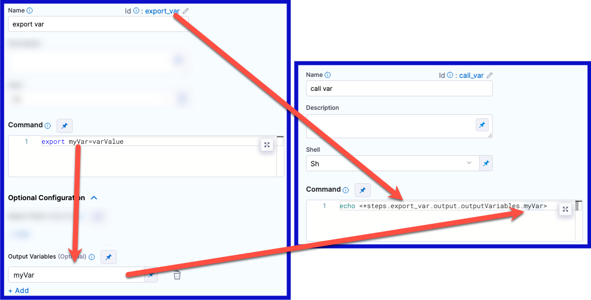

This topic describes settings for the Harness CI Run Tests step. Use the Run Tests step to [run tests](/docs/category/run-tests) and [enable Test Intelligence](./set-up-test-intelligence.md) in CI pipelines.

## Name

Enter a name summarizing the step's purpose. Harness automatically assigns an **Id** ([Entity Identifier Reference](../../../platform/20_References/entity-identifier-reference.md)) based on the **Name**. You can edit the **Id**.

## Description

Optional text string.

## Container Registry and Image

The **Container Registry** is a Harness container registry connector for the image that you want Harness to run build commands on, such as DockerHub.

The **Image** is the FQN (fully-qualified name) or artifact name of the Docker image to use when this step runs commands, for example `us.gcr.io/playground-123/quickstart-image`. The image name should include the tag. If you don't include a tag, Harness uses the `latest` tag.

You can use any Docker image from any Docker registry, including Docker images from private registries. Different container registries require different name formats:

* **Docker Registry:** Enter the name of the artifact you want to deploy, such as `library/tomcat`. Wildcards aren't supported. FQN is required for images in private container registries.
* **ECR:** Enter the FQN (fully-qualified name) of the artifact you want to deploy. Images in repos must reference a path, for example: `40000005317.dkr.ecr.us-east-1.amazonaws.com/todolist:0.2`.
* **GCR:** Enter the FQN (fully-qualified name) of the artifact you want to deploy. Images in repos must reference a path starting with the project ID that the artifact is in, for example: `us.gcr.io/playground-243019/quickstart-image:latest`.

:::info

The stage's build infrastructure determines whether these fields are required or optional:

* [Kubernetes cluster build infrastructure](../set-up-build-infrastructure/k8s-build-infrastructure/set-up-a-kubernetes-cluster-build-infrastructure.md): **Container Registry** and **Image** are always required.
* [Local runner build infrastructure](../set-up-build-infrastructure/define-a-docker-build-infrastructure.md): **Container Registry** and **Image** are always required.
* [Self-hosted cloud provider VM build infrastructure](/docs/category/set-up-vm-build-infrastructures): **Run Tests** steps can use binaries that you've made available on your build VMs. The **Container Registry** and **Image** are required if the VM doesn't have the necessary binaries. These fields are located under **Additional Configuration** for stages that use self-hosted VM build infrastructure.
* [Harness Cloud build infrastructure](../set-up-build-infrastructure/use-harness-cloud-build-infrastructure.md): **Run Tests** steps can use binaries available on Harness Cloud machines, as described in the [image specifications](/docs/continuous-integration/use-ci/set-up-build-infrastructure/use-harness-cloud-build-infrastructure#platforms-and-image-specifications). The **Container Registry** and **Image** are required if the machine doesn't have the binaries you need. These fields are located under **Additional Configuration** for stages that use Harness Cloud build infrastructure.

:::

## Language

Select the source code language to build, such as Java or C#.

## Build Tool

Select the build automation tool. Supported tools vary by **Language**. For example, Harness supports [Bazel](https://bazel.build/), [Maven](https://maven.apache.org/), and [Gradle](https://gradle.org/) for **Java** and [NET CLI](https://docs.microsoft.com/en-us/dotnet/core/tools/) and [Nunit](https://nunit.org/) for **.NET:** .

## Build Arguments

Enter the arguments for the build tool. These are used as input for the chosen build tool.

* **Java:** Provide runtime arguments for the tests, for example: `Test -Dmaven.test.failure.ignore=true -DfailIfNoTests=false`.
* **C#:** Provide runtime arguments for the tests, for example: `/path/to/test.dll /path/to/testProject.dll`. **Do not** inject another instrumenting agent, such as a code-coverage agent, in the argument string.
* **C#/Nunit:** Provide runtime executables and arguments for the tests, for example: `. "path/to/nunit3-console.exe" path/to/TestProject.dll --result="UnitTestResults.xml" /path/to/testProject.dll`. You must include the executable in the string. **Do not** inject another instrumenting agent, such as a code-coverage agent, in the string.

## Report Paths

The path to the file(s) that store test results in the JUnit XML format. You can add multiple paths. If you specify multiple paths, make sure the files contain unique tests to avoid duplicates. [Glob](https://en.wikipedia.org/wiki/Glob_(programming)) is supported.

This field is required for the Run Tests step to publish test results.

## Additional Configuration

Use these optional settings to specify additional configurations. Settings specific to containers, such as **Set Container Resources**, are not applicable when using the step in a stage with VM or Harness Cloud build infrastructure.

### Pre-Command

Enter the commands for setting up the environment before running the tests. For example, `printenv` prints all or part of the environment.

If a script is supplied here, select the corresponding **Shell** option.

### Post-Command

Enter the commands used for cleaning up the environment after running the tests. For example, `sleep 600` suspends the process for 600 seconds.

If a script is supplied here, select the corresponding **Shell** option.

### Run Only Selected Tests

This option must be selected to enable Test Intelligence.

If this option is unchecked, Test Intelligence is disabled and all tests run on every build.

### Packages

Leave blank or provide a comma-separated list of source code package prefixes, such as `com.company., io.company.migrations`. If you do not provide a list, Harness auto-detects the packages.

### Test Annotations

Provide a comma-separated list of test annotations used in unit testing. Any method with a specified annotation is treated as a test method. The defaults are: `org.junit.Test, org.junit.jupiter.api.Test, org.testing.annotations.Test`

### Namespaces (*C#*)

For .NET C# only, supply a comma-separated list of namespace prefixes that you want to test.

### Environment Variables

Variables passed to the container as environment variables and used in the step's commands.

### Output Variables

Output variables expose values for use by other steps or stages in the pipeline.

To create an output variable, do the following in the step where the output variable originates:

1. In the **Command** field, export the output variable. For example, the following command exports a variable called `myVar` with a value of `varValue`:

   ```
   export myVar=varValue
   ```

2. In the step's **Output Variables**, declare the variable name, such as `myVar`.

To call a previously-exported output variable in a later step or stage in the same pipeline, use a variable expression that includes the originating step's ID and the variable name.

<!--  -->

<docimage path={require('../../ci-technical-reference/static/run-step-output-variable-example.png')} />

To reference an output variable in another step in the same stage, use either of the following expressions:

```
<+steps.[stepID].output.outputVariables.[varName]>
<+execution.steps.[stepID].output.outputVariables.[varName]>
```

To reference an output variable in a different stage than the one where it originated, use the following expression:

```
<+stages.[stageID].spec.execution.steps.[stepID].output.outputVariables.[varName]>
<+pipeline.stages.[stageID].spec.execution.steps.[stepID].output.outputVariables.[varName]>
```

<details>
<summary>YAML example: Output variable</summary>

In the following YAML example, step `a` exports an output variable called `myVar`, and then step `b` references that output variable.

```yaml
              - step:
                  type: Run
                  name: a
                  identifier: a
                  spec:
                    shell: Sh
                    command: export myVar=varValue
                    outputVariables:
                      - name: myVar
              - step:
                  type: Run
                  name: b
                  identifier: b
                  spec:
                    shell: Sh
                    command: |-
                      echo <+steps.a.output.outputVariables.myVar>
                      echo <+execution.steps.a.output.outputVariables.myVar>
```

</details>

### Image Pull Policy

If you specified a [Container Registry and Image](#container-registry-and-image), you can specify an image pull policy:

* **Always:** The kubelet queries the container image registry to resolve the name to an image digest every time the kubelet launches a container. If the kubelet encounters an exact digest cached locally, it uses its cached image; otherwise, the kubelet downloads (pulls) the image with the resolved digest, and uses that image to launch the container.
* **If Not Present:** The image is pulled only if it isn't already present locally.
* **Never:** The image is not pulled.

### Run as User

If you specified a [Container Registry and Image](#container-registry-and-image), you can specify the user ID to use for running processes in containerized steps.

For a Kubernetes cluster build infrastructure, the step uses this user ID to run all processes in the pod. For more information, go to [Set the security context for a pod](https://kubernetes.io/docs/tasks/configure-pod-container/security-context/#set-the-security-context-for-a-pod).

### Set Container Resources

These settings specify the maximum resources used by the container at runtime:

* **Limit Memory:** The maximum memory that the container can use. You can express memory as a plain integer or as a fixed-point number using the suffixes `G` or `M`. You can also use the power-of-two equivalents `Gi` and `Mi`.
* **Limit CPU:** The maximum number of cores that the container can use. CPU limits are measured in CPU units. Fractional requests are allowed. For example, you can specify one hundred millicpu as `0.1` or `100m`. For more information go to [Resource units in Kubernetes](https://kubernetes.io/docs/concepts/configuration/manage-resources-containers/#resource-units-in-kubernetes).

### Timeout

The timeout limit for the step. Once the timeout is reached, the step fails and pipeline execution continues.

To change what happens when steps fail, go to [Step Failure Strategy settings](../../../platform/8_Pipelines/w_pipeline-steps-reference/step-failure-strategy-settings.md).

To configure when pipelines should skip certain steps, go to [Step Skip Condition settings](/docs/platform/8_Pipelines/w_pipeline-steps-reference/step-skip-condition-settings.md).
