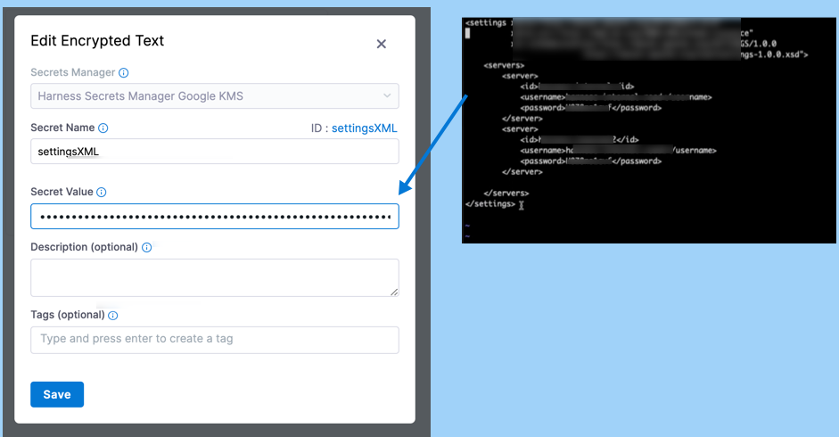

Use the following steps to override secrets in a [Maven settings.xml file](https://maven.apache.org/settings.html) by modifying the **Build** stage settings when the pipeline runs.

These steps assume you have an understanding of the [Harness Secret Manager](/docs/platform/Secrets/Secrets-Management/harness-secret-manager-overview) or that you know how to [add your own secrets manager](/docs/platform/Secrets/Secrets-Management/add-secrets-manager). You should also be familiar with [adding text secrets](/docs/platform/Secrets/add-use-text-secrets), [adding file secrets](/docs/platform/Secrets/add-file-secrets), and [adding SSH secrets](/docs/platform/Secrets/add-use-ssh-secrets).

## Create a secret at the account level

Create a [text secret](/docs/platform/Secrets/add-use-text-secrets) at the account level that contains the content of your `settings.xml` file.

You need the `Account: Secrets: Create/Edit/View` permission for the Harness Platform to be able to do this. For more information, go to the [Permission Reference](/docs/platform/Role-Based-Access-Control/ref-access-management/permissions-reference).

1. Go to **Account Settings**, select **Account Resources**, and then select **Secrets**.

   

2. Select **New Secret**, and then select **Text**.
1. Enter a **Secret Name**, such as `settingsXML`. Take note of the **ID**. You need it to reference the secret in your pipeline.
4. In **Secret Value**, paste the XML settings content from your `settings.xml` file.

   

5. Select **Save**.

## Transcribe the text secret into settings.xml

Create a new `settings.xml` file in the Harness working directory and include a command in your pipeline to assign the value of your settings XML text secret to that file. Modify either the **Run** or **Run Tests** step where your Maven tests run.

```mdx-code-block
import Tabs from '@theme/Tabs';
import TabItem from '@theme/TabItem';
```
```mdx-code-block
<Tabs>
  <TabItem value="run" label="Run step" default>
```

In the **Run** step, add the following to the **Command** field:

```
echo '<+secrets.getValue("account.[settingsXMLSecretID]")>' > settings.xml
```

```mdx-code-block
  </TabItem>
  <TabItem value="run-tests" label="Run Tests step">
```

In the **Run Tests** step, add the following to the **Pre-Command** field:

 ```
 echo '<+secrets.getValue("account.settingsXML")>' > settings.xml
 ```

```mdx-code-block
  </TabItem>
</Tabs>
```

## Modify the Maven test command

Once the `settings.xml` file exists in the Harness working directory, Maven can read your text secret from this file, and you can run your Maven test as follows:

```
mvn test -s settings.xml
```

## Optional: Use a non-default directory

If you created the `settings.xml` file in the `~/.m2/` folder, Maven can read the secrets from the default location and you don't need to run the test with `-s` flag.

For example, if you can use the following to [transcribe the text secret](#transcribe-the-text-secret-into-settingsxml) to `~/.m2/`:

```
echo '<+secrets.getValue("account.settingsXML")>' > ~/.m2/settings.xml
```

And then you only need `mvn test` to run the test.

## See also

* [Use Run steps](../run-ci-scripts/run-step-settings.md)
