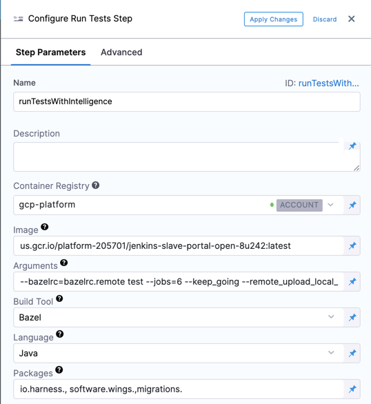
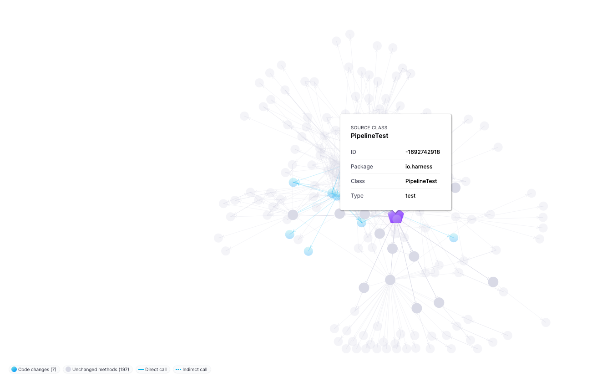

Test Intelligence (TI) dramatically improves test time by running only those tests required to confirm the quality of the code changes which triggered the build. You can enable Test Intelligence for your build in your CI stages using the Run Tests steps.

In this topic, we'll cover how to set up Test Intelligence in Harness CI Stage.

### Before You Begin

* [Test Intelligence Overview](../../ci-quickstarts/test-intelligence-concepts.md)
* [CI Pipeline Quickstart](../../ci-quickstarts/ci-pipeline-quickstart.md)

### Limitations

Test Intelligence is supported for Java and .NET Core codebases only at this time.

Currently, Test Intelligence for .NET is behind the Feature Flag `TI_DOTNET`. Contact [Harness Support](mailto:support@harness.io) to enable the feature.

### Step 1: Create the CI Stage

In your Harness Pipeline, click **Add Stage**, and then click Build.

### Step 2: Add the Codebase

Do one of the following:

* If this is the first CI stage in the Pipeline, in the Build stage settings, enable **Clone Codebase**.
* If you have an existing Pipeline with a Build stage, click **Codebase** to configure your codebase settings**.**

See [Edit Codebase Configuration](../codebase-configuration/create-and-configure-a-codebase.md).

### Step 3: Define the Build Farm Infrastructure

In the Build stage **Infrastructure**, define the build farm for the codebase. See [Kubernetes Cluster Build Infrastructure Setup](../set-up-build-infrastructure/set-up-a-kubernetes-cluster-build-infrastructure.md).

### Step 4: Configure a Run Tests Stage

In the Build stage **Execution**, click **Add step** and then click **Run Tests**.


The **Run Tests** step executes one or more commands on a container image.

The following screenshot explains the various parameters of **Configure Run Tests Step**. See [Run Test Step Settings](../../ci-technical-reference/configure-run-tests-step-settings.md) for details about specific settings.



|  |  |
| --- | --- |
| **Name** | Enter a unique name for the step. |
| **Description** | Enter a description for the step. |
| **Container Registry** | The Harness connector for a container registry. This is the container registry for the image Harness will use run build command on, such as Docker Hub. |
| **Image** | The name of the Docker image to use for running the build commands. Enter a Fully Qualified Image Name(FQIN) when using a private container registry. |
| **Arguments** | Enter the [arguments](../../ci-technical-reference/configure-run-tests-step-settings.md) for the build tool. These are used as input for the build tool choice. |
| **Build Tool** | Enter the build automation tool. Currently, Harness supports the following:*<p></p><p>**Java:** [Bazel](https://bazel.build/), [Maven](https://maven.apache.org/), and [Gradle](https://gradle.org/).</p><p>**.NET:** .[NET CLI](https://docs.microsoft.com/en-us/dotnet/core/tools/) and [Nunit](https://nunit.org/).</p>|
| **Language** | Select the source code language to build, such as Java or C#. |
| **Namespaces** | (*C# only*) A comma-separated list of the Namespace prefixes that you want to test. |
| **Packages** | List of source code package prefixes supported by a comma. For example `com.company.`, `io.company.`, migrations. |
| **Test Annotations** | Enter the list of test annotations used in unit testing, separated by commas. Any method annotated with this will be treated as a test method. The defaults are: `org.junit.Test`, `org.junit.jupiter.api.Test`, `org.testng.annotations.Test` |

### Step 5: Perform the Bootstrap

Bootstrapping helps generate the initial call graph for Test Intelligence. Once the call graph is generated, TI can perform Test Selection. Perform the bootstrap in the following steps:

Configure the Webhook.

You can trigger Pipelines in response to Git events automatically. For configuring the webhook for the Trigger, see [Add a Trigger](https://ngdocs.harness.io/article/hndnde8usz-triggering-pipelines#step_1_add_a_trigger_to_a_pipeline). 

Open the PR.

:::note
This PR should trigger all the tests (pom.xml, non-Java, etc.)
:::

Merge the PR.

### Step 6: View the Test Report

Once the Pipeline is executed, click **Tests**. **Tests** shows the test report of the test you configured and ran. Harness publishes test results in JUnit format. 


#### Test Execution Overview

Displays the overview of Total Test, Tests Selected, Duration of the Selected Tests, and Time Saved.

#### Test Execution Result

Displays the graphical representation of the successful and failed tests.

#### Test Selection Breakdown

Displays the selection of Tests on the following metrics: changed code, changed tests, and new tests.

#### Test Execution

Displays the detailed list of all tests: class methods and test methods.

#### Call Graph

A call graph is generated once the bootstrap is completed. In each later run, the test tab will display stats corresponding to the selection. 

#### Visualization

Visualization shows why a specific test was selected and the reason behind every test selection. Click on any test (the purple node), and you can see all the classes and methods covered by this test. These are the changed classes and methods (denoted by the blue nodes), which led to the selection of that test.



### Optional: YAML Configure As Code

Here's a working example of Test Intelligence on the open-source project Dubbo. Use this YAML template to create and configure the TI pipeline on the go.


```
pipeline:  
    name: ti-dubbo  
    identifier: tidubbo  
    properties:  
        ci:  
            codebase:  
                connectorRef: account.howdi  
                repoName: dubbo  
                build: <+input>  
    stages:  
        - stage:  
              name: unit-test  
              identifier: unitteststi  
              type: CI  
              spec:  
                  cloneCodebase: true  
                  execution:  
                      steps:  
                          - step:  
                                type: RunTests  
                                name: runTestsWithIntelligence  
                                identifier: runTestsWithIntelligence  
                                spec:  
                                    connectorRef: account.GCR  
                                    image: maven:3-openjdk-8  
                                    args: test -Dmaven.test.failure.ignore=true -DfailIfNoTests=false  
                                    buildTool: Maven  
                                    language: Java  
                                    packages: org.apache.dubbo,com.alibaba.dubbo  
                                    runOnlySelectedTests: true  
                                    reports:  
                                        type: JUnit  
                                        spec:  
                                            paths:  
                                                - "**/*.xml"  
                                    resources:  
                                        limits:  
                                            memory: 2Gi  
                                            cpu: 2000m  
                                timeout: 60m  
                  serviceDependencies: []  
                  infrastructure:  
                      type: KubernetesDirect  
                      spec:  
                          connectorRef: Kubernetes_Quickstart  
                          namespace: harness-delegate  
              variables: []  
    projectIdentifier: CD_Examples  
    orgIdentifier: default  
    description: TI for open source project dubbo  
    tags: {}
```
### See Also

* [Test Intelligence Concepts](../../ci-quickstarts/test-intelligence-concepts.md)
* [View Test Report](../view-your-builds/viewing-tests.md)

