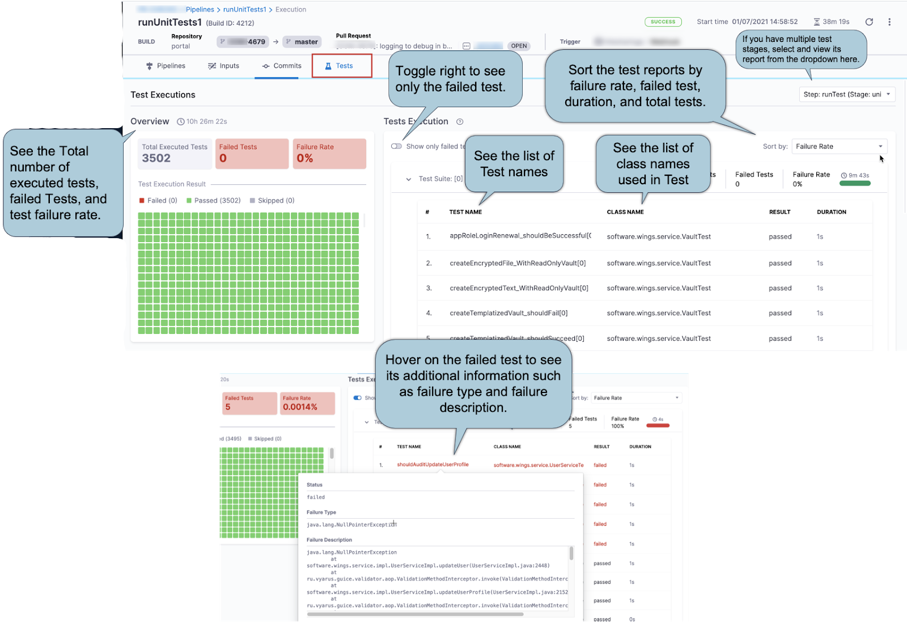

```mdx-code-block
import Tabs from '@theme/Tabs';
import TabItem from '@theme/TabItem';
```

Your CI pipelines can run tests in [Run steps](../run-ci-scripts/run-step-settings.md) and [Run Tests steps](./set-up-test-intelligence.md#add-the-run-tests-step). To publish test results and view them in Harness, you must add the **Report Paths** setting to the relevant step, for example:

```yaml
              - step:
                  type: Run
                  name: Run Ruby Tests
                  identifier: run_ruby_tests
                  spec:
                    shell: Sh
                    command: |-
                      bundle exec rake test --junit
                  reports:
                    type: JUnit
                    spec:
                      paths:
                        - report.xml
```

## Publish reports to the Tests tab

If the [test reports are in JUnit XML format](./test-report-ref.md), you can review test reports on the **Tests** tab on the [Build details page](../viewing-builds.md).



If you are using Test Intelligence for your unit tests, the **Tests** tab contains information unique to Test Intelligence. For details about this, go to [Enable Test Intelligence](./set-up-test-intelligence.md).

### Test report dashboard

:::note

Currently, the Unit Test Metrics dashboard is behind the feature flag `CI_TI_DASHBOARDS_ENABLED`. Contact [Harness Support](mailto:support@harness.io) to enable the feature.

:::

The **Unit Test Metrics** dashboard aggregates data from test reports in JUnit XML format. The dashboard reports the overall failure rate and the overall success rate. The dashboard breaks down failure data by pipeline, Git repo, and test. You can filter by project, pipeline, and date range.

You can find this and other [dashboards](/docs/platform/dashboards/dashboards-overview/) under the **Dashboards** section of your Harness account.

### Troubleshooting: Test suites incorrectly parsed

The parsed test report in the **Tests** tab comes strictly from the provided test reports. Test reports must be in JUnit XML format to appear on the **Tests** tab, because Harness parses test reports that are in JUnit XML format only. It is important to adhere to the standard [JUnit format](https://llg.cubic.org/docs/junit/) to improve test suite parsing. For more information, go to [Format test reports](./test-report-ref.md).

## View reports on the Artifacts tab

For reports that can't be published to the **Tests** tab, you can use the [Artifact Metadata Publisher Drone plugin](https://github.com/drone-plugins/artifact-metadata-publisher) to publish reports to the **Artifacts** tab on the [Build details page](../viewing-builds.md). You can [publish any URL to the Artifacts tab](/tutorials/ci-pipelines/publish/artifacts-tab).

```mdx-code-block
<Tabs>
  <TabItem value="Visual" label="Visual">
```

To publish an artifact to the **Artifacts** tab, you must:

1. Include steps in your pipeline that run tests and produce test reports.
2. Include a step to upload the report artifact to cloud storage, such as [Upload Artifacts to GCS](../build-and-upload-artifacts/upload-artifacts-to-gcs-step-settings.md), [Upload Artifacts to S3](../build-and-upload-artifacts/upload-artifacts-to-s-3-step-settings.md), or [Upload Artifacts to JFrog Artifactory](../build-and-upload-artifacts/upload-artifacts-to-jfrog.md).
3. Include a [Plugin step](../use-drone-plugins/plugin-step-settings-reference.md) that uses the `artifact-metadata-publisher` plugin. Configure the **Plugin** step settings as follows:

   * **Name:** Enter a name.
   * **Container Registry:** Select a Docker connector.
   * **Image:** Enter `plugins/artifact-metadata-publisher`.
   * **Settings:** Add the following two settings as key-value pairs.
      * `file_urls`: The URL to the target artifact that was uploaded in the **Upload Artifacts** step.
      * `artifact_file`: `artifact.txt`

```mdx-code-block
  </TabItem>
  <TabItem value="YAML" label="YAML" default>
```

1. Include steps in your pipeline that run tests and produce test reports.
2. Include a step to upload the report artifact to cloud storage, such as [Upload Artifacts to GCS](../build-and-upload-artifacts/upload-artifacts-to-gcs-step-settings.md), [Upload Artifacts to S3](../build-and-upload-artifacts/upload-artifacts-to-s-3-step-settings.md), or [Upload Artifacts to JFrog Artifactory](../build-and-upload-artifacts/upload-artifacts-to-jfrog.md).
3. Include a [Plugin step](../use-drone-plugins/plugin-step-settings-reference.md) that uses the `artifact-metadata-publisher` plugin, for example:

   ```yaml
                  - step:
                     type: Plugin
                     name: publish artifact metadata
                     identifier: publish_artifact_metadata
                     spec:
                       connectorRef: account.harnessImage
                       image: plugins/artifact-metadata-publisher
                       settings:
                         file_urls: ## Provide the URL to the target artifact that was uploaded in the Upload Artifacts step.
                         artifact_file: artifact.txt
   ```

```mdx-code-block
  </TabItem>
</Tabs>
```
