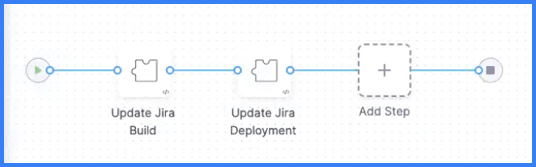
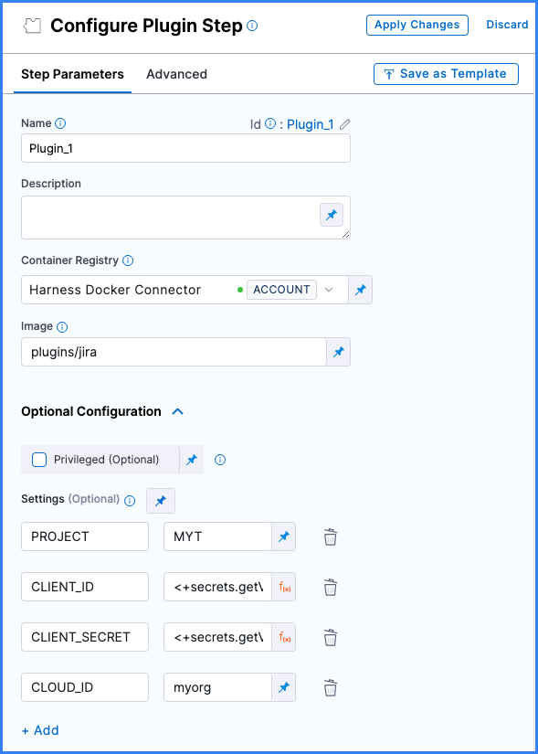

Understanding how a feature is being released, when Jira issues have been deployed, and whether a build has passed or failed is important for teams to stay aligned and better serve customers. Jira integrations in your CI pipelines provide insight into feature development and release information in Jira by automatically updating the **Deployment** or **Build** fields in Jira.

To integrate Harness CI and Jira, you need to:

- [Install the Harness CI Jira app](#install-the-harness-ci-jira-app)
- [Generate authentication credentials](#generate-authentication-credentials)
- [Add the Plugin step](#add-the-plugin-step)
- [Run your pipeline](#run-your-pipeline)

This topic assumes you have a familiarity with [Harness CI concepts](../../ci-quickstarts/ci-concepts.md), [CI pipeline concepts](../../ci-quickstarts/ci-pipeline-basics.md), and creating pipelines. If you haven't created a Harness CI pipeline before, try one of the [CI tutorials](../../ci-quickstarts/ci-pipeline-quickstart.md).

## Install the Harness CI Jira app

You must have administrator privileges in your Jira instance to install the Harness CI Jira app. You need to do this only once per instance.

1. In your Jira instance, select **Apps** and then select **Explore more apps**.
2. Search for and add the Harness CI Jira app.

## Generate authentication credentials

Use one of the following methods to generate authentication credentials that your Harness CI pipeline will use to communicate with Jira.

```mdx-code-block
import Tabs from '@theme/Tabs';
import TabItem from '@theme/TabItem';
```
```mdx-code-block
<Tabs>
  <TabItem value="connect_key" label="Token authentication" default>
```

If permitted by your organization's Jira permissions configuration, users can generate their own authentication tokens for the Harness CI Jira app. Otherwise, an administrator must generate one or more tokens.

1. Go to the [app configuration page](https://confluence.atlassian.com/upm/configuring-apps-273875766.html) and select the Harness CI Jira app.
2. Select **Configure** and generate an authentication token.
3. Save the token as a [Harness text secret](/docs/platform/Security/add-use-text-secrets).

```mdx-code-block
  </TabItem>
  <TabItem value="oauth2" label="OAuth2 authentication">
```

This method requires that you have access to **Administration** in Jira.

1. Get an OAuth2 client ID and client secret by [configuring an incoming link](https://confluence.atlassian.com/adminjiraserver/configure-an-incoming-link-1115659067.html).
2. Save the **Client ID** and **Client Secret** as two separate [Harness text secrets](/docs/platform/Security/add-use-text-secrets).

```mdx-code-block
  </TabItem>
</Tabs>
```

## Add the Plugin step

Add one or more **Plugin** steps to a CI **Build** stage to send updates to Jira. For example, your pipeline can have a step that updates Jira any time a build runs and another step that updates Jira when there is a deployment to production.

<!--  -->

<docimage path={require('./static/ci-jira-int-two-plugin-steps.png')} />

<details>
<summary>How does Harness determine which Jira issue and field to update?</summary>

The presence of the `ENVIRONMENT_NAME` setting in the **Plugin** step determines whether Harness updates the **Deployment** or **Build** field in Jira. If `ENVIRONMENT_NAME` is included, Harness updates the **Deployment** field. If `ENVIRONMENT_NAME` is excluded, Harness updates the **Build** field.

When the pipeline runs, Harness scans for a Jira issue number, such as `[JIRA-1234]`, in the title of the PR or the latest commit message associated with the build.

</details>

```mdx-code-block
import Tabs2 from '@theme/Tabs';
import TabItem2 from '@theme/TabItem';
```
```mdx-code-block
<Tabs2>
  <TabItem2 value="Visual" label="Visual" default>
```

1. In your pipeline's **Build** stage, select **Add Step**, select **Add Step** again, and then select **Plugins** from the **Step Library**.
2. Enter a **Name** and optional **Description**.
3. For **Container Registry**, select a container registry connector with DockerHub access.
4. In the **Image** field, enter `plugins/jira`.
5. Under **Optional Configuration**, add **Settings** to configure the Jira plugin's properties for this step, as described in the following table. These are passed as environment variables, and, therefore, you must use all uppercase letters for the keys.

| Keys | Required or optional | Description | Value example |
| - | - | - | - |
| <ul><li>For token authentication use `CONNECT_KEY`</li><li>For OAuth2 authentication use both `CLIENT_ID` and `CLIENT_SECRET`</li></ul>| Required | Provide authentication credentials as an [expression referencing a text secret](/docs/platform/Security/add-use-text-secrets#step-3-reference-the-encrypted-text-by-identifier) that contains [app authentication credentials](#generate-authentication-credentials). For OAuth2 authentication, specify `CLIENT_ID` and `CLIENT_SECRET` separately. | `<+secrets.getValue("jiraKey")>` |
| `PROJECT` | Required | Specify the Jira project key. For example, a `My Test` project might have a project key of `MYT`. | `MYT` |
| `INSTANCE` | Required | Specify the Jira instance using the prefix to your Jira hostname, such as `myorg` in `myorg.atlassian.net`. | `myorg` |
| `ENVIRONMENT_NAME` | Optional | Specify a deployment environment. Use this if you want Harness to update the **Deployment** field in Jira. If `ENVIRONMENT_NAME` is excluded, Harness updates the **Build** field in Jira. | `production` |
| `STATE` | Optional | Specify a deployment or build state. This is useful if you only want an update to appear in Jira when, for example, builds are successful. | `success` |
| `LOG_LEVEL` | Optional | Set the log level as either `debug` or `info`. Set to `debug` to print the response from Jira in the build logs. | `debug` |
| `CLOUD_ID` | Optional | Your site's Atlassian Cloud ID. | A Cloud ID is a 32-character UUID. |

:::tip

You can use [variable expressions](/docs/platform/variables-and-expressions/harness-variables/) for values, such as `<+secrets.getValue("jiraClientId")>`.

:::

The following image shows a **Plugin** step that uses OAuth2 authentication. For token authentication, you would specify `CONNECT_KEY` instead of `CLIENT_ID` and `CLIENT_SECRET`.

<!--  -->

<docimage path={require('./static/ci-jira-int-plugin-step-visual.png')} />

```mdx-code-block
  </TabItem2>
  <TabItem2 value="YAML" label="YAML">
```

Go to the pipeline where you want to add the Jira integration, and add a `Plugin` step configured as follows:

*  `type: Plugin`
*  `name:` A name for the step.
*  `identifier:` A unique step ID.
*  `connectorRef:` Specify a container registry connector with DockerHub access.
*  `image: plugins/jira`
*  `settings:` Add a series of key-value pairs to configure the Jira plugin's properties for this step, as described in the following table. These are passed as environment variables, and, therefore, you must use all uppercase letters for the keys.

| Keys | Required or optional | Description | Value example |
| - | - | - | - |
| <ul><li>For token authentication use `CONNECT_KEY`</li><li>For OAuth2 authentication use both `CLIENT_ID` and `CLIENT_SECRET`</li></ul>| Required | Provide authentication credentials as an [expression referencing a text secret](/docs/platform/Security/add-use-text-secrets#step-3-reference-the-encrypted-text-by-identifier) that contains [app authentication credentials](#generate-authentication-credentials). For OAuth2 authentication, specify `CLIENT_ID` and `CLIENT_SECRET` separately. | `<+secrets.getValue("jiraKey")>` |
| `PROJECT` | Required | Specify the Jira project key. For example, a `My Test` project might have a project key of `MYT`. | `MYT` |
| `INSTANCE` | Required | Specify the Jira instance using the prefix to your Jira hostname, such as `myorg` in `myorg.atlassian.net`. | `myorg` |
| `ENVIRONMENT_NAME` | Optional | Specify a deployment environment. Use this if you want Harness to update the **Deployment** field in Jira. If `ENVIRONMENT_NAME` is excluded, Harness updates the **Build** field in Jira. | `production` |
| `STATE` | Optional | Specify a deployment or build state. This is useful if you only want an update to appear in Jira when, for example, builds are successful. | `success` |
| `LOG_LEVEL` | Optional | Set the log level as either `debug` or `info`. Set to `debug` to print the response from Jira in the build logs. | `debug` |
| `CLOUD_ID` | Optional | Your site's Atlassian Cloud ID. | A Cloud ID is a 32-character UUID. |

:::tip

You can use [variable expressions](/docs/platform/variables-and-expressions/harness-variables/) for values, such as `<+secrets.getValue("jiraClientId")>`.

:::

The following YAML example describes a `Plugin` step that uses the Jira plugin to update the **Deployment** field in Jira when there is a successful deployment to the production environment.

```yaml
              - step:
                  type: Plugin
                  name: Update Jira Deployment
                  identifier: updateJiraDeployment
                  spec:
                    connectorRef: account.harnessImage
                    image: plugins/jira
                    settings:
                      PROJECT: MYT
                      CONNECT_KEY: <+secrets.getValue("jiraKey")>
                      INSTANCE: myorg
                      LOG_LEVEL: debug
                      STATE: success
                      ENVIRONMENT_NAME: production
```

The previous example uses token authentication (`CONNECT_KEY`). With OAuth2 authentication, `CONNECT_KEY` would be replaced by `CLIENT_ID` and `CLIENT_SECRET`, for example:

```yaml
                      CLIENT_ID: <+secrets.getValue("jiraClientId")>
                      CLIENT_SECRET: <+secrets.getValue("jiraClientSecret")>
```

```mdx-code-block
  </TabItem2>
</Tabs2>
```

:::tip

For more information about **Plugin** step settings, go to the [Plugin step settings reference](../../ci-technical-reference/plugin-step-settings-reference.md).

:::

## Run your pipeline

After adding the **Plugin** step, save and run the pipeline. If you set `LOG_LEVEL: debug`, you can see the Jira response in the build logs.

After the build runs, you can see updates to **Build** and **Deployment** fields on the Jira issue associated with the build. If you drill down into these fields, you can find links to the build in Harness.

<!--  -->

<docimage path={require('./static/ci-jira-int-ticket-details.png')} />

<details>
<summary>How does Harness determine which Jira issue and field to update?</summary>

The presence of the `ENVIRONMENT_NAME` setting in the **Plugin** step determines whether Harness updates the **Deployment** or **Build** field in Jira. If `ENVIRONMENT_NAME` is included, Harness updates the **Deployment** field. If `ENVIRONMENT_NAME` is excluded, Harness updates the **Build** field.

When the pipeline runs, Harness scans for a Jira issue number, such as `[JIRA-1234]`, in the title of the PR or the latest commit message associated with the build.

</details>