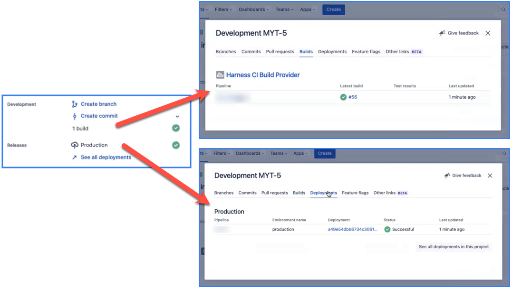

To stay aligned and better serve customers, development teams need to understand how a feature is being released, when Jira issues have been deployed, and whether a build has passed or failed. Jira integrations in your CI pipelines provide insights into feature development and release information in Jira by automatically updating the **Deployment** or **Build** fields in Jira.

To integrate Harness CI and Jira, install the **CI Enterprise by Harness** app in your Jira instance, generate an authentication token, and then add a **Plugin** step to your pipeline. If you haven't created a Harness CI pipeline before, try one of the [CI tutorials](../../ci-quickstarts/ci-pipeline-quickstart.md).

## Install the app

The **CI Enterprise by Harness** app uses the [Jira Drone plugin](https://plugins.drone.io/plugins/jira). If you aren't able to install apps in your Jira instance, you can also use the [Jira Drone plugin directly in a Plugin step](./run-a-drone-plugin-in-ci.md).

1. Install the [CI Enterprise by Harness app](https://marketplace.atlassian.com/apps/1227511/ci-enterprise-by-harness) in your Jira instance.
2. Go to the **CI Enterprise by Harness** app configuration page.
3. Generate an authentication token, and save it as a [Harness text secret](/docs/platform/Secrets/add-use-text-secrets).

## Add a Plugin step

```mdx-code-block
import Tabs3 from '@theme/Tabs';
import TabItem3 from '@theme/TabItem';
```

```mdx-code-block
<Tabs3>
  <TabItem3 value="Visual" label="Visual">
```

1. In your CI pipeline's **Build** stage, add a [Plugin step](./plugin-step-settings-reference.md).
2. Enter a **Name** and optional **Description**.
3. For **Container Registry**, select a container registry connector with Docker Hub access.
4. In the **Image** field, enter `plugins/jira`.
5. Under **Optional Configuration**, add **Settings** to configure the Jira plugin's properties for this step, as described in the following table.

| Keys | Required or optional | Description | Value example |
| - | - | - | - |
| `CONNECT_KEY` | Required | [An expression referencing your Jira auth token secret](/docs/platform/Secrets/add-use-text-secrets#step-3-reference-the-encrypted-text-by-identifier). | `<+secrets.getValue("jiraKey")>` |
| `PROJECT` | Required | Your Jira project key.<br/>For example, a project called `My Test` might have a project key of `MYT`. | `MYT` |
| `INSTANCE` <!--CONNECT_HOSTNAME?--> | Required | Your Jira hostname prefix, such as `myorg` in `myorg.atlassian.net`. | `myorg` |
| `ENVIRONMENT_NAME` | Optional | If included, Harness updates the Jira **Deployment** field when there is a deployment to the specified environment.<br/>If omitted, Harness updates the Jira **Build** field. | `production` |
| `STATE` | Optional | If included, Harness updates Jira only if builds/deployments achieve the specified status.<br/>Accepted values include: `pending`, `in_progress`, `cancelled`, `failed`, `rolled_back`, or `successful`.<br/>If omitted, Harness updates Jira for all build/deployments, regardless of status. | `successful` |
| `LOG_LEVEL` | Optional | Either `debug` or `info`.<br/>Set to `debug` to print the response from Jira in the build logs. | `debug` |

```mdx-code-block
  </TabItem3>
  <TabItem3 value="YAML" label="YAML" default>
```
The following YAML example describes a [Plugin step](./plugin-step-settings-reference.md) in a `CI` stage that updates the Jira **Build** field when there is a successful build.

```yaml
              - step:
                  type: Plugin
                  name: Update Jira Build #Step name
                  identifier: updateJiraBuild #Step ID
                  spec:
                    connectorRef: account.harnessImage #Docker Hub container registry connector
                    image: plugins/jira
                    settings:
                      PROJECT: MYT #Your Jira project key
                      CONNECT_KEY: <+secrets.getValue("jiraKey")> #Jira authentication token secret
                      INSTANCE: myorg #Your Jira instance hostname
                      STATE: successful #Optional: Update Jira only when builds succeed
```

To update the Jira **Deployment** field, instead of the **Build** field, include `ENVIRONMENT_NAME`, such as:

```yaml
                      ENVIRONMENT_NAME: production
```

<details>
<summary>Plugin step specifications</summary>

*  `type: Plugin`
*  `name:` Specify a step name.
*  `identifier:` Specify a unique step ID.
*  `connectorRef:` Specify a Docker Hub container registry connector.
*  `image: plugins/jira`
*  `settings:` Add environment variables to configure the Jira plugin's properties for this step, as described in the following table.

| Keys | Required or optional | Description | Value example |
| - | - | - | - |
| `CONNECT_KEY` | Required | [An expression referencing your Jira auth token secret](/docs/platform/Secrets/add-use-text-secrets#step-3-reference-the-encrypted-text-by-identifier). | `<+secrets.getValue("jiraKey")>` |
| `PROJECT` | Required | Your Jira project key.<br/>For example, a project called `My Test` might have a project key of `MYT`. | `MYT` |
| `INSTANCE` <!--CONNECT_HOSTNAME?--> | Required | Your Jira hostname prefix, such as `myorg` in `myorg.atlassian.net`. | `myorg` |
| `ENVIRONMENT_NAME` | Optional | If included, Harness updates the Jira **Deployment** field when there is a deployment to the specified environment.<br/>If omitted, Harness updates the Jira **Build** field. | `production` |
| `STATE` | Optional | If included, Harness updates Jira only if builds/deployments achieve the specified status.<br/>Accepted values include: `pending`, `in_progress`, `cancelled`, `failed`, `rolled_back`, or `successful`.<br/>If omitted, Harness updates Jira for all build/deployments, regardless of status. | `successful` |
| `LOG_LEVEL` | Optional | Either `debug` or `info`.<br/>Set to `debug` to print the response from Jira in the build logs. | `debug` |

</details>

```mdx-code-block
  </TabItem3>
</Tabs3>
```

## Run your pipeline

After adding the **Plugin** step, save and run the pipeline. If you set `LOG_LEVEL: debug`, you can see the Jira response in the build logs.

After the build runs, you can see updates to **Build** and **Deployment** fields on the Jira issue associated with the build. If you drill down into these fields, you can find links to the build in Harness.

<!--  -->

<docimage path={require('./static/ci-jira-int-ticket-details.png')} />

:::info How does Harness determine which Jira issue and field to update?

The presence of the `ENVIRONMENT_NAME` setting in the **Plugin** step determines whether Harness updates the **Deployment** or **Build** field in Jira. If `ENVIRONMENT_NAME` is included, Harness updates the **Deployment** field. If `ENVIRONMENT_NAME` is excluded, Harness updates the **Build** field.

When the pipeline runs, Harness scans for a Jira issue number, such as `[JIRA-1234]`, in the title of the PR or the latest commit message associated with the build.

:::
