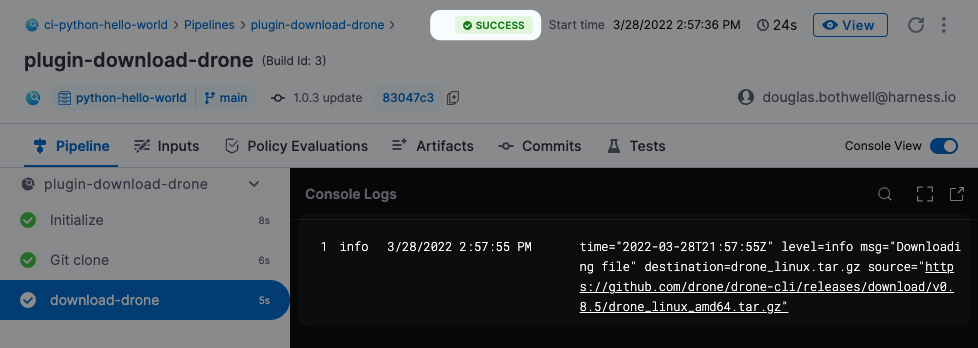

A Drone Plugin is a Docker container that performs a predefined task. Plugins are essentially templated scripts that can be written in any programming language. The Drone community maintains an [extensive library](https://plugins.drone.io/) of plugins for specific CI workflows. You can customize and extend your build processes using existing plugins or [write your own](https://harness.io/blog/continuous-integration/write-first-plugin-for-cie/).

This topic describes how to set up and run Drone Plugins in your CI pipelines. You can also use [GitHub Action plugin steps](../../ci-technical-reference/plugin-steps/ci-github-action-step.md) and [Bitrise plugin steps](../../ci-technical-reference/plugin-steps/ci-bitrise-plugin.md) to run GitHub Actions and Bitrise Integrations in your CI pipelines.

## Before You Begin

To install and run a plugin, you need the following:

* A familiarity with basic Harness CI concepts:
	+ [CI pipeline tutorials](../../ci-quickstarts/ci-pipeline-quickstart.md)
	+ [Harness key concepts](../../../getting-started/learn-harness-key-concepts.md)
* A build infrastructure and Delegate to run builds:
	+ [Set Up Build Infrastructure](/docs/category/set-up-build-infrastructure)
	+ [Delegate installation overview](../../../platform/2_Delegates/install-delegates/overview.md)
* A CI pipeline with a Build stage to run the plugin:
	+ [CI Build stage settings](../set-up-build-infrastructure/ci-stage-settings.md)
* You should create text secrets for any sensitive information required by the plugin, such as a password or Personal Access Token. You'll need to reference the IDs for any secrets when you set up the Plugin Step.
	+ [Add and Reference Text Secrets](../../../platform/6_Security/2-add-use-text-secrets.md)

## Workflow Description

The following steps describe the high-level workflow:

1. Go to the Pipeline and open the Build step where you want to run the plugin.
2. In the Execution tab, click **Add step** and select **Plugin**.
3. Enter the following:
	1. **Name:** A unique, descriptive name.
	2. **Container Registry:** A Connector to the image registry (such as Docker Hub) of the plugin image.
	3. **Image:** The full image name, such as`dockerhubusername/my-plugin:2.3.1`. The Step uses the latest image if you don't specify a tag.
	4. Under **Optional Configuration > Settings**, add any other settings that are required as specified in the docs for the specific plugin.
4. Click **Apply Changes** to apply your Stage settings, then **Save** to save the updated Pipeline
5. Run the updated Pipeline and check the log output to verify that the Plugin Step works as intended.

## Simple Example: Download a File

This example describes how to run the Drone Downloads plugin, which downloads an archive to your build infrastructure. You can use the following workflow to implement any plugin.

1. Go to the [Drone Plugins Marketplace](https://plugins.drone.io/) and read the description for the specific plugin. The description should indicate the plugin image and the required settings.

   The [Download plugin doc](https://plugins.drone.io/plugins/download) shows the image to use (`plugins/download`) and the settings that the plugin supports: `source`, `destination`, `username`, `password`, and so on.

2. Go to the Build Stage in a CI Pipeline. In the Execute tab, add a **Plugin** step.
3. Configure the Step as follows.

   * **Name:** A unique, descriptive name.
   * **Container Registry:** A Connector to Docker Hub.
   * **Image:** The plugin image --in this case, `plugins/download`
   * Under Optional Configuration, add the following settings:
      + `source` = The artifact to download.
	  + `destination` = Save the downloaded artifact to this file.
	  + `username` = A valid username for the Git provider.
	  + `password` = The ID of the text secret that contains the Git provider password, using the convention described [here](../../../platform/6_Security/2-add-use-text-secrets.md#step-3-reference-the-encrypted-text-by-identifier). For example: `<+secrets.getValue("mygithubpersonalaccesstoken")>`

   

4. Click **Apply Changes** to apply your stage settings, then **Save** to save the updated Pipeline
5. Run the updated Pipeline and check the log output to verify that the Plugin Step works as intended.

  


## Convert Drone Plugin YAML to Harness CI YAML

You can use YAML examples in the [Drone Plugins Marketplace](https://plugins.drone.io/) to configure a **Plugin** step in Harness CI. While the formats are slightly different, it is fairly simple to translate Drone Plugin definitions to Harness CI YAML.

### Listed and nested settings

To list-formatted settings from Drone Plugin YAML to Harness CI YAML, merge them with comma separation.

```mdx-code-block
import Tabs from '@theme/Tabs';
import TabItem from '@theme/TabItem';
```
```mdx-code-block
<Tabs>
  <TabItem value="drone" label="Drone Plugin YAML" default>
```

```yaml
Settings:
  tags:
    - latest
	- '1.0.1'
	- '1.0'
```

```mdx-code-block
  </TabItem>
  <TabItem value="ci" label="Harness CI YAML">
```

```yaml
settings:
  tags: latest,1.0.1,1.0
```

```mdx-code-block
  </TabItem>
</Tabs>
```

For nested settings, maintain key-value pair definitions, as shown in the following Harness CI YAML example:

```yaml
settings:
  mynestedsetting:
    nextlevel:
      varname: 100
  mylistsetting:
   - itemone
   - itemtwo
```

It's often easier to define complex settings in the Pipeline Studio's YAML editor, rather than the Visual editor. The settings in the above example would be defined in the Visual editor as shown in the following screenshot.


### Text Secrets

The following snippets illustrate the different ways that Drone and Harness CI handle [text secrets](../../../platform/6_Security/2-add-use-text-secrets.md).

Note that the CI definition includes a few additional fields and that some fields use different formats.

```mdx-code-block
import Tabs2 from '@theme/Tabs';
import TabItem2 from '@theme/TabItem';
```
```mdx-code-block
<Tabs2>
  <TabItem2 value="drone" label="Drone Plugin Marketplace definition" default>
```

```yaml
steps:
    - name: download
	  image: plugins/download
	  settings:
	    username:
		    from_secret: username
		password:
			from_secret: password
		source: https://github.com/drone/drone-cli/releases/download/v0.8.5/drone_linux_amd64.tar.gz
```

```mdx-code-block
  </TabItem2>
  <TabItem2 value="ci" label="Harness CI definition">
```

```yaml
  - step:
    type: Plugin
	name: download-drone
	identifier: downloaddrone
	spec:
	    connectorRef: mygithubconnector
		image: plugins/download
		privileged: false
		settings:
		    username: <+secrets.getValue("myusernamesecret")>
			password: <+secrets.getValue("mypasswordsecret")>
			source: https://github.com/drone/drone-cli/releases/download/v0.8.5/drone_linux_amd64.tar.gz
```

```mdx-code-block
  </TabItem2>
</Tabs2>
```

### More examples

You can see additional examples in the [GitHub Actions Support in Harness CI blog post](https://harness.io/blog/continuous-integration/github-actions-support-harness-ci/).

## See also

* [Drone Plugins Marketplace](https://plugins.drone.io/)
* [Run GitHub Actions in CI pipelines](run-a-git-hub-action-in-cie.md)
* [Plugin step settings](../../ci-technical-reference/plugin-steps/plugin-step-settings-reference.md)
* [Add and Reference Text Secrets](../../../platform/6_Security/2-add-use-text-secrets.md)

