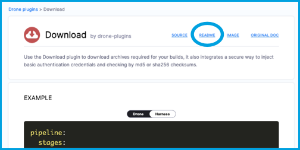

```mdx-code-block
import Tabs from '@theme/Tabs';
import TabItem from '@theme/TabItem';
```

Drone plugins are Docker containers that perform predefined tasks. You can use the **Plugin** step to run plugins from the [Drone Plugins Marketplace](https://plugins.drone.io/) in your Harness CI pipelines. You can also [write your own custom plugins](./custom_plugins.md). For more information about plugins, go to [Explore plugins](./explore-ci-plugins.md).

This topic assumes you're familiar with [pipeline creation](../prep-ci-pipeline-components.md). If you haven't created a pipeline before, try one of the [CI tutorials](../../ci-quickstarts/ci-pipeline-quickstart.md).

<details>
<summary>About Drone</summary>

[Drone](https://docs.drone.io/) was acquired by Harness in 2020 and is part of Harness CI.

For more information on the acquisition of Drone, go to the following blog posts:

* [Harness Acquires CI Pioneer Drone.io and Commits to Open Source](https://harness.io/blog/featured/harness-acquires-ci-pioneer-drone-io-and-commits-to-open-source/)
* [Lavasoft Reduces Developer Toil by 94% Using Drone and Harness](https://harness.io/customers/case-studies/reduce-developer-toil/)

</details>

## Add a plugin to a Harness CI pipeline

To demonstrate how to add a Drone plugin to a Harness CI pipeline, these steps use the [Download plugin](https://plugins.drone.io/plugins/download) as an example. This plugin downloads an archive to the [stage workspace](/docs/continuous-integration/use-ci/caching-ci-data/share-ci-data-across-steps-and-stages#share-data-between-steps-in-a-stage).

```mdx-code-block
<Tabs>
  <TabItem value="Visual" label="Visual">
```

Add the **Plugin** step to the **Build** stage of your CI pipeline, and configure the settings as follows:

* **Name:** Enter a name for the step.
* **Description:** Optional description.
* **Container Registry:** Select a [Docker connector](/docs/platform/Connectors/Cloud-providers/ref-cloud-providers/docker-registry-connector-settings-reference).
* **Image:** Enter the plugin's Docker image, such as `plugins/download`. You can find this on the plugin's page on the [Drone Plugins Marketplace](https://plugins.drone.io/).
* **Settings:** Enter key-value pairs representing plugin settings. You can find this on the plugin's page on the [Drone Plugins Marketplace](https://plugins.drone.io/) or in the plugin's README.
* For information about other settings, go to the [Plugin step settings reference](./plugin-step-settings-reference.md).

The following screenshot shows a **Plugin** step configured for the [Download plugin](https://plugins.drone.io/plugins/download).


```mdx-code-block
  </TabItem>
  <TabItem value="YAML" label="YAML" default>
```

Add the `Plugin` step to your `CI` stage with the following settings:

* `type: Plugin`
* `name:` A name for the step
* `connectorRef:` The ID of a [Docker connector](/docs/platform/Connectors/Cloud-providers/ref-cloud-providers/docker-registry-connector-settings-reference).
* `image:` The plugin's Docker image, such as `plugins/download`. You can find this on the plugin's page on the [Drone Plugins Marketplace](https://plugins.drone.io/).
* `settings:` A mapping of key-value pairs representing plugin settings. You can find this on the plugin's page on the [Drone Plugins Marketplace](https://plugins.drone.io/) or in the plugin's README.
* For information about other settings, go to the [Plugin step settings reference](./plugin-step-settings-reference.md).

The following examples show the YAML definition for a `Plugin` step configured for the [Download plugin](https://plugins.drone.io/plugins/download).

```mdx-code-block
<Tabs>
  <TabItem value="download1" label="Download Drone tarball" default>
```

This example downloads the Drone Linux amd64 tarball. It provides a username and password for authentication to GitHub.

```yaml
              - step:
                  type: Plugin
                  name: drone plugin
                  identifier: drone_plugin
                  spec:
                    connectorRef: account.docker
                    image: plugins/download
                    settings:
                      source: https://github.com/drone/drone-cli/releases/download/v0.8.5/drone_linux_amd64.tar.gz ## Target to download
                      username: my-username ## Username for authentication to the source
                      password: `<+secrets.getValue("mygithubpersonalaccesstoken")>` ## Password for authentication to the source
```

```mdx-code-block
  </TabItem>
  <TabItem value="download2" label="Download AWS CLI">
```

This example downloads the AWS CLI for Linux and saves it to the default stage workspace directory under the name `awscli.zip`. Because the target is publicly accessible, authentication settings aren't required.

```yaml
              - step:
                  type: Plugin
                  name: drone plugin
                  identifier: drone_plugin
                  spec:
                    connectorRef: account.docker
                    image: plugins/download
                    settings:
                      source: https://awscli.amazonaws.com/awscli-exe-linux-x86_64.zip ## Target to download
                      destination: awscli.zip ## File name to assign the downloaded file.
```

Expanding on this example, you could use the following commands in a subsequent [Run step](../run-ci-scripts/run-step-settings.md) to unzip and install this tool:

```
unzip awscli.zip
sudo ./aws/install
```

You could also [write a custom plugin](./custom_plugins.md) that downloads, unzips, and installs the AWS CLI in one step.

```mdx-code-block
  </TabItem>
</Tabs>
```

```mdx-code-block
  </TabItem>
</Tabs>
```

:::tip Tips

You can use variable expressions for **Settings** values, such as `credentials: <+stage.variables.[TOKEN_SECRET]>`, which uses a [stage variable](/docs/platform/Pipelines/add-a-stage#option-stage-variables).

Create [text secrets](/docs/platform/Secrets/add-use-text-secrets) for sensitive information, such as passwords and tokens, required by the plugin.

When you run the pipeline, [check the log output](../viewing-builds.md) to verify that the plugin works as intended.

:::

### Plugin settings

For information about a plugin's settings, go to the plugin's page on the [Drone Plugins Marketplace](http://plugins.drone.io/). In addition to the settings described on a plugin's Marketplace page, each plugin has a README where you can read about the plugin's settings in detail. The README can include additional or uncommon settings that aren't described on the Marketplace page or the Harness CI documentation. You can find README links at the top of each plugin's Marketplace page.

<figure>



<figcaption>The README link is at the top of each plugin's Drone Plugin Marketplace page.</figcaption>
</figure>

### Output variables

For information about output variables produced by plugins, refer to [Output variables in the Plugin step settings reference](/docs/continuous-integration/use-ci/use-drone-plugins/plugin-step-settings-reference#output-variables).

### Plugin configuration examples

Here are some YAML examples and additional information about specific Drone plugins.

<details>
<summary>Artifact Metadata Publisher plugin</summary>

Use the [artifact-metadata-publisher plugin](https://github.com/drone-plugins/artifact-metadata-publisher) to publish a URL of an artifact file to the [Artifacts tab](../viewing-builds.md).

An example of the **Plugin** step configuration is provided below; however your pipeline must also include steps to upload the file that you want to link to on the Artifacts tab, as demonstrated in the [Publish any URL to the Artifacts tab tutorial](/tutorials/ci-pipelines/publish/artifacts-tab/).

```yaml
               - step:
                  type: Plugin
                  name: metadata publisher plugin
                  identifier: metadata_publisher_plugin
                  spec:
                    connectorRef: account.harnessImage ## A Docker connector ID
                    image: plugins/artifact-metadata-publisher
                    settings:
                      file_urls: https://storage.googleapis.com/.../index.html ## URL for the storage location where the data file is located.
                      artifact_file: artifact.txt ## The name of the artifact file
```

</details>

<details>
<summary>GitHub Actions plugin</summary>

* With Harness Cloud build infrastructure, use the [GitHub Action plugin step](./ci-github-action-step.md).
* With other build infrastructures, use the [GitHub Actions Drone plugin in a Plugin step](./run-a-git-hub-action-in-cie.md).

</details>

<details>
<summary>Jira plugin</summary>

Go to [Integrate Jira in a CI pipeline](./ci-jira-int-plugin.md).

</details>

<details>
<summary>Slack plugin</summary>

Harness has built-in [notifications](/docs/category/notifications) for email, Microsoft Teams, and Slack.

</details>

## Convert Drone YAML to Harness YAML

The YAML examples in the [Drone Plugins Marketplace](https://plugins.drone.io/) can help you configure `settings` for a **Plugin** step in Harness CI. Many plugins offer both Harness and standalone Drone YAML samples, as indicated by the **Drone/Harness** toggle in the **Example** section.

<figure>


<figcaption>You can switch between Drone YAML and Harness YAML in the Drone Plugins Marketplace.</figcaption>
</figure>

Because Drone plugins can be used outside Harness CI, there are some differences, as explained below, in the YAML format when using Drone plugins in Harness CI versus outside Harness CI. This information focuses on the `step` YAML definition.

### Step structure

The following examples compare the YAML structure for a step when a Drone plugin is used in a Drone pipeline and a Harness CI pipeline.

```mdx-code-block
<Tabs>
  <TabItem value="drone" label="Drone YAML" default>
```

```yaml
steps:
- name: download ## Step name
  image: plugins/download ## Plugin's Docker image
  settings: ## Plugin settings
    source: https://github.com/drone/drone-cli/releases/download/v0.8.5/drone_linux_amd64.tar.gz
```

```mdx-code-block
  </TabItem>
  <TabItem value="harness" label="Harness YAML">
```

```yaml
            steps:
              - step:
                  type: Plugin ## Indicates that this is a Plugin step.
                  name: drone plugin ## Step name
                  identifier: drone_plugin ## Step ID
                  spec:
                    connectorRef: account.harnessImage ## Docker connector to pull the plugin's Docker image
                    image: plugins/download ## Plugin's Docker image
                    settings: ## Plugin settings
                      source: https://github.com/drone/drone-cli/releases/download/v0.8.5/drone_linux_amd64.tar.gz
```

```mdx-code-block
  </TabItem>
</Tabs>
```

### Listed and nested settings

To convert list-formatted settings from Drone Plugin YAML to Harness CI YAML, merge them with comma separation.

```mdx-code-block
<Tabs>
  <TabItem value="drone" label="Drone YAML" default>
```

```yaml
Settings:
  tags:
    - latest
	- '1.0.1'
	- '1.0'
```

```mdx-code-block
  </TabItem>
  <TabItem value="ci" label="Harness YAML">
```

```yaml
settings:
  tags: latest,1.0.1,1.0
```

```mdx-code-block
  </TabItem>
</Tabs>
```

For nested settings, maintain key-value pair definitions, as shown in the following Harness CI YAML example:

```yaml
settings:
  mynestedsetting:
    nextlevel:
      varname: 100
  mylistsetting:
   - itemone
   - itemtwo
```

It's often easier to define complex settings in the Harness Pipeline Studio's YAML editor, rather than the Visual editor.

<figure>


<figcaption>Using the Visual editor to configure Plugin settings.</figcaption>
</figure>

### Text secrets

The following snippets illustrate the different ways that Drone and Harness CI handle [text secrets](/docs/platform/Secrets/add-use-text-secrets).

```mdx-code-block
<Tabs>
  <TabItem value="drone" label="Drone YAML" default>
```

```yaml
steps:
    - name: download
	  image: plugins/download
	  settings:
	    username:
		    from_secret: username
		password:
			from_secret: password
		source: https://github.com/drone/drone-cli/releases/download/v0.8.5/drone_linux_amd64.tar.gz
```

```mdx-code-block
  </TabItem>
  <TabItem value="ci" label="Harness YAML">
```

```yaml
  - step:
    type: Plugin
	name: download-drone
	identifier: downloaddrone
	spec:
	    connectorRef: mygithubconnector
		image: plugins/download
		privileged: false
		settings:
		    username: <+secrets.getValue("myusernamesecret")>
			password: <+secrets.getValue("mypasswordsecret")>
			source: https://github.com/drone/drone-cli/releases/download/v0.8.5/drone_linux_amd64.tar.gz
```

```mdx-code-block
  </TabItem>
</Tabs>
```
