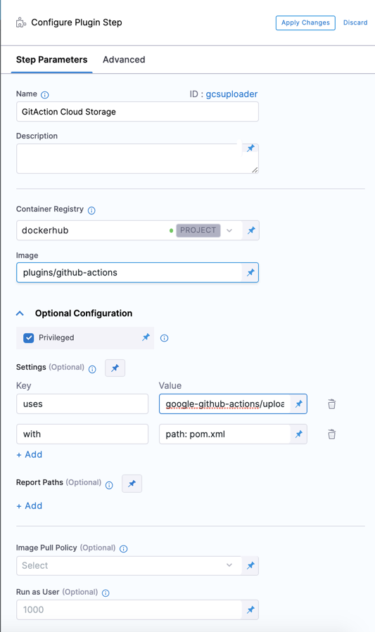
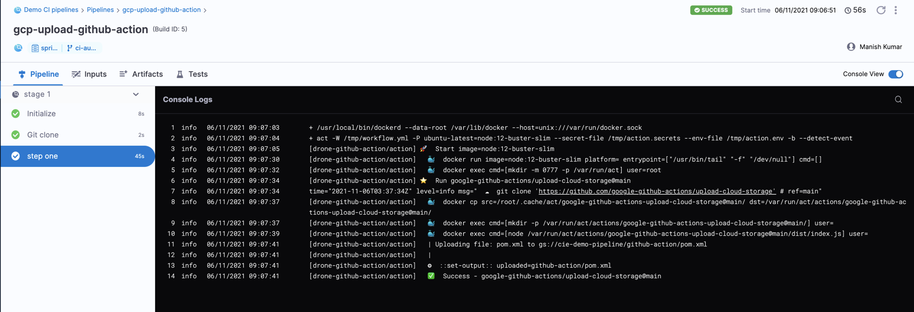

[Github Actions](https://docs.github.com/en/actions/learn-github-actions/understanding-github-actions) is a GitHub feature that enables you to automate various event-driven activities in GitHub, such as cloning a repository, generating Docker images, and testing scripts.

Harness CI supports launching GitHub Actions as part of a Pipeline Stage using the **Plugin** step.

You simply use the GitHub Actions Drone Plugin, [plugins/github-actions](https://github.com/drone-plugins/github-actions), in the **Plugin** step, and then replicate the GitHub Action settings.

The Github Actions Drone Plugin runs your GitHub Actions in the background using [nektos/act](https://github.com/nektos/act).

In this topic, we cover using GitHub Actions in the Plugin step with one of the several GitHub Actions listed in [GitHub Marketplace](https://github.com/marketplace?category=&query=&type=actions&verification=).


### Before You Begin

* [CI Pipeline Quickstart](../../ci-quickstarts/ci-pipeline-quickstart.md)
* [CI Stage Settings](../../ci-technical-reference/ci-stage-settings.md)
* [Set Up Build Infrastructure](https://docs.harness.io/category/set-up-build-infrastructure)
* [Learn Harness' Key Concepts](../../../getting-started/learn-harness-key-concepts.md)

### Step 1: Create the CI Stage

In your Harness Pipeline, click Add Stage, and then click CI.

### Step 2: Add the Codebase

In Connector, select an existing Connector to your codebase repo, or create a new one. See [Code Repo Connectors](https://ngdocs.harness.io/category/xyexvcc206-ref-source-repo-provider).

You can see the URL for the repo account below **Repository Name**. Don't add the URL into Repository Name.

In Repository Name, enter the name of the repo containing the codebase.

For example, if the account URL is `https://github.com/mycompany` and the repo in that account is `myapp`, enter `myapp` in the **Repository Name**.

### Step 3: Define the Build Farm Infrastructure

In the CI stage Infrastructure, define the build farm for the codebase.

The following example uses a Kubernetes cluster build farm. You can use AWS for your build infrastructure as well. See [Set Up an AWS VM Build Infrastructure](../set-up-build-infrastructure/set-up-an-aws-vm-build-infrastructure.md). 

In **Select a Kubernetes Cluster**, select, or create, a Kubernetes Connector. See [Kubernetes Cluster Connector Settings Reference](https://ngdocs.harness.io/article/sjjik49xww-kubernetes-cluster-connector-settings-reference). This Connector connects Harness to the cluster to use as the build farm.

In **Namespace**, enter the Kubernetes namespace to use. You can use a Runtime Input (`<+input>`) or expression also. See [Runtime Inputs](https://ngdocs.harness.io/article/f6yobn7iq0-runtime-inputs).

See [Define a Kubernetes Cluster Build Infrastructure](../set-up-build-infrastructure/set-up-a-kubernetes-cluster-build-infrastructure.md) for more information.

### Step 4: Add the Plugin step

In the stage's Execution, click **Add step**, select **Plugin**.

The Plugin settings appear.

Enter the following settings:


|  |  |
| --- | --- |
| **Name** | Enter a unique name for the step. |
| **Description** | Harness automatically generates a unique ID for the step. |
| **Container Registry** | Select or create a Harness Connector for the container registry. |
| **Image** | Enter the name of the Drone Plugin: `plugins/github-actions`. This Plugin allows running GitHub Action in CI. |
| **Privileged** | The Drone Plugin uses [nektos/act](https://github.com/nektos/act) to run GitHub Actions in CI. It requires DIND (docker-in-docker) to run your images. Hence, the **Privileged** attribute needs to be enabled to run with escalated permissions. |
| **Settings** | Replicate the GitHub Action attributes under **Settings**. See the following example. | 

##### Settings Example

Replicate the GitHub Action attributes under Settings.  For example:

* `name`: It refers to the GitHub repo of action along with branch or tag.
* `with`: It is a map with key and value as strings. These are inputs to the GitHub Actions.
* `env`: Environment variables passed to the GitHub Actions.

For example, for the Upload Cloud Storage Action, the attributes are as follows: 

* `uses`: google-github-actions/upload-cloud-storage@main
* `with`: 
   * `path: pom.xml`
   * `destination`: `cie-demo-pipeline/github-action`
   * `credentials`: `<+stage.variables.GCP_SECRET_KEY_BASE64>`

The `<+stage.variables.GCP_SECRET_KEY_BASE64>` setting uses a Stage variable and a Harness Secret. See [Add a Stage](https://docs.harness.io/article/2chyf1acil-add-a-stage).

Here's an example:




For the step settings on CI Plugins, see [Plugin Step Settings](../../ci-technical-reference/plugin-step-settings-reference.md).


### Step 5: View the Results

Save the Pipeline and click **Run**. 

You can see the logs for the GitHub GCP Upload Action in the Pipeline as it runs.




### Configure As Code: YAML

To configure your pipeline as YAML in CI, go to Harness **Pipeline Studio** and click **YAML**. Here’s is a working example of GitHub Action Cloud Storage Upload to GCP in CI. Modify the YAML attributes such as name, identifiers, codebase, connector ref, environment variables based on your Pipeline requirements.


```
pipeline:  
    name: gcp-upload-github-action # Configure your Pipeline name  
    identifier: gcpuploadgithubaction # Configure your Pipeline identifier  
    projectIdentifier: Demo_CI_pipelines # Configure your Project identifier  
    orgIdentifier: default # Configure your Organization  
    tags: {}  
    stages:  
        - stage:  
              identifier: gcp_upload_success_gha # Configure your Stage identifier  
              name: stage 1  
              type: CI  
              variables:   
                  - name: GCP_SECRET_KEY_BASE64 # Configure your Secret Key Name  
                    type: Secret  
                    value: gcpbase64secret # Configure your Secret Key Value  
              spec:  
                  execution:  
                      steps:  
                          - step:  
                                identifier: gcsuploader # Configure your step identifier name  
                                name: step one # Configure your step name  
                                type: Plugin  
                                spec:  
                                    connectorRef: dockerhub  
                                    image: plugins/github-actions  
                                    privileged: true  
                                    settings: # Configure your plugins Settings configuration  
                                        uses: google-github-actions/upload-cloud-storage@main  
                                        with:  
                                            path: pom.xml  
                                            destination: cie-demo-pipeline/github-action  
                                            credentials: <+stage.variables.GCP_SECRET_KEY_BASE64>  
                  infrastructure: # Configure your Infrastructure Settings  
                      type: KubernetesDirect  
                      spec:  
                          connectorRef: buildfarm  
                          namespace: cie-demo-pipeline  
    properties:  
        ci:  
            codebase: # Configure your Codebase  
                connectorRef: githubautouser  
                repoName: springboot  
                build:  
                    type: branch  
                    spec:  
                        branch: ci-autouser
```
### See Also

* [Plugin Step Settings](../../ci-technical-reference/plugin-step-settings-reference.md)
* [GitHub Actions](https://docs.github.com/en/actions/learn-github-actions/understanding-github-actions)

