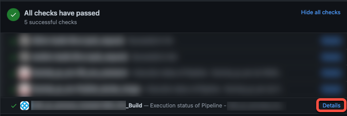

From the **Builds** page, you can inspect past builds and monitor the progress of ongoing builds.

The **Builds** page lists provides the following information about current and past builds:

* **Pipeline Name:** The name of the pipeline that ran and the build number (**Execution Id**). Select the pipeline name to go to the [build details page](#build-details).
* **Status:** The build status, such as running, failed, or success.
* **Trigger:** How the build started, whether by a webhook trigger or manually. Builds triggered by webhooks can include [source code repository links](#source-code-repository-links).
* **Executed By:** The name of the user that started the build.
* **Runtime:** How long the build ran.

## Source code repository links

Builds triggered by webhooks can include a link to the PR or commit that started the build.

Similarly, if a pull request triggers a build, you can follow the **Details** link from the PR's Git status to the build details page in Harness.

## Build details

On the **Build details** page, you can investigate a variety of build details.

* **Pipeline:** This tab shows the build stages and steps. Select a step to investigate logs, inputs, outputs, and errors (if any) for that steps.
* **Inputs**: This tab lists the pipeline-level inputs. Step-level inputs are reported in the step details on the **Pipeline** tab.
* **Artifacts:** Links to artifacts, such as images or reports, produced during the build. Artifacts aren't always displayed, depending on the upload location, configuration, or build infrastructure.
* **Commits:** Commits that triggered the build.
* **Tests:** Test results from **Run** or **Run Tests** steps. For more information, go to [View tests](./viewing-tests.md).
* **Policy Evaluations**, **Security Tests**, and **Error Tracking**: These tabs report information from other Harness modules and features, such as [Harness Policy As Code](/docs/platform/Policy-as-code/harness-governance-quickstart#step-6-review-policy-evaluations), if these are enabled and included in the pipeline.

