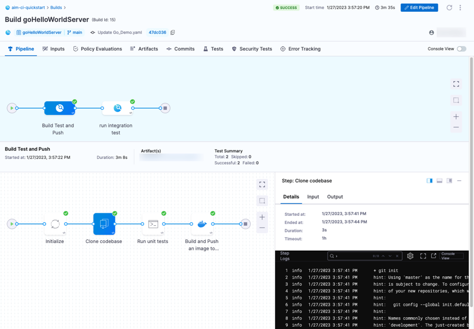

From the **Builds** page, you can inspect past builds and monitor the progress of ongoing builds.

The **Builds** page provides the following information about current and past builds:

* **Pipeline Name:** The name of the pipeline that ran and the build number (**Execution Id**). Select the pipeline name to go to the [Build details page](#build-details).
* **Status:** The build status, such as running, failed, or success.
* **Trigger:** How the build started, whether from a Git even, cron trigger, or manually. Builds triggered by webhooks can include the associated branch name, a link to the associated PR or commit, and the latest commit message. For more information, go to [SCM status checks](./codebase-configuration/scm-status-checks.md).
* **Execution Start Time:** The name of the user that started the build, whether by webhook trigger or manually, and how long ago the build started.
* **Runtime:** How long the build ran.

## Build details

On the **Build details** page, you can investigate a variety of details about a specific build.

### Pipeline tab (logs)

This tab shows the build stages and steps.

Select a step to investigate logs, inputs, outputs, and errors (if any) for that steps. If enabled, [AIDA](../troubleshoot-ci/aida.md) can provide troubleshooting assistance.

When troubleshooting failed builds, you can switch to **Console View** to allocate more screen space to logs. Once you've identified a potential cause, select **Edit Pipeline** to go directly to the Pipeline Studio.

#### Troubleshoot build log issues

Go to the [CI Knowledge Base](/kb/continuous-integration/continuous-integration-faqs) for issues and questions related to build logs, such as:

* [Truncated execution logs](/kb/continuous-integration/continuous-integration-faqs/#truncated-execution-logs)
* [Step logs disappear](/kb/continuous-integration/continuous-integration-faqs/#step-logs-disappear)
* [CI step logs don't load in real time.](/kb/continuous-integration/articles/CI-step-logs-dont-load-in-real-time)
* [Step succeeds even when explicitly executing exit 1 in a Bash script that is runs in script's background](/kb/continuous-integration/continuous-integration-faqs/#step-succeeds-even-when-explicitly-executing-exit-1-in-a-bash-script-that-is-runs-in-scripts-background)
* [A previous execution is missing from my Builds dashboard or Project Overview page.](/kb/continuous-integration/continuous-integration-faqs/#builds-older-than-30-days-arent-on-the-project-overview-page)

### Inputs tab

This tab lists pipeline-level inputs. Step-level inputs are reported in the step details on the [Pipeline tab](#pipeline-tab-logs).

### Artifacts tab

This tab provides links to artifacts, such as images or reports, produced during the build.

Availability of artifact details depends on the upload location, build configuration, or build infrastructure. For an example and more information, go to [Publish to the Artifacts tab](./build-and-upload-artifacts/artifacts-tab).

### Commits tab

This tab provides a list of commits that triggered the build, along with source code repo links, if applicable.

### Tests tab

This tab presents test results from **Run** or **Test** steps. For more information, go to [View tests](./run-tests/viewing-tests.md).

### Other tabs

The **Policy Evaluations** and **Security Tests** tabs report information from other Harness modules and features, such as [Harness Policy As Code](/docs/platform/governance/policy-as-code/harness-governance-quickstart#step-6-review-policy-evaluations), if these are enabled and included in the pipeline.

## Dashboards

For information about Harness dashboards, go to the Platform documentation on [Dashboards](/docs/platform/dashboards/dashboards-overview).
