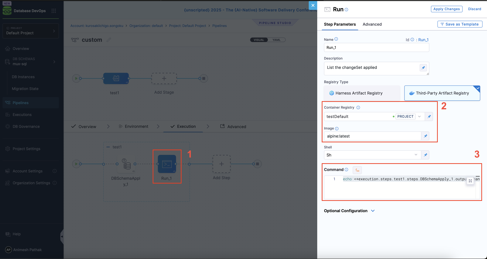

Harness Database DevOps enables users to retrieve the list of change sets applied during a pipeline execution. This is especially useful for audit trails, conditional logic, or notifications post deployment.

This guide outlines how to reference the applied change sets using built-in Harness pipeline expressions.

## Use Case

In many organizations, when it comes to database use cases, teams want to:

- Programmatically reference the applied Liquibase change sets after a schema apply step.
- Expose applied changes to downstream steps for notifications or logging.
- Integrate this output into audit/compliance workflows.

Harness supports this via the [`execution` pipeline context](https://developer.harness.io/docs/platform/variables-and-expressions/harness-variables#hyphens-and-spaces-require-escaping), which can also be auto-completed in the pipeline studio expression input.

## Expression Format

You can access the list of applied change sets using the following syntax:

```bash
<+execution.steps.<stepGroupName>.steps.<stepName>.output.ChangeSets>
```

This expression retrieves the applied change sets from a specific DBSchemaApply step in your pipeline. Where:
- `<stepGroupName>`: Name of the step group containing the database schema apply step.
- `<stepName>`: Name of the `DBSchemaApply` step.

### Example Usage

If the step group is named `test1` and the "DBSchemaApply" step is named `DBSchemaApply_1`, then the expression would be:

```bash
<+execution.steps.test1.steps.DBSchemaApply_1.output.changeSets>
```

Follow the below steps to use this expression in your pipeline:



1. Open your pipeline in Harness.
2. After your `Apply Schema` step has been added and configured, click **“Add Step”** and select the **Run** step.
3. Set the step name (e.g. default is, `Run_1`).
4. Under **Container Registry**, select your custom Docker Artifactory connector.
5. Set the **Image** to: `alpine:latest`.
6. In the **Shell** field, enter `sh`.
7. In the **Command** field, enter the following command to print the applied change sets:
For example, if your DBSchemaApply step is named `DBSchemaApply_1` and is part of a step group named `test1`, you would use:
```bash
echo <+execution.steps.test1.steps.DBSchemaApply_1.output.ChangeSets>
```
8. Save and run your pipeline. 

## How It Works

Harness captures the change sets applied by the "Apply Schema" step and exposes them under that step’s output context. This allows downstream steps in the same stage or pipeline to access this data for validation, notification, or reporting—similar to how pre-start tags or runtime variables work in other Harness modules.

## Practical Applications

You can use this expression to:

- Send Slack or email notifications with the list of applied change sets.
- Store the applied change sets in an external audit system via script steps.
- Gate promotion pipelines by validating that expected changes were deployed.

## Example: Notification Step

Here’s how you might use this in a custom shell script step to echo the applied changes:

```sh
echo "The following change sets were applied:"
echo <+execution.steps.test1.steps.DBSchemaApply_1.output.ChangeSets>
```
