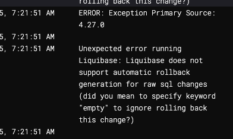

import Tabs from '@theme/Tabs';
import TabItem from '@theme/TabItem';

# Automatic and Custom Rollbacks

There are two types of rollback functionality:

- **Automatic rollbacks**: Generated automatically based on the change type
- **Custom rollbacks**: Explicitly specified by you in your changelog

:::caution 
SQL changelogs, do not support auto rollback, regardless of the Change Type. You must write custom rollback statements for all formatted SQL changelogs, can also write your own rollbacks if you want to override the default rollback statement for a Change Type that supports auto rollback.
:::




## Automatic rollback statements
For many Change Types, such as `createTable`, `addColumn`, and `renameColumn`, Liquibase **automatically generates** the SQL statements necessary to complete the rollback, so you can simply run a command like rollback on your desired changeset(s) and be done.

When you run the update command on a createTable changeset, Liquibase executes the SQL statement CREATE TABLE myTable. When you run the rollback command to revert that changeset, Liquibase recognizes that the inverse of the original change is DROP TABLE myTable and executes that statement. In this case, you aren't required to add anything special to your changelog.

``` text
Liquibase command 'rollback' was executed successfully.
Liquibase: Rollback has been successful.
```
However, if you try to run rollback on dropTable, Liquibase cannot automatically generate the rollback SQL:

``` text
Unexpected error running Liquibase: 
```

To roll back your `dropTable` statement, you have to specify custom logic in your changelog so that Liquibase knows how to correctly restore your database.


## Custom rollback statements

Liquibase cannot automatically generate rollback SQL for Change Types like `dropTable` and `insert`. To roll back database updates that include these changesets, you must write custom rollback statements in your desired changeset(s) and then run the rollback command.

In these cases, you must specify custom rollback syntax in your changelog for every changeset that you might want to roll back. This way, when you run the rollback command, Liquibase knows what to do.

For more information and example:

<Tabs>
<TabItem value="SQL" label="SQL" default>

``` sql
--changeset stephen-atwell:1
create table testTable ( id int primary key, name varchar(255) );
--rollback drop table testTable;

--changeset stephen-atwell:2
insert into testTable values ('1','The First', 'Country')
insert into testTable values ('2','The Second', 'Country2')
--rollback delete from testTable where id='1'
--rollback delete from testTable where id='2'

```
</TabItem>

<TabItem value="YAML" label="YAML" default>
``` bash
databaseChangeLog:
- changeSet:
    id: 2
    author: stephen-atwell
    changes:
    - dropTable:
        tableName: person
    rollback:
      createTable:
        catalogName: cat
        columns:
        - column:
          name: address
          type: varchar(255)
        remarks: A String
        schemaName: public
        tableName: person
```
</TabItem>

<TabItem value="XML" label="XML" default>
```
<databaseChangeLog
    xmlns="http://www.liquibase.org/xml/ns/dbchangelog"
    xmlns:xsi="http://www.w3.org/2001/XMLSchema-instance"
    xmlns:ext="http://www.liquibase.org/xml/ns/dbchangelog-ext"
    xmlns:pro="http://www.liquibase.org/xml/ns/pro"
    xsi:schemaLocation="http://www.liquibase.org/xml/ns/dbchangelog
        http://www.liquibase.org/xml/ns/dbchangelog/dbchangelog-latest.xsd
        http://www.liquibase.org/xml/ns/dbchangelog-ext
        http://www.liquibase.org/xml/ns/dbchangelog/dbchangelog-ext.xsd
        http://www.liquibase.org/xml/ns/pro
        http://www.liquibase.org/xml/ns/pro/liquibase-pro-latest.xsd">

    <changeSet author="stephen-atwell" id="2">
        <dropTable tableName="person"/>

        <rollback>
            <createTable catalogName="department"
                  remarks="A String"
                  schemaName="public"
                  tableName="person"
                <column name="address" type="varchar(255)"/>
            </createTable>
        </rollback>
  </changeSet>
</databaseChangeLog>
```
</TabItem>

<TabItem value="JSON" label="JSON" default>
``` json
{
  "databaseChangeLog": [
    {
      "changeSet": {
        "id": "2",
        "author": "stephen-atwell",
        "changes": [
          {
            "dropTable": {
              "tableName": "person"
            }
          }
        ],
        "rollback": [
          {
            "createTable": {
              "catalogName": "cat",
              "columns": [
                {
                  "column": {
                    "name": "address",
                    "type": "varchar(255)"
                  }
                }
              ],
              "remarks": "A String",
              "schemaName": "public",
              "tableName": "person"
            }
          }
        ]
      }
    }
  ]
}
```
</TabItem>

</Tabs>


:::info
When rolling back stored logic, Liquibase does not restore the previously stored version. Instead, Liquibase rolls back to the exact file/code specified in the custom rollback.
:::


### Multiple rollbacks
You can also specify multiple Change Types within a single `rollback` statement or across multiple `rollback` statements:

``` yaml
- changeSet:
    id: multiRollbackTest
    author: stephen-atwell
    changes:
      - createTable:
          tableName: multiRollback1
          columns:
            - column:
                name: id
      - createTable:
          tableName: multiRollback2
          columns:
            - column:
                name: id
      - createTable:
          tableName: multiRollback3
          columns:
            - column:
                name: id
    rollback:
      - dropTable:
          tableName: multiRollback1
      - dropTable:
          tableName: multiRollback2
    rollback:
      - dropTable:
          tableName: multiRollback3
```


### Empty rollback statements

If you do not want to revert a change in a rollback mode, use either the keyword empty or the keyword not required inside the rollback tag. In XML, YAML, and JSON changelogs, you can also use an empty string inside the rollback tag.

<Tabs>
<TabItem value="SQL" label="SQL" default>

``` sql
--changeset stephen-atwell:1
create table testTable ( id int primary key, name varchar(255) );
--rollback empty
```
</TabItem>

<TabItem value="YAML" label="YAML" default>
``` yaml
- changeSet:
    id: 1
    author: stephen-atwell
    changes:
      - createTable:
          tableName: testTable
          columns:
            - column:
                name: id
                type: int
    rollback: empty
```
</TabItem>

<TabItem value="XML" label="XML" default>
```xml
<changeSet id="3" author="stephen-atwell">
    <createTable tableName="testTable">
        <column name="id" type="int"/>
    </createTable>
    <rollback>empty</rollback>
</changeSet>
```
</TabItem>

<TabItem value="JSON" label="JSON" default>
``` json
{
  "changeSet": {
    "id": 1,
    "author": "stephen-atwell",
    "changes": [
      {
        "createTable": {
          "tableName": "testTable",
          "columns": [
            {
              "column": {
                "name": "id",
                "type": "int"
              }
            }
          ]
        }
      }
    ],
    "rollback": "empty"
  }
}
```
</TabItem>

</Tabs>
