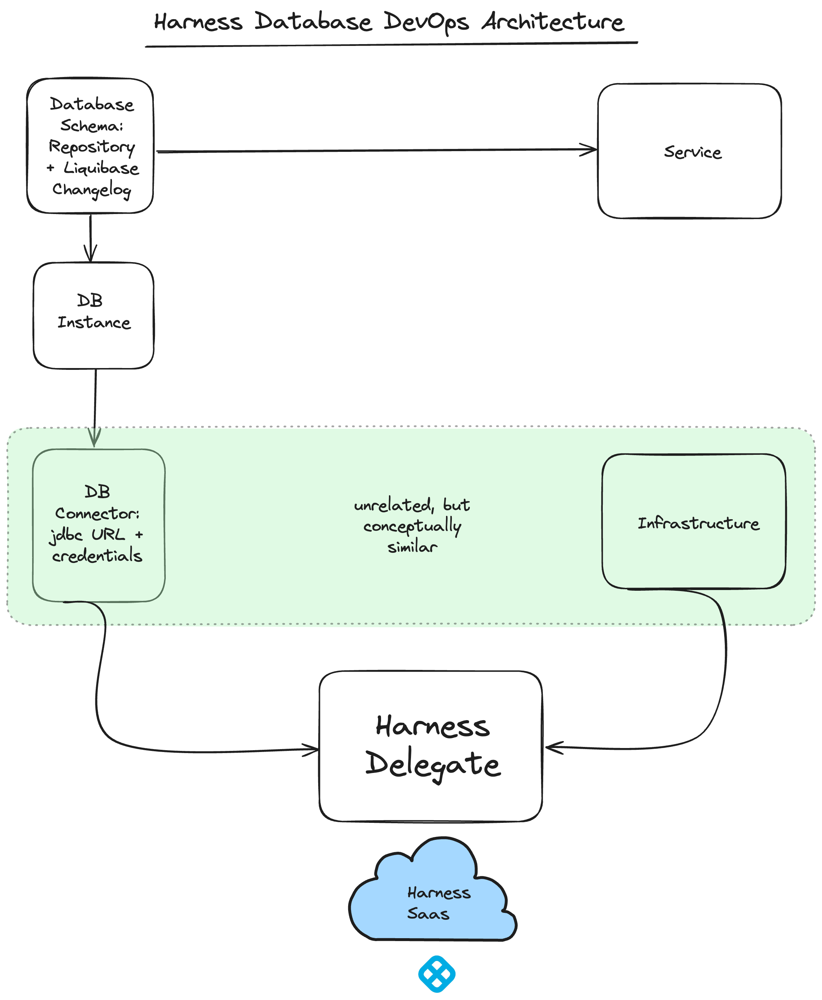

Welcome to the Harness Database DevOps Product Documentation. This guide will assist you in  integrating database operations into your application deployment workflows. Our Database DevOps module enables you to manage database schemas, orchestrate changes, and ensure consistency across all your environments. Let's dive into how Harness Database DevOps can streamline your database change management and enhance your overall deployment strategy.

## Before you begin, review the following:

- [All about Database DevOps](/docs/database-devops/get-started/)

## Harness DB DevOps Architecture

:::info
Before you can access Harness Database DevOps, you must have Harness enable the following feature flag, `DBOPS_ENABLED`. To enable the feature flag, please contact [Harness Support](mailto:support@harness.io).
:::

   

[Harness Database DevOps](/docs/database-devops/get-started/overview.md) is crucial to the Harness Delegate because it integrates database change management into [Harness CI](../../continuous-integration/get-started/overview.md), enabling organizations to apply DevOps best practices to their database operations. Here are several key points that highlight its importance:

 1. **Orchestration of Database Changes**: Harness Database DevOps allows for the orchestration of database changes in a manner similar to application code deployments. This means that database changes can be managed through pipelines, ensuring that they are executed in a controlled and automated way. This orchestration helps to eliminate the manual processes that often slow down deployments when database changes are involved.

 2. **Integration with CI/CD Practices**: By incorporating database changes into the CI/CD pipeline, Harness enables teams to ship database updates with the same frequency and reliability as application code. This is particularly important for organizations that deploy applications multiple times a day but face delays when needing to make database changes.

 3. **Visibility and Governance**: Database DevOps provides enhanced visibility into the state of databases across different environments. This visibility is essential for DBAs and DevOps teams to track changes, understand the deployment status, and ensure compliance with governance policies. The ability to compare database schemas between environments and enforce policies on allowed changes helps maintain database integrity and performance.

 4. **Collaboration Between Teams**: The integration of database changes into the deployment pipeline fosters collaboration between database administrators (DBAs) and application development teams. This collaboration is vital for ensuring that database changes are made safely and effectively, allowing developers to implement features at a faster pace while DBAs can enforce necessary guardrails.

 5. **Automated Rollback and Impact Analysis**: Harness Database DevOps supports automated rollback processes and impact analysis for database changes. This capability is essential for mitigating risks associated with deploying changes that could negatively affect database performance or stability. By providing tools to analyze the potential impact of queries before they are executed, organizations can prevent issues before they arise.

 6. **Utilization of Delegates**: The Harness Delegate acts as an agent that facilitates the connection between the CI/CD pipeline and the database. It enables the execution of database changes in a secure and efficient manner. The Delegate can be configured to connect to various database instances, ensuring that the right credentials and access parameters are used for each environment.

In summary, Database DevOps is vital to the Harness Delegate as it enhances the overall deployment process by integrating database management into CI/CD workflows, improving visibility, governance, and collaboration, while also enabling automation and risk mitigation. This integration ultimately leads to faster, more reliable, and safer database deployments.

## Database DevOps Key Concepts

### Database Schemas

A database schema is the structure of a database, e.g. what tables and columns and indexes exist. In the context of Harness DB DevOps, there is an entity called a 'schema’ that is a collection of DDL or DML changes that can be applied to a database. Today this collection is in the form of a liquibase changelog checked into git or artifactory.

### Database Instances 

A database instance associates a database schema to a database connection. It represents the intersection of the database's structural definition (the schema) with the actual data environment where the schema is implemented.

### Database Connection

A database connection refers to the specific parameters and credentials used to establish a secure link between the Harness platform and an individual database server. This connection is done through a JDBC (Java Database Connectivity) URL, which specifies the location of the database server, and is authenticated using a username and password. The connection is made via a Harness Delegate, which allows secure access to the database, even when the database instance is not internet-accessible. This setup enables Harness to execute SQL scripts, orchestrate database changes, and manage schema versions as part of the CI/CD pipeline, all while adhering to security best practices. 

:::info
Head over to the [Key Concepts documentation on Harness Database DevOps](../get-started/key-concepts.md) to learn more.
:::
