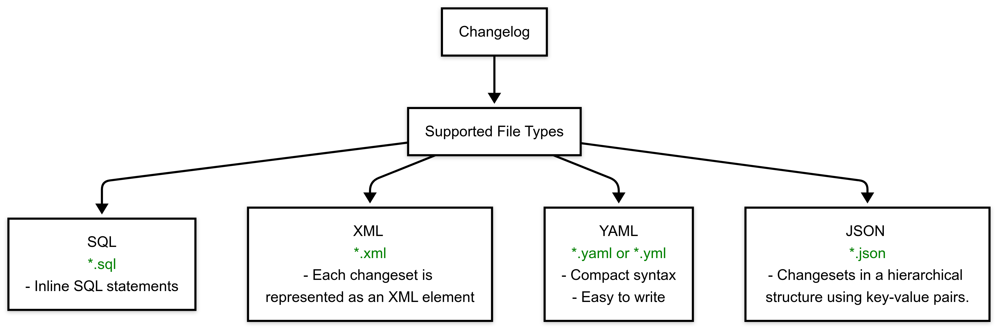

# Building a Database Changelog

Database version control is essential for maintaining a reliable and traceable history of your database changes. This guide will help you get started with creating and managing database changelogs effectively.


## Working with SQL File Directories

When you have multiple SQL files containing your database changes, you can organize them in a directory structure and track them systematically. Here's how:

   Create a directory structure for your SQL files:
   ```bash
   db/
   ├── changes/
   │   ├── release-1/
   │   │   ├── 001-create-users-table.sql
   │   │   ├── 002-add-email-column.sql
   │   │   └── 003-create-orders-table.sql
   │   └── release-2/
   │       ├── 001-add-payment-table.sql
   │       └── 002-alter-users-table.sql
   ```


## Understanding Changesets and Changelog

Changesets are the fundamental units of database change tracking. Each changeset represents an atomic change to your database schema or data. Here are the key concepts:

1. **Unique Identification**: Each changeset requires two identifiers:
   - `id`: A unique identifier for the change
   - `author`: The person responsible for the change

2. **Change Tracking**: Once a changeset is executed, it's tracked in a special table (typically called DATABASECHANGELOG) to ensure it's never run twice.

### Changelog
A collection of database changes that can be applied to a database. It includes an individual unit of change known as a changeset.

### File Format

The format of your changeset depends on the file type of your changelog, which can be SQL, XML, YAML, or JSON



##### SQL Example 
``` SQL Example
--liquibase formatted sql
--changeset John Snow:1
CREATE TABLE products (
      id INT PRIMARY KEY,
      name VARCHAR(255)
);
```

##### XML Example
``` XML Example
<changeSet  id="1"  author="John Snow">
    <createTable  tableName="company">
        <column  name="address"  type="varchar(255)"/>
    </createTable>
</changeSet>
```

##### YAML Example
``` YAML Example
databaseChangeLog:
  -  changeSet:  
      id:  1
      author: John Snow
      changes:
        -  createTable:
            tableName: company
            columns:
              -  column:
                  name: address
```

##### JSON Example
``` JSON Example
{
  "changeSet": {
    "id": "1",
    "author": "John Snow",
    "changes": [
      {
        "createTable": {
          "tableName": "company",
          "columns": [
            {
              "column": {
                "name": "address"
              }
            }
          ]
        }
      }
    ]
  }
}
```


## Generating Changelog from Existing Database

The `generate-changelog` command is used to automatically generate a changelog file that represents the current state of your database schema. This is especially useful when you are starting with an existing database that already has tables and structures, and you want to create a version-controlled changelog to track further changes.

```bash
liquibase generate-changelog \
    --url=jdbc:postgresql://localhost:5432/mydb \
    --username=admin \
    --password=secret \
    --changelog-file=generated-changelog.xml
```
### Steps
- **Run the Command**: To generate the Changelog
- **Review the ouput**: The output will be a changelog file in XML, YAML, or JSON format.
- **Modify the Changelog**: Edit the Changelog as needed.

### Configuration Options
- `--diffTypes`: Specify object types to include
- `--includeObjects`: Filter specific database objects
- `--excludeObjects`: Exclude specific database objects

```bash
liquibase generate-changelog \
    --url=jdbc:postgresql://localhost/mydb \
    --username=admin \
    --diffTypes=tables,indexes \
    --includeObjects="public.*" \
    --excludeObjects="public.temp_*,public.log_tables"
```
